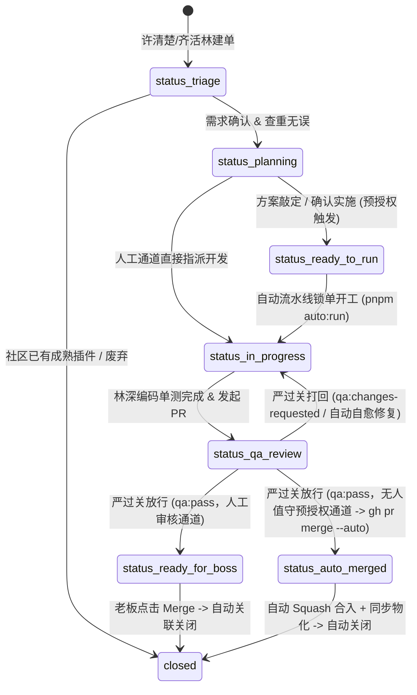

# agent-issue-lifecycle — OmniMux Agent 专属 GitHub Issue 驱动开发合同

> **真源与目的**：定义 `laozhong86/omnimux-dsh` 中所有 AI Agent 协同开发时的 GitHub Issue 生命周期规范。
> **核心铁律**：**No Issue, No Code**（先建单、后编码、全追踪、终闭环）。任何需求、特性开发、重构或缺陷修复，必须前置创建 Issue 并完成定界，严禁跳过 Issue 直接切分支或编码。

---

## 一、 核心原则

1. **唯一真源（Single Source of Truth）**：GitHub Issue 是任务背景、技术决策、验收标准和流转状态的唯一真源。
2. **编号穿透（One ID Throughout）**：Issue ID（如 `#42`）必须穿透全流程：
   - 临时工作区：`../omnimux-dsh-wt-<topic>-<issue-id>`
   - 分支名：`agent/<plugin>-<topic>-issue-<issue-id>`
   - 提交信息：`feat(<plugin>): ... (#<issue-id>)`
   - PR 描述：首段必须包含 `Closes #<issue-id>`
3. **老板唯一合入权**：Agent 负责从 Issue 立项到 PR 交付及 QA 验收的全流程，`gh pr merge` 及生产合入操作必须经由人类老板确认。

---

## 二、 4 轨分流与 Issue 处理矩阵

| 轨道 | 场景特征 | 主责 Agent 链路 | Issue 关注点 |
|---|---|---|---|
| **Track A (动态轻量插件)** | 会话内临时工具、交互卡片、轻量 Slot、实时看板 | 齐活林/许清楚 → 林深 → 严过关 | 验证纯 JS、无外部打包依赖、生命周期可逆 |
| **Track B (产品级 Stage / Tab 插件)** | 独立一级业务页（workflow、assets 等 `shell.overlay`）或侧边栏内容面板 Tab（`omnimux-clip` 走 `betterSidebar.registerTab`） | 许清楚 → 高见远 → 林深 → 严过关 | 路由挂载、Host 契约、DSH `--dsw-*` token；clip 禁止 Headless+自研 GUI |
| **Track C (标准服务/工具包)** | 通用工具、CLI 命令、后台 Job、自定义 Service | 许清楚 → 高见远 → 林深 → 严过关 | 社区查重、扩展点选型、Manifests 打包合规 |
| **Track D (增量热修与版本迭代)** | 针对现有 `@pluginId` 修复、运行时异常、配置微调 | 许清楚/齐活林 → 林深 → 严过关 | 错误日志与复现路径、Minimal Patch、回归验证 |

---

## 三、 Label 状态机与流转规范

### 1. 核心标签体系

| 分类 | 标签 (Label) | 颜色建议 | 描述 / 阶段 |
|---|---|---|---|
| **状态 (Status)** | `status:triage` | `#EDEDED` | 需求已提交，待许清楚定界与查重 |
| | `status:planning` | `#D4C5F9` | 架构设计中，高见远正在设计扩展点与契约 |
| | `status:ready-to-run` | `#A2EEEF` | 确认实施 / 预授权无人值守，一键触发全自动流水线 |
| | `status:in-progress` | `#FBCA04` | 编码开发中，林深在专属 Worktree 中实现 |
| | `status:qa-review` | `#0E8A16` | 编码完成已提 PR，严过关执行五维验收 |
| | `status:ready-for-boss` | `#1D76DB` | QA 验收通过，等待老板审查与合入（人工通道） |
| | `status:auto-merged` | `#6F42C1` | 预授权全自动合入并同步完成（无人值守通道） |
| **轨道 (Track)** | `track:A-dynamic` | `#BFD4F2` | Track A: 动态轻量插件 |
| | `track:B-stage` | `#5319E7` | Track B: OmniMux 一级 Stage 插件 |
| | `track:C-service` | `#1D76DB` | Track C: 标准服务与通用工具包 |
| | `track:D-patch` | `#D93F0B` | Track D: 缺陷修复与热修 |
| **质检 (QA)** | `qa:pass` | `#0E8A16` | 严过关五维验收全绿放行 |
| | `qa:changes-requested`| `#B60205` | 五维验收存在阻断项，打回修复 |
| **优先级 (Priority)** | `priority:P0` | `#B60205` | 阻断性故障 / 核心阻塞 |
| | `priority:P1` | `#E99695` | 标准特性需求 |
| | `priority:P2` | `#FEF2C0` | 优化与低优先级改进 |

### 2. 状态流转状态机



---

## 四、 标准 Agent 协作与执行 SOP

### 1. 建单阶段 (许清楚 / 齐活林)
- 收到用户输入后，由许清楚进行需求澄清、4 轨定界并检索社区插件（先查重验证）。
- 确认自研后，使用 CLI 创建带有 Frontmatter 的结构化 Issue：
  ```bash
  gh issue create -R laozhong86/omnimux-dsh \
    --title "feat(<plugin>): <功能简述>" \
    --body-file <issue_body.md> \
    --label "track:B-stage,scope:<plugin>,status:planning,priority:P1"
  ```
- 记录生成的 Issue 编号（例如 `#42`）。

### 2. 方案与契约阶段 (高见远)
- 高见远针对 Issue 展开扩展点设计（`ctx.tools` / `shell.overlay` / `ctx.theme` 等）及 Inspect 契约设计。
- 在 Issue 中追加 Comment，并流转状态至 `status:in-progress`：
  ```bash
  gh issue comment 42 -R laozhong86/omnimux-dsh --body "### 📐 架构设计与契约确认\n..."
  gh issue edit 42 -R laozhong86/omnimux-dsh --add-label "status:in-progress" --remove-label "status:planning"
  ```

### 3. 隔离开发阶段 (林深)
- 使用绑定 Issue ID 的标准命令挂载 Worktree：
  ```bash
  ./scripts/git-wt.sh start <plugin> <topic> 42
  ```
- 进入工作区 `../omnimux-dsh-wt-<topic>-42` 独立编写代码与单测。
- 提交 Commit 时严格包含 Issue 编号：
  ```bash
  git commit -m "feat(<plugin>): 实现... (#42)"
  git push -u origin HEAD
  ```

### 4. 提交 PR 与 QA 验收阶段 (林深 & 严过关)
- 林深在主仓或 Worktree 中发起 PR，**PR Body 必须包含 `Closes #42`**：
  ```bash
  gh pr create -R laozhong86/omnimux-dsh \
    --base main \
    --title "feat(<plugin>): ... (#42)" \
    --body "Closes #42\n\n## 变更说明\n..." \
    --label "status:qa-review"
  ```
- 严过关介入执行五维立体审查（语法合规 / 依赖生命周期 / 数据安全 / 视觉 Token / 稳定性保活）。
- 审查通过后打标放行：
  ```bash
  gh pr comment <PR_ID> -R laozhong86/omnimux-dsh --body "### 🛡️ 严过关五维验收报告: PASS\n..."
  gh pr edit <PR_ID> -R laozhong86/omnimux-dsh --add-label "qa:pass,status:ready-for-boss" --remove-label "status:qa-review"
  ```

### 5. 老板合入与闭环收尾（或预授权无人值守自动合入）
- **人工合入通道**：老板审查通过并执行 Merge，GitHub 自动关闭关联的 Issue `#42`。
- **无人值守预授权通道（`pnpm auto:run 42`）**：五维 QA 门禁 `qa:pass` 且 CI 通过后，流水线代行执行 `gh pr merge <PR_ID> --squash --auto --delete-branch`，自动关联关闭 Issue `#42`。
- 齐活林在主仓更新 `.workbuddy/pr-board.md` 并清理 Worktree，随后自动触发生产物化：
  ```bash
  git pull origin main
  ./scripts/git-wt.sh clean <topic> 42
  yarn omnimux:sync <plugin>
  ```
  ```
