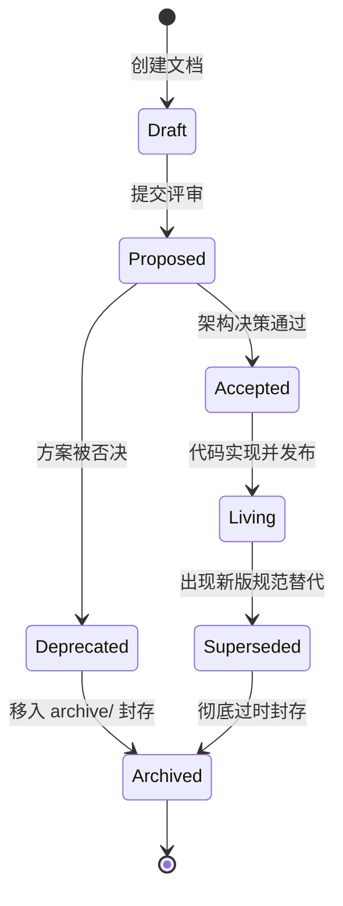

# 开发文档工程实践管理规范 (Documentation Engineering Standard)

> **版本**：v1.0.0 | **生效日期**：2026-08-26 | **权威级别**：L1（工程契约）  
> **适用范围**：OmniMux-DSH 代码仓库中 `docs/` 目录下的所有技术设计、架构决策、契约规范、交付日志与参考资料。

---

## 1. 规范背景与核心宗旨

在 OmniMux-DSH 多智能体（Multi-Agent）与人类工程师协同的工程研发体系中，文档不仅是人类的知识沉淀与备忘录，更是 Agent 执行任务时的**行为护栏（Guardrails）与最高行为约束**。

为杜绝“文档孤岛”、“历史决策误导”、“死链悬垂”、“格式分裂”与“权威冲突”等工程隐患，特制定本规范，旨在实现：
1. **权威分级清晰**：确立明确的文档权威金字塔，解决规范冲突时的仲裁优先级。
2. **结构索引完备**：全局与子目录建立 100% 覆盖的索引矩阵，消除信息孤岛。
3. **机器可读合规**：全量文档注入标准化 YAML Frontmatter 元数据，便于自动化解析与状态监控。
4. **生命周期可控**：建立从草案到归档的状态流转机制，保持演进型文档时效性与历史型文档不可变性。
5. **CI 自动化守护**：通过脚本和 CI 门禁进行死链检测、命名合规、Schema 校验，实现工程化常态防护。

---

## 2. 权威分级金字塔 (Authority Pyramid)

当不同文档、代码或上下文之间出现事实或规则冲突时，严格按照以下权威优先级进行仲裁：

```text
       ┌──────────────────────────────────────────────┐
       │   L0: 真实代码 / 磁盘真源 (series/, plugins/)   │  最高权威 (Ground Truth)
       ├──────────────────────────────────────────────┤
       │   L0+: 根级约束规则 (AGENTS.md / CONTEXT.md)  │  全会话硬约束
       ├──────────────────────────────────────────────┤
       │   L1: 现行契约矩阵 (docs/contracts/*)         │  系统接口、边界、规范
       │       + 真实能力表 (docs/capabilities.md)      │  真实/存根能力表
       │       + 上游锚点 (docs/harness-pin.md)         │  Upstream Pin 锚点
       ├──────────────────────────────────────────────┤
       │   L2: 架构决策 (docs/decisions/* - ADR)       │  架构拍板与决策理由
       │       + 技术规格 (docs/specs/* - PRD/Spec)    │  功能需求与详细设计
       ├──────────────────────────────────────────────┤
       │   L3: 实测证据 (docs/evidence/*)              │  测试执行与度量凭证
       │       + 过程日志 (docs/logs/*)                │  阶段交付与操作记录
       │       + 项目简报 (docs/briefing.md)           │  跨会话共享记忆 (Memory)
       ├──────────────────────────────────────────────┤
       │   L4: 外部参考与调研 (docs/references/*)       │  行业参考/SOP (仅供查阅)
       │       + 归档历史 (docs/archive/*)             │  历史废弃记录 (只读封存)
       └──────────────────────────────────────────────┘
```

### 仲裁优先序公式
$$\text{Live Code} > \text{AGENTS.md} > \text{docs/contracts/} \ge \text{capabilities.md} > \text{decisions/} > \text{specs/} > \text{briefing.md} > \text{logs/} > \text{references/}$$

---

## 3. 目录分类拓扑与命名规范

`docs/` 目录采用扁平化、职责单一的目录拓扑：

```text
docs/
├── README.md                           # 全局文档索引与导航门户 (Index Portal)
├── capabilities.md                     # [L1] 系统能力真假矩阵 (Living Matrix)
├── briefing.md                         # [L3] 跨会话项目级工作记忆 (Living Log)
├── harness-pin.md                      # [L1] 上游 harness SHA 与 Overlay 规则
├── contracts/                          # [L1] 现行工程契约 (Living, 不可带日期前缀)
│   ├── README.md                       #   契约索引与权责矩阵
│   ├── hub.md                          #   执行中枢 I/O 与缝规范
│   ├── dev-pipeline.md                 #   三层开发环境与发布规范
│   ├── model-list-ownership.md         #   模型配置所有权契约
│   └── ...                             #   命名规则: <topic-kebab-case>.md
├── decisions/                          # [L2] 架构决策记录 (Immutable ADR, 必须带日期)
│   ├── README.md                       #   ADR 时间线与状态索引
│   ├── 2026-08-14-execution-hub.md     #   命名规则: YYYY-MM-DD-<decision-topic>.md
│   └── ...
├── specs/                              # [L2] 产品与技术设计规格 (Spec / PRD)
│   ├── README.md                       #   功能规格需求矩阵
│   ├── 2026-08-22-omnimux-assets-creative-library.md
│   ├── prototypes/                     #   独立交互原型目录 (.html 原型)
│   │   ├── 2026-08-23-omnimux-products.html
│   │   └── 2026-08-25-social-analytics.html
│   └── ...
├── evidence/                           # [L3] 实测与验证证据 (Immutable, 统一日期前缀)
│   ├── README.md                       #   实测证据清单与验证覆盖率
│   ├── 2026-08-14-omnimux-video.md     #   命名规则: YYYY-MM-DD-<scope>-<target>.md
│   └── ...
├── logs/                               # [L3] 里程碑与阶段日志 (Immutable, 统一日期前缀)
│   ├── README.md                       #   交付时间线日志
│   ├── 2026-08-15-app-marketplace-mvp.md # 命名规则: YYYY-MM-DD-<topic>.md
│   └── ...
├── references/                         # [L4] 外部资料与业务 SOP 参考
│   ├── README.md                       #   业务背景参考索引
│   └── tiktok-drama-center.md          #   命名规则: <topic-kebab-case>.md
└── archive/                            # [L4] 历史废弃与过时文档归档
    ├── README.md                       #   归档清单与替代关系对照表
    └── 2026-08-14-handoff-audit.md     #   命名规则: YYYY-MM-DD-<original-topic>.md
```

### 3.1 命名通用规则
1. **全小写连字符**：所有文件与目录名一律使用小写字母与连字符（`kebab-case`），禁止使用空格、下划线、驼峰或大写字母。
2. **时序型文档（ADR / Spec / Evidence / Log / Archive）**：强制以标准日期 `YYYY-MM-DD-` 作为前缀。
3. **长期演进型契约（Contracts）**：**严禁带日期前缀**（例如必须为 `hub.md`，严禁写成 `2026-08-16-hub.md`），确保长期外部引用的稳定性。
4. **原型文件分类**：非 Markdown 文件（如 HTML 高保真交互原型）统一收敛至 `docs/specs/prototypes/`，禁止直接散落在文档根目录。

---

## 4. 标准 Frontmatter 元数据规范

所有 `docs/` 下的 Markdown 文档必须在第一行以 YAML Frontmatter 格式标注标准元数据：

```yaml
---
title: "文档中文标题"
id: "contract-unique-slug"                   # 全局唯一标识: <type>-<slug>
type: "contract"                             # 类型枚举值见下方定义
status: "living"                             # 状态枚举值见下方定义
authority: "L1"                              # 权威等级: L0 | L1 | L2 | L3 | L4
date: "2026-08-26"                           # 首次创建或生效日期 (YYYY-MM-DD)
updated: "2026-08-26"                        # 最后修订日期 (YYYY-MM-DD)
authors: ["x", "agent-architect"]            # 负责人/作者
subsystem: "omnimux"                         # 关联子系统/插件 (如 omnimux, omnimux-drama, global)
tags: ["tag1", "tag2"]                       # 检索标签
supersedes: []                               # 被当前文档替代的历史文档路径
superseded_by: null                          # 取代当前文档的新文档路径 (若已废弃)
related:                                     # 强关联文档列表
  - "docs/contracts/hub.md"
---
```

### 4.1 字段枚举值字典

- **`type` (文档类型)**:
  - `contract`：架构契约与硬性规范（活跃演进）
  - `decision`：架构决策记录 ADR（只读沉淀）
  - `spec`：产品 PRD 或技术设计规格 RFC
  - `evidence`：自动化或人工验证证据记录
  - `log`：里程碑交付或阶段记录日志
  - `reference`：外部资料、业务 SOP 或调研参考
  - `index`：目录导航索引与矩阵
  - `core`：根目录基础活文档（`capabilities.md`, `briefing.md`, `harness-pin.md`）

- **`status` (生命周期状态)**:
  - `draft`：草案中，方案未定型
  - `proposed`：已提交评审，等待架构裁定
  - `accepted`：已裁定通过，待实现
  - `living`：现行有效，持续演进维护中
  - `superseded`：已被新版本规范取代
  - `deprecated`：已废弃，停止遵循
  - `archived`：已归档封存

- **`authority` (权威等级)**:
  - `L0`（磁盘真源 / 根级约束）
  - `L1`（现行契约与能力真源）
  - `L2`（决策记录与技术规格）
  - `L3`（实测证据与过程日志）
  - `L4`（参考资料与历史归档）

---

## 5. 文档生命周期流转机制



### 5.1 演进与只读维护纪律
1. **不可变文档（ADR / Evidence / Log）**：
   - 合入主干后，**正文内容严禁篡改**。
   - 若决策发生修正，只能通过新增一篇带最新日期的 ADR，并在新旧两篇 ADR 的 Frontmatter 中互相关联（`supersedes` / `superseded_by`），并在旧文档正文头部追加引用注释。
2. **演进型契约（Contracts）**：
   - 必须保持与最新代码实现 100% 同步。
   - 代码变更若触及接口契约、环境变量、存储路径，**必须在同一个 Commit / PR 中同步更新契约文档**。
3. **废弃与归档安全机制**：
   - 禁止物理删除历史文档。
   - 归档时使用 `git mv` 移动到 `docs/archive/`，并在原路径建立 **Markdown 转发桩（Forwarding Stub）**，避免历史会话、注释与外部链接失效。

---

## 6. 自动化治理与 CI 门禁规范

为确保规范得到持续执行，本仓库集成了文档自动化校验脚本 `scripts/doc-lint.mjs`。

### 6.1 本地执行与 CI 门禁命令
```bash
# 执行文档合规与死链校验
pnpm doc:lint

# 自动生成或更新各目录的索引矩阵
pnpm doc:index

# 全面体检（包含文档门禁）
pnpm doctor
pnpm verify:all
```

### 6.2 CI 校验规则（Rules）
- **[Rule-01] YAML Frontmatter 格式与字段完整性**：缺失必填字段或枚举值非法直接阻断。
- **[Rule-02] 内部相对链接与锚点死链扫描**：引用不存在的本地文件或锚点直接阻断。
- **[Rule-03] 目录级文件命名正则校验**：命名不符合规则直接告警或阻断。
- **[Rule-04] 孤岛文档检测**：存在未被任何索引收录的文档将给出警告。
- **[Rule-05] 违禁术语扫描**：严禁出现违背执行中枢（Hub）契约的用语（如将 Hub 错误称为“网关”）。

---

## 7. 附录：文档新建与维护 SOP

1. **新建契约**：在 `docs/contracts/<topic>.md` 创建，添加 L1 Frontmatter，同步在 `docs/contracts/README.md` 注册。
2. **新建 ADR**：在 `docs/decisions/YYYY-MM-DD-<topic>.md` 创建，添加 L2 Frontmatter，同步在 `docs/decisions/README.md` 注册。
3. **新建需求/设计**：在 `docs/specs/YYYY-MM-DD-<topic>.md` 创建，原型放入 `prototypes/`。
4. **归档文档**：移至 `docs/archive/YYYY-MM-DD-<topic>.md`，原位保留转发桩，在 `docs/archive/README.md` 登记替代关系。
5. **提交前验证**：运行 `pnpm doc:lint` 确保通过所有检查。