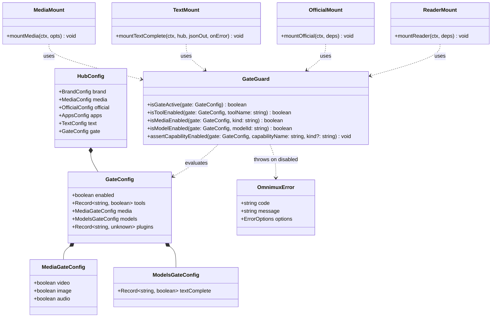
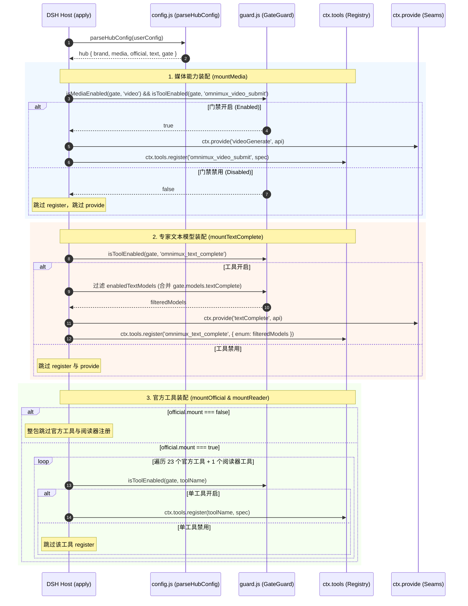
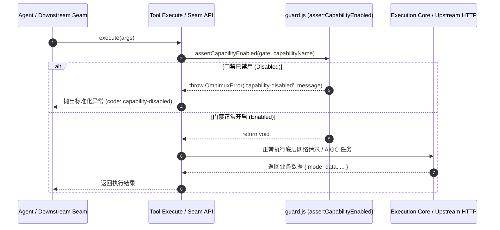
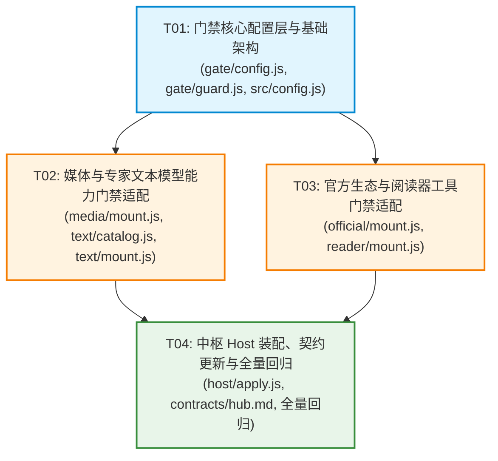

# OmniMux 执行中枢能力门禁（Config.gate）系统设计与任务分解

- **作者**：高见远（软件架构师）
- **适用模块**：OmniMux 执行中枢（`plugins/omnimux`）
- **参考规范**：`docs/specs/2026-08-30-omnimux-hub-capability-gate-prd.md`
- **版本**：v1.0.0 (Phase 1)

---

## Part A: 系统设计 (System Design)

### 1. 实现方案与技术选型 (Implementation Approach)

#### 1.1 核心技术挑战与难点分析

1. **双重生效策略（Dual-Stage Enforcement）的零漏洞保障**：
   - **阶段一（注册时不暴露）**：在 Cordis / DSH 插件生命周期 `apply()` 阶段，被禁用的能力必须跳过 `ctx.tools.register`，且不暴露对应的 `ctx.provide` Seam（或提供带防御的代理）。此阶段可确保 LLM 上下文 Prompt 中完全无被禁用工具的 Schema 污染，避免 LLM 幻觉产生无效调用。
   - **阶段二（调用时强拒绝）**：若上游调用方通过已存在的 Seam 引用、动态 RPC、未清理的旧会话或直接函数调用触发被禁用能力，执行入口必须进行前置拦截，统一抛出标准化的 `OmnimuxError('capability-disabled')`。
2. **多层开关仲裁与向后兼容性（Backward Compatibility & Merging Rules）**：
   - 现存系统拥有 `official.mount`（官方工具总闸开关）以及 `text.models[].enabled`（模型列表行内开关）。新引入的 `Config.gate` 必须与现有配置形成明确、自洽的仲裁关系：
     - `official.mount` 保持**一票否决**总闸地位；
     - `text.models[].enabled` 与 `gate.models.textComplete.<id>` 遵循 **“任一为 false 即禁用”** 的与（AND）逻辑；
     - `gate.media.<kind>` 与 `gate.tools.omnimux_<kind>_submit` 遵循 **“等价映射”** 规则。
3. **HTTP 服务与 Agent Tool 的物理与逻辑解耦**：
   - OmniMux 中枢同时承载了 Web 侧边栏/微应用所需的 Host HTTP 路由（如 `/omnimux/accounts`、`/omnimux/inspiration` 等）与供 Agent 调用的 `omnimux_*` 工具。关停 Agent Tool 绝不能导致前端 Host HTTP 路由不可用，必须实现边界严格隔离。
4. **零破坏性扩展与生态平滑演进**：
   - 设计通用的 `Config.gate` 结构，预留 `gate.plugins.<name>` 命名空间，确保一期聚焦中枢（Media 3 + Text 1 + Reader 1 + Official 23）的同时，未来垂直插件（`omnimux-workflow`、`omnimux-clip`、`omnimux-assets` 等）能无缝复用该 Schema。

#### 1.2 开源框架与技术库选型

- **配置验证与解析**：采用 DSH 官方标准 `Standard Schema` 契约规范（`plugins/omnimux/src/config.js` 的 `'~standard'` 接口），保持 100% 原生轻量实现，零额外第三方 runtime 依赖引入，避免外部包体积增加与潜在的安全漏洞。
- **错误机制**：复用中枢既有的 `OmnimuxError`（位于 `plugins/omnimux/src/media/errors.js`），扩展标准错误码 `'capability-disabled'`，确保错误类型与中枢原有的 `needs-omnimux`、`omnimux-unconfigured` 保持风格一致。
- **架构模式**：
  - **拦截器 / 守卫模式 (Interceptor / Guard Pattern)**：封装纯函数式门禁解析与判定守卫模块（`src/gate/guard.js` 与 `src/gate/config.js`），无状态、高内聚、易测试。
  - **依赖注入模式 (Dependency Injection)**：将解析后的 `gate` 对象注入至各子系统挂载器（`mountMedia`, `mountTextComplete`, `mountOfficial`, `mountReader`），实现松耦合。

---

### 2. Config.gate 最终 Schema 规范

#### 2.1 YAML 配置示例

```yaml
gate:
  enabled: true # 全局门禁总开关（可选，默认 true）
  tools: # 细粒度工具级开关（键名为标准 omnimux_* 工具名）
    omnimux_social_data: false
    omnimux_video_submit: false
    omnimux_page_fetch: false
    omnimux_analytics_inbox: false
  media: # 媒体能力类别开关（联动对应的 omnimux_<kind>_submit）
    video: false # false ≡ 禁用 omnimux_video_submit & videoGenerate seam
    image: true # 默认 true
    audio: false # false ≡ 禁用 omnimux_audio_submit & audioGenerate seam
  models: # 专家模型调用白名单门禁
    textComplete: # 一期仅作用于 omnimux_text_complete 专家模型
      grok-4.6: false
      claude-opus-5: false
  plugins: # 预留给未来垂直插件的扩展命名空间
    workflow: {}
    clip: {}
    assets: {}
```

#### 2.2 Schema 字段定义与规则

| 字段路径 | 类型 | 默认值 | 校验与行为规则 |
|:---|:---|:---|:---|
| `gate` | `object` | `{}` (默认全开) | 顶层门禁根对象；若非对象且非 undefined 则校验失败抛错。 |
| `gate.enabled` | `boolean` | `true` | 若显式为 `false`，则中枢全部受控能力均被禁用。 |
| `gate.tools` | `Record<string, boolean>` | `{}` | 工具级映射表。只有显式 `false` 才禁用；非布尔值抛出解析错误。 |
| `gate.media` | `Record<string, boolean>` | `{ video: true, image: true, audio: true }` | 媒体能力映射表。合法的 key 为 `video`、`image`、`audio`。若设为 `false` 则级联禁用对应的 `omnimux_<kind>_submit` 工具和 `<kind>Generate` Seam。 |
| `gate.models` | `object` | `{}` | 模型门禁根对象。 |
| `gate.models.textComplete` | `Record<string, boolean>` | `{}` | 专家模型白名单映射表。key 必须为有效模型 ID。若某模型设为 `false`，从白名单中排除。 |
| `gate.plugins` | `Record<string, unknown>` | `{}` | 垂直插件预留命名空间，一期安全透传解析。 |

---

### 3. 文件列表及相对路径 (File List)

| 文件相对路径 | 变更类型 | 核心职责说明 |
|:---|:---:|:---|
| `plugins/omnimux/src/gate/config.js` | **新建** | `Config.gate` 默认值定义、Standard Schema 声明、结构解析与归一化逻辑。 |
| `plugins/omnimux/src/gate/guard.js` | **新建** | 门禁判定纯函数（`isToolEnabled`, `isMediaEnabled`, `isModelEnabled`, `assertCapabilityEnabled`）。 |
| `plugins/omnimux/src/gate/config.test.js` | **新建** | `Config.gate` 解析器与 Standard Schema 校验单测。 |
| `plugins/omnimux/src/gate/guard.test.js` | **新建** | 门禁判定守卫逻辑、双重生效拦截与错误抛出单测。 |
| `plugins/omnimux/src/config.js` | **修改** | 引入 `parseGateConfig`，扩展 `parseHubConfig` 返回值与 Standard Schema 根校验。 |
| `plugins/omnimux/src/config.test.js` | **修改** | 补充根配置解析 `gate` 字段的集成测试。 |
| `plugins/omnimux/src/media/mount.js` | **修改** | 挂载媒体工具时读取 `gate`；实现注册期跳过与执行期 `assertCapabilityEnabled` 强拒绝。 |
| `plugins/omnimux/src/media/mount.test.js` | **新建/修改** | 覆盖 `mountMedia` 在 gate 禁用情况下的防注册与调用拦截测试。 |
| `plugins/omnimux/src/text/catalog.js` | **修改** | 改造 `enabledTextModels` 支持合并 `gate.models.textComplete`；双写开关与（AND）判定。 |
| `plugins/omnimux/src/text/catalog.test.js` | **修改** | 补充 `text.models[].enabled` 与 `gate.models.textComplete` 双写合并测试。 |
| `plugins/omnimux/src/text/mount.js` | **修改** | 挂载 `omnimux_text_complete` 时做工具级门禁跳过，动态生成可用模型 enum，执行期前置拦截。 |
| `plugins/omnimux/src/text/mount.test.js` | **新建/修改** | 覆盖 `omnimux_text_complete` 工具级及模型级 gate 门禁测试。 |
| `plugins/omnimux/src/official/mount.js` | **修改** | 遍历注册 23 个官方工具时读取 `isToolEnabled`，实现精准跳过与执行前置断言。 |
| `plugins/omnimux/src/official/mount.test.js` | **修改** | 覆盖官方工具在 `official.mount` 与 `gate.tools` 双重控制下的测试。 |
| `plugins/omnimux/src/reader/mount.js` | **修改** | 挂载 `omnimux_page_fetch` 时读取 `isToolEnabled`，实现精准跳过与执行拦截。 |
| `plugins/omnimux/src/reader/mount.test.js` | **修改** | 覆盖 `omnimux_page_fetch` 门禁生效测试。 |
| `plugins/omnimux/src/host/apply.js` | **修改** | 组装中枢各能力模块，将解析后的 `hub.gate` 注入至各个 mount 函数。 |
| `plugins/omnimux/src/host/apply.test.js` | **修改** | 补充全链路中枢装配门禁测试。 |
| `docs/contracts/hub.md` | **修改** | 更新中枢契约，记录 `Config.gate` 规范、Seam 行为与 `capability-disabled` 错误码。 |

---

### 4. 数据结构与接口定义 (Data Structures & Interfaces)



#### 4.1 TypeScript 接口签名定义

```typescript
export interface MediaGateConfig {
  video: boolean
  image: boolean
  audio: boolean
}

export interface ModelsGateConfig {
  textComplete: Record<string, boolean>
}

export interface GateConfig {
  enabled: boolean
  tools: Record<string, boolean>
  media: MediaGateConfig
  models: ModelsGateConfig
  plugins: Record<string, unknown>
}

export interface HubConfig {
  productName?: string
  heroHeadline?: string
  media: unknown
  official: { mount: boolean; accountAvatars: unknown }
  apps: unknown
  text: { defaultProvider: string; defaultModel: string; maxTokens: number; models: Array<{ id: string; enabled: boolean }> }
  gate: GateConfig
}

export interface IGateGuard {
  isGateActive(gate?: GateConfig): boolean
  isToolEnabled(gate: GateConfig | undefined, toolName: string): boolean
  isMediaEnabled(gate: GateConfig | undefined, kind: 'video' | 'image' | 'audio'): boolean
  isModelEnabled(gate: GateConfig | undefined, modelId: string): boolean
  assertCapabilityEnabled(gate: GateConfig | undefined, capabilityName: string, kind?: 'tool' | 'media' | 'model'): void
}
```

---

### 5. 程序调用时序流 (Program Call Flow)

#### 5.1 阶段一：插件启动与注册期时序（Registration-time Prevention）



#### 5.2 阶段二：运行时调用拦截时序（Execution-time Enforcement）



---

### 6. 旧配置开关合并与仲裁规则 (Backward Compatibility & Merging Rules)

#### 6.1 仲裁真值表

| 场景维度 | 开关 A (`Config.official` / `Config.text`) | 开关 B (`Config.gate`) | 最终生效状态 | 仲裁理由与规则说明 |
|:---|:---|:---|:---:|:---|
| **官方工具总闸** | `official.mount: false` | `gate.tools.omnimux_social_data: true` | **禁用** | `official.mount` 拥有一票否决权，总闸关闭整包不挂载。 |
| **官方单工具细粒度** | `official.mount: true` | `gate.tools.omnimux_social_data: false` | **禁用** | 总闸开启时，由 `gate.tools.<name>` 逐一进行细粒度裁决。 |
| **官方单工具默认** | `official.mount: true` | `gate.tools` 未声明该工具 | **开启** | 默认全开原则，未显式声明为 `false` 则视为开启。 |
| **媒体能力与工具** | `gate.media.video: false` | `gate.tools.omnimux_video_submit: true` | **禁用** | 媒体类别开关与对应 submit 工具等价，任一为 `false` 即视为禁用。 |
| **媒体工具与能力** | `gate.media.video: true` | `gate.tools.omnimux_video_submit: false` | **禁用** | 同上，任一为 `false` 即禁用。 |
| **专家模型双写** | `text.models[id].enabled: true` | `gate.models.textComplete[id]: false` | **禁用** | 双写开关逻辑与（AND），`gate` 显式禁用优先。 |
| **专家模型双写** | `text.models[id].enabled: false` | `gate.models.textComplete[id]: true` | **禁用** | 双写开关逻辑与（AND），行内 `enabled: false` 优先。 |
| **专家模型默认** | `text.models[id].enabled: true` | `gate.models.textComplete` 未声明 | **开启** | 默认开启。 |
| **全局 Gate 开关** | 任意配置 | `gate.enabled: false` | **全部禁用** | 全局 Gate 总开关一票否决所有受控能力。 |

#### 6.2 默认值与空值处理策略

- `gate` 未配置 / `undefined` / `{}`：所有判定逻辑均返回 `true`（全量放行）。
- 仅当明确判定 `=== false` 时才执行拦截；`null`, `undefined`, `true`, `1`, `"true"` 均判定为开启，防止类型非严格导致的意外误关。

---

### 7. 统一错误码与异常契约 (Error Codes & Conventions)

- **统一错误码**：`'capability-disabled'`
- **异常类**：`OmnimuxError`
- **错误消息规范模板**：
  - 工具被禁用：`Capability 'omnimux_video_submit' is disabled by capability gate`
  - 媒体能力被禁用：`Media capability 'video' is disabled by capability gate`
  - 专家模型被禁用：`Model 'grok-4.6' on textComplete is disabled by capability gate`
- **捕获与传递契约**：
  - 各工具在 `execute(args)` 内部的 `try...catch` 中，遇到 `error instanceof OmnimuxError` 必须直接 rethrow 原对象，严禁将其降级或包裹为未知内部异常。

---

### 8. 共享约定与跨切面设计 (Shared Knowledge)

1. **Host HTTP 路由零侵入与隔离原则**：
   - Host 上的 Web 路由（`/omnimux/accounts`、`/omnimux/inspiration`、`/omnimux/apps` 等）仅受登录态与同源策略约束，绝不与 `gate.tools` 产生任何耦合。禁用 `omnimux_accounts_list` 工具后，用户在前端 UI 中打开社媒账号页面依然能正常加载列表。
2. **Schema 预留扩展命名空间**：
   - `gate.plugins.<pluginName>` 允许垂直插件在自身配置中扩展私有门禁规则，`parseGateConfig` 对未知 key 保持安全透传，不阻断、不报错。
3. **LLM 上下文纯净性原则**：
   - 注册期严格剔除被禁用的工具，使得发送给 LLM 的 system/tool context 保持最小化，节省 Prompt Token 消耗并杜绝无效调用。

---

### 9. 非目标 / Out of Scope

1. **零 UI 界面**：本期不开发任何前端 Settings 配置面板或可视化开关控件（严格遵守决策 1）。
2. **不强制改造垂直插件**：本期门禁仅覆盖中枢内部 28 个 Agent 工具及对应 Seam，垂直插件由后续专项接入。
3. **不管聊天主模型 Runtime 动态禁用**：聊天主模型所有权归属于 `cordis.patch.yml` 与 Harness 模型层，本期仅针对专家白名单 `textComplete` 模型进行启停控制。
4. **不变更现有 HTTP 接口行为**：关闭 Tool 不级联关闭任何 Host HTTP 路由。

---

### 10. 待明确事项与假设 (Anything UNCLEAR)

- **当前假设**：
  - 假设一期配置均通过 YAML / JSON 静态装载注入，运行时动态修改 Config 依赖已有的 Host 重载机制，无需额外开发热更新监听器。
  - 假设所有通过中枢发起的能力调用均走 `mountMedia`、`mountTextComplete`、`mountOfficial`、`mountReader` 中的统一工具或 Seam 入口。
- **待明确事项**：无（所有产品与架构决策已在 PRD 锁定）。

---

## Part B: 任务分解 (Task Decomposition)

### 11. 依赖声明 (Required Packages)

本方案采用原生 JavaScript 实现，完全复用现有工程依赖，**无需新增任何外部依赖包**：
- `@deepseek-ai/dsh-base`: 运行时环境支持
- `cordis`: 服务生命周期容器支持

---

### 12. 任务清单 (Task List)

遵循架构硬约束：**任务总数 4 个（≤ 5），每个任务涉及 3~6 个相关文件（≥ 3），无过长依赖链**。

```
================================================================================
T01: 门禁核心配置层与基础架构 (Gate Infrastructure & Config Layer)
================================================================================
【优先级】：P0
【依赖项】：无
【涉及文件】：
  - plugins/omnimux/src/gate/config.js (新建)
  - plugins/omnimux/src/gate/guard.js (新建)
  - plugins/omnimux/src/config.js (修改)
  - plugins/omnimux/src/gate/config.test.js (新建)
  - plugins/omnimux/src/gate/guard.test.js (新建)
  - plugins/omnimux/src/config.test.js (修改)
【任务目标与内容】：
  1. 实现 parseGateConfig，定义 DEFAULT_GATE，支持 tools、media、models.textComplete 及 plugins 命名空间；
  2. 实现 Standard Schema 校验，确保非法类型抛出清晰异常；
  3. 实现 GateGuard 纯函数守卫（isGateActive, isToolEnabled, isMediaEnabled, isModelEnabled, assertCapabilityEnabled）；
  4. 将 parseGateConfig 集成至 parseHubConfig，扩展全局 Config 校验；
  5. 编写针对 gate 配置解析、Standard Schema 校验及 guard 守卫断言的高覆盖率单元测试。

================================================================================
T02: 媒体与专家文本模型能力门禁适配 (Media & Text Capability Gate)
================================================================================
【优先级】：P0
【依赖项】：T01
【涉及文件】：
  - plugins/omnimux/src/media/mount.js (修改)
  - plugins/omnimux/src/text/catalog.js (修改)
  - plugins/omnimux/src/text/mount.js (修改)
  - plugins/omnimux/src/media/mount.test.js (新建/修改)
  - plugins/omnimux/src/text/catalog.test.js (修改)
  - plugins/omnimux/src/text/mount.test.js (新建/修改)
【任务目标与内容】：
  1. 改造 mountMedia：在注册期检查 isMediaEnabled 与 isToolEnabled，禁用时跳过 tools.register 与 provide seam；在 API 执行入口前置 assertCapabilityEnabled；
  2. 改造 text/catalog.js：重构 enabledTextModels，合并 gate.models.textComplete 配置，实现双写开关逻辑与（AND）仲裁；
  3. 改造 text/mount.js：在注册期检查 omnimux_text_complete 工具门禁，过滤有效模型并动态注入 enum；在 execute 入口增加门禁前置断言；
  4. 编写并补充媒体 3 工具及文本 1 工具的门禁单元测试。

================================================================================
T03: 官方生态与阅读器工具门禁适配 (Official & Reader Capability Gate)
================================================================================
【优先级】：P0
【依赖项】：T01
【涉及文件】：
  - plugins/omnimux/src/official/mount.js (修改)
  - plugins/omnimux/src/reader/mount.js (修改)
  - plugins/omnimux/src/official/mount.test.js (修改)
  - plugins/omnimux/src/reader/mount.test.js (修改)
【任务目标与内容】：
  1. 改造 official/mount.js：保留 official.mount 总闸一票否决权；在注册 Social Data (1)、Accounts (3)、Publish (3)、Inspiration (8)、Analytics (8) 共 23 个官方工具时，通过 isToolEnabled 进行细粒度注册过滤，并在 execute 前置增加 assertCapabilityEnabled 校验；
  2. 改造 reader/mount.js：在 omnimux_page_fetch 工具注册与执行期接入门禁拦截；
  3. 确保 Host HTTP 路由（/omnimux/accounts, /omnimux/inspiration 等）完全不受 tool gate 影响；
  4. 编写并更新官方工具与阅读器工具的门禁单测。

================================================================================
T04: 中枢 Host 装配、契约更新与全量回归验证 (Hub Assembly, Contracts & Verification)
================================================================================
【优先级】：P0
【依赖项】：T02, T03
【涉及文件】：
  - plugins/omnimux/src/host/apply.js (修改)
  - plugins/omnimux/src/host/apply.test.js (修改)
  - docs/contracts/hub.md (修改)
  - docs/contracts/model-list-ownership.md (修改)
【任务目标与内容】：
  1. 改造 host/apply.js：在装配各子模块时传入解析后的 hub.gate，完成全量门禁链条打通；
  2. 更新 docs/contracts/hub.md 与 docs/contracts/model-list-ownership.md，补充 Config.gate 规范、双重拦截机制与 capability-disabled 错误码定义；
  3. 补充 Host Apply 全局装配门禁测试，覆盖默认全开、显式禁用、双写合并与错误码断言；
  4. 执行全量测试套件验证（pnpm test），确保全绿通过。
================================================================================
```

---

### 13. 任务依赖拓扑图 (Task Dependency Graph)



---
*文档编制完成，请工程师按照任务列表 T01 开始执行！*
