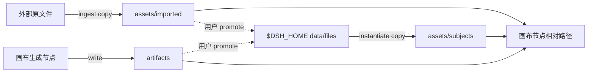

# 画布与资产库 100% 物理实体化

> 状态：**已拍板**（2026-08-30）  
> L1 合同：[`docs/contracts/project-assets-contract.md`](../contracts/project-assets-contract.md)  
> ADR：[`docs/decisions/2026-08-30-physical-materialization.md`](../decisions/2026-08-30-physical-materialization.md)  
> 本文件阶段 0 只定需求与方案；Host 实现另开实施 Issue。

---

## 0. TL;DR

**项目是物理作品包，主体库是全局母本仓，画布只引用包内相对路径。**  
导入 / 拖入 / 生成必须 copy 进对应目录。废止画布与创作资产库的外部 `real_path` 持久化。

```text
外部文件 ──ingest──► <ProjectRoot>/assets/imported/
全局母本 ──instantiate──► <ProjectRoot>/assets/subjects/<id>/
节点生成 ──write──► <ProjectRoot>/artifacts/
项目资产 ──promote──► $DSH_HOME/omnimux/assets/data/files/<id>/
```

---

## 1. 问题

| 断层 | 现状（活代码） | 代价 |
|---|---|---|
| 存储 | 项目壳在 `~/Movies/OmniMux/Projects/`，画布在 `$DSH_HOME/omnimux/workflow/workspaces/` | Finder 打开项目看不到片子 |
| 导入 | `POST .../assets/index` 与 canvas `realPath` 只索引 | 删桌面原文件即红叉 |
| 主体库 | `library.json` 记外部 `real_path`，禁止 copy | 无法离线、无法打包 |
| 生成物 | `$DSH_HOME/.../media/executions/` | 不在作品包内 |
| 回写 | 抽屉「存到资产」部分是内存假 UI | 刷新丢失 |

对标 MiniMax：一个项目一个文件夹；生成物在包内；全局资产按需实例化进项目。

---

## 2. Goals / Non-Goals

**Goals**

1. 导入后删原文件，刷新仍可播。
2. 整夹复制项目到另一台机器，画布零断链。
3. 全局主体与项目快照隔离。
4. 生成物出现在 `<ProjectRoot>/artifacts/` 并进资产账本。
5. JSON 零绝对路径。

**Non-Goals（本规格）**

- 产品库 `omnimux-products` 仍可 `real_path`（另立项）
- OpenReel 内部仓
- Hardlink 去重、`.omxpack`、向量检索
- 删除项目时 `rm -rf` 文件夹
- 无项目绑定的隐式「另存为」
- 抽屉视觉大改 / 四套筛选 Popover 重做（可后续）
- 生成成功自动写入全局主体库 / `assets_upload`（promote 必须是用户显式动作）

---

## 3. 实体

| 实体 | 物理位置 | JSON 记什么 |
|---|---|---|
| 全局主体 | `$DSH_HOME/omnimux/assets/data/files/<id>/` | `library.json` 仓内相对路径 |
| 项目导入 | `<ProjectRoot>/assets/imported/` | `.omnimux/assets.json` → `relative_path` |
| 主体快照 | `<ProjectRoot>/assets/subjects/<id>/` | 同上 + `snapshot.globalSubjectId` |
| 生成物 | `<ProjectRoot>/artifacts/` | 同上 + `lineage` |
| 画布 | `<ProjectRoot>/.omnimux/canvases/<id>.json` | 节点 `assetId` / `relativePath` |

工作区：`Session.cwd === workspace.path === Project.path`（已有本地项目规格）。画布 `WorkspaceStore` 是 DAG 文档，不是作品包。



---

## 4. 用户旅程（P0）

1. **拖入画布 / 点导入**：预检磁盘 → copy 到 `assets/imported/` → 登记账本 → 节点只持相对路径。>10MB 显示进度。
2. **主体库投入**：copy 全局仓到 `assets/subjects/<id>/` → 建素材节点。无本地文件的主体不可入画布。
3. **生成成功**：写 `artifacts/` → 登记账本。
4. **提升全局**：命名 + 类型 → copy 到全局仓 → 资产库一级页可见。
5. **无项目**：ingest 被拒，提示先保存为本地项目。

---

## 5. 需求池

| ID | 内容 | 优先级 | 阶段 |
|---|---|---|---|
| REQ-MAT-01 | 流式 copy + 同名递增 + 磁盘预检 | P0 | 1 |
| REQ-MAT-02 | 项目相对路径与 `project-file` | P0 | 1 |
| REQ-MAT-03 | 废弃 `assets/index` 纯索引 | P0 | 1 |
| REQ-MAT-04 | 全局仓 `data/files/` + 创建即 copy | P0 | 2 |
| REQ-MAT-05 | instantiate / promote | P0 | 2 |
| REQ-MAT-06 | 生成物进 `artifacts/` | P0 | 3 |
| REQ-MAT-07 | 画布 DAG 迁入 `.omnimux/canvases/` | P0 | 3 |
| REQ-MAT-08 | 右键真实持久化，去掉假 UI | P0 | 3 |
| REQ-MAT-09 | 惰性迁移旧绝对路径 | P0 | 1–3 |
| REQ-MAT-10 | 大文件 HUD | P1 | 1 最小 / 3 完整 |
| REQ-MAT-11 | lineage 写入 + Hover 展示 | P1 | 3 |
| REQ-MAT-12 | 选择器 project / library Tab | P1 | 3 |
| REQ-MAT-13 | 打包导出 / GC | P2 | — |

---

## 6. 验收（阶段 0 文档）

- [ ] 本合同 / ADR / 本规格 frontmatter 合规
- [ ] 旧零拷贝条款标明 superseded
- [ ] `docs/` 根无 `system_design.md`、无裸 mermaid
- [ ] API 表不出现 `/api/projects/:id`

**后续实施验收（不在本 Issue 编码）**

- [ ] 拖入后删桌面原文件，刷新仍播
- [ ] 主体拖入后项目目录有副本；拷项目到新机器可开
- [ ] 同名第二次导入得到 `name (1).ext`
- [ ] 生图文件出现在 `artifacts/` 且资产 Tab 可见
- [ ] 新写入 JSON 无 `/Users` 绝对路径

---

## 7. 实施切片（独立合入）

| 阶段 | 内容 | 可交付状态 |
|---|---|---|
| 0 | 本文档金字塔 | 行为不变，新代码不得再写零拷贝 |
| 1 | 项目 ingest + 最小 Client | 新导入进作品包 |
| 2 | 全局库物化 + instantiate | 主体离线可开 |
| 3 | DAG/产物搬家 + 真回写 | 作品包自包含 |
| 4 | ego-browser 离线探针 | 证据进 `docs/evidence/` |

跨插件：workflow / assets 默认拆 PR；合同变更走 R1 人工合入。Worktree：`./scripts/git-wt.sh start …`。

---

## 8. 风险

- 大视频 copy 耗时：必须 HUD，禁止同步读入内存。
- 符号链接逃逸：双重 containment。
- 旧 Agent 仍读「禁止 copy」：本规格 + AGENTS.md 必须先合入。
