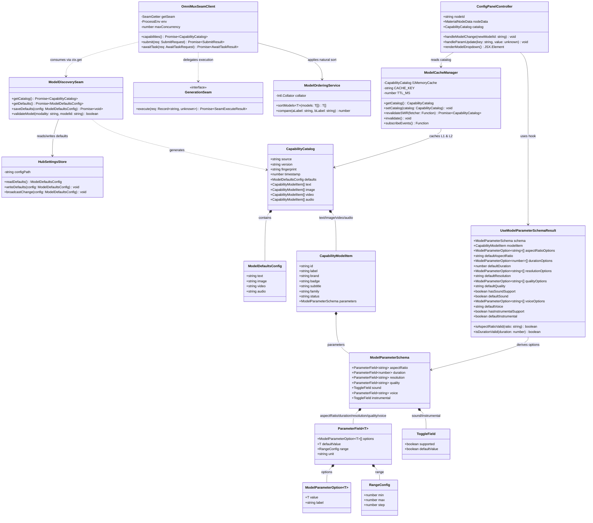
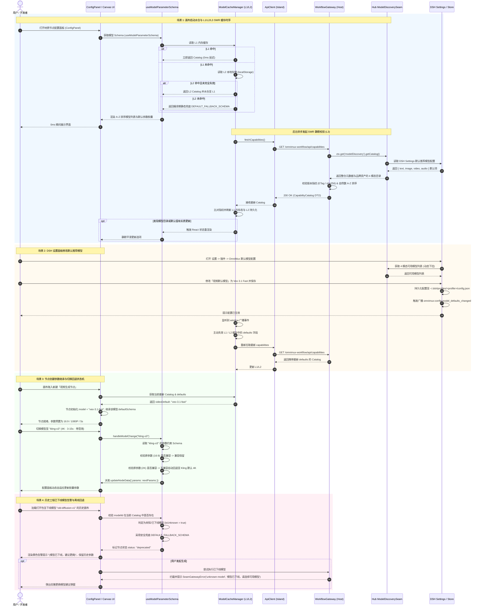
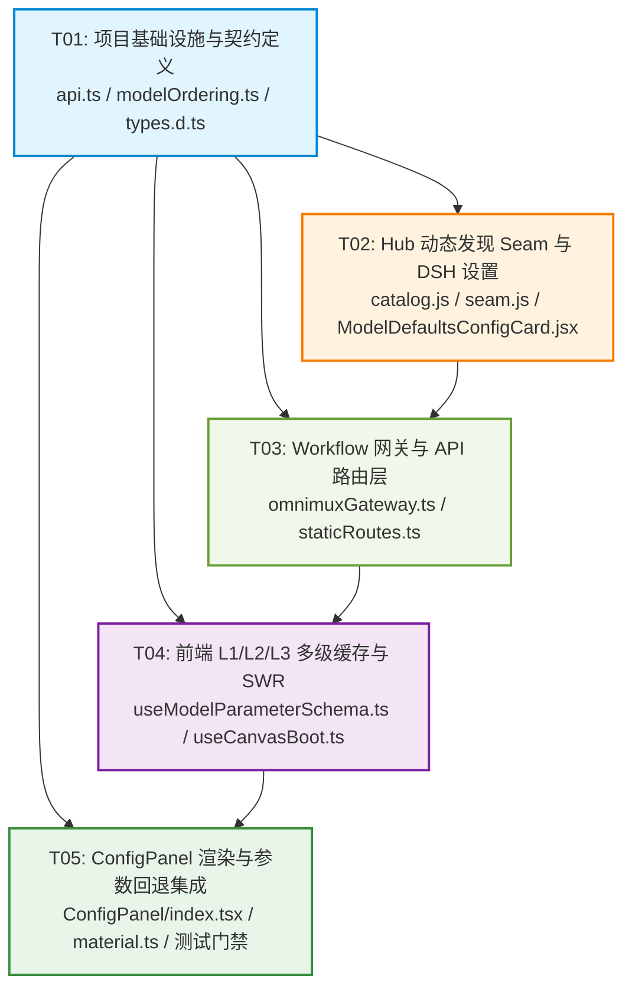

# 系统架构与技术方案设计：OmniMux 全模态模型动态发现、排序、DSH 设置默认推荐与多级缓存体系

> **版本**：1.0.0-rc  
> **作者**：高见远（Software Architect - Bob）  
> **输入基准**：产品经理许清楚 PRD（4大模态动态发现、DSH Settings 插件配置、A-Z 升序排序、L1/L2/L3 多级缓存、容错回退机制）  
> **权威归属**：L1 架构设计规范与实施契约  

---

## Part A: System Design (系统设计)

### 1. Implementation Approach (实现方案与技术选型)

#### 1.1 核心技术挑战与难点分析
1. **中枢解耦与跨插件动态目录发现**：
   - 目前文本模型在 `plugins/omnimux/src/text/catalog.js`，媒体模型在 `plugins/omnimux/src/media/route.js`，品牌视觉在 `plugins/omnimux/src/brand/model-brands.js`。
   - 画布插件 `omnimux-workflow` 过去存在静态硬编码模型列表，导致 Hub 中枢模型列表或 patch 变更时，画布未能即时感知。
   - 需要建立非侵入式、轻量级、零密钥泄露的 **Seam 通信契约**（`ctx.provide('modelDiscovery', ...)`），由 Hub 统一汇聚 4 大模态（文本、图片、视频、音频）可用模型目录与参数约束。
2. **DSH 官方设置席位契约约束**：
   - 严格遵循 `docs/contracts/settings-ui.md` 铁律：**严禁占用一级侧边栏 Tab (`settings.section`)**，必须使用官方插件设置席位（`settings.plugin.item` 或 `settings.plugins.tab`）。
   - 需实现配置持久化至 DSH Profile、跨窗口/跨组件的实时广播与动态响应。
3. **极速交互体验与多级缓存（L1/L2/L3）**：
   - 用户在画布中高频点击展开节点配置面板（ConfigPanel），必须做到 **0ms 瞬时响应，无阻塞、无闪烁、无网络 I/O 抖动**。
   - 实现「L1 内存态 -> L2 本地带版本/TTL持久化 -> L3 SWR (Stale-While-Revalidate) 后台静默校验与事件驱动主动失效」的三级缓存体系。
4. **国际化自然数排序（A-Z 自然升序）与参数继承状态机**：
   - 下拉菜单模型显示名称必须严格遵循本地化自然数升序（如 `GPT-5.5` 早于 `GPT-5.6 Sol`，`Veo 3.1` 早于 `Wan 2.6`）。
   - 节点切换模型时，必须根据新模型的参数 Schema 自动进行兼容性校验与平滑回退，禁止产生非法参数请求。

#### 1.2 开源框架与技术选型
- **微内核与插件扩展**：`Cordis` 依赖注入体系（`ctx.provide` / `ctx.inject` / `ctx.get`），保持跨插件零物理源码直接依赖（loose coupling）。
- **字符串与本地化排序**：原生 ECMAScript `Intl.Collator`（配置 `{ numeric: true, sensitivity: 'base' }`），实现高性能、跨语言自然排序，无需额外臃肿的排序第三方库。
- **状态与缓存管理**：React Hooks (`useMemo`, `useCallback`, `useSyncExternalStore`) + `localStorage` + `CustomEvent` 事件总线。
- **UI 组件与设计系统**：100% 消费官方 DSH 原生 Design Tokens（`--dsw-alias-*` / `--dsw-specific-*`）与 `dsh-ui-kit` / React Popover 浮层体系，严禁私建 CSS 隔离孤岛。

#### 1.3 架构分层模式 (Layered Architecture)
```text
┌──────────────────────────────────────────────────────────────────────────┐
│                    Layer 1: Execution Hub (中枢执行层)                   │
│  - Text Catalog / Media Route / Brand Registry / DSH Settings Storage     │
│  - Seam Provider: ctx.provide('modelDiscovery', modelDiscoveryApi)       │
└───────────────────────────────────┬──────────────────────────────────────┘
                                    │ Cordis Seam Contract (ctx.get)
┌───────────────────────────────────▼──────────────────────────────────────┐
│                 Layer 2: Workflow Gateway (画布网关与路由层)             │
│  - OmniMuxSeamClient (M4 Gateway)                                        │
│  - Static Fallback & Stub Engine (离线/独立沙箱安全兜底)                 │
│  - HTTP API Endpoint: GET /omnimux-workflow/api/capabilities             │
└───────────────────────────────────┬──────────────────────────────────────┘
                                    │ HTTP REST / JSON Contract
┌───────────────────────────────────▼──────────────────────────────────────┐
│               Layer 3: Canvas Multi-Level Cache (多级缓存与SWR层)        │
│  - L1: Module/React Memory Singleton (0ms Access)                        │
│  - L2: Persistent Cache (localStorage + Schema Fingerprint + TTL)        │
│  - L3: SWR Revalidation & omnimux:config:model_defaults_changed Event     │
└───────────────────────────────────┬──────────────────────────────────────┘
                                    │ Reactive State Hook
┌───────────────────────────────────▼──────────────────────────────────────┐
│               Layer 4: UI & ConfigPanel (节点参数配置与交互层)            │
│  - A-Z Natural Ordered Select                                            │
│  - Parameter Migration & Fallback State Machine                          │
│  - Deprecated Model Warning Badge & Safe Execution Gate                  │
└──────────────────────────────────────────────────────────────────────────┘
```

---

### 2. File List (改动与新增文件清单)

| 文件相对路径 | 类型 | 模块归属 | 核心职责 |
|---|---|---|---|
| `plugins/omnimux-workflow/src/shared/api.ts` | 变更 | Workflow 契约 | 扩展 `CapabilityCatalog`、`CapabilityModelItem`、`ModelDefaultsConfig` 与版本指纹 DTO |
| `plugins/omnimux-workflow/src/shared/modelOrdering.ts` | 新增 | 共享工具 | 基于 `Intl.Collator` 实现全模态模型 A-Z 自然升序排序标准函数 |
| `plugins/omnimux/src/discovery/catalog.js` | 新增 | Hub 中枢 | 汇聚 Text/Image/Video/Audio 4 大模态模型目录与品牌元数据 |
| `plugins/omnimux/src/discovery/seam.js` | 新增 | Hub Seam | 挂载 `modelDiscovery` Seam 服务，提供目录查询与默认推荐模型读写接口 |
| `plugins/omnimux/src/client/ModelDefaultsConfigCard.jsx` | 新增 | Hub 设置 | 在 DSH Settings（`settings.plugin.item`）挂载 4 模态默认推荐模型配置卡片 |
| `plugins/omnimux-workflow/src/workflow/seam/omnimuxGateway.ts` | 变更 | Workflow 网关 | 消费 `modelDiscovery` Seam，聚合动态目录与 A-Z 排序，提供健壮离线 Stub 兜底 |
| `plugins/omnimux-workflow/src/workflow/routes/staticRoutes.ts` | 变更 | Workflow 路由 | 完善 `GET /api/capabilities` 路由处理器与 ETag / 版本指纹校验 |
| `plugins/omnimux-workflow/src/canvas/editor/hooks/useModelParameterSchema.ts` | 变更 | 前端缓存 | 重构为 L1/L2/L3 多级缓存状态机，支持 SWR 静默校验与广播事件主动失效 |
| `plugins/omnimux-workflow/src/canvas/editor/components/MaterialNode/ConfigPanel/index.tsx` | 变更 | 前端组件 | 接入 A-Z 排序下拉、默认推荐继承状态机、下线模型黄色警告标识与平滑降级 |
| `plugins/omnimux-workflow/src/canvas/nodes/definitions/material.ts` | 变更 | 节点定义 | 新建节点初始化时默认继承 DSH Settings 配置的默认模型与参数 Schema |

---

### 3. Data Structures and Interfaces (数据结构与接口契约)

#### 3.1 类图设计 (Mermaid Class Diagram)



#### 3.2 `GET /omnimux-workflow/api/capabilities` 响应 JSON Schema
```json
{
  "$schema": "http://json-schema.org/draft-07/schema#",
  "title": "CapabilityCatalogDto",
  "type": "object",
  "required": ["source", "version", "fingerprint", "timestamp", "defaults", "text", "image", "video", "audio"],
  "properties": {
    "source": { "type": "string", "enum": ["omnimux", "static-stub"] },
    "version": { "type": "string", "example": "2.0.0" },
    "fingerprint": { "type": "string", "example": "sha256_e8a91b..." },
    "timestamp": { "type": "number", "example": 1725000000000 },
    "defaults": {
      "type": "object",
      "required": ["text", "image", "video", "audio"],
      "properties": {
        "text": { "type": "string", "example": "gemini-3.7-flash" },
        "image": { "type": "string", "example": "gpt-image-2" },
        "video": { "type": "string", "example": "seedance-2-0-fast" },
        "audio": { "type": "string", "example": "suno" }
      }
    },
    "text": { "type": "array", "items": { "$ref": "#/definitions/CapabilityModelItem" } },
    "image": { "type": "array", "items": { "$ref": "#/definitions/CapabilityModelItem" } },
    "video": { "type": "array", "items": { "$ref": "#/definitions/CapabilityModelItem" } },
    "audio": { "type": "array", "items": { "$ref": "#/definitions/CapabilityModelItem" } }
  },
  "definitions": {
    "CapabilityModelItem": {
      "type": "object",
      "required": ["id", "label"],
      "properties": {
        "id": { "type": "string" },
        "label": { "type": "string" },
        "brand": { "type": "string" },
        "badge": { "type": "string" },
        "subtitle": { "type": "string" },
        "family": { "type": "string" },
        "status": { "type": "string", "enum": ["active", "deprecated", "preview"] },
        "parameters": { "$ref": "#/definitions/ModelParameterSchema" }
      }
    },
    "ModelParameterSchema": {
      "type": "object",
      "properties": {
        "aspectRatio": {
          "type": "object",
          "properties": {
            "options": {
              "type": "array",
              "items": { "type": "object", "properties": { "value": { "type": "string" }, "label": { "type": "string" } }, "required": ["value", "label"] }
            },
            "defaultValue": { "type": "string" }
          }
        },
        "duration": {
          "type": "object",
          "properties": {
            "options": {
              "type": "array",
              "items": { "type": "object", "properties": { "value": { "type": "number" }, "label": { "type": "string" } }, "required": ["value", "label"] }
            },
            "range": { "type": "object", "properties": { "min": { "type": "number" }, "max": { "type": "number" }, "step": { "type": "number" } } },
            "defaultValue": { "type": "number" },
            "unit": { "type": "string" }
          }
        },
        "resolution": {
          "type": "object",
          "properties": {
            "options": {
              "type": "array",
              "items": { "type": "object", "properties": { "value": { "type": "string" }, "label": { "type": "string" } }, "required": ["value", "label"] }
            },
            "defaultValue": { "type": "string" }
          }
        },
        "quality": {
          "type": "object",
          "properties": {
            "options": { "type": "array", "items": { "type": "object", "properties": { "value": { "type": "string" }, "label": { "type": "string" } }, "required": ["value", "label"] } },
            "defaultValue": { "type": "string" }
          }
        },
        "sound": {
          "type": "object",
          "properties": { "supported": { "type": "boolean" }, "defaultValue": { "type": "boolean" } }
        },
        "voice": {
          "type": "object",
          "properties": {
            "options": { "type": "array", "items": { "type": "object", "properties": { "value": { "type": "string" }, "label": { "type": "string" } }, "required": ["value", "label"] } },
            "defaultValue": { "type": "string" }
          }
        },
        "instrumental": {
          "type": "object",
          "properties": { "supported": { "type": "boolean" }, "defaultValue": { "type": "boolean" } }
        }
      }
    }
  }
}
```

---

### 4. Program Call Flow (程序调用时序与交互流程)



---

### 5. Anything UNCLEAR (待确认事项与架构假设)

1. **多 Profile / 跨设备配置同步假设**：
   - 假定 DSH Settings 的默认模型配置仅持久化在本地 Profile 配置路径（如 `~/.dsh/profiles/<profile>/config.json` 或 `$DSH_HOME/omnimux/config.json`）。云端账号多端同步将在后续账号中心统一同步管线中实现。
2. **已下线模型执行策略**：
   - 历史节点如果引用了已被网关下线的模型，系统在 UI 层仅作非破坏性警告提示，不强制篡改用户画布数据；但在点击生成时，网关将抛出 `omnimux:unknown-model` 明确错误，并在前端引导用户一键切换至当前模态的默认推荐模型。
3. **音频模态子模式细分**：
   - 音频模态目前包含 `text-to-audio`（语音/TTS）和 `text-to-music`（音乐/Suno）。架构设计中将两者统一聚合在 `audio` 模态下，通过模型定义的 `voice` 或 `instrumental` 参数特性动态区分。

---

## Part B: Task Decomposition (任务拆解与实施计划)

### 6. Required Packages (依赖包声明)

```
- @xyflow/react@12.11.3: 流程图与工作流画布渲染引擎
- lucide-react@1.33.0: 矢量 SVG 图标库（遵守无 Emoji 铁律）
- dsh-ui-kit@file:../../../../personal/dsh-ui-kit: 官方原生 UI 组件库（Button, Popover 等）
- react@19.2.8: 客户端组件渲染框架
```

---

### 7. Task List (有序依赖任务列表 - 严格不超过 5 个任务)

#### T01: 项目基础设施与跨插件契约规范 (P0)
- **任务目标**：定义全模态模型发现与排序的数据结构、DTO Schema、自然数排序核心工具函数与 Seam 接口定义。
- **涉及源码文件**：
  1. `plugins/omnimux-workflow/src/shared/api.ts`
  2. `plugins/omnimux-workflow/src/shared/modelOrdering.ts`
  3. `plugins/omnimux-workflow/src/shared/modelOrdering.test.mjs`
  4. `plugins/omnimux/src/discovery/types.d.ts`
- **依赖关系**：无（首个基础任务）
- **交付验收标准**：
  - `api.ts` 完整导出 `CapabilityCatalog`、`CapabilityModelItem`、`ModelDefaultsConfig`。
  - `modelOrdering.ts` 完成基于 `Intl.Collator` 的自然数升序算法，并通过独立单元测试。

#### T02: Hub 执行中枢动态发现 Seam 与 DSH 设置配置化 (P0)
- **任务目标**：在 `plugins/omnimux` 中构建 4 模态目录聚合器，挂载 `modelDiscovery` Seam，并在官方 `settings.plugin.item` 席位注册默认推荐模型配置卡片，实现配置持久化与广播机制。
- **涉及源码文件**：
  1. `plugins/omnimux/src/discovery/catalog.js`
  2. `plugins/omnimux/src/discovery/seam.js`
  3. `plugins/omnimux/src/discovery/catalog.test.js`
  4. `plugins/omnimux/src/client/ModelDefaultsConfigCard.jsx`
  5. `plugins/omnimux/src/client/index.js`
  6. `plugins/omnimux/src/host/apply.js`
- **依赖关系**：`T01`
- **交付验收标准**：
  - `ctx.provide('modelDiscovery', ...)` 成功提供 4 模态元数据与默认配置读取/存储能力。
  - DSH Settings -> 插件中展示 OmniMux 默认模型配置卡片，修改后成功持久化并触发 `omnimux:config:model_defaults_changed` 广播。

#### T03: Workflow 网关层动态聚合与 Capabilities API 路由 (P0)
- **任务目标**：重构 `OmniMuxSeamClient`，消费 `modelDiscovery` Seam，整合动态目录、参数 Schema 与 A-Z 自然升序排序；完善 `GET /api/capabilities` 路由与离线 Stub 容错。
- **涉及源码文件**：
  1. `plugins/omnimux-workflow/src/workflow/seam/omnimuxGateway.ts`
  2. `plugins/omnimux-workflow/src/workflow/seam/gateway.ts`
  3. `plugins/omnimux-workflow/src/workflow/routes/staticRoutes.ts`
  4. `plugins/omnimux-workflow/src/workflow/seam/omnimuxGateway.test.mjs`
- **依赖关系**：`T01`, `T02`
- **交付验收标准**：
  - `GET /omnimux-workflow/api/capabilities` 返回全量 4 模态 A-Z 升序模型列表与 DSH 设置默认值。
  - Hub 未启动或离线时，自动平滑降级为 `static-stub` 模式，网关单测 100% 通过。

#### T04: 前端 L1/L2/L3 多级缓存状态机与 SWR 水合 (P0)
- **任务目标**：重构 `useModelParameterSchema.ts` 与 `useCanvasBoot.ts`，实现 L1 内存即时响应（0ms）、L2 本地带版本/TTL持久化、L3 SWR 静默校验以及设置变更事件驱动的主动失效。
- **涉及源码文件**：
  1. `plugins/omnimux-workflow/src/canvas/editor/hooks/useModelParameterSchema.ts`
  2. `plugins/omnimux-workflow/src/canvas/hooks/useCanvasBoot.ts`
  3. `plugins/omnimux-workflow/src/canvas/editor/hooks/useModelParameterSchema.test.mjs`
- **依赖关系**：`T01`, `T03`
- **交付验收标准**：
  - 启动和打开面板 0ms 命中 L1/L2 缓存，后台静默完成 SWR 校验。
  - 监听到 `omnimux:config:model_defaults_changed` 事件后，无感刷新默认推荐配置，单测覆盖率 100%。

#### T05: ConfigPanel 下拉渲染、参数继承回退与端到端回归防线 (P0)
- **任务目标**：更新 `ConfigPanel/index.tsx` 与节点创建逻辑，支持 A-Z 动态下拉、下线模型黄色警告徽章、模型切换参数兼容性回退状态机，并完成全套端到端与自动化回归测试。
- **涉及源码文件**：
  1. `plugins/omnimux-workflow/src/canvas/editor/components/MaterialNode/ConfigPanel/index.tsx`
  2. `plugins/omnimux-workflow/src/canvas/nodes/definitions/material.ts`
  3. `plugins/omnimux-workflow/src/canvas/editor/components/MaterialNode/ConfigPanel/configPanel.test.mjs`
- **依赖关系**：`T01`, `T04`
- **交付验收标准**：
  - 新建节点默认继承 DSH Settings 配置的推荐模型。
  - 下拉菜单严格展示 A-Z 自然升序。
  - 切换模型时画幅、时长等参数平滑自适应，下线模型展示醒目警告标识。
  - 运行 `pnpm test` 与 `pnpm verify:m5` 全绿通过。

---

### 8. Shared Knowledge (跨模块共享设计规范与通信约定)

1. **统一错误响应结构**：
   - 跨 Seam 与 API 的错误抛出必须统一遵循 `SeamGatewayError` 规范：`{ code: "unknown-model" | "omnimux-unconfigured" | "invalid-params", message: string }`。
2. **事件命名空间约定**：
   - 设置变更广播：`window.dispatchEvent(new CustomEvent('omnimux:config:model_defaults_changed', { detail: { defaults, timestamp } }))`。
3. **缓存键与存储隔离**：
   - L2 缓存 Storage Key：`wf_capabilities_catalog_v2`。
   - 结构体中必须携带 `version: "2.0"`、`fingerprint: string`、`timestamp: number`、`ttl: 3600000`（1小时）。
4. **自然数排序算法实现规范**：
   ```typescript
   const naturalCollator = new Intl.Collator('zh-CN', { numeric: true, sensitivity: 'base' });
   export function sortModelsByName<T extends { label: string }>(models: T[]): T[] {
     return [...models].sort((a, b) => naturalCollator.compare(a.label, b.label));
   }
   ```
5. **参数平滑回退映射表**：
   - 当从旧模型切换至新模型时，若旧参数值不存在于新模型的 `options` 中，强制平滑降级为新模型的 `defaultValue`；若存在，则 100% 保持用户原选值不变。

---

### 9. Task Dependency Graph (任务依赖关系图)


