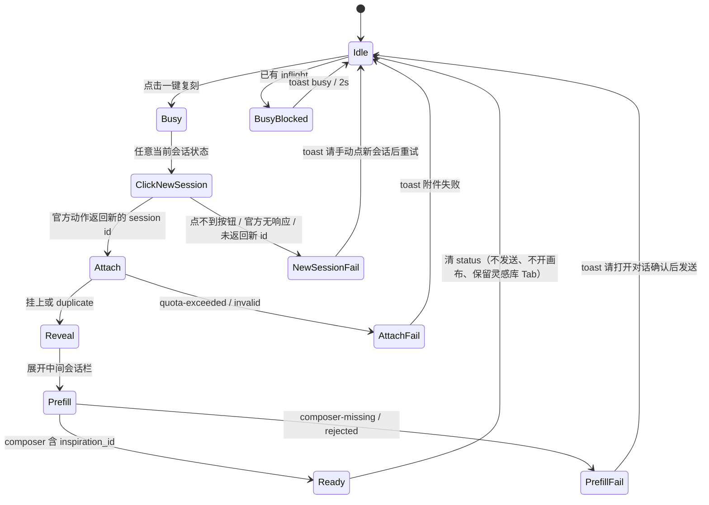

# 灵感库卡片 CTA：加会话 → 一键复刻（增量 PRD）

> **历史稿，全文已被替代。** 当前产品约束、精确提示词、官方空白会话复用及草稿保护以 [#552 当前设计](2026-09-05-inspiration-replicate-dismiss-reversal-design.md) 为准。下文保留需求演变记录，不再用于实施或验收；其中新 ID 必须变化、DOM 整框覆盖、附件失败仍预填等要求均不适用。

> 作者：许清楚（产品）  
> 输入：用户原话（最高优先级）+ 本轮已拍板（含 2026-09-04 新会话语义）+ 现网 Inspect  
> 给：架构师 / 工程师  
> 范围：只改产品路径与文案契约。不写代码。不新建 skill 包。不改 plugins 源码。

---

## 0. 结论

> **#552 已批准需求更正**：本 PRD 内较早的「空白会话复用」「无会话先报 noSession」「附件可落 `default`」与「成功后关闭灵感库」描述均由本节及后续 #552 增量设计覆盖。CTA 对任何当前会话状态均点击一次官方新会话，且只在返回的新 session id 上挂附件并预填；失败或无新 id 时不得使用旧会话或 `default`。灵感库 Tab 保留，仅 reveal 中间会话栏，画布不碰。

**一次点击、一条路径、新会话语义（同工作区空白对话）。** 卡片主按钮从「加会话」改为「一键复刻」。点击后必须同时完成三件事，然后停住等用户按发送：

1. 无论当前会话是否为空，先走官方「新会话」动作，再把该条灵感以 `kind=inspiration` 挂到该动作返回的**新会话**附件槽；拿不到新 session id 即失败，不得回退到当前会话或 `default`。
2. Composer **整框预填**下文 §5 提示词（含钉死手势 `/video-deconstruct`）。
3. **不自动发送**（沿用 `prefillReplicationPrompt`）。

**会话落点（2026-09-04 拍板）：一键复刻 = 官方侧栏「新会话」业务逻辑 + 附件 + 预填。** 不是「新建项目」。禁止每条灵感创建一个工作区 / 项目文件夹。仓内无「新绘画」产品名（语音谐音）；一律按官方「新会话」理解。

| 当前状态 | 本 CTA 必须做 | 本 CTA 禁止做 |
|---|---|---|
| 当前会话为空或已有内容 | 一律触发与用户点侧栏「新会话」**同一套**结果。实现优先：程序化点击官方 `.newSession` / aria「新会话」按钮（与用户手势同构），并只向返回的新 session id 挂附件和预填 | `sessions.create({})`；import workflow；`startReplicationProject` / `runNewProject`；复用当前会话 |
| 无任何会话 | 一律触发官方「新会话」动作，获得新 session id 后继续；失败时可感知地停住 | `sessions.create({})`；把附件静默丢进 `default` |

成功后保留灵感库 Tab，并展开中间会话栏以露出 composer；附件仅挂到**官方新会话动作返回的那条新会话**。不打开工作流画布 15:85（那是「新建项目」副作用）。新会话保持官方默认布局。

**覆盖上一轮：** 禁止双按钮。禁止把「加会话」留作主按钮。禁止本 CTA 走 `startReplicationProject` → `runNewProject`（POST `/api/projects` + `workspaces.create` 新 path + 画布 15:85）。禁止把「挂当前活跃会话、有内容也不新开会话」当作默认（2026-09-03 Q1 推荐已被用户否决）。

**Skill：** catalog `sk-omx-video-deconstruct` / slug `video-deconstruct` / 手势 `/video-deconstruct`（标题「视频拆解与复刻」）。替换现网占位 `video-replication`。禁止搜索「爆款」随机装。P0 安装策略 = **只预填手势，发送时 JIT**；点击不阻塞安装。

**商品与时长：** P0 不强制先选商品、不挂产品附件；prompt 写清「无商品则停止出片、请用户补」。时长不在 `LocalInspirationRecord` 上，按 §5 瀑布取值，缺省 **15 秒**。

---

## 1. 产品目标与非目标

### 1.1 原始需求复述

把灵感库卡片「加会话」改成「一键复刻」：点击后将该条灵感挂到会话附件，并预填「完全复刻原视频脚本和画面，只把原片商品换成我的商品；有口播才改口播、无则不编；不要字幕；原片有出镜则新片也要有；时长控制在时间范围内」；同时默认匹配并预填一个爆款复刻 skill（钉死 catalog 已有项，不新建包）。

**2026-09-04 用户否决：** 现网「每有一条灵感库记录就创建一个工作区」不符合预期。应走官方「新会话」那套业务，只在其上增加附件和预填信息。

### 1.2 Product Goals（正交）

1. **一键到达可发送态**：用户从封面到「目标空白会话 + 附件已挂 + 提示词已填 + skill 手势已写」，中间零分流、零二次确认、零新项目文件夹。
2. **复刻约束可执行**：口播 / 出镜 / 字幕 / 时长 / 商品缺失，全部写进 prompt，不做成 UI 开关。
3. **skill 可预期**：slug 钉死、失败可感知，绝不搜词乱装。

### 1.3 非目标

- 不自动点发送、不声称已出片。
- 不新建 skill 包；不把 `video-deconstruct-analyzer` / `image-remix` 当视频主路径。
- 灵感库不 `sessions.create` / 不 `sessions.create({})`；本 CTA 不调用 `__omnimuxWorkflow.startReplicationProject`、不调用 `runNewProject`、不调用 `createProject` / `createProjectSession`。
- **禁止 POST `/omnimux-workflow/api/projects`**（Host mkdir 默认库 + 说明.md + `project.json`）。
- **禁止 `workspaces.create` 新 path**（每条灵感一个新工作区正是用户否决的现网行为）。
- 不 `activateProjectCanvas` 15:85；不走 `runResetSession`（同工作区新对话但仍开画布，不是官方新会话）。
- 不跨包 client import；不 `claimProductStage`。
- 不把产品库选择做成 P0 拦截弹窗。
- 不为时长新增 Host 字段（P0 用 prompt 瀑布 + 15s 缺省）。
- 不写竞品长文。
- 「新建项目」是另一条产品（侧栏 `mountNewProjectEntry` → prompt 名称 → `runNewProject`）；一键复刻禁止走它。`docs/contracts/sidebar-extra-entries.md`：新建项目 MUST NOT 走新会话 path——对称地，新会话也 MUST NOT 走新建项目。

### 1.4 项目信息

| 项 | 值 |
|---|---|
| Language | zh（UI 双语 zh/en，见 §7） |
| 改动面 | `omnimux-inspiration` client（编排 / 文案 / CTA）；必要时市场 P1 缝 |
| Programming Language | 沿用现网（非新应用；禁止借机换成 Vite+React+MUI 新壳） |
| Project Name | `inspiration_one_click_replicate` |

---

## 2. 用户故事（含验收）

**US-1 视频灵感一键复刻**  
As a 带货创作者, I want 在封面点一次「一键复刻」 so that 我进入一条空白对话（官方新会话语义），该灵感已挂上附件，输入框已是复刻指令，我确认商品后自己点发送。  
验收：主按钮可见文本为「一键复刻」（放不下则「复刻」，`aria-label` 仍为「一键复刻」）；点击后附件 Tray 出现 `kind=inspiration` 且 `metadata.inspiration_id` 等于该行；composer 含 `/video-deconstruct` 与 `inspiration_id`；发送按钮**未被**程序点击；**无**新项目文件夹、**无**新 `workspaces.create` path。

**US-2 无商品也能先铺好**  
As a 还没选品的用户, I want 仍然能一键复刻铺好会话 so that 我稍后把商品图拖进附件再发。  
验收：不弹产品库强制选择；prompt 含「尚未提供商品则停止出片、请用户补充」；不挂 `kind=product`。

**US-3 预览里同样能复刻**  
As a 先看片再决定的用户, I want 在预览/详情里点同一颗「一键复刻」 so that 不必关弹窗回网格再找按钮。  
验收：预览与详情主 CTA 与卡片同一编排；「查看」仍只开预览，不复刻。

**US-4 失败可感知、成功不吵**  
As a 连点或环境未就绪的用户, I want 忙/附件满/composer 找不到/无会话时看到短提示 so that 我知道下一步，而不是 silently 丢了。  
验收：成功无 toast、不写剪贴板；失败 `aria-live` 2s；连点 `{error:'busy'}` 不排队；无会话时文案「请先新建或打开一个会话」。

**US-5 图片/链接不走错 skill**  
As a 库里混了图和链接的用户, I want 同一颗按钮仍预填 `/video-deconstruct` 并标明 `media_type` so that 不会被装成图片重混。  
验收：`media_type` 为 `image` / `link` 时 prompt 走 §5 降级段；手势仍是 `/video-deconstruct`，禁止改 `/image-remix`。

**US-6 十条灵感不应产生十个工作区**  
As a 连续复刻多条爆款的创作者, I want 每条灵感只占用一条空白对话、全部留在当前工作区 so that 我的工作区账本和磁盘不会被灵感库刷爆。  
验收：连续点十条不同灵感：**0** 次 `POST /api/projects`、**0** 个新项目文件夹、工作区账本 **+0** 新 path；每次都走一次官方新会话动作，附件只落在返回的新 session id；布局保持官方默认，不切 15:85 画布。

---

## 3. 需求池 P0/P1/P2

### P0 Must

| ID | 需求 | 可测标准 |
|---|---|---|
| P0-1 | 卡片主按钮文案 `card.cta.try`：zh「一键复刻」/ en「Replicate」；4 字放不下时可见「复刻」，`aria-label` 完整「一键复刻」/「One-click replicate」 | locale 单测；胶囊 28px 不截断 |
| P0-2 | 禁止「加会话」作主按钮；删除双路径：卡片 click **不得**再同时「事件挂附件 + clipboard + startReplicationProject」 | 编排只走一个 orchestrator |
| P0-3 | 一次点击 = 官方新会话 + 挂附件 + 预填 prompt + 预填 `/video-deconstruct` | 官方动作、附件与预填都发生，或按状态机失败且不回退到旧会话 |
| P0-4 | 附件：`sourcePlugin=omnimux-inspiration`，`kind=inspiration`，`entityId=row.id`，`extension=INSPIRATION`，`metadata.inspiration_id/source_url/source_platform` | 与现网 payload 字段对齐；去重指纹不变 |
| P0-5 | **会话落点 = 官方新会话语义**：无论当前为空或有内容，均触发侧栏「新会话」同一结果；附件只挂到该动作返回的**新会话** `sessionId` | 不 `sessions.create({})`；不每灵感一个工作区；不回退 `default` 或旧会话 |
| P0-6 | `buildReplicationPrompt` 输出 §5 全文；`REPLICATION_SKILL='video-deconstruct'` | 单测含手势、id、时长、商品降级、口播/字幕/出镜 |
| P0-7 | 只预填、不发送 | composer-inject 现网契约不变 |
| P0-8 | 口播/出镜/字幕仅为 prompt 约束，无 UI 开关 | 无新 checkbox |
| P0-9 | 无商品：不拦截、不挂产品附件 | 见 US-2 |
| P0-10 | 预览弹窗（`InspirationPreviewModal`）与详情（`InspirationDetailModal`）主 CTA 改为同一「一键复刻」；卡片「查看」保留 | 详情不再单独「添加到会话」 |
| P0-11 | 成功：保留灵感库 Tab、展开中间会话栏以露出 composer；无 toast；**停止写剪贴板**；**不**打开工作流画布 | 失败才 2s `aria-live`；布局 = 官方新会话默认 |
| P0-12 | 图片/链接：同一按钮 + 同一 skill + `media_type` 降级段 | 见 US-5 |
| P0-13 | 防重入：模块锁 + 全卡片 `disabled`；附件 `quota-exceeded` / `duplicate` 可感知 | duplicate 视为已挂，继续预填 |
| P0-14 | 图标改为复刻语义 SVG（拷贝/层叠），禁止 emoji；`--dsw-*`、28px 胶囊、8px 体系 | 对齐 design.md Chip |
| P0-15 | 本 CTA **0 次** `runNewProject` / `startReplicationProject` / `createProject` / `createProjectSession` / `POST /omnimux-workflow/api/projects` / `workspaces.create` 新 path / `activateProjectCanvas` | 单测 mock 断言 0 次；连续复刻工作区账本 +0 |
| P0-16 | 当前已是空白会话：仍程序化点击官方 `.newSession` / `aria-label` 新会话按钮；不建项目、不复用当前会话 | 点击恰好 1 次，附件与预填只落在返回的新 session id |
| P0-17 | 当前会话已有内容：程序化点击官方 `.newSession` / `aria-label` 新会话按钮（与用户手势同构）；灵感库禁止自己 `sessions.create`、禁止 import workflow | 结果与手点侧栏「新会话」一致，附件与预填只落在返回的新 session id |
| P0-18 | 无任何会话：仍只走官方新会话动作；失败时可感知地停住且不静默吞 | 不 `sessions.create({})`，不回退 `default` 或旧会话 |
| P0-19 | 实现优先点击官方按钮，而不是调用 `runResetSession`（后者仍会 `activateProjectCanvas`） | 无 15:85 画布副作用 |

### P1 Should

| ID | 需求 |
|---|---|
| P1-1 | 市场暴露 `window.__omnimuxMarket.ensureInstalled({ catalogId:'sk-omx-video-deconstruct', slug:'video-deconstruct' })`；点击 best-effort 安装，失败不阻断预填，toast 指向市场卡片名「视频拆解与复刻」 |
| P1-2 | 会话已有 `kind=product` 附件时，prompt 增加「已检测到商品附件，用其替换原片商品」 |
| P1-3 | 从拆解 markdown / 本地 video 元数据解析时长，写入附件 `duration` 与 prompt `duration_budget_seconds` |
| P1-4 | 纯图片灵感可在 prompt 末尾**建议**（不改手势）用户稍后可改用图片重混；P0 不切 skill |

### P2 Nice

| ID | 需求 |
|---|---|
| P2-1 | 将 `video-deconstruct` 预装进 profile/bundled（git 源，非本轮） |
| P2-2 | 若产品以后要「新开工作流项目会话」，必须**另开显式入口**（可复用侧栏「新建项目」），不得回到本 CTA 主按钮，不得恢复本 CTA 对 `startReplicationProject` 的调用 |
| P2-3 | `LocalInspirationRecord.duration` 字段与导入时写入 |

---

## 4. 交互（卡片 / 预览 / 状态机 / 反馈）

### 4.1 卡片

现网（必须覆盖）：

```
handleReplicate =
  dispatch omnimux:add-to-conversation
  + clipboard.writeText
  + onReplicate → replicateInspirationToChat → startReplicationProject → runNewProject
      POST /api/projects → workspaces.create(新 path) → sessions.create({ workspaceId })
      → bind → dismissProductStage → open → activateProjectCanvas 15:85
      → prefill
```

这就是用户看到的「每条灵感一个工作区」。文件：`replicate-to-chat.js`、`workflow-global.js`、`newProject.js`（`runNewProject` / `createProjectSession`）。「新建项目」才该建工作区（`docs/specs/2026-08-23-omnimux-local-project.md`）。

目标：

```
主胶囊「一键复刻」 → 唯一 orchestrator oneClickReplicate(row)
  任意当前会话状态 → 程序化 click 官方「新会话」
  → 取得新 session id → attach（该新会话）→ reveal conversation → prefill
  → 未取得新 id 则提示失败，绝不回退旧会话或 default
次胶囊「查看」 → 仅打开预览（现网 onSelect）
多选网格：隐藏 CTA（沿用）
```

几何沿用 2026-08-28 §5.3：行高 28px、圆角 9999px、`gap: 6px`、主按钮 primary token。可见文本优先「一键复刻」；工程师量过胶囊溢出则可见「复刻」。

### 4.2 预览 / 详情

| 表面 | 现网 | 本轮 |
|---|---|---|
| 卡片「查看」 | 开 Modal | **保留** |
| `InspirationPreviewModal` | 无复刻 CTA | 底栏主按钮「一键复刻」，同一 orchestrator；成功后仅关 Modal，灵感库 Tab 保留 |
| `InspirationDetailModal` | 「添加到会话」= 只挂附件 + 剪贴板 + `onClose` | 改为「一键复刻」同一路径；废止单独「添加到会话」 |

### 4.3 会话落点（三列对照，已拍板）

| 维度 | 侧栏「新建项目」 | 官方侧栏「新会话」 | 本 CTA「一键复刻」 |
|---|---|---|---|
| 产品意图 | 一个作品一个文件夹 | 官方会话动作 | **官方新会话 + 附件 + 预填** |
| `POST /omnimux-workflow/api/projects` | 要（Host mkdir + 说明.md + project.json） | 不要 | **禁止** |
| `workspaces.create` 新 path | 要 | 不要 | **禁止** |
| `sessions.create({})` | 不要（有 `workspaceId`） | 官方内部；插件禁止 | **灵感库禁止** |
| `sessions.create({ workspaceId })` | 要（新项目会话） | 官方内部；插件禁止 | 灵感库禁止自己调；只许程序化点官方按钮 |
| 当前空白会话 | 不适用 | 官方动作自身语义 | **仍必须点一次官方新会话；不得复用当前会话** |
| 一级页 overlay | `dismissProductStage` | 官方控制 | 灵感库 Tab 保留，只 reveal 中间会话栏 |
| 画布 15:85 | `activateProjectCanvas` | **否**（官方默认布局） | **禁止** |
| `runResetSession` | 否 | 否（比新会话重，仍开会话+画布） | **禁止**当默认 |
| 附件 + §5 预填 | 否 | 否（市场 summon 只 insertGesture） | **要** |
| 谁可以走这条 path | 仅「新建项目」按钮 | 仅「新会话」按钮 / 本 CTA 点它 | 本 CTA；**禁止**走新建项目 |

无任何会话时也只尝试官方「新会话」动作；**仍禁止**灵感库自己 `sessions.create`。不把附件先丢进 `default` 假装成功；动作失败或不返回新 session id 即失败。

成功后必须让用户看见 composer：保留 workbench 灵感库 Tab（不 `claimProductStage`），并 reveal 中间会话栏。

### 4.4 状态机



顺序硬约束：**先点官方新会话 → 获得新的 session id → attach → reveal → prefill**。禁止先建项目再挂附件；不得复用空白会话或回退 `default`。JIT 安装**不是**本状态机节点：P0 不在点击同步安装。

### 4.5 反馈

| 事件 | 反馈 |
|---|---|
| 进行中 | 全卡主按钮 disabled；`card.cta.replicating` 可停在卡片底部，不 toast |
| 成功 | 保留灵感库 Tab、reveal 中间会话栏；`onStatus(null)`；**无 toast**；**不写剪贴板**；**不开画布** |
| busy | 2s `card.cta.busy` |
| 附件满 | 2s 新 key `card.cta.attachFull` |
| composer 失败但附件已挂 | 2s `card.cta.sendManual`（文案改为「附件已添加，请打开对话粘贴或重试」） |
| 无当前会话 | 仍尝试官方新会话；失败时 2s `card.cta.newSessionFailed` |
| 新会话手势失败或未返回新 id | 2s `card.cta.newSessionFailed` |
| 工作流缺失 | **不再出现**（本路径不依赖 workflow 全局缝） |
| 建项目失败 | **不再出现**（本路径不建项目） |

---

## 5. 预填提示词全文（zh，可被工程师原样写入 `replication.js`）

`buildReplicationPrompt(row, opts)` 必须输出下面模板。花括号为运行时替换；工程师不得改约束语义。

**时长瀑布（写入 `duration_budget_seconds` 与 `duration_source`）：**

1. `row.duration` 或 `row.stats.duration` 或 `row.stats.video_duration`（秒，有限数字）
2. `row.deconstruction.duration` / `.video_duration` / `.length_seconds`
3. 都无 → **15**，`duration_source=default_15s`
4. prompt 仍命令 Agent：若附件/本地成片可量片，以实测秒数为准且不得长于 budget

**商品：** P0 `opts.product` 恒空。有 P1 商品附件再追加一段。

```
/video-deconstruct

请完全复刻原视频的脚本和画面，仅将原视频中的商品替换成我的商品。

元数据：
- inspiration_id: {id}
- media_type: {video|image|link}
- title: {title}
- source_url: {url}
- duration_budget_seconds: {n}
- duration_source: {stats|deconstruction|default_15s}

执行步骤：
1. 读取 /video-deconstruct 技能说明书。未安装时不要改用其他 skill、不要搜索「爆款」或近义技能；按本提示词继续，发送后由运行时 JIT 安装。
2. 调用 inspiration_get，传入上述 inspiration_id，读取五维拆解与本地媒体。会话附件槽已挂 kind=inspiration 的同一条目，不要再向用户索要原片。
3. 完全复刻原片脚本结构、镜头、节奏、画面语法与出场顺序；只把原片中的商品替换为我的商品。

硬约束：
- 商品：若用户消息或会话附件已提供商品图 / 产品库条目，用其替换原片商品，保持原片机位与卖点节奏。若尚未提供任何商品，停止出片，明确请用户补充商品主图或从产品库挂到附件，不要编造商品外观或品牌。
- 口播：仅当原片确有口播时，结合我的商品改写口播；原片没有口播则不要出现口播，禁止编口播。
- 字幕：新视频不要出现字幕。
- 出镜：原视频有出镜人物，新视频也必须有对应出镜；原片无出镜则不要强行加人。
- 时长：新脚本时长必须控制在 duration_budget_seconds 以内（可短，不可无故加长）。若能从本地成片或附件量到真实时长，以实测为准，但仍不得超过该上限。
- 媒体类型降级：media_type=image 时，复刻构图/光影/主体关系，不编造不存在的镜头运动，时长约束可忽略。media_type=link 且本地无成片时，用 source_url + 拆解报告复刻，不要假装已经下载原片。
- 不要假装已经出片。等待用户补充商品或确认后再生成。
```

替换规则：`{id}`=`String(row.id||'')`，空 id 仍输出该行（单测可抓）。`{title}`/`{url}` 允许空字符串。第一行必须是 `/video-deconstruct`（无多余空格）。

---

## 6. Skill 绑定（id、slug、手势、安装策略、失败降级）

| 项 | 值 |
|---|---|
| catalog id | `sk-omx-video-deconstruct`（已核对 `plugins/omnimux-market/catalog/index.json`） |
| title | 视频拆解与复刻 |
| skill / slug | `video-deconstruct` |
| 手势 | `/video-deconstruct` |
| source | git `infometa/OmniMux-skills` / `skills/video-deconstruct` / ref `main`（非 bundled，首次安装要网络） |
| 现网占位 | `REPLICATION_SKILL='video-replication'` **必须替换**；仓库无此 skill |

**弃用（禁止当本 CTA 默认）：**

| id | 原因 |
|---|---|
| `sk-omx-video-deconstruct-analyzer` | 只分析，不出片复刻 |
| `sk-omx-image-remix` | 图路径，不适合视频主路径 |
| `video-replication` | 不存在 |

**P0 安装策略（推荐默认 = 选项 c）：只预填手势，发送时 JIT。**

| 策略 | 本轮 |
|---|---|
| (a) 市场 `ensureInstalled` 窗口缝 | P1。现网 `omnimux-market` **无** `__omnimuxMarket` 安装全局；灵感库禁止跨包 import |
| (b) profile/bundled 预装 | P2。git 源，不在本增量 |
| **(c) 预填 `/video-deconstruct`，发送 JIT** | **P0**。点击零网络；slug 钉死；与「/ 可见 ≠ 已装，发送才热装」历史假设一致 |

**失败降级：** 预填永远带手势。Agent 读不到 skill 时执行 §5 步骤 2–7。禁止点击时 `skillhub_search('爆款')`。禁止调用 `skillhub_install`（该工具契约是「用户选卡片后才装」）。用户曾对装错 skill 极度反感——本功能只允许这一个 id。

旧规格 2026-08-28 §6「允许仓库尚无该 skill / 禁止新建 skill 包」：前半被「默认预填已有 catalog 项」覆盖；**后半仍有效**。

---

## 7. 文案表 zh/en

| key | zh | en |
|---|---|---|
| `card.cta.try` | 一键复刻 | Replicate |
| `card.cta.tryFull`（aria，若可见文本缩短） | 一键复刻 | One-click replicate |
| `card.cta.detail` | 查看 | View |
| `card.cta.addToConversation` | **删除或改为与 try 同值**；不得再显示「添加到会话」作主 CTA | — |
| `card.cta.replicating` | 正在准备复刻… | Preparing replication… |
| `card.cta.busy` | 正在复刻，请稍候 | Replication in progress |
| `card.cta.sendManual` | 附件已添加，请打开对话确认后发送 | Attachment added — open chat and press Send |
| `card.cta.attachFull` | 会话附件已满（最多 8 个） | Attachment limit reached (max 8) |
| `card.cta.attachFailed` | 无法添加到会话附件 | Could not add to chat |
| `card.cta.noSession` | 请先新建或打开一个会话 | Start or open a session first |
| `card.cta.newSessionFailed` | 无法打开新会话，请手动点「新会话」后重试 | Could not open a new session — click New session and retry |
| `card.cta.workflowMissing` | **本 CTA 不再使用** | — |
| `card.cta.createFailed` | **本 CTA 不再使用** | — |

动词纯粹律：胶囊内禁止「一键复刻到当前会话试试」这类长句。

---

## 8. 成功标准 DoD

1. 网格悬停主按钮不再出现「加会话」/「Add to chat」。
2. 单击主按钮：每次先执行一次官方新会话动作；仅在其返回的新 session id 上出现一条 `kind=inspiration` 附件，指纹含 `omnimux-inspiration::inspiration::{id}`。
3. Composer 文本以 `/video-deconstruct` 开头，含该 `inspiration_id`、口播/字幕/出镜/时长/商品缺失句；`document.querySelector(发送)` **无**程序 click。
4. `replication.js` 不再导出或使用 `video-replication`。
5. 预览/详情主 CTA 与卡片同一 orchestrator；「查看」不挂附件、不预填。
6. 无 `navigator.clipboard.writeText` 作为本 CTA 副作用。
7. **0 次** `startReplicationProject` / `runNewProject` / `createProject` / `POST /omnimux-workflow/api/projects` / `workspaces.create` 新 path / `activateProjectCanvas`（单测 mock 断言 0 次）。
8. 灵感库无 `sessions.create` / 无 `sessions.create({})` / 无跨包 import / 无新 skill 包。
9. 连点第二下 `busy`；附件满可感知；成功无 toast。
10. **连续点两条不同灵感**：工作区账本 **+0** 新 path、磁盘 **+0** 新项目文件夹；每次均点一次官方新会话，附件各自落在返回的新 session id。十条同理：工作区 +0。
11. 成功后布局 = 官方新会话默认且灵感库 Tab 保留、会话栏 reveal，**不是** 15:85 画布。
12. 无当前会话时仍只尝试官方新会话；失败不挂附件，且 `sessions.create` 调用次数为 0。
13. 单测全绿 **不够**：`pnpm verify:live omnimux-inspiration` + ego-browser（hover CTA 文案、点击后 Tray + composer、发送键未被点、工作区未新增）。

---

## 9. 待确认问题（最多 5，每题带推荐默认）

**Q1. 挂当前会话，还是新建工作流项目会话，还是官方新会话？**  
**已拍板（用户 2026-09-04）：一键复刻 = 官方新会话业务 + 附件 + 预填。**  
无论当前会话为空、有内容或不存在，都与侧栏「新会话」同构（程序化点击官方按钮）；只有获得返回的新 session id 才继续，禁止 `sessions.create({})`、旧会话复用或 `default` 回退。禁止每条灵感一个工作区。禁止本 CTA 调用 `startReplicationProject` / `runNewProject`。`startReplicationProject` 缝只留给「新建项目」按钮。不再作为开放问题。

**Q2. skill 默认安装选哪种？**  
推荐默认：**P0 = 只预填 `/video-deconstruct` + 发送 JIT（c）**。灵感库无安装能力、市场无 ensure 全局、git 源点击安装会拖死一键、`skillhub_install` 不允许后台偷装。P1 再补 ensure 缝。

**Q3. 用户没选商品时？**  
推荐默认：**不强制先选商品**；prompt 等待补充。强制选品破坏一键，产品库也尚未接到本 CTA。

**Q4. 成功是否关一级页 / toast / 剪贴板？**  
**已拍板（#552）**：**保留灵感库 Tab、reveal 中间会话栏 + 成功静默 + 停止剪贴板**。失败才 2s live 文案。不开画布。

**Q5. 图片/链接点一键复刻？**  
推荐默认：**同一按钮、同一 skill、prompt 降级**。禁止改预填 `/image-remix`（装错 skill 的历史雷）。

（提示词精确中文已写死在 §5，不再作为开放问题。Q1 已闭合。）

---

## 10. 给架构师的输入摘要（保留 / 砍掉哪些缝）

### 现网事实（Inspect，勿凭记忆改签名）

- `InspirationCoverCard.handleReplicate`：CustomEvent 挂附件 + clipboard + `onReplicate`。
- `use-inspiration-feed.handleReplicate` → `replicateInspirationToChat` → wait `__omnimuxWorkflow` → `startReplicationProject` → `runNewProject`：
  1. `POST /omnimux-workflow/api/projects { title }` → Host mkdir 默认库 + 说明.md + project.json
  2. `workspaces.create({ path: projectRoot })` ← **每条灵感一个新工作区**
  3. `sessions.create({ workspaceId })`
  4. bind、dismissProductStage、open、`activateProjectCanvas` 15:85
- `replication.js`：`REPLICATION_SKILL='video-replication'`（不存在）。
- `composer-inject.js`：只预填不发送（已落地）。
- `LocalInspirationRecord`：**无 `duration`**。
- AttachmentStore：`kind` 已含 `'inspiration'`；事件名 `omnimux:add-to-conversation`；无 sessionId → active / `default`；上限 8；指纹去重。
- `InspirationPreviewModal`：无复刻按钮；`InspirationDetailModal`：独立「添加到会话」。
- 市场 catalog 已有 `sk-omx-video-deconstruct`；client **无**安装 window 全局。
- 官方「新会话」：`plugins/omnimux/src/client/conversation-box.js` 是本 CTA 唯一可用的官方动作入口；本 CTA 必须观察到新的 active session id 后才挂附件，意图是进入对话列，不是建项目。
- 市场广场的 `isBlankSession` 策略不适用于本 CTA；本 CTA 不因当前会话空白而跳过官方动作。
- `runResetSession`（`newProject.js`）：已有 `workspaceId` 上 `sessions.create({ workspaceId })` + open，不 mkdir；**仍会** `activateProjectCanvas`。比 `runNewProject` 轻，但**不是**官方新会话。本 CTA 默认对齐官方新会话，而不是 reset+画布。
- 侧栏「新建项目」：`mountNewProjectEntry` → prompt 名称 → `runNewProject`。另一条产品；一键复刻禁止走它。
- workbench：无当前会话 **禁止** `sessions.create({})`；提示「请先新建或打开一个会话」。

### 保留

| 缝 | 用法 |
|---|---|
| `omnimux:add-to-conversation` | **本 CTA 挂附件的唯一合法通道**；成功路径必须带官方动作返回的新 `sessionId` |
| `prefillReplicationPrompt` / `setComposerValue` | 整框预填 + focus，不 click 发送 |
| `runExclusive` / `isReplicateBusy` | 防连点 |
| `resolveMediaType` / `deriveProjectTitle` | 前者 P0 仍用；后者本 CTA 不再建项目，可留作纯函数 |
| 官方 `.newSession` / aria「新会话」按钮 | **任意当前会话状态下本 CTA 唯一允许的「开会话」手段**（程序化 click，与用户手势同构） |
| `window.__omnimuxWorkflow.startReplicationProject` / `runNewProject` | **保留安装与 disposer，专供侧栏「新建项目」按钮**；**本 CTA 0 次调用** |
| `inspiration_get` | prompt 引用，不改 Host |
| 卡片「查看」+ 预览 Modal | 保留 |
| 附件 `claimPendingAttachments` | 点了新会话但尚拿不到 `sessionId` 时的迁移，不是无会话时的成功路径 |

### 砍掉（本 CTA）

| 行为 | 原因 |
|---|---|
| 主按钮「加会话」 | 用户否决分流，本轮改名 |
| 一次点击里 clipboard | 附件 Tray 已是真源，剪贴板是假反馈 |
| 一次点击里 `startReplicationProject` / `runNewProject` / `POST /api/projects` / `workspaces.create` 新 path | 用户否决「每条灵感一个工作区」；那是「新建项目」 |
| `activateProjectCanvas` 15:85 / `runResetSession` | 新建项目或 reset 的副作用，不是官方新会话 |
| 详情「添加到会话」独立路径 | 必须并入一键复刻 |
| `REPLICATION_SKILL = video-replication` | 换成 `video-deconstruct` |
| 为本功能新建 skill 包 / 搜索爆款安装 | 硬禁 |
| 灵感库 `sessions.create` / `sessions.create({})` / inject sessions / 跨包 import | 硬禁 |
| 自动发送 | 硬禁 |
| 强制商品选择器 | P0 不做 |
| 无会话时静默把附件丢进 `default` 当成功 | 必须提示「请先新建或打开一个会话」 |

### 建议编排（给工程师，非本文件实现）

把卡片事件派发从 JSX 挪进唯一 `oneClickReplicate(row)`：

1. 任意当前会话状态均程序化 click 官方新会话按钮，等待新的 active session id。
2. 未获得新 id → `newSessionFailed`，不挂附件。
3. `omnimux:add-to-conversation` 必须带返回的新 `sessionId`。
4. reveal 中间会话栏。
5. `buildReplicationPrompt` → `prefillReplicationPrompt`。
6. 保留灵感库 Tab。

`InspirationCoverCard` 只调 `onReplicate`，不再自己 `dispatch`+clipboard。灵感库**禁止** `waitForWorkflowGlobal` / `startReplicationProject`。

### 风险

- 一级页挡住 composer：必须有「收起灵感库 Tab」手段，否则预填了用户看不见。官方新会话「看起来像没点」时尤其依赖自己关 overlay。
- 点新会话后 `sessionId` 短暂不可得：允许先 `default` 再 `claimPendingAttachments`；不得为此改调 `sessions.create`。
- JIT 未热装：用户发送后 Agent 可能说找不到 skill——可接受，文案已禁止改 skill。
- 附件满：预填仍应尝试，但必须 toast 满额。
- 旧单测锁定「加会话」与 `startReplicationProject` 调用次数，需按本 PRD 改断言（QA 回归点：断言 **0** 次建项目，而不是 1 次）。
- 把 `runResetSession` 误当成「新会话」：会错误打开画布。产品判定这不是官方新会话。
