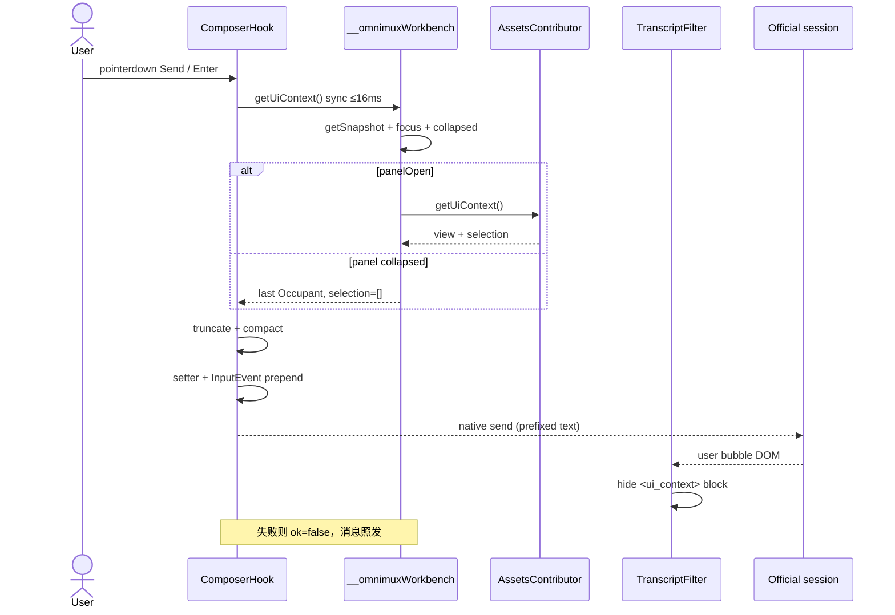
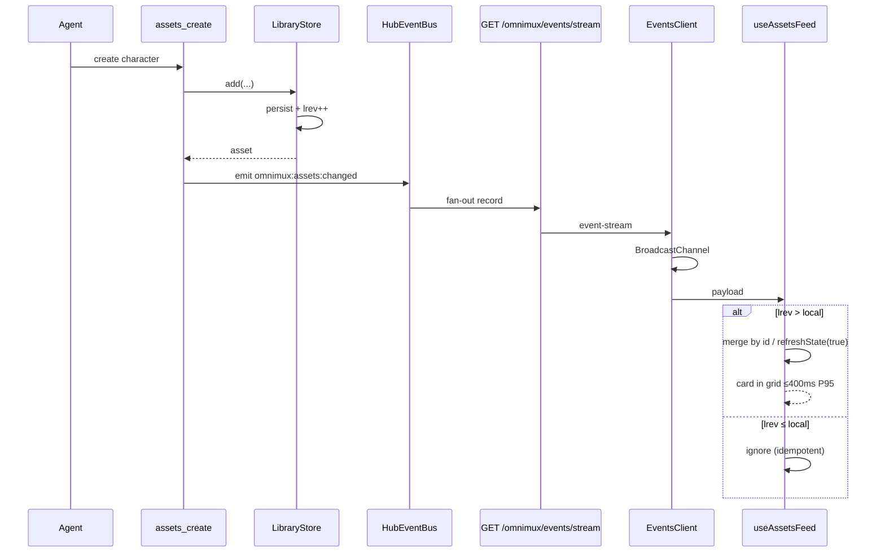
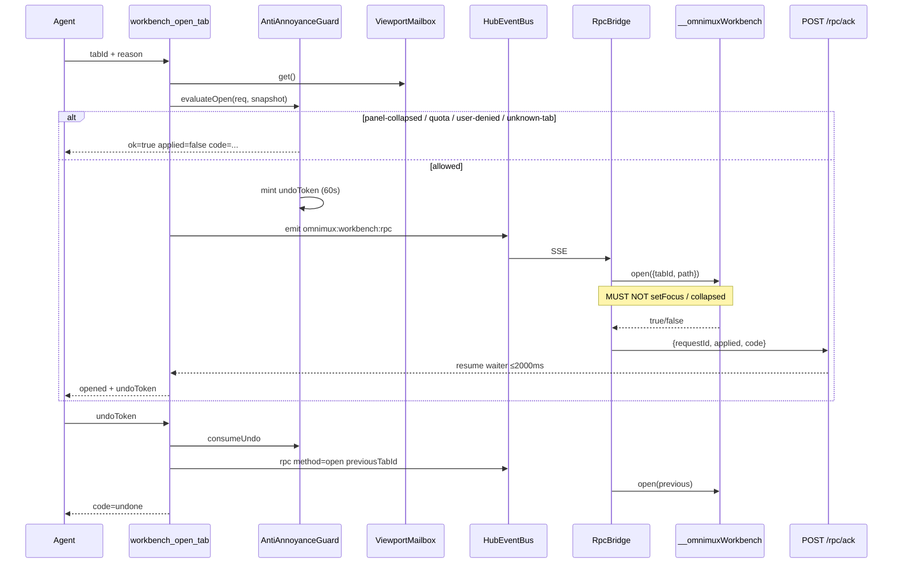
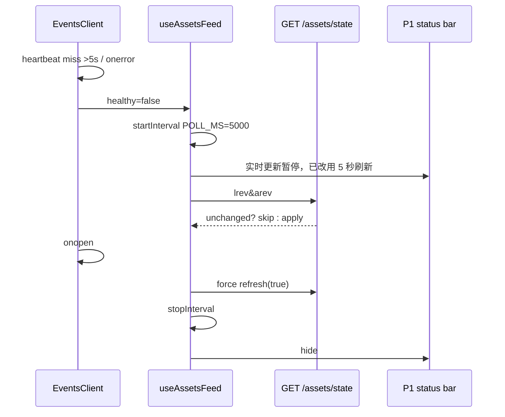
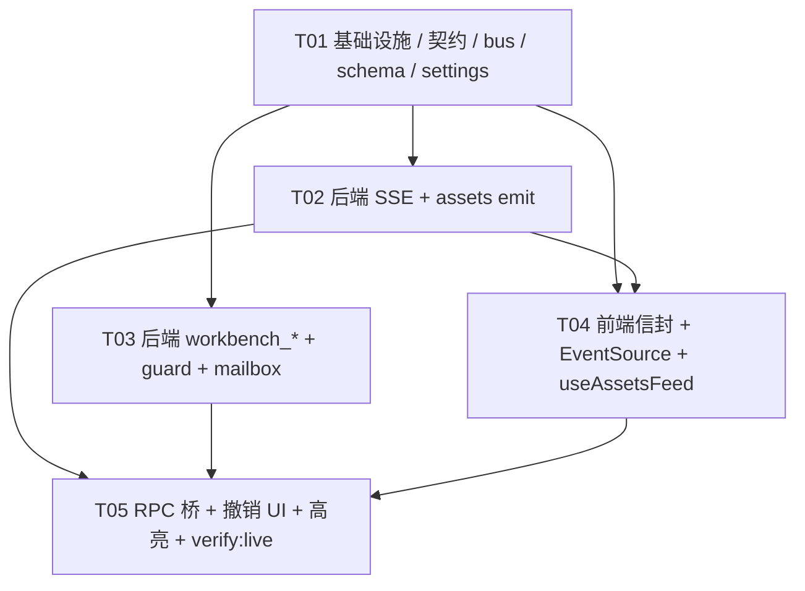

# 系统设计与任务分解：Agent 页面感知与工作台双向协同

> **文档地位**：L2 技术规格。实现以本文 + L1 `docs/contracts/agent-workbench-sync.md` + ADR 为准；产品口径以 PRD 为准。  
> **作者**：高见远（架构师） · 2026-09-04  
> **工作树**：`omnimux-dsh-wt-agent-workbench-sync` / 分支 `agent/omnimux-agent-workbench-sync`  
> **不新开包**。必改 `omnimux` + `omnimux-assets`；其余 Occupants 跟进同一贡献器接口（P1）。

---

# Part A: 系统设计

## 1. Implementation Approach

### 1.1 问题与难点

人机同面已经成立（左官方导航 | 中官方会话不卸载 | 右 `dsh-better-sidebar`），但三面状态不通：

| 目标 | 现网缺口 | 难点 |
|---|---|---|
| **G1 视口可寻址** | 发送路径无视口；插件不能 fork composer，也没有官方 `message.metadata` 缝 | 必须在 **不卸载、不自绘 composer** 的前提下，把信封送进模型上下文，且用户气泡不展示 JSON |
| **G2 工作台可驾驶** | `window.__omnimuxWorkbench.open` 只活在渲染进程；Host 工具碰不到 | Agent 在 Node Host；`open()` 在 Chromium。必须有 **可审计 RPC**，且遵守 #372 焦点独立 / 防打扰 |
| **G3 写盘即可见** | `useAssetsFeed` `POLL_MS = 5000` | 400ms P95；SSE 断连必须自动回 5s poll；幂等防双卡 |

额外硬边界（不可谈判）：

- 垂直包 **禁止** `import` hub client / hub internals。
- 禁止第二套 composer、禁止 shadow `conversation`、禁止无 better-sidebar 回退 overlay（#313）。
- `workbench_open_tab` **禁止** `setFocus` / 改 `conversationCollapsed` / `claimProductStage` / `sessions.create({})`。
- 5s poll **不得删除**，只从主路径降为兜底。
- 设置项禁止新的一级 `settings.section`。

### 1.2 拍板（解答 PRD Q1 / Q2）

完整理由见 [ADR](../decisions/2026-09-04-agent-workbench-bidirectional-sync.md)。工程结论：

**Q1 信封注入** — 双通道，不发明 hidden 系统消息，不赌官方 metadata：

1. **认知面**：Composer **capture-phase** 拦截发送（pointerdown 发送钮 / keydown Enter）。同步采集 ≤16ms，把紧凑 `<ui_context schema="1">` **前缀**写入受控 textarea（React 18 prototype setter + `InputEvent`，与 `omnimux-inspiration` `composer-inject.js` 同构）。会话气泡由 Hub 过滤器隐藏该块。
2. **工具面**：Client 心跳 `POST /omnimux/workbench/viewport`；`workbench_get_active_view` 读 Host last-known，>3s 标 `stale`。

**Q2 传输** — Hub 一条多路复用 SSE，不是 N 条垂直 SSE，也不是长轮询主路径：

- 进程内 `HubEventBus`，`ctx.provide('hubEvents')`。
- 浏览器 **一条** `EventSource('/omnimux/events/stream')`，`BroadcastChannel('omnimux:hub-events')` 扇出。
- 心跳 2s；5s 静默 → 资产库恢复 5s poll。
- 画布已有私有 execution SSE，本轮 **不动**；域变更走 Hub 总线。

### 1.3 架构模式

```text
┌─ Chromium ─────────────────────────────────────────────────────────┐
│ Composer hook ─capture→ Envelope ─prefix→ official send            │
│ Transcript filter hides <ui_context>                               │
│ __omnimuxWorkbench.open / getSnapshot / registerContextContributor │
│ EventSource ×1 ──► BroadcastChannel ──► useAssetsFeed / RPC bridge │
└──────────────▲─────────────────────────────┬───────────────────────┘
               │ POST viewport / rpc/ack     │ GET /omnimux/events/stream
┌──────────────┴───────── Node Host ─────────┴───────────────────────┐
│ Hub: HubEventBus · SSE router · viewport mailbox · workbench_*     │
│      SettingsConfig.allowAgentSwitchTab · systemPrompt.section     │
│ Assets: library.add/update/remove ──emit──► hubEvents              │
│         GET /omnimux/assets/state 仍作 poll 兜底                    │
└────────────────────────────────────────────────────────────────────┘
```

模式：

- **Sidecar prefix（G1）**：不 fork composer，只在发送手势前改受控 value。
- **Mailbox + RPC（G2）**：Host 是工具真源；浏览器是执行器；ack 关闭等待。
- **In-process Event Bus + 单路 SSE（G3）**：垂直包只 `emit`，不拥有连接。
- **Push-primary / poll-fallback**：健康 SSE 停 interval；不健康复用现网 poll。

### 1.4 框架与库

零新 runtime 依赖。复用：

| 能力 | 复用 |
|---|---|
| Occupants / open 序列 / Default Focus | `plugins/omnimux/src/client/workbench.js` |
| 工具 schema | `plugins/omnimux/src/tools/schema.js` `objectParams` + `JSON_TOOL_OUTPUT` |
| 写闸 | `plugins/omnimux/src/apps/origin.js` `assertLocalWrite`（SSE GET 用同一 host 集） |
| SSE 线格式 | 对齐 `omnimux-workflow` `ExecutionSSE`（`id/event/data` + heartbeat + `retry: 3000`） |
| Composer setter | `omnimux-inspiration/src/client/composer-inject.js` |
| 资产 revision | `library.revision()` / `artifacts.revision()` + `GET /omnimux/assets/state` |
| 设置座 | 现有 `settings.plugin.item` `omnimux` 卡 |

不引入 socket.io、不引入 ws 客户端、不把 `EventTarget` 当跨进程真源。

---

## 2. File List

```text
docs/
  contracts/agent-workbench-sync.md                         # [新建] L1 契约
  contracts/hub.md                                          # [修改] hubEvents + workbench_* 缝
  contracts/workbench-split.md                              # [修改] Agent 驾驶指针
  contracts/plugin-agent-tools-inventory.md                 # [修改] 中枢 +2 工具
  contracts/README.md                                       # [修改] 索引
  decisions/2026-09-04-agent-workbench-bidirectional-sync.md
  specs/2026-09-04-agent-workbench-bidirectional-sync-prd.md
  specs/2026-09-04-agent-workbench-bidirectional-sync-design.md
  specs/2026-09-04-agent-workbench-sync-class.mermaid
  specs/2026-09-04-agent-workbench-sync-sequence.mermaid
  specs/README.md
  decisions/README.md

plugins/omnimux/src/
  events/
    bus.js                                                  # [新建] HubEventBus
    bus.test.js
    sse.js                                                  # [新建] SSE publisher（心跳 2s / 回放）
    sse.test.js
    http-routes.js                                          # [新建] GET /omnimux/events/stream
    names.js                                                # [新建] 事件名常量
  workbench/
    mailbox.js                                              # [新建] viewport last-known
    mailbox.test.js
    guard.js                                                # [新建] 防打扰状态机（配额/undo/3s 去抖）
    guard.test.js
    http-routes.js                                          # [新建] POST viewport + rpc/ack
    mount.js                                                # [新建] 注册两工具 + systemPrompt
    mount.test.js
    schema.js                                               # [新建] Envelope 校验 / 截断 / compact
    schema.test.js
  host/apply.js                                             # [修改] provide hubEvents + mount workbench
  host/http.js                                              # [修改] 挂 events + workbench HTTP
  settings/schema.js                                        # [修改] allowAgentSwitchTab
  client/
    workbench.js                                            # [修改] getUiContext / registerContextContributor
    ui-context.js                                           # [新建] 采集 + 截断 + compact
    ui-context.test.js
    composer-envelope.js                                    # [新建] 发送拦截 + setter 注入
    composer-envelope.test.js
    transcript-filter.js                                    # [新建] 隐藏用户气泡里的 <ui_context>
    events-client.js                                        # [新建] EventSource 单例 + BroadcastChannel
    events-client.test.js
    workbench-rpc-bridge.js                                 # [新建] 订阅 rpc → open() → ack
    workbench-rpc-bridge.test.js
    WorkbenchSwitchCard.jsx                                 # [新建] 对话内切页痕迹 + 撤销/打开
    ModelsSettingsCard.jsx                                  # [修改] 允许 Agent 切页开关
    chrome.js / index.js                                    # [修改] 安装 envelope / events / filter
    locales.js                                              # [修改] 文案

plugins/omnimux-assets/src/
  index.js                                                  # [修改] library 写路径 emit hubEvents
  http-routes.js                                            # [修改] 写成功后 emit（若未走 store 包装则双保险禁双发）
  client/
    use-assets-feed.js                                      # [修改] SSE 主路径 / poll 兜底 / 幂等合并
    use-assets-feed.test.js                                 # [新建或扩展]
    ui-context.js                                           # [新建] getUiContext 贡献器
    highlight.js                                            # [新建] highlightIds + Chip hint
    index.js / AssetsStage                                  # [修改] 注册贡献器、高亮、状态条
```

垂直 Occupants（P1，不阻塞金标）：各 `src/client/ui-context.js` + `registerContextContributor`。本轮任务表不把它们拆成独立任务。

---

## 3. Data Structures and Interfaces

### 3.1 classDiagram

完整源：`docs/specs/2026-09-04-agent-workbench-sync-class.mermaid`。

```mermaid
classDiagram
    direction TB

    class UiContextEnvelope {
        +int schemaVersion
        +boolean ok
        +string reason
        +int capturedAt
        +string sessionId
        +Surface surface
        +View view
        +SelectionItem[] selection
    }

    class Surface {
        +string tabId
        +string plugin
        +boolean panelOpen
        +string focus
        +boolean conversationCollapsed
    }

    class View {
        +string kind
        +string filterType
        +string query
        +string sortKey
        +string viewMode
        +string layer3Tab
        +object extra
    }

    class SelectionItem {
        +string id
        +string name
        +string type
        +string kind
    }

    class HubEventBus {
        +int nextId
        +EventRecord[] ring
        +emit(type, payload) EventRecord
        +subscribe(fn) Function
        +replaySince(lastId) EventRecord[]
    }

    class EventRecord {
        +string id
        +string type
        +int at
        +object payload
    }

    class HubSsePublisher {
        +ServerResponse res
        +attach(bus)
        +send(record)
        +heartbeat()
        +close()
    }

    class ViewportMailbox {
        +Envelope last
        +int capturedAt
        +put(envelope)
        +get() Envelope
        +isStale(ms) boolean
    }

    class AntiAnnoyanceGuard {
        +string sessionId
        +int switchCount
        +Map undoByToken
        +boolean allowAgentSwitchTab
        +evaluateOpen(req, snapshot) GuardDecision
        +rememberUndo(token, snapshot)
        +consumeUndo(token) UndoSnapshot
    }

    class GuardDecision {
        +boolean ok
        +boolean applied
        +string code
        +string undoToken
        +string previousTabId
    }

    class WorkbenchRpcRequest {
        +string requestId
        +string method
        +string tabId
        +string path
        +object view
        +string[] highlightIds
        +string reason
        +string previousTabId
        +string undoToken
        +string sessionId
        +boolean forceOpenPanel
    }

    class WorkbenchApi {
        +open(opts) Promise
        +getSnapshot() object
        +getFocus() string
        +isActive(tabId) boolean
        +registerContextContributor(tabId, fn)
        +getUiContext() UiContextEnvelope
    }

    class ContextContributor {
        +string tabId
        +read() ContributorSlice
    }

    class ComposerEnvelopeHook {
        +install()
        +capture(submitEvent) UiContextEnvelope
        +injectPrefix(textarea, compact)
    }

    class EventsClient {
        +EventSource source
        +boolean healthy
        +connect()
        +subscribe(type, fn)
        +fanout(record)
    }

    class AssetsFeed {
        +int lrev
        +int arev
        +Asset[] assets
        +boolean sseHealthy
        +applyEvent(payload)
        +refreshState(force)
        +startPoll()
        +stopPoll()
    }

    class LibraryStore {
        +add() Asset
        +update() Asset
        +remove()
        +revision() int
    }

    UiContextEnvelope *-- Surface
    UiContextEnvelope *-- View
    UiContextEnvelope *-- SelectionItem
    HubEventBus *-- EventRecord
    HubSsePublisher --> HubEventBus : subscribe
    ViewportMailbox --> UiContextEnvelope
    AntiAnnoyanceGuard --> GuardDecision
    WorkbenchApi --> ContextContributor
    ComposerEnvelopeHook --> WorkbenchApi : getUiContext
    EventsClient --> HubSsePublisher : EventSource
    AssetsFeed --> EventsClient : omnimux:assets:changed
    LibraryStore --> HubEventBus : emit
    AntiAnnoyanceGuard --> HubEventBus : omnimux:workbench:rpc
```

### 3.2 Envelope 校验与截断

`plugins/omnimux/src/workbench/schema.js`（Host 与 Client 允许各有一份纯函数拷贝，禁止跨包 import）：

```text
normalizeEnvelope(raw) → Envelope
compactEnvelope(env) → string          # <ui_context> 块
truncateEnvelope(env, budget=800) → Envelope
  drop selection from tail → view.query → view.extra
  NEVER drop surface
stripSecretsAndPaths(env) → Envelope   # 拒绝 /Users、OMNIMUX_、sk-
```

`reason` 枚举：`ok | no-workbench | panel-collapsed | no-contributor | timeout | unavailable`。

`panel-collapsed` 时 `ok === true`（last tab 有价值），`selection = []`。

### 3.3 Tool Schema（normative）

#### `workbench_get_active_view`

```json
{
  "name": "workbench_get_active_view",
  "description": "Read the user's current OmniMux workbench viewport: which plugin tab is focused, whether the right panel is open, library filters, and up to 20 selected ids. Use this before listing an entire library. Does not change the UI.",
  "parameters": { "type": "object", "properties": {}, "additionalProperties": false }
}
```

成功：

```json
{
  "ok": true,
  "stale": false,
  "uiContext": { "schemaVersion": 1, "ok": true, "reason": "ok", "capturedAt": 0, "surface": {}, "view": {}, "selection": [] }
}
```

#### `workbench_open_tab`

```json
{
  "name": "workbench_open_tab",
  "parameters": {
    "type": "object",
    "additionalProperties": false,
    "required": ["tabId", "reason"],
    "properties": {
      "tabId": { "type": "string" },
      "reason": { "type": "string", "minLength": 4, "maxLength": 80 },
      "view": {
        "type": "object",
        "properties": {
          "filterType": { "type": "string" },
          "query": { "type": "string" },
          "layer3Tab": { "type": "string" }
        }
      },
      "highlightIds": { "type": "array", "maxItems": 20, "items": { "type": "string" } },
      "forceOpenPanel": { "type": "boolean" },
      "undoToken": { "type": "string" }
    }
  }
}
```

成功 / 软拒绝统一：

```json
{
  "ok": true,
  "applied": true,
  "code": "opened",
  "tabId": "omnimux-assets:library",
  "previousTabId": "omnimux-workflow:canvas",
  "undoToken": "undo_01J...",
  "reason": "新角色图已入库"
}
```

`code` 枚举见契约 §4.2。`ok: true, applied: false` 是合法成功。

`output.render`（对话痕迹）：Hub 自定义 render，**不要**只丢 JSON。一行 13px 次文案（reason）+ 文本按钮「撤销」（有 `undoToken` 且未过期）+ `panel-collapsed` 时「打开资产库」。控件 32px / 8px / SVG / 无 emoji。实现：`WorkbenchSwitchCard.jsx` 经 tool output 的 `render` 返回结构化块；若官方 render 只吃 text，则退化为带 marker 的 markdown + 过滤器升级为按钮（P1 允许先 text 按钮后卡片）。

### 3.4 SSE Event Schema

```text
id: 17
event: omnimux:assets:changed
data: {"type":"omnimux:assets:changed","lrev":42,"arev":7,"op":"create","ids":["ast_new"],"assetType":"character","at":1756944000500}

id: 18
event: omnimux:heartbeat
data: {"type":"omnimux:heartbeat","at":1756944002000}

id: 19
event: omnimux:workbench:rpc
data: {"type":"omnimux:workbench:rpc","requestId":"rpc_01J...","method":"open",...}
```

| type | 发射方 | 订阅方 |
|---|---|---|
| `omnimux:heartbeat` | SSE publisher | EventsClient 看门狗 |
| `omnimux:assets:changed` | assets Host | `useAssetsFeed` |
| `omnimux:workbench:rpc` | workbench mount | rpc-bridge |
| `omnimux:workbench:highlight` | rpc-bridge 成功后（可选同页） | 资产网格 |

未知 `type`：Client 忽略，不得断连。

### 3.5 `hubEvents` provide

```text
ctx.provide('hubEvents', bus)
bus.emit(type, payload) → EventRecord
bus.subscribe(listener) → unsubscribe
bus.replaySince(lastId) → EventRecord[]
```

垂直包：`ctx.get?.('hubEvents')?.emit(...)`。缺失 = no-op（poll 兜底）。**禁止**垂直包 `provide` 同名缝。

---

## 4. Program Call Flow

完整源：`docs/specs/2026-09-04-agent-workbench-sync-sequence.mermaid`。

### 4.1 G1 — 用户发送 + 信封



### 4.2 G3 — 生图入库秒级可见



### 4.3 G2 — `workbench_open_tab` + undo



### 4.4 断连降级



---

## 5. 关键子系统设计

### 5.1 Q1 — Composer 采集与注入（落地机制）

**为什么不是 metadata / hidden 系统消息**

- 产品树是 out-of-tree 插件，**没有**官方 `UserPromptSubmit` 或 `messages.metadata` 扩展点；自绘 composer 被 PRD / workbench-split 双禁。
- 独立系统消息会变成用户可见的第二条气泡，或需要 fork 会话渲染。

**拦截点（Hub client only）**

`installComposerEnvelopeHook(doc)`：

1. 在 `[data-composer-card]` 上 **capture** `pointerdown`（发送按钮：`button` 且非 attachment/add）与 `keydown`（Enter 且无 Shift，目标为 composer textarea）。
2. 调用 `getUiContext()`。用 `performance.now()`；超过 16ms 或 throw → `ok:false, reason:timeout|unavailable`。
3. `compactEnvelope`；若 textarea 已有本 schema 前缀则先剥再写（防重复发送堆叠）。
4. React 18：`Object.getOwnPropertyDescriptor(HTMLTextAreaElement.prototype, 'value').set.call(field, next)` + `field.dispatchEvent(new InputEvent('input', { bubbles: true }))`。
5. **不** `preventDefault`。原生发送继续，读到的已是带前缀的 value。

**显示过滤**

`installTranscriptFilter(doc)` 观察会话列：用户消息文本节点若以 `<ui_context` 开头，包进 `<span data-omnimux-ui-context hidden>`。复制消息时是否包含前缀：P0 允许仍在剪贴板（实现简单）；P1 可在 copy 时剥。

**贡献器**

```js
// omnimux-assets client
window.__omnimuxWorkbench.registerContextContributor('omnimux-assets:library', () => ({
  view: {
    kind: 'library',
    filterType: feed.filterType || undefined,
    query: (feed.query || '').slice(0, 64) || undefined,
    sortKey: feed.sortKey,
    viewMode: feed.viewMode,
  },
  selection: [...feed.selectedIds].slice(0, 20).map((id) => {
    const row = feed.assets.find((a) => a.id === id)
    return { id, name: row?.name, type: row?.type, kind: 'asset' }
  }),
}))
```

贡献器必须闭包当前 feed 的 ref，不能 `await`。Tab 未挂载 → `no-contributor`。

**心跳 mailbox**

`workbench.subscribe` + 1s interval：`POST /omnimux/workbench/viewport` body = Envelope。`assertLocalWrite`。无会话也允许 POST（`sessionId` 可空），工具在无会话时仍返回 `no-session` 给 **open**，get_active_view 可返回信封但标 `no-session` 仅当 PRD 要求——PRD：get 在无会话报 `no-session`。Mailbox 有数据但 `sessions.current` 空 → get 返回 `{ ok:false, error:'no-session' }`。

### 5.2 Q2 — HubEventBus 与 SSE

**Bus**（`events/bus.js`）

- 单进程单例，`apply()` 里 `createHubEventBus()` + `ctx.provide('hubEvents', bus)`。
- `emit` 分配十进制字符串 id（EventSource `Last-Event-ID` 友好）。
- Ring：64 条或 10s，先到先丢。
- 同步通知 subscribers；SSE publisher 是其中一个 subscriber。

**路由**（`events/http-routes.js`）

- `webServer.register({ kind:'prefix', path:'/omnimux/events', handler })`。
- 仅 `GET /omnimux/events/stream`。其它 path 404。
- Origin 闸：与 `assertLocalWrite` 同一 `LOCAL_HOSTS`；跨站 403 `{ error:'not-local' }`。
- `writeHead` 后 **不得** `sendJson`。`req`/`res` `close` → publisher.cleanup。
- 心跳 2s：`event: omnimux:heartbeat`。
- `Last-Event-ID` 回放 ring。

**为什么心跳 2s 而不是画布的 30s**：资产金标看门狗是 5s；30s 心跳无法在 5s 内判定死亡。2s 对 loopback 可忽略。

**Client 单例**（`events-client.js`）

- `installHubEventsClient()` 在 hub `apply()` effect。HMR 可重装，必须先 `close()` 旧 EventSource。
- `window.__omnimuxHubEvents = { subscribe, getHealthy }`。垂直包只读。
- Fan-out：`BroadcastChannel('omnimux:hub-events')` 供同文档多 hook；同页不依赖 channel 也可 `subscribe`。
- `onerror`：标记 unhealthy，**不**自己疯狂重连（浏览器 EventSource 已有 `retry: 3000`）。5s 无消息同样 unhealthy。

**资产发射点**

在 `omnimux-assets` `apply()` 包装 store，避免 HTTP 与 tool 双发：

```js
function withEvents(store, bus, kind) {
  const wrap = (op, fn) => async (...args) => {
    const result = await fn(...args)
    const ids = extractIds(op, result, args)
    bus?.emit('omnimux:assets:changed', {
      lrev: store.revision(),
      arev: artifacts.revision(),
      op,
      ids,
      assetType: result?.type || args[1]?.type,
      at: Date.now(),
    })
    return result
  }
  return { ...store, add: wrap('create', store.add), update: wrap('update', store.update), remove: wrap('delete', store.remove) }
}
```

Hub **不得**读 `library.json`。

### 5.3 RPC 控制桥与 undoToken

**Host `workbench_open_tab` 伪码**

```text
if (args.undoToken) return applyUndo(args.undoToken)
if (!reason valid) return { ok:true, applied:false, code:'reason-required' }
if (!occupants.has(tabId)) return { ..., code:'unknown-tab' }
if (!allowAgentSwitchTab) return { ..., code:'user-denied' }
if (!currentSession) return { ..., code:'no-session' }
snap = mailbox.get()
if (!snap.surface.panelOpen && !args.forceOpenPanel && !sessionGrant)
  return { ..., code:'panel-collapsed' }
if (guard.sameTabWithin3s(tabId)) return { ..., code:'already-active', applied:true }
if (tab actually changes && guard.switchCount >= 3) return { ..., code:'quota-exceeded' }
token = mintUndo(sessionId, previousTabId, previousView)
emit rpc
wait ack 2000ms
  timeout → { code:'rpc-timeout', applied:false }  // undo 不计数
  ack.applied → increment quota if tab changed
return ack + token
```

**Client bridge**

订阅 `omnimux:workbench:rpc`：

1. `method === 'open'` → `await window.__omnimuxWorkbench.open({ tabId, path })`。
2. 成功后把 `view` / `highlightIds` 写入 `sessionStorage['omnimux-workbench-intent:'+tabId]`（垂直包 mount 时读取一次：Chip hint 或显式 filter；**P0 不静默改 Chip**，只 highlight + hint）。
3. `POST /omnimux/workbench/rpc/ack`。
4. 无 `__omnimuxWorkbench` → ack `no-workbench`。

Waiter：`Map<requestId, { resolve, timer }>` 活在 Host mount 闭包。

**undoToken**

- 格式 `undo_` + ulid/random，内存 Map，TTL 60s。
- 载荷：`{ sessionId, previousTabId, previousView, expiresAt }`。
- 过期 / 跨会话 → 按钮 disable「已过期」。
- 撤销是用户手势：P1 按钮走 **同一** `open()`，**不**占配额；也可 `workbench_open_tab({ undoToken, tabId: previous, reason: '撤销切页' })`。为少一次 Occupant 校验，undo 分支忽略 `tabId` 必填冲突：schema 仍 require tabId，undo 时 tabId 可填 previous 或原目标，Host **以 token 为准**。

### 5.4 资产库秒级响应

改 `useFeedPolling`：

```text
useAssetsEvents(open, refreshState, applyEvent):
  if (!open) return
  unsub = __omnimuxHubEvents.subscribe('omnimux:assets:changed', onEvent)
  unsubHealth = subscribeHealthy(setHealthy)
  if (!healthy) startPoll() else stopPoll()

onEvent(payload):
  if (payload.lrev <= localLrev && payload.arev <= localArev) return
  if (payload.op === 'create' && payload.ids?.length && we have those rows) return
  refreshState(true)   // P0：正确优先于乐观插入；P1 再做 ids 乐观合并
```

P0 选择 **事件触发一次 force refresh**，而不是手写乐观插入。理由：现网 `applyFreshState` 已按全量 assets 替换且 `unchanged` 短路；400ms 预算足够跑一次 `GET /omnimux/assets/state`。乐观合并作 P1。

金标：单测可 `POLL_MS` 不启动（healthy=true），只喂事件仍刷新。

Chip：`assetType !== filterType` → 不改 filter；Chip 旁 hint「1 张新角色，查看」。`highlightIds`：`data-asset-id` 滚动进视口 + 1.5s `--dsw-alias-accent-primary` 描边；`prefers-reduced-motion` 无动画。

`display:none` 保活：`open` 对 feed 而言在 Tab 挂载后即为 true（现网 `open: visible` 需核对）。**MUST**：Tab 根一旦 mount（含 hidden），feed `open===true` 并订阅事件。若现网 `visible` 在 hidden 时为 false，本轮改为 `mounted` 驱动订阅，否则违反 P0-8。

### 5.5 设置

`SettingsConfig` 增：

```js
allowAgentSwitchTab: true  // boolean, meta: 允许 Agent 切换工作台页面
```

`ModelsSettingsCard` 增一行 Switch（32px，`--dsw-*`）。Host `workbench/mount.js` 读 `ctx.get('settings').get('omnimux').allowAgentSwitchTab`。默认缺省 = true。

---

## 6. Anything UNCLEAR（假设）

| # | 事项 | 本轮假设 | 若打脸则 |
|---|---|---|---|
| U1 | 官方 tool `output.render` 能否渲染 React 按钮 | 先 text + marker；卡片作同任务增强。对话痕迹 P0 至少有可点「撤销」或可复制 undoToken | 升级为 slot |
| U2 | EventSource 在 Electron 带 cookie 的 loopback 是否稳定 | 允许；5s 降级是合同。验收 **不得** 在 SSE 挂了还宣称 400ms | 加同页 `hubEvents` 直连测试通道（仅单测） |
| U3 | composer 发送钮选择器随 RC 漂移 | 用 `[data-composer-card] button` 启发式 + 测试夹具；RC bump 走 `omnimux-rc-upgrade` | 补 overlay 选择器表 |
| U4 | `forceOpenPanel` 会话授权存储 | P0 不做；字段在 schema 但 evaluate 忽略 | P2 |
| U5 | 画布 `view.extra.canvasId` | P2 | 不进 T01–T05 |
| U6 | 多窗口 Desktop | 单窗口假设；mailbox 进程级；第二窗口可能 stale | 不修 |
| U7 | tool 与 HTTP 包装 store 后 `library.add` 引用 | apply() 包装后 dispatcher 与 tools 必须共用包装后的 store | 工程师用同一 `library` 变量 |

---

# Part B: 任务分解

## 7. Required Packages

无新第三方包。现网已有：

```
- react（Hub / assets client 已用）
- node:http / node:events（Host 标准库）
- dsh webServer.register prefix
- EventSource / BroadcastChannel（浏览器平台）
```

## 8. Task List（≤5，按依赖）

前后端可并行的前提：T01 先把契约、事件名、Tool/SSE schema、空壳文件一次铺齐。

### T01 · 项目基础设施（契约 + 空壳 + 依赖声明）

- **Priority**：P0
- **Owner**：Hub 工程师（可与文档已落盘部分重叠：契约/ADR/本规格已由架构师写入）
- **Dependencies**：无
- **Source Files**（≥3）：
  - `docs/contracts/agent-workbench-sync.md`（已有，实现时不得偏离）
  - `plugins/omnimux/src/events/names.js`
  - `plugins/omnimux/src/events/bus.js`（可运行的内存 bus + 单测）
  - `plugins/omnimux/src/workbench/schema.js`（normalize / compact / truncate + 单测）
  - `plugins/omnimux/src/settings/schema.js`（`allowAgentSwitchTab`）
  - `plugins/omnimux/src/host/apply.js`（`provide('hubEvents')`）
  - `docs/contracts/hub.md` / `plugin-agent-tools-inventory.md` / `workbench-split.md` 索引补丁
- **Done when**：`pnpm test` 覆盖 bus + schema；`ctx.get('hubEvents')` 在 hub apply 后存在；设置 schema 含布尔默认 true。

### T02 · 后端：SSE 总线 + 资产域事件（G3 数据面）

- **Priority**：P0
- **Owner**：Backend（Hub HTTP + assets Host）
- **Dependencies**：T01
- **Source Files**：
  - `plugins/omnimux/src/events/sse.js`
  - `plugins/omnimux/src/events/http-routes.js`
  - `plugins/omnimux/src/host/http.js`
  - `plugins/omnimux-assets/src/index.js`（store 包装 emit）
  - `plugins/omnimux-assets/src/http-routes.js`（仅当测试证明 HTTP 未走包装 store）
  - 对应 `*.test.js`
- **Done when**：
  - `GET /omnimux/events/stream` loopback 200、跨站 403、2s 心跳、`Last-Event-ID` 回放。
  - `assets_create` / HTTP POST library 后总线出现 `omnimux:assets:changed` 且 `lrev` 单调。
  - 双发测试：一次 add 只一条事件。

### T03 · 后端：工作台工具 + RPC 控制面 + 防打扰（G2）

- **Priority**：P0
- **Owner**：Backend（Hub tools）
- **Dependencies**：T01（可与 T02 并行）
- **Source Files**：
  - `plugins/omnimux/src/workbench/mailbox.js`
  - `plugins/omnimux/src/workbench/guard.js`
  - `plugins/omnimux/src/workbench/http-routes.js`
  - `plugins/omnimux/src/workbench/mount.js`
  - `plugins/omnimux/src/host/apply.js`（mountWorkbench）
  - 单测 `mailbox/guard/mount`
- **Done when**：
  - 两工具注册；非法 tab / 缺 reason / 配额 / 收起 / 设置关 均返回契约 code。
  - emit `omnimux:workbench:rpc` 后 2s 内 ack 恢复 waiter；超时 `rpc-timeout`。
  - undo 60s；跨会话 token 无效。
  - `systemPrompt.section({ name:'workbench:viewport' })` 已挂。
  - **不**调用 `setFocus`（静态扫描）。

### T04 · 前端：信封采集 + SSE 订阅 + 资产 feed（G1+G3 Client）

- **Priority**：P0
- **Owner**：Frontend（Hub chrome + assets client）
- **Dependencies**：T01（契约）；联调 G3 需要 T02
- **Source Files**：
  - `plugins/omnimux/src/client/ui-context.js`
  - `plugins/omnimux/src/client/composer-envelope.js`
  - `plugins/omnimux/src/client/transcript-filter.js`
  - `plugins/omnimux/src/client/events-client.js`
  - `plugins/omnimux/src/client/workbench.js`（contributor API）
  - `plugins/omnimux/src/client/chrome.js` / `index.js`
  - `plugins/omnimux-assets/src/client/ui-context.js`
  - `plugins/omnimux-assets/src/client/use-assets-feed.js`
  - 对应测试
- **Done when**：
  - 单测：16ms 超时放行；前缀注入用 setter；截断保 surface。
  - `healthy=true` 时 **不** `setInterval(5000)`；喂 `changed` 事件仍 `refreshState`。
  - `unchanged: true` 不清网格；同 id 不双卡。
  - hidden Tab 仍订阅（P0-8）。
  - 垂直包无 `from '.../omnimux/...'` import。

### T05 · 前端：驾驶桥 + 痕迹 UI + 高亮/设置 + 真机金标

- **Priority**：P0（金标出口）
- **Owner**：Frontend（Hub + assets）+ QA 真机
- **Dependencies**：T02、T03、T04
- **Source Files**：
  - `plugins/omnimux/src/client/workbench-rpc-bridge.js`
  - `plugins/omnimux/src/client/WorkbenchSwitchCard.jsx`（或 transcript 按钮增强）
  - `plugins/omnimux/src/client/ModelsSettingsCard.jsx`
  - `plugins/omnimux/src/client/locales.js`
  - `plugins/omnimux-assets/src/client/highlight.js`
  - assets Stage 状态条 / Chip hint
- **Done when**：
  - rpc → `open({tabId})` → ack；**无** `setFocus`。
  - 撤销 400ms 内焦点回 previousTab（面板已开时）。
  - 新卡 1.5s accent 描边；Chip 不静默改。
  - Settings 插件卡可关切页。
  - **`pnpm verify:live assets` 在 45120 通过**，场景 A/B/C；证据 `docs/evidence/live-qa-report.json`。未跑真机不得报完成。

## 9. Shared Knowledge

```
- Occupants 白名单 = workbench.js WORKBENCH_OCCUPANTS（与 workbench-split.md 表一致）
- 跨包只走 window.__omnimuxWorkbench / __omnimuxHubEvents / Host HTTP / hubEvents provide
- 工具返回 { ok, ... }；切页软拒绝也是 ok:true applied:false
- 日期 / capturedAt / at = Unix ms
- SSE 线格式 id/event/data；心跳事件名 omnimux:heartbeat
- assertLocalWrite host 集用于 SSE GET 与 workbench POST
- 生图宣称必须 mode==="live"；stub 可入库但 UI/话术标明存根
- 日常物化 ~/.omnimux-dev 端口 45120；禁止擅自 --prod
- 5s poll 是兜底不是主路径；SSE 健康时禁止 5s 全量刷网格
- Agent 禁止 setFocus / conversationCollapsed / claimProductStage / sessions.create({})
- 设置只许 settings.plugin.item，禁止 settings.section
```

HTTP 契约速查：

| Method | Path | Auth | Body / 说明 |
|---|---|---|---|
| GET | `/omnimux/events/stream` | loopback origin | SSE |
| POST | `/omnimux/workbench/viewport` | `assertLocalWrite` | Envelope JSON |
| POST | `/omnimux/workbench/rpc/ack` | `assertLocalWrite` | `{ requestId, ok, applied, code, tabId }` |
| GET | `/omnimux/assets/state?lrev&arev` | 现网 | poll 兜底，语义不变 |

## 10. Task Dependency Graph



T02 ∥ T03 在 T01 之后。T04 可先写采集单测，接上 T02 再测 SSE。T05 是金标集成，禁止提前宣称 G2/G3 完成。

---

## 11. 里程碑对齐（给主理人）

| PRD 里程碑 | 任务 | 出口 |
|---|---|---|
| M1 契约 | T01 + 本文 / ADR / L1（本轮架构已交） | 工程师按 T01 补代码空壳 |
| M2 资产金标 | T02 + T04 | 场景 A/B；关 poll 仍刷新；P95 400ms |
| M3 防打扰 | T03 + T05 撤销/配额/收起 | 场景 C |
| M4 P1 Occupants | 不在本 5 任务内 | 各库 `registerContextContributor` |
| M5 评测看板 | 不在本轮 | 14 天指标 |

**工程师下一步入口：T01**（若契约已在树内，从 `events/bus.js` + `workbench/schema.js` + `provide('hubEvents')` 写起）。

---

## 12. Out of Scope

- 第二 composer / 卸载 conversation / overlay 回退。
- `forceOpenPanel` P0、画布 extra P0、可视摘要、dev JSON 开关。
- 删除 5s poll；hub 解析 `library.json`。
- 垂直包私有 WebSocket；N 条 EventSource。
- Apps / Settings / 登录门迁入。
- 物化合同变更。
