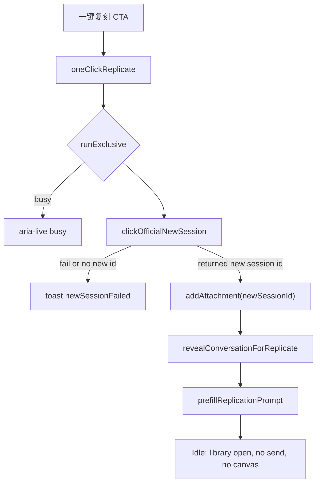
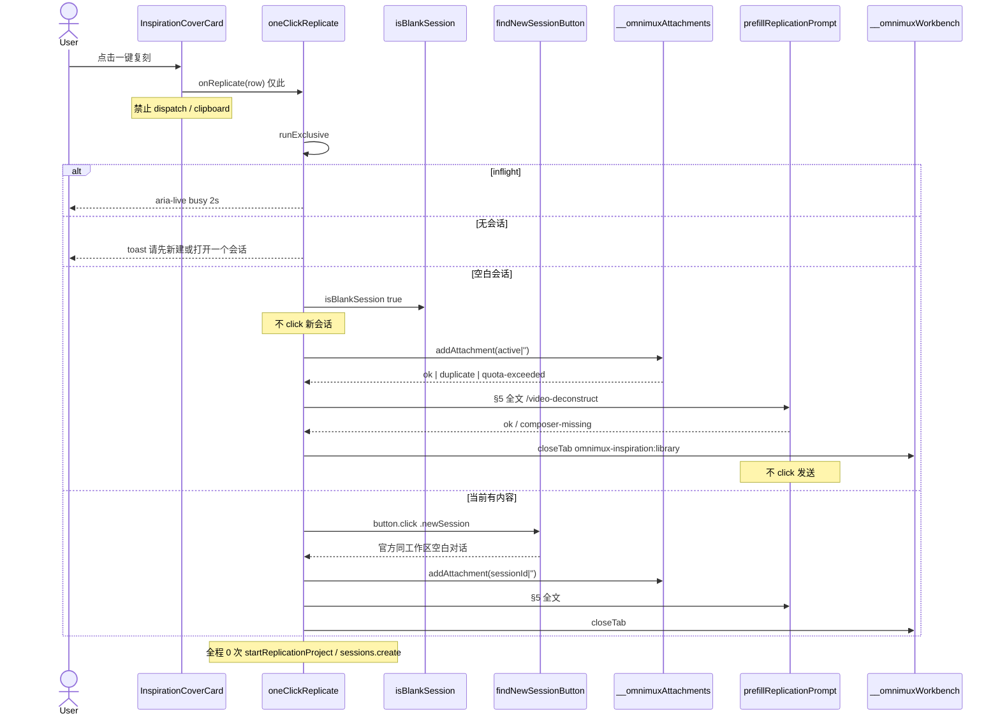

# 灵感库「一键复刻」：官方新会话语义增量系统设计

> **历史稿，全文已被替代。** 当前实现及验收以 [#552 当前设计](2026-09-05-inspiration-replicate-dismiss-reversal-design.md) 为准。下文的 DOM 空白判定、全局编辑器写入、关闭库页与附件先写规则不再生效。

> **需求更正（#552，已批准）**：本稿中所有「空白会话复用」「仅非空会话点击新会话」「无会话直接报 noSession」「附件回退到 `default`」及「成功后关闭灵感库」的表述均已失效。CTA 无论当前会话状态都必须走一次官方新会话动作，且只在返回的新 session id 上挂附件并预填；动作失败或未返回新 id 时不得向旧会话或 `default` 添加附件。灵感库 Tab 保留，链路只 reveal 中间会话栏，不触碰画布。

> 作者：高见远（架构）  
> 输入：冻结 PRD `prd-inspiration-one-click-replicate`（2026-09-04 新会话语义）+ 现网 Inspect  
> 给：工程师  
> 范围：只改 `omnimux-inspiration` client 编排 / 文案 / CTA。不写业务实现代码于本文件。不改 `plugins/omnimux*` 功能代码（本轮只出规格）。不新建 skill 包。零新 npm。

**一句话方案：** 把卡片/预览/详情的唯一 orchestrator 从 `replicateInspirationToChat → startReplicationProject` 换成 `oneClickReplicate`：不论当前会话状态均 DOM click 官方 `.newSession`，只在返回的新 session id 上调用 `__omnimuxAttachments.addAttachment`，再 reveal 中间会话栏并预填 §5 `/video-deconstruct`；灵感库 Tab 保留；0 次建项目、0 次发送。

---

## 1. 选型与定界（一句话 + 否决表）

一句话：在现有 `omnimux-inspiration` 客户端内，用**程序化 click** 官方侧栏「新会话」按钮（与 `conversation-box.js` `shellNewSessionControl` 同构）完成会话落点；只接受该动作返回的新 session id，附件走已存在的 `window.__omnimuxAttachments.addAttachment`，预填前 reveal 中间会话栏，灵感库 Tab 保留。不新 Slot、不新 Host 路由、不跨包 import、不 inject `sessions` 来开会话。

| 候选 | 结论 | 理由 |
|---|---|---|
| **DOM click 官方 `.newSession` / aria「新会话」** | **本 CTA 任意当前会话状态下唯一开会话手段** | 与用户手势同构；必须得到新的 session id 后才挂附件。灵感库禁止 `sessions.create` / `sessions.create({})`。 |
| **复制市场 `isBlankSession` 到本包** | **P0 必做** | 禁止 `import` 市场包。算法：标题 `新会话\|New session\|Untitled` 或 `[data-conversation-scroll]` trim 长度 &lt; 40。 |
| **`window.__omnimuxAttachments.addAttachment`** | **读挂附件结果的首选** | CustomEvent 是单向广播，拿不到 `quota-exceeded` / `duplicate`。全局已存在、与 workflow 全局同构。无 sessionId 时 store 走 active / `default`。 |
| `CustomEvent('omnimux:add-to-conversation')` | **本 CTA 不再从 JSX 派发** | 若与 `addAttachment` 同时发会双挂。其它插件仍可广播；本 CTA 直接调 store。全局缺失时才 fallback dispatch（无法读 reason，当 ok）。 |
| `startReplicationProject` / `runNewProject` / `POST /api/projects` / `workspaces.create` 新 path | **本 CTA 严禁** | 用户否决「每条灵感一个工作区」。缝留给侧栏「新建项目」。`workflow-global.js` 可留文件，编排不再 import。 |
| `runResetSession` / `activateProjectCanvas` | **严禁** | 仍开会话+15:85 画布，不是官方新会话。 |
| 灵感库 `inject sessions` + `sessions.create({})` | **严禁** | workbench 硬约束；无会话只 toast。现网 `index.js` 已把 sessions bind 给 workbench，本 CTA **不得**调用。 |
| 跨包 `import` 市场 / workflow / hub | **严禁** | 客户端加载顺序不保证。 |
| 新 Slot / 新 Host 路由 / Package RPC | **否决** | 两端同渲染进程；附件与 composer 缝已够。 |
| 剪贴板 / 自动发送 / 双按钮 | **严禁** | PRD 冻结。 |
| P0 `ensureInstall` / `skillhub_install` / 搜「爆款」 | **严禁** | Skill 钉死 `sk-omx-video-deconstruct` / `video-deconstruct`；只预填手势，发送 JIT。 |
| `claimProductStage` | **严禁** | 关库走 workbench `closeTab` / sidebar `stageStore.close`。 |

---

## 2. 拓扑

```
 inspir. CoverCard / PreviewModal / DetailModal
              │  onReplicate(row) only
              ▼
     oneClickReplicate(row)          ← plugins/omnimux-inspiration only
              │
              ├─ busy? ────────────────────────── toast card.cta.busy
              └─ click official .newSession once
                     │ fail / no new id
                     └ toast newSessionFailed
                                            ▼
                    addAttachment(returnedNewSessionId, payload)
                       │ quota-exceeded → toast attachFull（仍尝试预填）
                       │ duplicate → 视为已挂，继续
                       │ invalid → toast attachFailed
                                            ▼
                    revealConversationForReplicate()
                    buildReplicationPrompt(row)  // PRD §5 原文
                    prefillReplicationPrompt(text)  // 不 click 发送
                    keep inspiration library Tab open

 禁止箭头：
   inspiration ──x── __omnimuxWorkflow.startReplicationProject
   inspiration ──x── runNewProject / runResetSession / activateProjectCanvas
   inspiration ──x── sessions.create / sessions.create({})
   inspiration ──x── import omnimux-market | omnimux-workflow
   CoverCard   ──x── dispatch + clipboard
```



---

## 3. 模块与文件列表（相对路径，标新建/改/不改）

工作目录：worktree `/Users/x/Desktop/Project/dsh-plugin/product/omnimux-dsh-wt-one-click-replicate`  
相对仓库根。源文件控制 ≤12（测试夹具另计）。**禁止改** `plugins/omnimux/`、`plugins/omnimux-workflow/`、`plugins/omnimux-market/` 功能代码。

| 路径 | 动作 | 职责 |
|---|---|---|
| `plugins/omnimux-inspiration/src/client/is-blank-session.js` | **新建** | 复制市场算法：`isBlankSession` + `hasAnySession`。零跨包 import。 |
| `plugins/omnimux-inspiration/src/client/is-blank-session.test.js` | **新建** | 标题 / 滚动区 / 无会话启发式单测。 |
| `plugins/omnimux-inspiration/src/client/new-session-click.js` | **新建** | `findNewSessionButton` / `clickOfficialNewSession`（只 DOM click）。 |
| `plugins/omnimux-inspiration/src/client/new-session-click.test.js` | **新建** | 选择器、0 次 `sessions.create`。 |
| `plugins/omnimux-inspiration/src/client/replicate-to-chat.js` | **改** | 导出 `oneClickReplicate`；去掉 `waitForWorkflowGlobal`；挂附件 + 预填 + `dismissInspirationLibrary`。可保留 `runExclusive` / `isReplicateBusy` / `resetReplicateLock`。 |
| `plugins/omnimux-inspiration/src/client/replicate-to-chat.test.js` | **改** | 断言 **0** 次 `startReplicationProject`；覆盖三态会话 / busy / 附件满 / 无会话。 |
| `plugins/omnimux-inspiration/src/client/replication.js` | **改** | `REPLICATION_SKILL='video-deconstruct'`；`buildReplicationPrompt(row, opts)` 输出 PRD §5 全文；时长瀑布。`deriveProjectTitle` 可留纯函数，本 CTA 不调用。 |
| `plugins/omnimux-inspiration/src/client/replication.test.js` | **改** | 手势、id、时长、商品降级、口播/字幕/出镜、image/link 降级段；禁止 `video-replication`。 |
| `plugins/omnimux-inspiration/src/client/locales.js` | **改** | 按 PRD §7 换文案；新增 `tryFull` / `attachFull` / `attachFailed` / `noSession` / `newSessionFailed`。 |
| `plugins/omnimux-inspiration/src/client/InspirationCoverCard.jsx` | **改** | 只 `onReplicate`；删 dispatch+clipboard；复刻 SVG；`aria-label` 用 `tryFull`。 |
| `plugins/omnimux-inspiration/src/client/InspirationPreviewModal.jsx` | **改** | 底栏主 CTA「一键复刻」→ 同一 `onReplicate`。 |
| `plugins/omnimux-inspiration/src/client/InspirationDetailModal.jsx` | **改** | 废止独立「添加到会话」；改同一 orchestrator。 |
| `plugins/omnimux-inspiration/src/client/InspirationSection.jsx` | **改** | 预览传入 `onReplicate`；成功关库由编排完成，Modal 随 Tab 卸载。 |
| `plugins/omnimux-inspiration/src/client/use-inspiration-feed.js` | **改** | `handleReplicate` 调 `oneClickReplicate`。 |
| `plugins/omnimux-inspiration/src/client/styles.test.js` | **改** | locale 断言「一键复刻」/「Replicate」；禁止「加会话」；28px 胶囊仍锁。 |
| `plugins/omnimux-inspiration/src/client/composer-inject.js` | **不改** | 只预填不发送，契约已落地。 |
| `plugins/omnimux-inspiration/src/client/composer-inject.test.js` | **不改** | 可选把样例手势换成 `/video-deconstruct`，非 P0 阻断。 |
| `plugins/omnimux-inspiration/src/client/workflow-global.js` | **不改、不删** | 本 CTA 不再 import。 |
| `plugins/omnimux-inspiration/src/client/sidebar-entry.js` | **不改** | `INSPIRATION_TAB_ID` 已是 `omnimux-inspiration:library`；close 已走 workbench store。编排读该常量（可从本文件 re-export 或在 dismiss 内字面量，禁止再发明 id）。 |
| `plugins/omnimux-inspiration/src/client/index.js` | **不改** | 现有 `inject(['layout','sessions'])` 只 bind workbench，本 CTA 不得调用 `sessions.create`。 |
| `plugins/omnimux-inspiration/src/client/styles.js` | **不改**（默认） | overlay 已 28px / `gap:6px` / `border-radius:9999px`。溢出则可见文本改「复刻」，不改高度。 |
| `plugins/omnimux-workflow/src/client/projects/newProject.js` | **不改** | 对照禁止调用。`startReplicationProject` 保留给「新建项目」。 |
| `plugins/omnimux/src/client/attachments/store.ts` | **不改** | 只消费。 |
| `plugins/omnimux/src/client/conversation-box.js` | **不改** | 只对齐选择器。 |
| `plugins/omnimux-market/src/client/composer.js` | **不改** | 只复制 `isBlankSession` 算法。 |

P0 源文件上限核对：新建 2（`is-blank-session.js`、`new-session-click.js`）+ 改 8（replicate-to-chat / replication / locales / CoverCard / Preview / Detail / Section / feed）= **10**。`styles.test.js` 为测试。未超 12。

---

## 4. 接口

全部在 `omnimux-inspiration` 包内。`document` / `window` 可注入，便于 node:test。

### 4.1 `oneClickReplicate`

```js
/**
 * @param {{ id?: unknown, title?: unknown, source_url?: unknown, source_platform?: unknown, type?: unknown, local_paths?: object, stats?: object, deconstruction?: object, duration?: unknown }} row
 * @param {{
 *   document?: Document,
 *   window?: Window,
 *   clickNewSession?: (opts?: object) => Promise<{ ok: boolean, sessionId?: string, error?: string }>,
 *   addAttachment?: (sessionId: string, payload: object) => { ok: boolean, reason?: string, attachment?: object },
 *   prefillPrompt?: (text: string, opts?: object) => Promise<{ ok: boolean, error?: string, via?: string }>,
 *   revealConversation?: () => void,
 *   now?: () => number,
 *   onStatus?: (key: string | null, detail?: string) => void,
 *   onDismissModal?: () => void,
 * }} [io]
 * @returns {Promise<
 *   | { ok: true, clickedNewSession: true, attached: boolean, duplicate?: boolean }
 *   | { ok: false, error: 'busy' | 'newSessionFailed' | 'attachFull' | 'attachFailed' | 'sendManual' }
 * >}
 */
export async function oneClickReplicate(row, io = {})
```

行为顺序（硬约束）：

1. 已 inflight → `{ error:'busy' }`，`onStatus('card.cta.busy')`，不排队。
2. `!hasAnySession` → `{ error:'noSession' }`，`onStatus('card.cta.noSession')`。**禁止**把附件丢进 `default` 当成功。
3. `isBlankSession` → 不 click、不建会话（`reused: true`）。
4. 否则 `clickOfficialNewSession`；失败 → `{ error:'newSessionFailed' }`。
5. 解析 `sessionId`：优先 `io.sessionId` / click 返回 / `__omnimuxAttachments.getActiveSessionId()`；若仍是 `'default'` 或空，传 `''` 让 store 走 active（open 后 `claimPendingAttachments`）。
6. `addAttachment(sessionId, buildInspirationPayload(row))`。  
   - `duplicate`：视为已挂，继续预填。  
   - `quota-exceeded`：`onStatus('card.cta.attachFull')`，**仍尝试预填**，最终 `{ error:'attachFull' }`（预填成败另计，status 以满额为准）。  
   - `invalid-payload` / 无全局且 fallback 也失败：`{ error:'attachFailed' }`。
7. `prefillReplicationPrompt(buildReplicationPrompt(row))`。失败且附件已挂 → `{ error:'sendManual' }`。
8. 成功：`onStatus(null)`；`dismissInspirationLibrary`；**不** toast、**不** clipboard、**不** click 发送、**不** 开画布。

删除 / 不再导出本 CTA 路径上的：`waitForWorkflow`、`startReplication`、`waitForWorkflowGlobal`。  
`replicateInspirationToChat` **不要**留别名（避免旧测试继续 mock `startReplicationProject`）。`use-inspiration-feed` 改 import。

### 4.2 `isBlankSession` / `hasAnySession`

```js
/** 对齐市场 composer.js，禁止 import 市场包。无 document 时视为空白（与市场 `typeof document==='undefined' return true` 一致）——但 hasAnySession 必须先判。 */
export function isBlankSession(doc) // doc 默认 document
export function hasAnySession(doc)
```

`isBlankSession(doc)`（复制，不得改语义）：

1. 无 `doc` → `true`（仅单测/SSR；生产路径被 `hasAnySession` 挡住）。
2. `[data-slot="conversation.session.header"]` 的 `textContent` 匹配 `/新会话|New session|Untitled/i` → `true`。
3. 无 `[data-conversation-scroll]` → `true`。
4. 滚动区 `textContent.trim().length < 40` → `true`，否则 `false`。

`hasAnySession(doc)`（本包新增，市场没有对应函数）：

返回 `true` 当且仅当以下任一成立：

- 存在 `[data-slot="conversation.session.header"]`；或
- 侧栏存在会话行：`[role="treeitem"]` 且其文本/aria 不像「工作区」空壳（实现：至少 1 个 `treeitem`，**或** header 已存在）；或
- `__omnimuxAttachments.getActiveSessionId()` 为非空且不等于 `'default'`。

全无 → `false` → 走 `noSession`。不要用「无 header ⇒ 空白可复用」——那是市场 summon 的宽松默认，本 CTA 会把无会话误判成功。

### 4.3 `findNewSessionButton` / `clickOfficialNewSession`

```js
/** @returns {HTMLElement | null} */
export function findNewSessionButton(doc)

/**
 * 只 button.click()。禁止 sessions.create。
 * @returns {Promise<{ ok: true, sessionId?: string } | { ok: false, error: 'newSessionFailed' }>}
 */
export async function clickOfficialNewSession(opts = {})
```

`findNewSessionButton` 对齐 `conversation-box.js` `shellNewSessionControl`：

- `button.closest('#omnimux-sidebar-new-menu')` → 跳过（那是收起轨菜单，未展开时点它不是用户「新会话」手势）。
- `button.closest('[role="treeitem"]')` → 跳过（工作区行内「在 x 中新建会话」，可能绑 workspaceId）。
- `String(button.className).includes('newSession')` → 命中。
- `aria-label` 匹配 `/^(新建会话|新会话|New session)$/i` → 命中。
- 多个命中时取第一个可见（`getClientRects?.().length > 0` 或无几何信息时第一个）。

`clickOfficialNewSession`：

1. 找不到按钮 → fail。
2. `button.click()`（真实 DOM click，让官方与 `conversation-box` 捕获器跑完）。
3. 轮询至多 **1500ms** / 50ms：`isBlankSession` 为 true **或** `getActiveSessionId()` 变化。官方复用空白时「看起来像没点」，只要 click 前已判定非 blank、click 后变为 blank（或 id 变了）即 ok。
4. 超时仍非 blank 且 id 未变 → `newSessionFailed`。
5. **0 次** `sessions.create`。

### 4.4 `dismissInspirationLibrary`

```js
/** @param {{ window?: Window, tabId?: string, onDismissModal?: () => void }} [io] */
export function dismissInspirationLibrary(io = {})
```

1. `io.onDismissModal?.()`（关预览/详情，避免幽灵 Modal）。
2. `win.__omnimuxWorkbench.closeTab(tabId)`，`tabId` 默认 `'omnimux-inspiration:library'`（与 `sidebar-entry.js` / `InspirationStage.jsx` 同一字面量）。
3. 若无 `closeTab`：`__omnimuxWorkbench.createSidebarStore({ tabId }).close()`。
4. 禁止 `claimProductStage`、禁止 `dismissProductStage`、禁止写 `html.dataset.dshProductStage`（那是 workflow 一级 overlay 路径；灵感库已是 workbench Tab）。

建议放在 `replicate-to-chat.js` 并导出，避免再新建第 3 个模块。

### 4.5 `buildReplicationPrompt`

```js
export const REPLICATION_SKILL = 'video-deconstruct' // 禁止 video-replication

/**
 * 输出 PRD §5 模板原文。花括号仅运行时替换。不得改约束语义。
 * P0 `opts.product` 恒空，不追加 P1 商品段。
 * @param {object | null | undefined} row
 * @param {{ product?: unknown }} [opts]
 * @returns {string}
 */
export function buildReplicationPrompt(row, opts = {})
```

时长瀑布（写入 `duration_budget_seconds` 与 `duration_source`）：

1. `row.duration` 或 `row.stats.duration` 或 `row.stats.video_duration`（有限数字，秒）→ source `stats`
2. `row.deconstruction.duration` / `.video_duration` / `.length_seconds` → source `deconstruction`
3. 都无 → **15**，`duration_source=default_15s`

替换：`{id}=String(row.id||'')`（空 id 仍输出该行）；`{title}`/`{url}` 允许 `''`；`{video|image|link}` 来自现有 `resolveMediaType`。第一行必须是 `/video-deconstruct`（无多余空格）。全文见 PRD §5，工程师**原样**写入 `replication.js`（本规格不重复粘贴以免漂移；PRD 为文案真源）。

### 4.6 附件 payload（本 CTA 唯一形状）

```js
{
  sourcePlugin: 'omnimux-inspiration',
  kind: 'inspiration',
  entityId: row.id,
  title: row.title || row.source_url || '灵感素材',
  extension: 'INSPIRATION',
  relativePath: row.local_paths?.video || row.local_paths?.cover || `inspiration/${row.id}`,
  previewUrl: pickCoverSrc(row), // CoverCard 现用；纯函数路径可内联相同回退，避免 orchestrator import api.js 若引起循环则把 pick 逻辑复制一行
  metadata: {
    inspiration_id: row.id,
    source_url: row.source_url,
    source_platform: row.source_platform,
  },
}
```

指纹保持 `omnimux-inspiration::inspiration::{id}::…`（store `generateFingerprint`）。不要挂 `kind=product`。

`addAttachment` 调用：

```js
const store = win.__omnimuxAttachments
if (store && typeof store.addAttachment === 'function') {
  return store.addAttachment(sessionId || '', payload)
}
// fallback only: dispatch CustomEvent，读不到 reason，当作 { ok: true }
```

---

## 5. 时序图



成功路径（有内容）逐步：

1. UI → `oneClickReplicate(row)`
2. `hasAnySession` true，`isBlankSession` false
3. `findNewSessionButton(doc).click()`
4. 短轮询 blank 或 activeSessionId
5. `addAttachment`
6. `buildReplicationPrompt` → `prefillReplicationPrompt`
7. `dismissInspirationLibrary`
8. Idle

---

## 6. 任务列表（P0 only，按实现顺序）

本轮 **不含 P1/P2**（市场 `ensureInstalled`、商品附件段、时长解析进附件字段、预装 skill 均不做）。

每个任务一个工程师 turn 可写完；任务之间尽量只依赖 T01。

### T01 文案 + 纯函数（prompt / 空白判定）

- **源文件：** `locales.js`，`replication.js`，`replication.test.js`，`is-blank-session.js`，`is-blank-session.test.js`，`styles.test.js`（locale 段）
- **依赖：** 无
- **优先级：** P0
- **步骤：**
  1. locales 按 PRD §7 更新 zh/en；`card.cta.try` = 一键复刻 / Replicate；`tryFull` = 一键复刻 / One-click replicate；`addToConversation` 改为与 `try` 同值（不得再显示「添加到会话」）；新增 `attachFull` / `attachFailed` / `noSession` / `newSessionFailed`；`busy` / `replicating` / `sendManual` 换新文案；`workflowMissing` / `createFailed` 可留 key 但本 CTA 不再引用。
  2. `REPLICATION_SKILL = 'video-deconstruct'`；`buildReplicationPrompt` 原样落地 PRD §5；时长瀑布；`opts.product` P0 忽略。
  3. 复制市场 `isBlankSession`；实现 `hasAnySession`。
- **验收断言：**
  - `zh['card.cta.try']==='一键复刻'`，`en['card.cta.try']==='Replicate'`；zh/en key 集合相等。
  - `styles.test.js` 不再断言「加会话」/「Add to chat」。
  - prompt 以 `/video-deconstruct\n` 开头，含 `inspiration_id`、口播/字幕/出镜/商品缺失/时长；image/link 含降级段。
  - `replication.js` 源码不含 `video-replication`。
  - 空 id 仍输出 `inspiration_id:` 行。
  - `isBlankSession`：标题「新会话」true；滚动区 40+ 字且标题非空白模式 false。
  - `hasAnySession`：无 header、无 treeitem、activeId default → false。

### T02 官方新会话手势 + 编排 `oneClickReplicate`

- **源文件：** `new-session-click.js`，`new-session-click.test.js`，`replicate-to-chat.js`，`replicate-to-chat.test.js`，`use-inspiration-feed.js`
- **依赖：** T01
- **优先级：** P0
- **步骤：**
  1. `findNewSessionButton` / `clickOfficialNewSession`：只 DOM click；选择器对齐 `shellNewSessionControl`。
  2. 重写 `replicate-to-chat.js`：导出 `oneClickReplicate` + `dismissInspirationLibrary` + 保留锁；删除对 `workflow-global.js` 的 import。
  3. 挂附件优先 `addAttachment`；payload 见 §4.6。
  4. `use-inspiration-feed.js` 的 `handleReplicate` 改调 `oneClickReplicate`。
- **验收断言：**
  - `replicate-to-chat.js` 源码 **不匹配** `startReplicationProject` / `waitForWorkflowGlobal` / `runNewProject` / `activateProjectCanvas` / `sessions.create` / `clipboard`。
  - mock `startReplicationProject` 调用次数 **恒为 0**（即使 io 传入该函数也不该被编排调用——不要再接受 `io.startReplication`）。
  - 无会话：`addAttachment` 0 次，status `card.cta.noSession`。
  - blank：`click` 0 次，`addAttachment` 1 次，prefill 1 次，`closeTab` 1 次。
  - 有内容：`button.click` 1 次，随后 attach+prefill+closeTab。
  - 找不到新会话按钮：`newSessionFailed`，不 attach。
  - 连点第二下 `{ error:'busy' }`。
  - `duplicate` 继续预填；`quota-exceeded` status `attachFull`。
  - prefill 失败 → `sendManual`；`findSendButton().click` 计数 0。
  - `new-session-click.js` 不含 `sessions.create`。

### T03 UI 三入口同一 orchestrator

- **源文件：** `InspirationCoverCard.jsx`，`InspirationPreviewModal.jsx`，`InspirationDetailModal.jsx`，`InspirationSection.jsx`
- **依赖：** T02（需要 `onReplicate` 已接 `oneClickReplicate`）
- **优先级：** P0
- **步骤：**
  1. CoverCard：`handleReplicate` 只 `stop` + `onReplicate(row)`；删 CustomEvent 与 `clipboard`；图标改为拷贝/层叠 SVG（禁止 emoji、禁止气泡+号旧图标）；`aria-label={t('card.cta.tryFull')}`，可见文本 `t('card.cta.try')`。28px 胶囊放不下「一键复刻」时可见改「复刻」（locale `try` 缩短，`tryFull` 保持完整）——量过再改，默认先四字。
  2. PreviewModal：新增 props `onReplicate` / `replicateBusy`；右栏或底栏 **主按钮**「一键复刻」；「查看」路径不出现在此（查看仍是卡片次按钮，只 `onSelect`）。成功后不必自己关一级页（编排 dismiss）；点复刻后可 `onClose` 以免遮罩挡 composer。
  3. DetailModal：footer 主按钮改 `onReplicate` + 文案 `card.cta.try`；删除 `handleAddToConversation` 的 dispatch/clipboard。
  4. Section：`<InspirationPreviewModal … onReplicate={handleReplicate} replicateBusy={replicateBusy} />`。
- **验收断言：**
  - `InspirationCoverCard.jsx` 不含 `omnimux:add-to-conversation`、不含 `clipboard`。
  - 三文件主 CTA 文案 key 均为 `card.cta.try`，不含「添加到会话」可见字符串（Detail 不得 fallback `'添加到会话'`）。
  - Preview 有 `onReplicate`；卡片「查看」仍只 `onSelect`。
  - 图标为 SVG `stroke`/`path`，无 emoji。
  - overlay CSS 仍 28px / `gap:6px` / `border-radius:9999px`（`styles.test.js` 现有用例保持）。

### T04 源码隔离与回归锁（同一 turn 可与 T03 后半并行）

- **源文件：** `replicate-to-chat.test.js`（补隔离），`replication.test.js`（补隔离），`styles.test.js`，`new-session-click.test.js`（补 0 create）
- **依赖：** T01、T02、T03
- **优先级：** P0
- **步骤：**
  1. 读源断言：`replicate-to-chat.js` / `InspirationCoverCard.jsx` / `InspirationPreviewModal.jsx` / `InspirationDetailModal.jsx` / `use-inspiration-feed.js` 均不出现 `startReplicationProject`、`waitForWorkflowGlobal`、`omnimux-workflow`、`runNewProject`、`clipboard.writeText`（Detail 的 markdown **复制拆解**按钮可保留，那不是本 CTA）。
  2. CoverCard CTA 单测若无独立文件，用 `styles.test.js` 读 CoverCard 源：无「加会话」、有复刻 SVG、无 `clipboard`。
  3. 不改 workflow 包；不删 `workflow-global.js`。
- **验收断言：**
  - `pnpm --filter omnimux-inspiration test` 全绿。
  - 上述源码隔离 `doesNotMatch` 全过。
  - **单测绿不够交付**（AGENTS.md）：工程师编码后由 QA/工程师跑 `pnpm verify:live omnimux-inspiration` + ego-browser。本架构任务不跑真机。

---

## 7. 依赖包

**零新 npm。** 不新增 React / MUI / Vite 壳。不引入 lucide 新图标到 CoverCard（Preview 已有 lucide 的 Detail 路径可继续用 SVG 内联替换 MessageSquarePlus，避免「添加到会话」语义图标）。

现有：`dsh-ui-kit`（Button / IconButton / ModalDialog）、React、node:test。本轮只消费。

---

## 8. 共享知识（跨文件约定）

- **事件：** 本 CTA **不**派发 `omnimux:add-to-conversation`。其它插件仍可派发。读结果只认 `window.__omnimuxAttachments.addAttachment(sessionId, payload)` → `{ ok, reason?: 'duplicate'|'quota-exceeded'|'invalid-payload', attachment? }`。无 sessionId 传 `''`。
- **Tab id：** `'omnimux-inspiration:library'`。关库 `closeTab` / `createSidebarStore({ tabId }).close()`。禁止 `claimProductStage`。
- **Locale keys（P0 必用）：** `card.cta.try` / `tryFull` / `detail` / `replicating` / `busy` / `sendManual` / `attachFull` / `attachFailed` / `noSession` / `newSessionFailed`。本 CTA 禁用 `workflowMissing` / `createFailed`。
- **Skill：** catalog `sk-omx-video-deconstruct`，slug `video-deconstruct`，手势 `/video-deconstruct`。P0 不 `ensureInstall`。
- **禁止 import：** `omnimux-market`、`omnimux-workflow`、`omnimux` 客户端模块。禁止 `from '.../workflow-global.js'`（本 CTA）。
- **禁止 API：** `startReplicationProject`、`runNewProject`、`runResetSession`、`createProject`、`createProjectSession`、`POST /omnimux-workflow/api/projects`、`workspaces.create` 新 path、`activateProjectCanvas`、`sessions.create`、`sessions.create({})`、`navigator.clipboard.writeText`（本 CTA）、发送按钮 `click`。
- **锁：** 模块级 `runExclusive`；第二击 `{ error:'busy' }` 不排队；全卡片 `disabled={replicateBusy}`。
- **成功反馈：** 无 toast、无剪贴板、关库；失败 2s `aria-live`（现网 `#omnimux-inspiration-cta-status`）。
- **预填真源：** PRD §5，不是旧 `replication.js` 四行步骤。
- **几何：** overlay CTA 28px、圆角 9999px、`gap: 6px`、`--dsw-*`、禁止 emoji。design.md Chip 22–24px 是状态 Chip；本 CTA 沿用 2026-08-28 悬停胶囊 28px，不要改成 22px。
- **Git：** 编码前应有 Issue（见 §9）。规格已进本 worktree。风险倾向 **R1**（一级库页 × 官方新会话手势），合入走老板人工，不 `auto:run`。

---

## 9. 待明确事项（只列实现级；产品已拍板的不要再问）

1. **`hasAnySession` DOM 启发式是否过严/过松。** 推荐默认：header **或** 任意 `[role="treeitem"]` **或** `getActiveSessionId() !== 'default'`。若真机「有会话但 header 未挂 data-slot」漏判，把选择器补进 `is-blank-session.js`，不要为此 `sessions.create`。主理人若有官方 session list 稳定 selector，开工前丢一句即可。
2. **点 `.newSession` 后等待预算。** 推荐默认 1500ms/50ms。过短会 `newSessionFailed` 误伤；过长会拖死「一键」。真机再调常数，不改状态机。
3. **胶囊可见「一键复刻」vs「复刻」。** 默认四字；28px + `padding:0 6px` + 图标 14px 可能挤。工程师量过溢出则只改 `zh['card.cta.try']='复刻'`，`tryFull` 仍「一键复刻」。不必回产品。
4. **GitHub Issue（主理人建，架构不 `gh issue create`）。**  
   - 推荐标题：`灵感库一键复刻改为官方新会话语义（不再每条灵感一个工作区）`  
   - 正文要点：Closes 本增量；PRD `docs/specs/2026-09-03-inspiration-one-click-replicate-prd.md`；规格 `docs/specs/2026-09-04-inspiration-one-click-replicate-design.md`；DoD = 0 次 `startReplicationProject` / 0 新工作区 path / 不自动发送 / 关 `omnimux-inspiration:library`；风险 R1；worktree 分支 `agent/inspiration-one-click-replicate`；验收 `pnpm --filter omnimux-inspiration test` + `pnpm verify:live omnimux-inspiration` + ego-browser。
5. **`pickCoverSrc` 循环依赖。** orchestrator 不要 import `api.js` 若已形成环；`previewUrl` 允许省略或复制 CoverCard 的 cover 回退一行。缺 preview 不阻断挂附件。

**产品已闭合、禁止再问：** 新会话 vs 新建项目 vs 挂当前会话；双按钮；自动发送；P0 安装 skill；强制选商品；成功 toast/剪贴板；图片改 `/image-remix`。

---

## 工程师可否立即开工

**规格可编码；Git 合同「No Issue, No Code」。** 主理人建好 Issue 并把 issue-id 绑到现有 worktree 后，林深从 T01 起即可开工。不要改主仓 `main`，不要改 plugins 里非本列表文件，不要删 `workflow-global.js`，不要动 `startReplicationProject` 安装缝。
