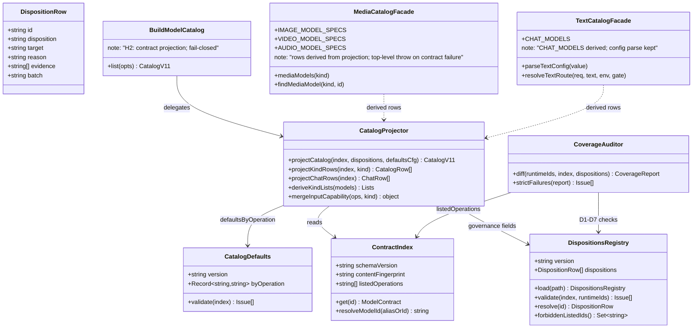
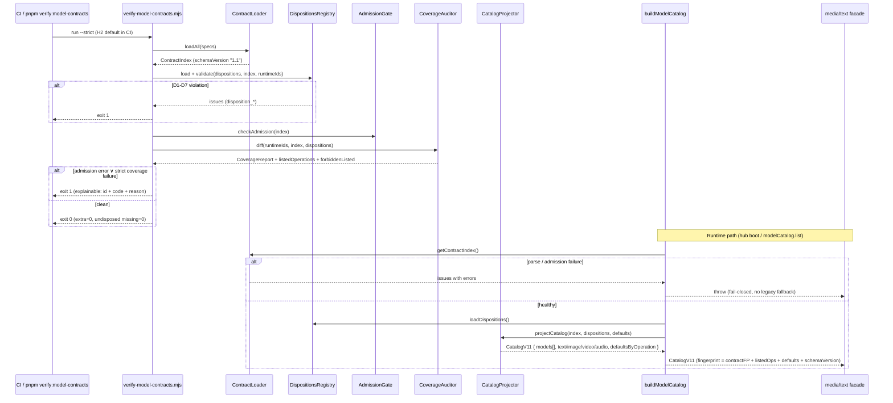
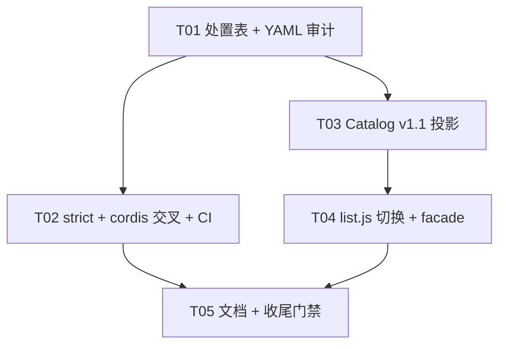

# 增量系统设计：H2 审计 43 模型并切换 Catalog v1.1 契约投影

> **2026-09-05 当前方法**：[模型合同文档优先方法修订](2026-09-05-model-contract-docs-first.md) 与 [模型 API 权威](../contracts/model-api-authority.md) 取代本文关于存在性、最小生成、边界探测、样本上限、真实执行和按执行翻转 `listed` 的可执行指令。本文保留原模型范围、历史快照与已发生执行；它们不得被当作当前输入合同。具体 EvoLink/APIMart 模型 API 文档未说明的字段、角色、数量、格式、时长和模式均为未知，不得猜测、试探或跨渠道借用。

> **文档地位**：L2 增量设计（Epic #463 / Issue #465）。**只描述相对 H1（#464 / PR #485 @ `b5652a1`）的增量**；契约 schema、op 级状态机、admission、fingerprint、CLI fail-closed 等以 H1 正式设计为准，本文不推倒。
> **作者**：高见远（架构师） · 2026-09-04
> **工作树**：`omnimux-dsh-wt-model-contract-catalog-465` / 分支 `agent/omnimux-model-contract-catalog-issue-465`
> **术语**：`omnimux` 一律称**执行中枢**；禁止称「网关」。
> **阶段边界**：H2 的 43 ID 处置、Catalog 投影、facade 与 coverage 是历史实现范围。逐 op 真实补证与“取更严”限制计划已替代；输入合同现按渠道官方 API 文档确定，文档缺项标未知。
> **当前解释**：现有 `listed` 与 `execution.live` 检查是实现事实，不能作为渠道合同或发起真实请求的理由。H2 的处置、alias、fingerprint 与 coverage 历史事实仍保留；渠道字段和模式按当前 L1 合同重新核对。

---

# Part A：系统设计

## 1. 实现方案（Implementation Approach）

### 1.1 核心技术挑战与对策

| # | 难点 | H2 设计对策 |
|---|---|---|
| H2-C1 | **43 个 runtime ID 全处置不可无声遗漏** | 新增机器真源 **`dispositions.json`**：每个 runtime ID 一行处置（canonical / alias / draft / unavailable / deprecated / quarantine）+ reason + evidenceRef。coverage auditor 由「diff YAML」升级为「**处置表驱动**」：runtime ID 无处置行 = error；处置与 YAML 状态不一致 = error。H2 起 `--strict` 因此可对 coverage 失败 |
| H2-C2 | **YAML 已声明 ≠ verified+live** | listed 的五元判定是当前实现事实。它不决定渠道字段或模式，也不授权真实请求；文档支持、离线实现验证和历史执行须分列。任何未来状态变更另行审查，本次不改 YAML 或 `listed` |
| H2-C3 | **Catalog 权威切换且旧消费方不断裂** | 新增 **投影模块 `project.js`**：`ContractIndex → Catalog v1.1 DTO`。权威 = 扁平 `models[]`（透传 operations/inputs/output/research/execution/aliases/parameters/schemaVersion + disposition 治理字段）；兼容四列表 `text/image/video/audio` **仅**按可见 operation 的 `output.type` 派生。`buildModelCatalog()` 改调投影；导出行形状与 defaults 解析对外保持兼容 |
| H2-C4 | **旧 JS 能力表绞杀且解析失败不得回退** | `media/catalog.js` / `text/catalog.js` 中硬编码 SPECS/CHAT_MODELS 行数据 **删除**，改为 facade：模块加载时调用投影派生同名导出。**契约加载/解析/admission 失败 → 顶层 throw（fail-closed）**，hub 启动失败可定位；**不存在**「catch 后回退旧表」代码路径——旧表已物理删除，无表可回退 |
| H2-C5 | **冲突限制取更严** | YAML 与 runtime JS 行为不一致处（Grok video 参考图 max、Seedance multi-ref），在验证完成前 YAML 写**更严**值（Grok video `max: 1`；Seedance multi-ref 单图/首帧），`limitSource.kind` 标 `policy_conservative` 并 notes 注明「runtime 对账取更严，待 dated 复测放宽」。**禁止**捏造 official 上限 |
| H2-C6 | **nanobanana 双列 / extra 幽灵** | canonical = underscore ID；hyphen ID 走 `model.aliases`（H1 已定 wire 归一机制）+ dispositions 标 `alias`。投影层 `resolveModelId` 归一，四列表按 canonical 去重，**双列 = 测试失败**。extra 三 ID：查 runtime 引用后**删除或 alias**，一律不 listed |
| H2-C7 | **H1 CI 是 audit 宽松态，H2 必须可红** | `--strict` 语义升级：coverage 失败条件从「missingInYaml 非空」升级为「**runtime ID 无处置 ∨ 处置-YAML 不一致 ∨ extra 未清理 ∨ 禁上架 ID 出现 listed op**」。CI quality-gate 由 `--audit` 切 `--strict`；根 `verify:model-contracts` 默认同步切 strict |
| H2-C8 | **fingerprint 必须对上架/限制变化敏感** | `buildModelCatalog` 的 `fingerprintOf` 输入从「四列表 id + defaults」升级为「**contract contentFingerprint + listedOperations + defaults + schemaVersion**」。改任一 MIME/数量/大小/时长/op/output/准入/处置 → fingerprint 必变；回归测试锁定 |

### 1.2 框架与库选型（沿用 H1，**零新增依赖**）

| 项 | 选型 | 理由 |
|---|---|---|
| YAML | `yaml@^2.9.0`（H1 已引入 `plugins/omnimux` 直接依赖） | 沿用；禁止扩写 parseSimpleYaml |
| Schema / Registry / Profiles | 沿用 H1 `model-capability.schema.json` / `operation-registry.json` / `adapter-profiles.json` | 机器真源不变 |
| 处置表 | **新增 `dispositions.json`**（JSON，与 registry/profiles 同风格） | 43 行处置需 diff 友好、测试可直接 assert；不塞进 YAML specs（specs 描述能力，dispositions 描述治理决策，分离） |
| 投影 | 纯函数模块，无框架 | `node:test` 单测即可全量覆盖 |
| 测试 | `node:test` | 与 H1 一致 |
| 架构模式 | **Strangler Fig**（旧表 facade 化）+ **Projection Switch**（buildModelCatalog 切契约 DTO） | 回滚 = revert `list.js`；YAML/处置表保留 |

### 1.3 模块边界（H2 增量视图）

```text
plugins/omnimux（执行中枢 · Catalog Owner）
├─ contract/operation-registry.json        [H1，不动]
├─ contract/model-capability.schema.json   [H1，不动]
├─ contract/adapter-profiles.json          [H1，可按补证需要新增 profile（如 videoDigitalHuman 保持 unavailable）]
├─ contract/dispositions.json              [H2 新增] 43 runtime ID 处置机器真源
├─ contract/dispositions.js                [H2 新增] 加载/校验/与 index+runtime 交叉验证
├─ contract/catalog-defaults.json          [H2 新增] defaults.byOperation 稳定配置
├─ specs/*-models.yaml                     [H2 修改] 29 missing 补契约/alias、extra 三 ID 清理、限制取更严、逐 op 补证、parameters 迁入
├─ contract/coverage.js                    [H2 修改] strict 语义升级为处置表驱动
├─ contract/index.js                       [H2 修改] verifyContracts 接入 dispositions；报告暴露 dispositions 摘要
├─ catalog/project.js                      [H2 新增] ContractIndex → Catalog v1.1 DTO + 四列表派生 + facade 行派生
├─ catalog/list.js                         [H2 修改] buildModelCatalog 切投影；fingerprintOf 升级
├─ media/catalog.js                        [H2 修改] facade：SPECS 由投影派生；失败顶层 throw
├─ text/catalog.js                         [H2 修改] facade：CHAT_MODELS 由投影派生；config 解析逻辑保留
└─ host/apply.js                           [不动] modelCatalog seam 签名不变（listCatalog → buildModelCatalog）

plugins/omnimux-workflow/**                [禁止修改] W1–W3
厂商 protocol/execute/mapper               [禁止修改] 本轮只对账写 YAML，不改执行码
cordis.patch.yml                           [内容不动] 仅新增交叉验证（verifier/测试断言 composer id 可 resolve）
```

---

## 2. 文件列表（H2 精确表 · 相对仓库根）

### 2.1 新建

| 路径 | 说明 |
|---|---|
| `plugins/omnimux/src/catalog/contract/dispositions.json` | **43 runtime ID 处置机器真源**（§5） |
| `plugins/omnimux/src/catalog/contract/dispositions.js` | 处置表加载、shape 校验、与 ContractIndex/runtime 交叉验证、`resolveDisposition(id)` |
| `plugins/omnimux/src/catalog/contract/dispositions.test.js` | 43 行锁定测试；alias target 存在；禁上架集合无 listed op |
| `plugins/omnimux/src/catalog/contract/catalog-defaults.json` | `defaults.byOperation` 稳定配置（§3.4） |
| `plugins/omnimux/src/catalog/project.js` | Catalog v1.1 DTO 投影 + 四列表 output.type 派生 + facade 行投影（§3） |
| `plugins/omnimux/src/catalog/project.test.js` | DTO shape、STT→text 桶、nanobanana 无双列、quarantine 不进列表、fingerprint 敏感 |
| `docs/specs/2026-09-04-model-io-contract-h2-catalog-design.md` | 本文件 |
| `docs/specs/2026-09-04-model-io-contract-h2-catalog-class.mermaid` | 类图（§3.6 摘录） |
| `docs/specs/2026-09-04-model-io-contract-h2-catalog-sequence.mermaid` | 时序图（§4 摘录） |

### 2.2 修改

| 路径 | 说明 |
|---|---|
| `plugins/omnimux/src/catalog/specs/text-models.yaml` | 补 11 个 text missing ID 契约（draft 或按仓内 dated evidence 补证）；whisper-1 保持 unavailable 语义；STT `output.type: text` |
| `plugins/omnimux/src/catalog/specs/image-models.yaml` | 补 12 个 image missing；nanobanana underscore=canonical、hyphen=alias；extra `gpt-4o`（若在）删除或 alias；`gpt-image-2`/`grok-imagine-image` t2i 按证据纪律处置 |
| `plugins/omnimux/src/catalog/specs/video-models.yaml` | 补 6 个 video missing；Grok video max1、Seedance multi-ref 保守；`seedance-2-0-fast` t2v 按证据纪律处置；kling-avatar unavailable 语义 |
| `plugins/omnimux/src/catalog/specs/audio-models.yaml` | whisper-1 unavailable；suno/gpt-4o-mini-tts 有 YAML ≠ live（保持 draft 除非有证据）；extra `deepseek-r1`/`deepseek-v3`（若在 text yaml）删除或 alias |
| `plugins/omnimux/src/catalog/contract/coverage.js` | strict 失败条件升级为处置表驱动（§5.3） |
| `plugins/omnimux/src/catalog/contract/index.js` | `verifyContracts` 加载并校验 dispositions；报告暴露 `dispositions` 摘要与 `unresolvedDispositions` |
| `plugins/omnimux/src/catalog/list.js` | `buildModelCatalog` 切契约投影；`fingerprintOf` 输入含 contract fingerprint + listedOperations + schemaVersion；defaults 解析兼容 |
| `plugins/omnimux/src/media/catalog.js` | **facade 化**：删除硬编码三表行数据，导出由 `project.js` 派生；`mediaModels`/`mediaModelIds`/`findMediaModel` 签名保留；契约失败顶层 throw |
| `plugins/omnimux/src/text/catalog.js` | **facade 化**：`CHAT_MODELS` 行由投影派生（`inputCapability` 由 op inputs 派生）；`parseTextConfig`/`resolveTextRoute`/`enabledTextModels`/DEFAULT_TEXT 配置解析保留 |
| `plugins/omnimux/src/catalog/model-capabilities.test.js` | 断言从「listedOperations=[]」升级为「处置表 43 行 + listed 集合与处置一致」 |
| `scripts/verify-model-contracts.mjs` | 报告含 dispositions 摘要；CLI 形状不变（fail-closed 语义 H1 已定） |
| `package.json`（根） | `verify:model-contracts` 由 `--audit` 切 `--strict` |
| `.github/workflows/quality-gate.yml` | audit 步切 `--strict`（trap 清理保留） |
| `docs/contracts/model-capabilities-matrix.md` | 补 H2：处置枚举、43 全覆盖、Batch A 纪律、投影切换说明；updated 2026-09-04 |
| `docs/contracts/model-list-ownership.md` | Canvas catalog 段：H2 已切契约投影、旧 JS 表为 facade；cordis 交叉验证说明；updated 2026-09-04 |
| `docs/specs/README.md` | 本 design 索引行（已随架构回合落盘） |

### 2.3 **禁止修改**

| 路径 | 原因 |
|---|---|
| `plugins/omnimux-workflow/**` | W1–W3；本 Issue 无画布/UI 变更 |
| `plugins/omnimux/src/media/route.js` / `execute*.js` / 厂商 protocol、mapper | 本轮只把对账结论**写进 YAML**；执行码不变 |
| `plugins/omnimux/cordis.patch.yml` 内容 | 聊天 composer 仍由其拥有；仅新增交叉验证，不改内容 |
| `plugins/omnimux/src/host/apply.js` | `modelCatalog` seam 签名不变 |
| H1 PRD / H1 design / H2 PRD 文件 | 架构不改 PM 文档；语义冲突记 §10 |
| PRD 基线外的未提交文件 | 保留 |

---

## 3. Catalog v1.1 DTO 与 `buildModelCatalog()` 切换

### 3.1 DTO 权威形状

```js
/**
 * Catalog v1.1（buildModelCatalog 返回值 / modelCatalog.list 载荷）
 * @typedef {object} CatalogV11
 * @property {"1.1"} schemaVersion            // 契约 schema 版本（唯一版本字段，禁止根 version）
 * @property {'omnimux'} source
 * @property {string} fingerprint             // 16 hex；输入 = contractFingerprint + listedOperations + defaults + schemaVersion
 * @property {string} contractFingerprint     // 透传 ContractIndex.contentFingerprint
 * @property {CatalogModelDto[]} models       // ★ 权威扁平列表
 * @property {CatalogRow[]} text              // 兼容投影：output.type==='text' 的可见 op 所属 model
 * @property {CatalogRow[]} image             // 兼容投影：output.type==='image'
 * @property {CatalogRow[]} video             // 兼容投影：output.type==='video'
 * @property {CatalogRow[]} audio             // 兼容投影：output.type==='audio'
 * @property {{ text: string, image: string, video: string, audio: string }} defaults          // 兼容 kind 级
 * @property {Record<string, string>} defaultsByOperation // ★ 权威：operationId → modelId
 *
 * @typedef {object} CatalogModelDto
 * @property {string} id                      // canonical id
 * @property {string} label
 * @property {string} [family]
 * @property {string[]} [aliases]             // wire/runtime 归一别名（hyphen nanobanana 等）
 * @property {OperationContractDto[]} operations  // 透传：id/label/output/inputs/parameters/research/execution/listed
 * @property {Record<string, unknown>} [parameters] // model 级（YAML 迁入）
 * @property {boolean} listed                 // 摘要 any(op.listed)，禁止作为放行依据
 * @property {string[]} listedOperations      // ["modelId#operationId"]
 * @property {string} disposition             // 治理字段：canonical|alias|draft|unavailable|deprecated|quarantine
 *
 * @typedef {object} CatalogRow               // 兼容四列表行（形状对齐旧 SPECS 行）
 * @property {string} id
 * @property {string} label
 * @property {string} [badge]
 * @property {string} [subtitle]
 * @property {string} [family]
 * @property {object} [inputCapability]       // 由可见 ops 的 inputs 归并派生
 * @property {object} [parameters]            // 由 YAML parameters 透传
 */
```

### 3.2 四列表派生规则（**唯一规则：`output.type`**）

```text
visibleOps(model)  = model.operations.filter(op => op.listed)        // H2 可见 = op 级 listed
for model in contracts:
  kinds = unique(op.output.type for op in visibleOps(model))
  for kind in kinds: lists[kind].push(projectRow(model, kind))
```

| 规则 | 拍板 |
|---|---|
| 派生键 | **仅** `op.output.type` ∈ text\|image\|video\|audio；**禁止**按 managementGroup / 文件归属 / 输入模态分桶 |
| STT | `speech_to_text` 的 `output.type: "text"` → 所属 model 进 **text** 列表（产出语义），**不得**因管理分组在 audio 文件而误入 audio 产出桶。whisper-1 因 unavailable 无任何 listed op，实际不出现；规则与测试先行锁定 |
| 一 model 多桶 | 允许（如某模型同时有 listed 的 video op 与 audio op）；每桶行按该 kind 的可见 ops 归并 `inputCapability` |
| 空集合 | 某 model 无 listed op → 不进任何四列表（仍出现在权威 `models[]` 带 disposition 治理字段，Q6 拍板） |
| 排序 | 沿用 `sortCatalogRows`；同一 canonical 只出现一次（alias 归一后） |
| text 桶兼容 | 旧 text 行含 `inputCapability`（modalities/referenceImages）；由 chat/vision_chat 等 op 的 image/video slots 归并派生；`family` ← YAML family / brand |

### 3.3 `buildModelCatalog()` 切换

```text
buildModelCatalog(opts)
  ├─ index = getContractIndex()                 // H1 loader，content-hash cache
  ├─ assertContractHealthy(index)               // parseErrors/issues 有 error → throw（fail-closed）
  ├─ dispositions = loadDispositions()          // 校验失败 → throw
  ├─ dto = projectCatalog(index, dispositions, defaults)   // §3.1–3.2
  ├─ env/settings/config defaults 覆盖逻辑保留（resolveDefault 不变；ids 取投影后四列表）
  └─ return dto
```

| 保持兼容 | 说明 |
|---|---|
| `opts.text` / `opts.media` / `gate` / `env` / `settingsDefaults` 入参 | 签名不变；gate 过滤（`isMediaEnabled`/`isModelEnabled`）仍生效，作用于投影之后 |
| `source`/`defaults`/四列表字段名 | 消费方（workflow seam、HTTP 桥接）无感 |
| `resolveDefault` / `ENV_DEFAULT_KEYS` / `SETTINGS_DEFAULT_KEYS` | 原样导出 |
| `fingerprintOf(lists, defaults)` 旧签名 | 保留导出但内部实现改为契约敏感输入；**旧调用方传旧形状也得到确定结果**（兼容重载），测试锁定新语义 |

### 3.4 defaults

- 新增 `catalog-defaults.json`：`{ "version": "1.0.0", "byOperation": { "text_to_video": "seedance-2-0-fast", "text_to_image": "gpt-image-2", ... } }`。
- kind 级 `defaults.{text,image,video,audio}` 为**兼容投影**：env > settings > config > `byOperation` 中该 kind 主 op 的 default > 列表第一行；**禁止**引用已删除/alias 的幽灵 ID（verifier 校验 `byOperation` 每个值 ∈ canonical id 且该 op 存在于契约）。
- 若 `byOperation` 指向的 op 未 listed：default 仍解析（config 层），但投影行不含未 listed 模型时 fallback 到列表第一行（`resolveDefault` 现状语义保留）。

---

## 4. 旧 JS 能力表 strangler：facade + fail-closed

### 4.1 facade 化方案

| 文件 | 删除 | 保留 | 新增 |
|---|---|---|---|
| `media/catalog.js` | `IMAGE_MODEL_SPECS` / `VIDEO_MODEL_SPECS` / `AUDIO_MODEL_SPECS` 三个**硬编码行数组**；`RATIO_OPTS`/MIME 常量（迁入 YAML parameters/allowedMimes） | 导出名 `IMAGE_MODEL_SPECS` 等、`mediaModels` / `mediaModelIds` / `findMediaModel` 签名 | 模块顶层：`const __index = requireContractIndexOrThrow()`（ESM 为顶层调用 `getContractIndex()` + health assert），三表 = `projectKindRows(index, kind)`；`findMediaModel` 的宽松匹配改为先 `resolveModelId`（aliases 归一）再回退原 fuzzy |
| `text/catalog.js` | `CHAT_MODELS` 硬编码行（11 行 Object.freeze） | `CHAT_MODEL_IDS`、`parseTextConfig`、`enabledTextModels`、`resolveTextRoute`、`DEFAULT_TEXT`、`TEXT_ROLES`、注释中的 evidence 引用（移入 YAML research.docUrl） | `CHAT_MODELS = projectChatRows(index)`（`input`/`inputCapability` 由 op slots 派生：image slot → modalities 含 image 且 referenceImages {min,max}；video slot 同理） |

### 4.2 fail-closed 纪律（**硬**）

1. 契约 YAML 解析失败 / schema admission error / dispositions 校验失败 → facade 模块顶层 **throw**，错误 message 含文件路径与首条 issue code。
2. **不存在** `try { contract } catch { legacySpecs }` 代码路径——旧表数据已物理删除，无可回退对象。
3. 测试锁定：fixture 目录故意损坏 specs → `buildModelCatalog` / facade import 抛错；`verify:model-contracts` exit 1。
4. hub 启动期失败可观测：throw 冒泡到插件 apply，DSH 插件加载日志可见；**禁止**静默降级为空目录。

### 4.3 绞杀里程碑对齐

M2（本 Issue）= 投影切换 + facade；M3–M5（W3/H3）= workflow BUILTIN 穷举绞杀 + submit guard，**不在本轮**。

---

## 5. 历史 43 ID 处置设计（输入合同部分已替代）

### 5.1 `dispositions.json` 形状

```json
{
  "version": "1.0.0",
  "dispositions": [
    {
      "id": "seedance-2-0-fast",
      "disposition": "canonical",
      "batch": "A",
      "reason": "命中 runtime；t2v 主路径",
      "evidence": ["docs/evidence/2026-08-14-omnimux-video.md"],
      "notes": "Batch A 仅 text_to_video 可按证据上架；first_frame/video_multi_ref 另证"
    },
    { "id": "nanobanana-2", "disposition": "alias", "target": "nano_banana_2", "reason": "hyphen→underscore 归一；禁止双列" },
    { "id": "whisper-1", "disposition": "unavailable", "reason": "无 speechToText live seam；audio→text 不上架" },
    { "id": "kling-avatar", "disposition": "unavailable", "reason": "digital_human 需 audio；video mapper 丢 audioTrack；执行未闭环" },
    { "id": "omni_flash", "disposition": "quarantine", "reason": "内部/不明 SKU；无官方/执行证据" },
    { "id": "deepseek-v4-pro", "disposition": "draft", "reason": "runtime 存在；契约已补；证据不足不上架" }
  ]
}
```

| 字段 | 约束 |
|---|---|
| `id` | 非空、表内唯一 |
| `disposition` | ∈ `canonical \| alias \| draft \| unavailable \| deprecated \| quarantine`（`verified+live` **不是**处置值——它是 op 级状态结果；处置表只表达治理意图，上架与否由 H1 五元判定） |
| `target` | 当且仅当 `disposition === "alias"` 必填；必须指向表内另一 `canonical` 行 |
| `reason` | 非空 string（禁止无声处置） |
| `evidence` | optional string[]；仓内相对路径或 docUrl；`verified` 上架的模型必须有 dated 引用 |
| `batch` | optional ∈ `A|B|C`，人读分类 |

### 5.2 处置 ↔ YAML 一致性规则（`dispositions.js` 校验，strict 下全为 error）

| # | 规则 | 违例 code |
|---|---|---|
| D1 | 每个 runtime ID（`collectRuntimeModelIds()`）**必须**有处置行 | `disposition_missing` |
| D2 | `canonical` / `draft` 处置 ⇒ YAML 存在该 id 的契约行（draft 也必须有合法契约占位） | `disposition_contract_missing` |
| D3 | `alias` ⇒ YAML **不得**以该 id 作为 model.id 出现；target 契约存在且其 `aliases[]` 含该 id | `disposition_alias_inconsistent` |
| D4 | `unavailable` / `quarantine` / `deprecated` ⇒ 该 model（含 alias 指向）**无任何 listed op**；`listedOperations` 中出现即 fail | `disposition_listed_forbidden` |
| D5 | 处置表中的 id 不在 runtime 且非 extra 清理残留说明 ⇒ 不允许幽灵处置行（extra 三 ID 若选「删除」则**不得**留处置行冒充 runtime） | `disposition_unknown_id` |
| D6 | YAML 中 model.id 不在 runtime 且未被 alias 处置覆盖（extra 幽灵） ⇒ fail | `coverage_extra`（升级为 strict error） |
| D7 | `catalog-defaults.json` 的 `byOperation` 值 ∈ canonical 且 op 存在 | `defaults_unknown` |

### 5.3 coverage strict 升级

```text
--strict 失败条件（H2 起，任一即 exit 1）：
  admission.ok === false                          // H1 已有
  ∨ dispositions 校验任一 error（D1–D7）
  ∨ coverage.missingInYaml 中存在处置 ∉ {alias, unavailable, quarantine, deprecated} 的 ID
  ∨ coverage.extraInYaml 非空
  ∨ listedOperations ∩ 禁上架集合（unavailable/quarantine/deprecated 及其 alias）≠ ∅
--audit 保留：全部产出 machine-readable report，不 exit 1（除 admission/CLI 用法错误）。
```

43 全处置完成后的目标稳态：**`--strict` 下 extra=0、未处置 missing=0、禁上架 listed=0**，CI 红灯可逐条解释到 `id + code + reason`。

### 5.4 43 ID 处置总表（设计拍板 · 工程按此落 `dispositions.json`）

**Batch A（3 model，仅各 1 op 可上架；证据不足则 draft）**

| runtime ID | 处置 | 可上架 op（条件） | 备注 |
|---|---|---|---|
| `seedance-2-0-fast` | canonical | `text_to_video` —— **仅当仓内存在可引用的 dated live 证据**（如 `docs/evidence/2026-08-14-omnimux-video.md` 覆盖该路径）才 verified+live；**否则保持 draft** | first_frame / video_multi_ref 默认 draft；multi-ref 保守单图/首帧 |
| `gpt-image-2` | canonical | `text_to_image` —— 同上证据纪律；**无独立 live 证据文件则 draft** | multi_reference 另证 |
| `grok-imagine-image` | canonical | `text_to_image` —— 同上证据纪律 | multi_reference 另证 |

**禁止捏造 live**：工程任务卡（T01）验收写明——若审计后确认仓内无对应 dated 证据，三键保持 draft 不算 H2 门禁失败；H2 strict 门禁只锁「处置覆盖 + 一致性」，不锁 listed 非空。

**锁定 unavailable / quarantine（产品铁律，不得推翻）**

| runtime ID | 处置 |
|---|---|
| `whisper-1` | unavailable（无 speechToText live seam） |
| `kling-avatar` | unavailable（mapper 丢 audioTrack，执行未闭环） |
| `omni_flash` | quarantine |
| `kling-o1` / `kling-o3` / `kling-v3-motion-control` | quarantine（无证据） |

**alias 归一**

| runtime ID | 处置 | target |
|---|---|---|
| `nanobanana-2` | alias | `nano_banana_2` |
| `nanobanana-pro` | alias | `nano_banana_pro` |

**extra 三 ID（YAML 有、runtime 无）**：`deepseek-r1` / `deepseek-v3` / `gpt-4o` → 工程查 runtime/wire 引用后**删除或 alias**（默认假设：能证明 wire 仍有流量则 alias 到现行 canonical，否则删除；PRD Q3）；一律不 listed。

**其余 34 个 runtime ID**：逐个落 `canonical`（已有 YAML 命中 runtime 的 14 个中除上述外）或 `draft`（29 missing 中未列入上表者，补合法契约占位 + draft 状态）。text 11 个 missing 中，`docs/evidence/2026-08-18-omnimux-modality.md` 与 `2026-08-23-omnimux-brand-four.md` 已提供 dated 模态证据的 chat/vision_chat op **可**按证据 verified+live（这属于仓内既有独立证据文件，非捏造）；无证据覆盖的一律 draft。

### 5.5 冲突限制对账写入（P0-7）

| 项 | YAML 写入 | limitSource |
|---|---|---|
| `grok-imagine-video-1-5` 参考图 | `max: 1`（验证前） | `policy_conservative`，notes 注明 runtime 冲突取更严 |
| `seedance-2-0-fast` / `seedance-2-5` / `seedance-2-0` 的 `video_multi_ref` | 单图/首帧（max: 1）或不声明该 op 可 listed | `policy_conservative`，不承诺 max4 |
| 一切无可信来源上限 | 写保守值 + `policy_conservative`，或不写上限且该 op 不 listed | 禁止 `official_docs` 冒充 |

---

## 6. 类图 / 时序图

类图（H2 增量，全图见 `docs/specs/2026-09-04-model-io-contract-h2-catalog-class.mermaid`）：



时序图（全图见 `docs/specs/2026-09-04-model-io-contract-h2-catalog-sequence.mermaid`）：



---

## 7. H1 / H2 边界确认与回滚

| 场景 | 策略 |
|---|---|
| H2 投影回归（四列表缺失/错桶） | revert `list.js` 投影切换 + facade 两文件；YAML 契约与 dispositions **保留**（纯数据，可再切） |
| 处置表误伤（合法模型被 strict 红） | 修 `dispositions.json` 行；**禁止**把 strict 改回 audit 当修复 |
| 证据争议（某 op 该不该 verified） | 一律降级 draft；证据补全后单独 PR 上架 |
| facade throw 影响 hub 启动 | 这是设计意图（fail-closed）；修复 YAML，不加 try/catch 回退 |
| cordis 交叉验证漂移 | verifier 报 `cordis_unresolvable_model`；由模型列表 owner 修 cordis 或契约 alias |

H2 交付盒（相对 H1）：

- 43 ID 处置表 100% + strict 红灯门禁
- 逐 op 补证（Batch A 三键按证据纪律；其余 draft/quarantine/unavailable/alias）
- runtime 限制对账写 YAML（取更严）
- `buildModelCatalog` 切 Catalog v1.1 投影；旧 JS 表 facade + fail-closed
- cordis ↔ contracts 交叉验证
- fingerprint 敏感回归锁定

仍不做：Workflow 画布（W1–W3）、submit guard（H3）、ASR seam、Prod、合入前 45120 物化。

---

## 8. 校验错误码（H2 增量）

| code | level | 含义 | strict |
|---|---|---|---|
| `disposition_missing` | error | runtime ID 无处置行（D1） | **fail** |
| `disposition_invalid` | error | 处置表 shape/枚举/target 非法 | **fail**（audit 也 fail，属机器真源自检） |
| `disposition_contract_missing` | error | canonical/draft 无契约行（D2） | **fail** |
| `disposition_alias_inconsistent` | error | alias 双列/target 缺/aliases 未声明（D3） | **fail** |
| `disposition_listed_forbidden` | error | 禁上架 ID 出现 listed op（D4） | **fail** |
| `disposition_unknown_id` | error | 处置行指向非 runtime 幽灵（D5） | **fail** |
| `coverage_extra` | error | extra YAML 未删除/未 alias（D6，H2 升级） | **fail** |
| `defaults_unknown` | error | byOperation 指向未知 canonical/op（D7） | **fail** |
| `cordis_unresolvable_model` | error | cordis composer id 无法 resolve 到 canonical/alias | **fail** |
| `evidence_missing_for_verified` | error | research.verified 缺 docUrl/verifiedAt（H1 researchHasEvidence 强化到实 specs） | **fail** |

（H1 已有码不变：`profile_operation_unknown` 等仍为 admission error。）

---

# Part B：任务分解

## 9. Required Packages

```
- （无新增）yaml@^2.9.0 由 H1 已引入 plugins/omnimux
- 不引入 ajv/zod/其他运行时依赖
```

## 10. 历史任务列表（输入合同部分已替代）

### T01 — 43 ID 处置表机器真源 + YAML 审计落地

| 项 | 内容 |
|---|---|
| **Priority** | P0 |
| **Dependencies** | 无（H1 @ `b5652a1` 为基线） |
| **Source Files** | `contract/dispositions.json`（新）· `contract/dispositions.js`（新）· `contract/dispositions.test.js`（新）· `specs/text-models.yaml` · `specs/image-models.yaml` · `specs/video-models.yaml` · `specs/audio-models.yaml` · `contract/catalog-defaults.json`（新） |
| **交付** | 43 runtime ID 全处置（§5.4 总表）；29 missing 补契约占位或 alias；extra 三 ID 删除/alias；nanobanana hyphen→underscore alias；whisper/kling-avatar unavailable；Grok video max1、Seedance multi-ref 保守写入；parameters/MIME 迁入 YAML；Batch A 三键按证据纪律——**仓内无独立 live 证据文件则保持 draft，禁止捏造 verified+live**；text chat op 引用既有 dated evidence 的可 verified+live |
| **独立验证** | `node --test plugins/omnimux/src/catalog/contract/dispositions.test.js` 绿；`node scripts/verify-model-contracts.mjs --audit --json` 显示 43 行处置、extra=0（audit 可绿）；listedOperations 与证据一致（可能仅 text chat 若干键，甚至为空均属合法交付） |

### T02 — coverage strict 升级 + cordis 交叉验证 + CI 切换

| 项 | 内容 |
|---|---|
| **Priority** | P0 |
| **Dependencies** | T01 |
| **Source Files** | `contract/coverage.js` · `contract/index.js` · `scripts/verify-model-contracts.mjs` · `package.json`（根）· `.github/workflows/quality-gate.yml` · `contract/coverage.test.js` |
| **交付** | strict 失败条件升级（§5.3）；`verifyContracts` 接入 dispositions 校验 D1–D7；报告暴露 dispositions 摘要；cordis.patch.yml composer id ↔ 契约 canonical/alias 交叉验证（`cordis_unresolvable_model`）；根 `verify:model-contracts` 与 CI 切 `--strict`（trap 保留） |
| **独立验证** | `pnpm verify:model-contracts`（strict）绿；人为删一行处置 → exit 1 且报 `disposition_missing`；cordis 加幽灵 id 的负例测试 exit 1；`pnpm verify:models` keyless skip 有记录 |

### T03 — Catalog v1.1 投影模块

| 项 | 内容 |
|---|---|
| **Priority** | P0 |
| **Dependencies** | T01 |
| **Source Files** | `catalog/project.js`（新）· `catalog/project.test.js`（新）· `contract/catalog-defaults.json`（T01 已建，本任务消费校验）· `catalog/contract/index.js`（如需补导出 `resolveModelId`） |
| **交付** | `projectCatalog` / `projectKindRows` / `projectChatRows`；四列表**仅**按 `output.type` 派生；STT→text 桶规则；nanobanana 无双列（alias 归一去重）；quarantine/unavailable 不进四列表但保留在权威 `models[]` 带 disposition；`inputCapability` 由 op slots 归并；`defaultsByOperation` 校验 |
| **独立验证** | `node --test plugins/omnimux/src/catalog/project.test.js` 绿：STT output=text → text 桶且不在 audio 产出桶；hyphen+underscore 只出一行；改 fixture 任一 MIME/max/listed → fingerprint 输入变化 |

### T04 — buildModelCatalog 切换 + 旧 JS 表 facade 化

| 项 | 内容 |
|---|---|
| **Priority** | P0 |
| **Dependencies** | T01、T03 |
| **Source Files** | `catalog/list.js` · `media/catalog.js` · `text/catalog.js` · `catalog/list.test.js`（或既有测试更新）· `catalog/model-capabilities.test.js` |
| **交付** | `buildModelCatalog` 改调 `projectCatalog`（§3.3）；`fingerprintOf` 升级（contract fingerprint + listedOperations + defaults + schemaVersion）；media/text 两文件 facade 化（§4），硬编码行物理删除；fail-closed：契约损坏 → 顶层 throw，无回退路径；`resolveDefault`/env/settings 兼容保留 |
| **独立验证** | `pnpm --filter omnimux test` 绿；负例：fixture 损坏 specs → `buildModelCatalog` 抛错而非静默旧表；四列表 id 集合 = 投影派生集合；whisper/kling-avatar 不在任何列表 |

### T05 — 文档交叉与收尾

| 项 | 内容 |
|---|---|
| **Priority** | P0 |
| **Dependencies** | T01–T04 |
| **Source Files** | `docs/contracts/model-capabilities-matrix.md` · `docs/contracts/model-list-ownership.md` · `docs/specs/README.md`（本 design 行已由架构回合落盘，工程复核）· PR 描述 |
| **交付** | L1 补 H2 处置枚举/投影切换/facade 说明（updated 2026-09-04）；PR 写明：H2 边界、43 处置结果、Batch A 证据结论（哪些键最终 listed、哪些因证据不足保持 draft）、verify:models skip 记录、回滚策略 |
| **独立验证** | 全量门禁：`pnpm --filter omnimux test` + `pnpm verify:model-contracts` + `pnpm verify:models`（keyless 规则）+ `pnpm verify:gates` 绿；禁区 diff 为空（workflow / execute / mapper / cordis 内容） |

```text
T01 ──► T02 ──► T05
T01 ──► T03 ──► T04 ──► T05
```

### 任务依赖图



## 11. Shared Knowledge（工程师共享约定）

```
1. 执行中枢 = omnimux；禁止称「网关」。
2. listed 原子 = operation；权威键 "modelId#operationId"；model.listed 仅摘要。
3. 无证据不得 listed：verified 必须 docUrl + verifiedAt（dated、可引用、仓内或可溯源 URL）。
4. Batch A 白名单仅三 op；同模型其它 op 默认 draft；仓内无独立 live 证据文件则三键也保持 draft。
5. whisper-1 / kling-avatar unavailable；omni_flash / kling-o1 / kling-o3 / kling-v3-motion-control quarantine；禁止推翻。
6. extra 三 ID（deepseek-r1/deepseek-v3/gpt-4o）删除或明确 alias；禁止幽灵上架。
7. nanobanana：underscore = canonical，hyphen = alias；UI/目录禁止双列。
8. 冲突限制取更严；limitSource 无据可查用 policy_conservative；禁止捏造 official 上限。
9. 处置表是机器真源：43 行、每行有 reason；disposition 只表达治理意图，不替代 op 级五元判定。
10. Catalog 权威 = models[]；四列表仅按 op.output.type 派生；STT 产出 text → text 桶。
11. 旧 JS 表 facade 化：物理删除硬编码行；契约失败顶层 throw；禁止 try/catch 回退旧表。
12. fingerprint = contract contentFingerprint + listedOperations + defaults + schemaVersion；改限制必变。
13. H2 起 CI 与 verify:model-contracts 用 --strict；禁止用改回 --audit 修复红灯。
14. cordis.patch.yml 内容不动；交叉验证失败由模型列表 owner 处理。
15. schemaVersion: "1.1" 精确字面量；registry/profiles/dispositions 文档自身 version 不机械改名。
16. 禁止改 plugins/omnimux-workflow/**、execute/mapper、host/apply.js seam。
17. R1 人工合入；不写 Prod；合入前不物化 45120；本 Issue 无 UI/GIF 强制项。
```

## 12. Anything UNCLEAR / 假设

| # | 项 | 假设 / 处理 |
|---|---|---|
| A1 | Batch A 三键最终是否 listed | **取决于仓内 dated live 证据审计结果**（`docs/evidence/2026-08-14-omnimux-video.md`、`2026-08-16-omnimux-image.md` 等是否覆盖对应 op 路径）。T01 工程任务先审计再落状态；证据不足 → draft，且不构成 H2 门禁失败。**禁止**为达标而标 live |
| A2 | text 11 missing 的 listed 范围 | 默认仅 `2026-08-18-omnimux-modality.md` / `2026-08-23-omnimux-brand-four.md` 明确覆盖的 chat/vision_chat op 可 verified+live；其余 draft（PRD Q2 默认假设一致） |
| A3 | extra 三 ID 删除 vs alias | 工程查 runtime/wire 引用后定（PRD Q3 默认：wire 仍有流量则 alias，否则删除）；本设计两种路径的校验规则（D3/D6）均已覆盖 |
| A4 | 四列表只含 listed op 可能导致某些 kind 列表很短 | 这是产品意图（US-H2-2：目录只出现可执行能力）；Hide Don't Grey 交互属 W2。若 text 桶因 composer 场景需要更宽集合，由 PM 裁决后调整 `visibleOps` 谓词，本设计已参数化 |
| A5 | `inputCapability` 归并精度（多 op 不同 slots 合并到行级） | 取各 visible op slots 的 role 并集、min 取最小、max 取最大、allowedMimes 取并集；有损但兼容旧行形状；精确槽位消费走权威 `models[].operations[]` |
| A6 | PRD §7.2 称 14 个 YAML 命中 runtime，实测基线 contracts=17 | 以 `--audit --json` 实测为准；处置表以 runtime 43 为分母，YAML 行数不作门禁 |
| A7 | `deprecated` 处置当前无实例 | 枚举保留（H3 可能用）；D4 规则同样适用 |
| A8 | H2 PRD status 仍为 proposed | 本设计 status 同步 proposed；评审后一并 accepted，工程再动工 |

---

**文档结束（高见远 · 架构师 · 2026-09-04 · H2 增量 · status: proposed）**
