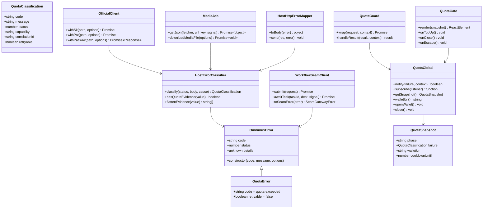
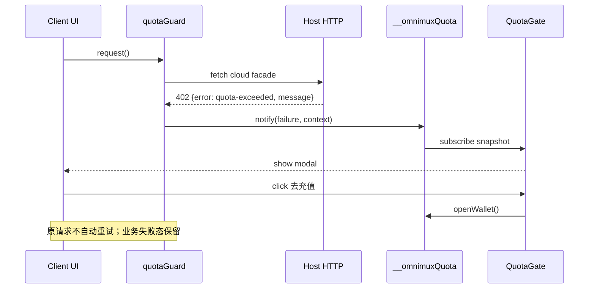
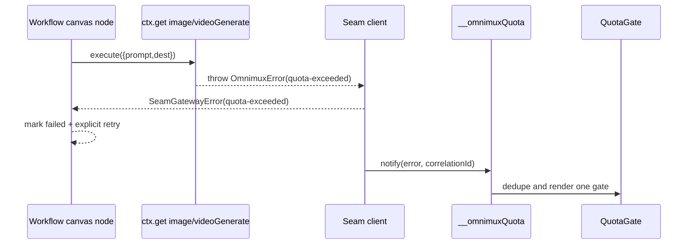
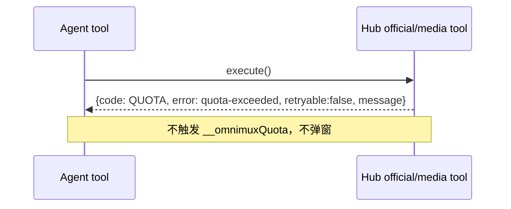
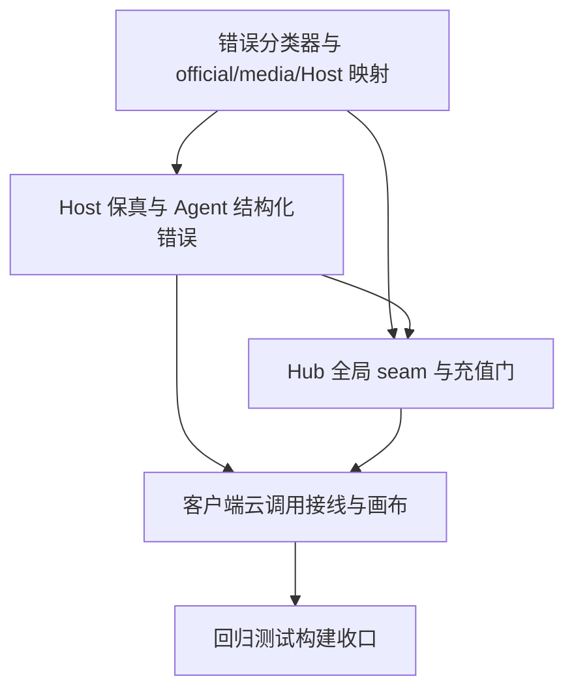

# OmniMux 全局额度不足与统一充值弹窗——系统设计

> 本文只定义增量设计，不包含生产实现代码。权威边界：真实代码与 `AGENTS.md` 高于本文；本方案遵循 PRD 已锁定决策。

## Part A 系统设计

## 1. 实现方案与框架选型

### 1.1 核心难点

1. **402 被吞**：`official/client.js` 当前把 402 归为通用 `omnimux-request-failed`，`media/job.js` 只保留“下载失败/HTTP 状态”文本；submit、poll、download 三阶段均可能丢失额度证据。
2. **Host→client 保真**：客户端只能看到同源 Host 的 `{status, body}`，必须同时保留稳定码、可读 message 和必要 status；不得泄漏 token、prompt、原始响应中的秘密。
3. **跨 bundle seam**：Hub 与垂直包是独立 bundle，垂直不能 import Hub；采用登录门已验证的 `window.__omnimuxAuth` 形态，新增 Hub 单例 `window.__omnimuxQuota`，垂直只在调用时懒读取。
4. **Agent 与客户端边界**：Agent 工具返回结构化 `QUOTA`/`quota-exceeded`，不调用全局门；仅客户端云调用通知 modal。
5. **不自动重试**：充值发生在外部钱包，到账不可确认；充值门只能打开钱包或关闭，不持有原请求、不重放。
6. **多阶段和并发去重**：同一操作的 submit/poll/download 只能通知一次；不同插件同刻失败合并单门，同时需要 2 秒冷却避免关闭后立即再弹。

### 1.2 选型与模式

- **模块化单体**：额度分类、错误映射、全局状态和 UI 均归属 `plugins/omnimux`，不新建兄弟包；垂直仅消费稳定 seam。
- **纯 JavaScript 分类模块 + React modal**：沿用现有 `node --test`、React、`useSyncExternalStore`、`shell.overlay` 和 `createPortal`；不引入状态管理库。
- **错误策略**：Host 侧分类器以结构化 status/body/cause 为主，消息正则为兜底；统一使用 `OmnimuxError` 的 `code/status/cause/details`，不依赖 `instanceof` 穿越 bundle。
- **钱包打开**：复用 `openAuthUrl`，URL 只采用已登录 profile 的 `base_url`，否则 `https://omnimux.ai/wallet`；不新增支付 SDK、Settings section 或内嵌收银台。
- **UI**：复用现有 overlay/portal，不新增依赖；采用 DSH `--dsw-*` token、32px 控件、8px/16px 间距、16px modal 圆角、SVG 图标和键盘焦点管理。

### 1.3 明确拒绝的替代方案

- **每插件自弹充值窗**：造成多门、文案和去重分裂，违反 Hub 单点所有权。
- **Cordis `ctx.provide` 跨 bundle 共享客户端服务**：独立 bundle 的模块作用域不可见且加载顺序不保证；继续采用登录门的 window 全局 seam。
- **各垂直自建 HTTP/充值页**：违反垂直不得自建品牌 HTTP 客户端、不得 import hub、不得持有 secret 的合同。
- **把充值塞进 Settings**：充值是操作反馈，不是配置；PRD 明确无 Settings section，且应能覆盖 Chat/Tab/画布当前页面。
- **充值成功自动重试**：无法确认到账，会导致重复扣费、发布或生成；本期只打开钱包。

## 2. 错误码与分类器

### 2.1 稳定错误码

选定 `quota-exceeded` 作为跨 Host/client 的稳定码，同时在 Agent 结构化结果保留兼容字段 `code: "QUOTA"`。建议增加常量 `QUOTA_EXCEEDED_CODE = 'quota-exceeded'`；`OmnimuxError` 的 `code` 为 `quota-exceeded`，并附 `status`、安全 `details`、原始 `cause`（仅 Host 内部）。不把 `QUOTA` 改成唯一跨层码，以避免破坏现有 Harness turn-tail 兼容。

Host HTTP body 统一为：

```json
{ "error": "quota-exceeded", "message": "当前操作需要更多额度，充值后即可继续使用 OmniMux。" }
```

其它错误也尽量保持 `{error, message}`；客户端不可依赖 message 反推所有业务状态。

### 2.2 分类优先级

`classifyQuotaFailure({status, body, error, cause})` 返回 `quota-exceeded | needs-omnimux | other`，并按以下顺序：

1. **401 认证优先**：真实 401 先返回 `needs-omnimux`，即使 message 含 quota；唯一例外是同一失败对象有明确额度证据且是上游错误包装，需保留额度证据并由实现测试固定“证据优先于裸 403”，不要将真实缺 token 的 401误报充值。
2. **额度证据**：HTTP 402；任意嵌套 `code/error.code/data.code === insufficient_user_quota`；消息含“预扣费额度失败”；`code === QUOTA`；以及与既有 `isQuotaFailure` 对齐的 `insufficient (user )?(quota|balance|credits)`、`quota/usage-limit (exceeded|exhausted|reached)`、`exceeded current quota`、`balance/credits (exhausted|depleted)`。
3. **额度证据优先裸 403**：403 若同时有额度证据为 `quota-exceeded`；没有额度证据则保留权限/认证类其它错误，绝不弹充值。
4. **排除项**：429、裸 403、`capability-disabled`、`needs-provider`、`omnimux-unconfigured`、未知模型/协议、参数/网络/磁盘错误、本地附件或 sessionStorage 的 `quota-exceeded` 不触发充值门。

遍历对象时读取 `error`、`data`、嵌套 JSON 字符串、`cause` 链，最多有限深度并防循环；primitive 字符串只能作为 message 证据，裸 `quota` 单词不够。所有分类都输出 `retryable: false` 给 Agent/客户端业务层。

### 2.3 映射点

- `official/client.js` 的 JSON request：先分类上游响应，再抛 `OmnimuxError('quota-exceeded', safeMessage, {cause})`，保留 `status=402`（或带额度证据的 403）；401 仍为 `needs-omnimux`。
- `media/job.js` 的 `getJson` 与 `downloadMediaFile`：读取非 2xx body（含非 JSON 的安全文本），分类后抛稳定额度错误；poll 的 failed body 也必须经过同一分类器。
- `media/protocols/openai-media.js`、`media/execute.js`：不吞掉已分类的 `OmnimuxError`，只在无证据时使用原有通用码。
- `official/http-routes.js` 及其它 Host facade：集中把 `OmnimuxError` 映射为 `{error, message}`，额度 status 传 402；Agent tool 层使用结构化结果而不是调用 UI。

## 3. 文件列表（相对仓库根）

### 新增

- `plugins/omnimux/src/errors/quota-classifier.js`：Host 统一证据提取、分类和安全 message。
- `plugins/omnimux/src/errors/quota-classifier.test.js`：402/嵌套码/cause/403 优先级/排除项测试。
- `plugins/omnimux/src/client/quota-gate.js`：单例 store、去重/冷却、`__omnimuxQuota` 安装。
- `plugins/omnimux/src/client/QuotaGate.jsx`：Portal overlay 与焦点/ESC/关闭/充值 CTA。
- `plugins/omnimux/src/client/quota-gate.test.js`：seam、并发、冷却、wallet、无弹窗边界测试。
- `docs/specs/2026-09-04-omnimux-universal-quota-gate-sequence.mermaid`
- `docs/specs/2026-09-04-omnimux-universal-quota-gate-class.mermaid`

### 修改

- `plugins/omnimux/src/media/errors.js`：扩展稳定码/字段和安全错误辅助方法。
- `plugins/omnimux/src/official/client.js`：官方 HTTP 响应分类与 402 保真。
- `plugins/omnimux/src/media/job.js`、`plugins/omnimux/src/media/protocols/openai-media.js`、`plugins/omnimux/src/media/execute.js`：submit/poll/download 保留额度证据。
- `plugins/omnimux/src/official/http-routes.js`、`plugins/omnimux/src/official/inspiration-http.js`：统一 Host body 映射。
- `plugins/omnimux/src/client/index.js`：安装 global 并注册 `shell.overlay`。
- `plugins/omnimux/src/client/api-auth.js`、`plugins/omnimux/src/client/api.js`：新增对标 `authGuard` 的 `quotaGuard`/结果处理（不与 authGuard 混淆）。
- `plugins/omnimux/src/client/quota-failure.js`、`QuotaTopUpLink.jsx`、Chat turn-end 相关组件：收敛为共享门/共享 wallet URL。
- `plugins/omnimux/src/client/locales.js`：`quota.gate.title/description/topUp/close/context.*`。
- `plugins/omnimux-workflow/src/workflow/seam/omnimuxGateway.ts`：保留 `quota-exceeded`，客户端触发时通知 seam；Agent 路径仅结构化返回。
- `plugins/omnimux-accounts/src/client/api.js`、`plugins/omnimux-inspiration/src/client/api.js`、`plugins/omnimux-analytics/src/client/api.js`、`plugins/omnimux-publish/src/client/api.js`：各自 HTTP wrapper 接入全局 quota seam。
- `plugins/omnimux-products/src/client/api.js`、`plugins/omnimux-workflow/src/client/api.js`：P1 AI/画布客户端接线时接入；本地 CRUD 不接入。
- `plugins/omnimux/src/client/quota-failure.test.js` 及各垂直 API 测试：回归测试。

不修改 PRD；不新增 `settings.section`；不修改桌面壳。

## 4. 数据结构与接口

### 4.1 `window.__omnimuxQuota` 最小 API

```js
window.__omnimuxQuota = {
  notify(failure, context = {}) => boolean, // 仅额度证据才入门；返回是否接受
  subscribe(listener) => () => void,
  getSnapshot() => {
    phase: 'closed' | 'open',
    failure: { code: 'quota-exceeded', message, status?, capability?, billingSurface?, correlationId? } | null,
    walletUrl: string,
    cooldownUntil: number
  },
  walletUrl() => string,
  openWallet() => void,
  close() => void
}
```

`notify` 在内部再分类一次以抵御调用方误传；不接受 secret/prompt/raw response。`walletUrl` 只从已登录 profile 的 `base_url` 读取并安全拼接 `/wallet`，否则默认站点。`openWallet` 复用 `openAuthUrl`。

`quotaGuard(fn, contextFactory?)` 对标 `authGuard`，只包装客户端 Host HTTP 结果：检测额度即通知且原样返回失败结果，不重试；遇到 401 交给 `authGuard`，认证成功最多重试原请求一次，若重试返回 402 再通知额度门。

### 4.2 Mermaid 类图



垂直改动面裁定：**改** accounts（云 accounts Host API）、inspiration（云内容/编辑）、analytics（云 dashboard/sync）、publish（预签名/创建/查询）；workflow 客户端提交/画布节点通过 hub seam 由中枢错误传播，必要时在浏览器节点执行边界 notify。products 仅 P1 AI 辅助接入后改；本地 CRUD 不改。**不改** assets、clip、market、gallery、video-preview 及所有 Agent-only 工具 UI；Agent 只由 Host/工具返回结构化码。

## 5. 程序调用流程

### 5.1 客户端 Host HTTP 402 → 门（不重试）



### 5.2 画布 image/videoGenerate → failed + 门



### 5.3 未登录 401 → 登录 → 重试 → 402

```mermaid
sequenceDiagram
    participant UI as Client operation
    participant Auth as __omnimuxAuth
    participant Host as Host HTTP
    participant Quota as __omnimuxQuota
    UI->>Host: request()
    Host-->>UI: 401 needs-omnimux
    UI->>Auth: ensureLogin({onSuccess: retryOnce})
    Auth-->>UI: login success
    UI->>Host: retry once
    Host-->>UI: 402 quota-exceeded
    UI->>Quota: notify(failure)
    Quota-->>UI: show recharge modal; no further retry
```

### 5.4 Agent 工具 → 结构化返回、无弹窗



## 6. Chat turn-end 与统一门合并

`selectQuotaTurn` 保留为 Chat 失败态选择器，但改为调用共享分类器，仅决定 turn-end 内是否保留业务提示，不再自己拥有充值逻辑。`QuotaTopUpLink` 不再直接构造第二 CTA 逻辑；它改为共享门的轻量入口（调用 `window.__omnimuxQuota.notify` 或 `openWallet`），主门仍由 Hub `QuotaGate` 唯一渲染。Chat turn 失败内容、quota hint 和 modal 可同时存在：turn-end 保持原失败态，modal 负责全局统一说明与 CTA。

## 7. 去重与冷却

- **correlation id 来源**：优先调用方显式传入；Host 请求上下文可使用已有 request/task id；workflow 使用节点执行 id；Chat 使用 turn id；没有可用 id 时生成本次事件 id。不得把 prompt、token 或 URL query secret 放入 id。
- **同一操作**：store 保存最近 `correlationId`，submit/poll/download 的同 id 只接受第一次。
- **并发事件**：门 `phase=open` 时合并为一个快照，保留首个安全 message 和能力上下文；不叠加 modal。
- **2 秒冷却**：关闭后至 `Date.now()+2000` 前，同 correlation 或同一失败窗口不重新打开；冷却不阻止业务返回失败，也不阻止显式用户操作。
- **生命周期**：仅内存单例、刷新清空；不使用 localStorage/sessionStorage，避免把本地业务 `quota-exceeded` 与云额度混淆。

## 8. 共享约定与跨文件约束

- Hub 是唯一错误分类、Host 映射、global seam 和 modal 所有者；垂直 MUST NOT import hub、存 secret、自建品牌 HTTP 或充值 UI。
- 错误 HTTP body 使用 `{error, message}`；客户端不展示 JSON、prompt、token、key；Agent 使用 `{code:'QUOTA', error:'quota-exceeded', retryable:false, message}`。
- 401 认证门与额度门严格分离：`authGuard` 只处理登录恢复；`quotaGuard` 不触发登录、不自动重试。
- 任何 402 或明确额度证据都不能被 `catch` 改写成普通 500/下载失败；无证据 403/429 不升级为额度。
- 外部钱包只使用已登录 profile `base_url`；未登录无法由 quota 门替代 auth 门。
- UI 只用 `--dsw-alias-*`/`--dsw-specific-*`，32px、8px/16px、modal 16px、SVG、WCAG AA、ESC/遮罩/关闭和焦点回收；不新增 Settings section。
- P0 覆盖 T-01~05、T-10~16、T-18~22；Agent T-06~09/T-17 只做结构化错误；T-23~28 排除。

## 9. Out of Scope

不内嵌支付收银台、不做余额实时预检/套餐页、不改云计费、不把 429 当余额、不允许垂直自建充值页、不把本地 CRUD、clip、market、preview、磁盘不足算触发源、不因充值成功自动重试；余额展示、钱包返回刷新和用户确认重试属于后续 P1/P2。

## 10. 待明确事项与默认假设

1. **钱包打开方式**：默认复用登录门 `openAuthUrl`，系统浏览器打开。
2. **冷却策略**：默认关闭后 2 秒，并按 correlation 去重；不做同能力 30 秒抑制。
3. **profile 来源**：默认只信任已登录 profile 的 `base_url`；错误 body 不得覆盖。
4. **返回钱包后的恢复**：本期不实现；默认为 P2 的“刷新余额→用户确认重试”，不改变不自动重试原则。
5. **Host facade 全量覆盖**：假设所有 P0 客户端云调用最终经过可观测 Host wrapper 或 workflow seam；若发现某个云调用绕过两者，需要在实现前将其补入中枢 seam，而非在垂直新建 HTTP。

## Part B 任务分解

> 既有 monorepo 增量，不伪造脚手架；每项至少覆盖三个相关文件，最多五项。

### T01 — 错误分类器与 official/media/Host 映射

- **Source Files**：`plugins/omnimux/src/errors/quota-classifier.js`、`plugins/omnimux/src/errors/quota-classifier.test.js`、`plugins/omnimux/src/media/errors.js`、`plugins/omnimux/src/official/client.js`、`plugins/omnimux/src/media/job.js`、`plugins/omnimux/src/media/protocols/openai-media.js`、`plugins/omnimux/src/media/execute.js`。
- **Dependencies**：无。
- **Priority**：P0。
- **验收要点**：402、嵌套 `insufficient_user_quota`、预扣费、QUOTA、cause 和既有正则全部命中；额度证据优先裸 403；真 401、裸 403、429 和非计费错误不误判；submit/poll/download 均保留 code/status/message；无 secret。

### T02 — Host HTTP 保真与 Agent 结构化错误

- **Source Files**：`plugins/omnimux/src/official/http-routes.js`、`plugins/omnimux/src/official/inspiration-http.js`、`plugins/omnimux/src/official/client.test.js`、`plugins/omnimux/src/official/http-routes.test.js`、`plugins/omnimux/src/media/job.test.js`、`plugins/omnimux-workflow/src/workflow/seam/omnimuxGateway.ts`、相关 `plugins/omnimux-*/src/hubtools.js`。
- **Dependencies**：T01。
- **Priority**：P0。
- **验收要点**：Host 对额度返回 402 与 `{error:'quota-exceeded',message}`；workflow 节点收到稳定码并保持 failed；Agent 返回 `QUOTA`/`quota-exceeded`、`retryable:false` 且不触发 UI；普通错误映射不改变。

### T03 — Hub 全局 seam 与充值门 modal

- **Source Files**：`plugins/omnimux/src/client/quota-gate.js`、`plugins/omnimux/src/client/QuotaGate.jsx`、`plugins/omnimux/src/client/index.js`、`plugins/omnimux/src/client/locales.js`、`plugins/omnimux/src/client/quota-gate.test.js`、`plugins/omnimux/src/client/QuotaTopUpLink.jsx`、`plugins/omnimux/src/client/quota-failure.js`。
- **Dependencies**：T01、T02（可与 T02 并行实现，集成验收依赖 T02）。
- **Priority**：P0。
- **验收要点**：幂等安装 `window.__omnimuxQuota`；`notify/subscribe/getSnapshot/walletUrl/openWallet/close` 可用；shell.overlay + `createPortal` 单门；2 秒冷却、correlation 去重、并发合并；CTA/ESC/遮罩关闭；不自动重试；Chat 失败态与共享门共存；token/32px/SVG/a11y 合规。

### T04 — 客户端云调用接线与画布触发

- **Source Files**：`plugins/omnimux/src/client/api-auth.js`、`plugins/omnimux/src/client/api.js`、`plugins/omnimux-workflow/src/client/api.js`、`plugins/omnimux-accounts/src/client/api.js`、`plugins/omnimux-inspiration/src/client/api.js`、`plugins/omnimux-analytics/src/client/api.js`、`plugins/omnimux-publish/src/client/api.js`、`plugins/omnimux-workflow/src/workflow/seam/omnimuxGateway.ts`。
- **Dependencies**：T02、T03。
- **Priority**：P0。
- **验收要点**：T-10~16、T-19~22 的客户端云错误统一通知；401 先 authGuard，登录后仅重试一次，402 才 quota 门；本地 CRUD/market/assets/clip 不弹；画布节点 failed 且显式重试；垂直只懒读 window，无跨包 import。

### T05 — 回归测试、构建与收口验收

- **Source Files**：`plugins/omnimux/src/client/quota-failure.test.js`、各垂直 `src/client/api.test.js`、`plugins/omnimux/src/official/client.test.js`、`plugins/omnimux/src/official/http-routes.test.js`、`plugins/omnimux/src/media/*test.js`、新增文档 Mermaid 文件与本设计文档。
- **Dependencies**：T01、T02、T03、T04。
- **Priority**：P0。
- **验收要点**：分类器和 seam 单测全绿；重建受影响 client bundle；静态检查无垂直 import hub/新 HTTP/Settings section；执行 `pnpm doc:lint`；完成 dev profile 的真实 Chat/Tab/画布与 Agent 边界验证。充值后无自动重试、错误态保留、单门去重均有证据。

### 任务依赖图



## 11. Required Packages

**无新依赖。** 复用现有 React、`dsh-ui-kit`、已有 overlay/portal、`useSyncExternalStore`、`openAuthUrl` 和 Node 内建测试能力。

## 12. Shared Knowledge

- 所有跨 Host/client 错误至少含 `{error, message}`；额度码是 `quota-exceeded`，Agent 兼容码为 `QUOTA`。
- 401 是登录恢复链；402/有额度证据是充值门链；两者不可合并。
- 额度门永远不自动重试；充值之后由业务显式重试。
- Hub 统一拥有错误证据、HTTP/媒体映射、全局 seam 和 UI；垂直只消费 window seam 与现有 hub seams。
- 钱包默认 `https://omnimux.ai/wallet`，仅已登录 profile 的 `base_url` 可覆盖。
- UI 遵循 DSH 原生 token、32px、高度/圆角/间距和 SVG/a11y 规范；不增加 Settings section。
- 生产实现前，文档 Mermaid 与代码接口必须保持一致；发现新的绕过 wrapper 的 P0 云调用时，补到 Hub，而非复制客户端。

## 13. 工程师入口

从 **T01** 开始：先实现并测试统一分类器及错误证据保真，再推进 Host body、全局 seam 和垂直接线。
