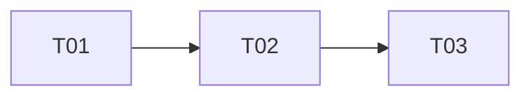

# 灵感库一键复刻 dismiss/reveal 方向修正 — 增量设计

## 0. 产品红线（PM PRD，用户已批准，不可协商）

- **P-1** 灵感库 Tab 不自动关闭 —— 删除 dismiss 里的 `closeTab('omnimux-inspiration:library')`
- **P-2** CTA 唯一副作用 = 激活中间会话栏 + 预填 prompt
- **P-3** 画布开关权归用户 —— 灵感库链路不得调用 `closePanel`，也不得 open 画布（完全解耦）
- **P-4** 灵感库与画布解耦

终态：
- 状态 A（仅灵感库打开）：`[左栏][会话栏(已预填)][灵感库(原样保留，split 宽度)]`
- 状态 B（灵感库+画布同在右侧面板 tabs）：三栏并存，右侧面板 tabs 由用户自行切换

## 1. 关键疑点查证结论（读代码后的确定结论）

### 疑点 1：focus 模式是否 sticky？不 closeTab 仅 `setConversationCollapsed(false)` + `setFocus('split')` 能否稳定得到终态？

**结论：能，且 split 是 sticky 的。现有 workbench 状态机没有任何路径会把 focus 打回 gui。**

证据链（`plugins/omnimux/src/client/workbench.js` + `conversation-collapse.js`）：

1. `wb.setFocus('split')` 即 `setWorkbenchFocus('split', attachedStore)`（L1653 全局 API 映射）。它做了三件事：
   - 把**当前活跃 tab**（CTA 在灵感库页面内被点击 ⇒ 活跃 tab 必为 `omnimux-inspiration:library`）的 `record.mode` 改写为 `'split'`，并通过 `persistSessionFocus` 持久化到 `localStorage["omnimux-workbench-focus:v1:<sessionId>"]`（L1017–1022）；
   - 自己内部调用 `setConversationCollapsed(false, { sessionId })`（L1026–1029）——所以 reveal 里显式的 `setConversationCollapsed(false)` 是**冗余但无害**的双保险；
   - `store.reduce` 写入 `panelOpen: true` + split 宽度（`record.splitWidth ?? workbenchDefaultWidthPx`，并被 `clampSplitPanelWidth` 钳到 split max，保证中间会话栏 ≥360px）（L1034–1056）。
2. 持久化之后，所有"重算 focus"的入口都读到 split 而非 gui 默认值：
   - `focusRecordForTab` 只在 `map[tabId]` 不存在时才 seed `resolveDefaultFocus`（L951–956）——记录已存在，默认值不再生效；
   - `openWorkbench` 优先取 `map[tabId]?.mode`（explicitMode），split 胜过 `resolveDefaultFocus(tabId)`（L1342–1345）——即使用户之后重开灵感库，也以 split 打开（行为变化，见 §5 待明确事项 M-1）；
   - `attachStore` 只在 `record.mode ∈ {gui, chat}` 时重放 `setWorkbenchFocus(record.mode)`；split 走 `inferWorkbenchFocus` 几何推断，面板宽度刚被写成 split 宽度，推断结果就是 split（L1414–1419）；
   - `getWorkbenchFocus` 的 sticky-gui 分支要求 `record.mode === 'gui'`（L987–989），不满足；sticky collapse 分支要求 `getConversationCollapsed()` 为真（L991–993），已被置 false。
3. 唯一会持续运行的几何同步 `syncWorkbenchGuiWidth` 的 `wantsGui = record.mode === 'gui' || getConversationCollapsed()`（L520）为 false → 走 split 钳制分支，**只钳面板宽度，绝不触碰 conversation collapse**（注释明确写了 "Left-rail resize MUST NOT flip middle-pane intent, #372"）。
4. `conversation-collapse.js` 的 collapsed 是 per-session sticky boolean（内存 + localStorage `omnimux-conversation-collapsed:v1:`），只有 `setWorkbenchFocus('gui')` 会把它打回 true；灵感库链路不再有任何代码调 `setFocus('gui')`。

**唯一残余风险（低）**：`setWorkbenchFocus` 不带 `targetTabId` 时作用于"活跃 tab"。CTA 只在灵感库 tab 可见时可点（非活跃 tab 的 Stage 是 `display:none`），所以活跃 tab 必为灵感库。另：`getWorkbenchFocus` 末尾有 `record.mode = inferred`（L997）的内存改写——仅在 `attachedStore` 缺失导致宽度没写进去时才可能误推 gui；真实 App 中灵感库 Stage mount 时已 `attachStore`（InspirationStage.jsx L21–26），面板打开 ⇒ store 必在，该路径不可达。不需要为此加防御代码。

### 疑点 2：0ms/50ms replay 去留？

**结论：保留，但 replay 的内容从「closeTab + reveal」缩为「仅 reveal」。**

- 原 replay 针对的竞态注释写得很清楚："Library open() defaults to gui and can re-collapse the middle pane **on the same tick as closeTab**"。该竞态的主体是 closeTab 引发的 subscriber 级联（`closeWorkbenchTab` → 最后一个 workbench tab 关闭时 `closeWorkbenchPanel()` → `setWorkbenchFocus('chat')` → store/subscriber 重新布局）。
- 删掉 closeTab 后，上述级联整体消失。剩余的同 tick 写入源只有：better-sidebar 自身 openTab/geometry settle、以及 `attachStore`/subscriber 的 `persistClampedSplitWidth`——这些都不写 collapse、不写 mode=gui（疑点 1 已证）。
- 因此 replay **严格来说不再需要**。但鉴于本链路已因竞态被否决 3 次，且 reveal-only replay 是**纯幂等几何断言**（不再 mutate tab 集合，不持久化任何新状态——split 已在首次调用时持久化），保留 0ms/50ms 两次 reveal 重放的工程成本为零、收益是抵御"CTA 点击恰逢面板几何过渡中"的边角。决策：**保留双 replay，reveal-only**。

### 疑点 3：prefill 失败路径的顺序取舍

**结论：维持「先 reveal 后 prefill」，并把 reveal 统一上移到 attach 解析之后（覆盖 quota 分支）。不重排为「先 prefill 后 reveal」。**

理由：
1. **reveal 必须先于 prefill（技术硬约束）**：`conversation-collapse.js` 的 gui 折叠用 CSS `visibility:hidden; pointer-events:none` 隐藏 `[data-slot="conversation"]`。composer DOM 仍 mounted，`findComposer` 能选中，但对 hidden 字段 `focus()` + `execCommand('insertText')` 不可靠（#528 的历史教训，现有注释 L288–289 也记录了这一点）。所以"先 prefill 成功再 reveal"不可行。
2. **prefill 失败的新 UX 严格优于旧方向**：灵感库原样保留（用户零损失），中间栏已展开且附件卡片已挂上，状态 `card.cta.sendManual` 提示手动发送。合理，无需额外补偿逻辑。
3. **quota 分支统一**：现代码 quota-exceeded 时 prefill 但**跳过 dismiss**（测试断言 `closes.length === 0`）。新语义下 reveal 不再是"关闭动作"而是"激活会话栏"，quota 分支同样应该 reveal 后再 prefill——否则预填进了隐藏 composer，用户看不见。P-2 的"唯一副作用"对 attach 结果不做区分。改动：把 reveal 调用移到 attach 结果解析之后、quota 分支判断之前。

### 疑点 4：测试重写策略

`replicate-to-chat.test.js`（18 个测试）处理明细：

**源码级红线断言（isolation describe，新增 3 条）**：
- `assert.doesNotMatch(source, /closeTab/)` —— P-1
- `assert.doesNotMatch(source, /closePanel/)` —— P-3
- `assert.doesNotMatch(source, /createSidebarStore/)` —— 删除 close 兜底路径

**`dismissInspirationLibrary` describe（4 个）→ 整体改写为 `revealConversationForReplicate` describe**：

| 旧测试 | 处置 |
|---|---|
| `calls onDismissModal then closeTab with the library tab id` | **改写**：断言 onDismissModal 被调；fake wb 上放 closeTab spy，断言**未被调用**；断言 `collapsed:false` + `focus:split` |
| `after closeTab unhides the conversation column` | **改写**：调用顺序断言改为 `['collapsed:false','focus:split']`，无 close |
| `keeps the right panel open (canvas stays) #531` | **改写保留**：fake wb 同时提供 closeTab/closePanel/setFocus spy，断言无 closeTab、无 closePanel、无 focus:chat，有 focus:split |
| `falls back to createSidebarStore().close when closeTab is missing` | **删除**（兜底路径随 closeTab 一并移除） |
| （新增）`replay re-asserts reveal only` | **新增**：用计数 spy 断言 0/50ms replay 只重复 collapsed:false + focus:split，全程不触碰 closeTab |

**`oneClickReplicate` describe**：

| 旧测试 | 处置 |
|---|---|
| `never invokes startReplication` | 保留不动 |
| `noSession …` | 保留（closes→reveals 计数改名） |
| `success uses real dismissInspirationLibrary: closeTab then split` | **改写**：`delete io.dismissLibrary` 改 `delete io.revealConversation`；fake wb 断言无 closeTab/closePanel，有 collapsed:false + focus:split |
| `dismisses before prefill (#528)` | **改写保留**：更名 `reveals conversation before prefill`，顺序断言 `['reveal','prefill']` 不变 |
| `blank reuses … 1 closeTab` / `non-blank clicks … +close` | **改写**：`io.closes` → `io.reveals`，计数语义不变（1 次） |
| `quota-exceeded still prefills but returns attachFull` | **改写**：`reveals.length` 从 0 改为 **1**（对应疑点 3 的 quota 统一 reveal） |
| `prefill failure after attach still dismisses (#528)` | **改写保留**：更名 `prefill failure still reveals conversation`；断言 sendManual + reveal 1 次 + attach 1 次 + 灵感库未被 close |
| busy / runExclusive / duplicate 等 | 保留不动（closes→reveals 改名处同步） |

预计测试数 18 → 19（删 1、增 2）。

## 2. 增量改动点清单（精确到函数）

### 文件 1：`plugins/omnimux-inspiration/src/client/replicate-to-chat.js`

| # | 位置 | 改动 |
|---|---|---|
| C-1 | 模块头注释（L1–7） | 管线描述改为 `exclusive lock → hasAnySession/isBlankSession → clickOfficialNewSession → addAttachment → revealConversationForReplicate → prefillReplicationPrompt`；补一句红线注释："灵感库 Tab 永不由此链路关闭（#552 P-1），画布开关权归用户（P-3）" |
| C-2 | `revealConversationColumn(wb)`（L113–121） | 逻辑不变（collapsed:false + focus:split 双保险），更新上方块注释：删除 "AFTER closeTab" 表述，改为 "Enter-conversation: uncollapse + split only. Never closeTab, never closePanel（#552）" |
| C-3 | `dismissInspirationLibrary(io)`（L129–152） | **重命名为 `revealConversationForReplicate(io)`**。删除 `tabId` 解析、`wb.closeTab(tabId)` 调用、`createSidebarStore` 兜底分支。保留：`onDismissModal` 调用（卡片详情弹窗关闭，与 tab 无关）+ `revealConversationColumn(wb)` + 0/50ms reveal-only replay |
| C-4 | `INSPIRATION_LIBRARY_TAB_ID` 常量（L13）与 `io.tabId` | 删除（closeTab 移除后成死代码；全仓 grep 确认仅本文件与其测试引用） |
| C-5 | `oneClickReplicate` io seam（L214–219） | `io.dismissLibrary` → `io.revealConversation`；默认实现改调 `revealConversationForReplicate({ window: win, onDismissModal: io.onDismissModal })` |
| C-6 | 调用点顺序（L282–302） | reveal 调用从"quota 分支之后、prefill 之前"上移到 **attach 结果解析完成之后立即执行**（quota 与正常分支共用同一次 reveal）；更新 L288–289 注释 |

不改：`runExclusive`/`isReplicateBusy`/`resetReplicateLock`、`pickReplicationPreviewUrl`、`buildInspirationPayload`、`readActiveSessionId`/`resolveAttachSessionId`、`defaultAddAttachment`、状态 key 体系（`card.cta.*`）。

### 文件 2：`plugins/omnimux-inspiration/src/client/replicate-to-chat.test.js`

按疑点 4 表格执行：3 条源码红线断言 + dismiss describe 整体改写 + oneClickReplicate 中 6 个测试改写 + 其余保留。

### 不触碰的文件

- `plugins/omnimux/src/client/workbench.js` / `conversation-collapse.js` —— 状态机已满足需求，零改动（疑点 1 结论）
- `InspirationStage.jsx` L28–35 的 `handleClose` —— 那是用户点关闭按钮的主动行为，不在红线范围
- `use-inspiration-feed.js` —— 只传 `onStatus`，io seam 改名不影响它
- `composer-inject.js`、`replication.js`、`is-blank-session.js`、`new-session-click.js`

## 3. 任务列表（给工程师寇豆码）

| Task ID | 任务名 | 源文件 | 依赖 | 优先级 |
|---|---|---|---|---|
| T01 | 编排器改造：删除 closeTab、重命名 reveal、统一 quota reveal | `plugins/omnimux-inspiration/src/client/replicate-to-chat.js`（C-1~C-6 全部） | 无 | P0 |
| T02 | 测试重写：红线断言 + reveal 语义改写 | `plugins/omnimux-inspiration/src/client/replicate-to-chat.test.js` | T01 | P0 |
| T03 | 真机探针验收：`pnpm verify:live omnimux-inspiration`，状态 A/状态 B 两幕截图 + `docs/evidence/live-qa-report.json`（状态 A：三栏 `[左栏][会话栏(已预填)][灵感库 split]`；状态 B：灵感库+画布 tabs 并存，点击 CTA 后面板不收、tabs 不丢） | evidence 输出 | T01、T02 | P0 |

## 4. 共享知识 / 跨文件约定

- **workbench 全局 API**：插件只读 `window.__omnimuxWorkbench`，禁止 import `plugins/omnimux` 内部模块。相关方法：`setConversationCollapsed(bool)`、`setFocus('split'|'gui'|'chat')`、`closeTab(tabId)`、`closePanel()`。
- **focus 状态机事实**（本设计查证，可作为后续维护共识）：
  - focus record 按 `(sessionId, tabId)` 持久化在 `localStorage["omnimux-workbench-focus:v1:<sessionId>"]`；`resolveDefaultFocus` 只在记录缺失时 seed 一次；
  - `setFocus('split')` 自带 `setConversationCollapsed(false)`，显式调 collapsed 是冗余双保险；
  - 左栏 resize 同步（`syncWorkbenchGuiWidth`）永不翻转 conversation collapse（#372 不变量）。
- **CTA 可见性 ⇒ 灵感库 tab 必为活跃 tab**：非活跃 Stage `display:none`，因此 `setFocus('split')` 不带 targetTabId 是安全的。
- **reveal 幂等**：reveal-only replay（0/50ms）不 mutate tab 集合、不写新持久化状态，可安全重放。
- **状态 key 不变**：`card.cta.*` 全套沿用，包括 prefill 失败的 `card.cta.sendManual`。
- **io seam 命名**：`io.revealConversation`（替代 `io.dismissLibrary`）；`onDismissModal` 保留（只管卡片详情弹窗）。

## 5. Anything UNCLEAR / 待明确事项

- **M-1（行为变化，已在授权范围内，仅备案）**：`setFocus('split')` 会把灵感库 tab 的 focus 持久化为 split。此后用户在该会话**重开**灵感库时默认 split 而非全屏 gui。这与终态 A 一致，且用户可拖分屏条调整；若 PM 希望"每次重开都回全屏"，需要额外的"一次性 reveal 不持久化"机制（workbench 侧新 API），本期不做。
- **M-2**：状态 B 下若用户把画布 tab 切为活跃后，灵感库 reveal 写入的 split 记录挂在灵感库 tab 上；切回灵感库 tab 时 panel 宽度按灵感库 record 恢复（split 宽度）——符合"tabs 由用户自行切换"预期。
- 无其他阻塞项。
