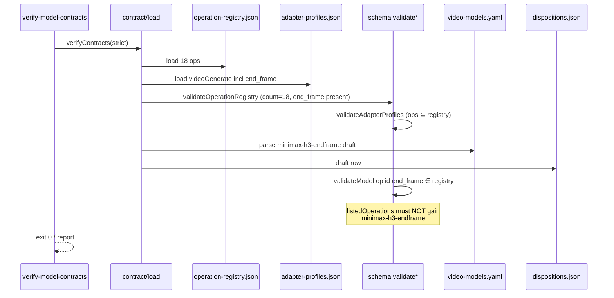
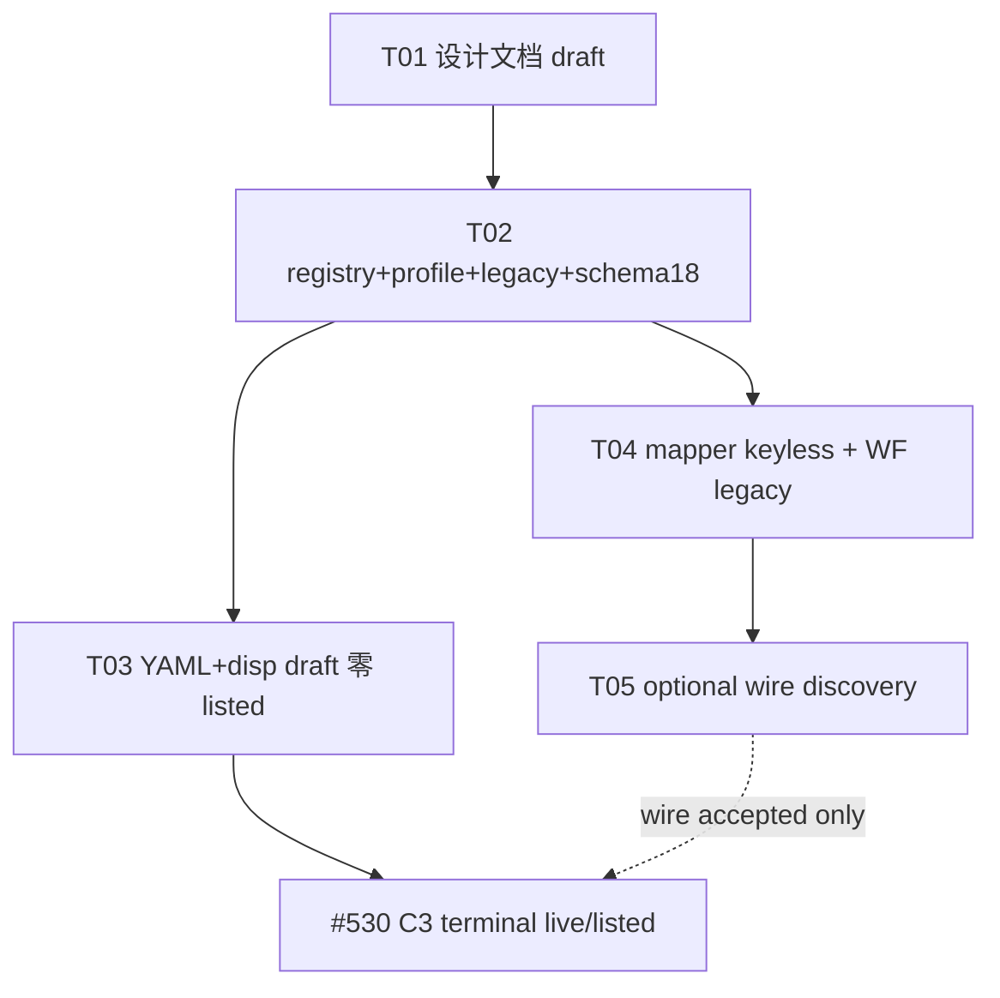

# 增量设计：#567 MiniMax H3 end-frame 独立 operation / slot / profile / wire

> **文档地位**：L2 增量设计（Issue **#567** · 关闭 #530 视频附录 **BI-2 / R-G registry_gap** 的前置）。**只写 docs，不实现、不 live API、不 commit/push/PR/物化**。
> **作者**：高见远（架构师） · 2026-09-05
> **工作树**：`omnimux-dsh-wt-video-end-frame-567` · 分支 `agent/omnimux-video-end-frame-issue-567` @ `ad2d00e`（#566 `image_tail` 已合入 main）
> **status = `draft`**：**end-frame-only 客户 wire 尚未被 `minimax-h3-endframe` dated probe 钉死**；禁止伪 `accepted`。升格条件见 §0 / §12。
> **术语**：`omnimux` = **执行中枢**；禁止称「网关」。上游 HTTP 云端仍称 OmniMux API / 上游。
> **原则**：**不得把 end-frame 塞入 `first_frame` / `first_last_frame`**；**#566 `image_tail` ≠ end-only 自动真源**；**模型层 draft 不能带飞未证 op listed**；**#567 DoD = execution expressibility + keyless tests**；**#530 C3 terminal live / listed 另行**。

---

## 0. 为何是 draft（升格门槛）

| 条件 | 本文件落盘时 | 升格 `accepted` 所需 |
|---|---|---|
| 需要第 18 op 的裁决 | **已钉**（§1） | 保持 |
| registry / profile / legacy / slot·role 命名 | **已钉**（§2–§3） | 实现 PR 与 keyless 测试对齐后可仍 draft 至 wire |
| `minimax-h3-endframe` model 字符串 | **E1 官方 Identity 钉死** | 保持完整 id 透传 |
| end-only 客户字段名/shape | **未钉**（官方模板 + #566 仅 FLF 间接） | dated **submit discovery**：至少 1 次 schema-accepted（HTTP 非 unknown-field）的 only-last body；首选假设 `image_tail` |
| only-last **无** first/`image` 是否被该 model 接受 | **未钉** | 同上；失败则书面不接或保留 draft，**禁止**用 flf 双帧证据冒充 |
| listed / `execution:live` | **禁止**由本 Issue 带飞 | #530 C3 + 独立 dated evidence（非 #567 关闭条件） |

**本设计可执行范围（draft 也必须钉死）**：operation 裁决、registry 18 扩表、profile、legacy 只读映射、YAML/disposition 初态、mapper 表达边界、W1–W3/H3 影响面、任务分解、测试矩阵、探针预算、回滚、安全/证据协议、#567 完成边界。

---

## 1. 架构裁决：是否需要第 18 个 canonical operation `end_frame`

### 1.1 Operation 定义口径（输入槽结构 / 角色 / 任务族）

| Operation | 任务族 | 必填图像槽结构 | 角色集合 | 禁止等同的原因 |
|---|---|---|---|---|
| `text_to_video` | 纯文生 | 无图 | — | — |
| `first_frame` | **首帧驱动** I2V | **仅** start/first | `first_frame` | — |
| `first_last_frame` | **首尾帧过渡** | **同时** first + last（min=1 各一） | `first_frame` + `last_frame` | 缺 first 即不构成 flf |
| `video_multi_ref` | 多图参考/风格 | 1..N generic refs | `reference` | 角色非帧锚点 |
| **`end_frame`（NEW）** | **尾帧参考** I2V | **仅** end/last | **`last_frame`（role）** | 见下 |

官方产品命名（updates / llms）：

- `minimax-h3-endframe` = **「End-frame reference I2V」**（独立 SKU）
- `minimax-h3-flf` = **First-Last Frame**（另一 SKU / 另一 op）

二者 **SKU 分列 + 任务族分列**，不是同一 op 的参数开关。

### 1.2 否决「可组合表达」的候选

| 候选 | 是否采纳 | 理由 |
|---|---|---|
| 把 endframe 映射为 `first_frame` | **禁止** | 角色相反；违反视频附录 **R-G** / **VP0-3**；污染 listed 语义 |
| 把 endframe 映射为 `first_last_frame` 且 first 可选 | **禁止** | 改变 flf 合同（两槽 min=1）；画布/兼容引擎会把「只有尾帧」误判为 flf 不完整或自动要首帧 |
| 用 `video_multi_ref` + 单图冒充尾帧 | **禁止** | 进 `reference_images`，不是帧锚点；#566 已证明 last 不得塌进 ref |
| 仅 model id 分叉、registry 不扩 | **禁止** | operation 是契约原子；catalog / fingerprint / listed 键都是 `modelId#operationId`；无 op 则无法诚实 listed |
| **新增 canonical `end_frame`** | **采纳** | 独立输入槽结构 + 独立任务族；与 flf/first 正交 |

### 1.3 裁决（硬）

```text
ADOPT: 第 18 个 canonical operation id = end_frame
REJECT: 任何把 end-frame-only 塞进 first_frame / first_last_frame / video_multi_ref 的映射
NOTE:  #566 只关闭「FLF 场景 last_frame → image_tail」的 mapper 表达力；
       不自动证明 end-frame-only SKU 的 live 合同，也不等于 registry 已有 end_frame op。
```

**本 Issue 关闭 BI-2 的契约侧**：registry + profile + legacy +（实现阶段）YAML 可声明 `end_frame`。  
**不关闭** #530 C3 的 `minimax-h3-endframe#end_frame` listed。

---

## 2. Registry schema（17 → 18）

### 2.1 新 operation 条目（机器真源）

写入 `plugins/omnimux/src/catalog/contract/operation-registry.json`：

| 字段 | 值 |
|---|---|
| `id` | **`end_frame`** |
| `label` | `尾帧参考`（或 `尾帧驱动`；UI 文案可后调，id 不可漂） |
| `group` | `video` |
| `defaultOutputType` | `video` |
| `promptPolicy` | **`required`**（与 first_frame / flf 一致；官方页 prompt conditional t2v，I2V 仍建议带短 prompt；若 live 证明可空再降 optional，**不得**在无证时改 none） |
| `notes` | `仅尾帧锚点；禁止映射为 first_frame；slot=end_frame role=last_frame；wire 候选 image_tail（#566 间接）` |

**可选** `defaultSlotRoles`: `["last_frame"]`（若 registry schema 已支持；无则仅 notes + YAML 显式 slots）。

### 2.2 Slot / role 命名裁决

| 层级 | 名称 | 裁决 | 理由 |
|---|---|---|---|
| **operation id** | `end_frame` | 固定 | 任务族名；legacy `endframe` 只读映入 |
| **YAML/DTO slot** | **`end_frame`** | 固定 | 与 workflow mockGateway / compat 测试已用的 `slot: 'end_frame'` 对齐；与 flf 的 `slot: 'last_frame'` **字面区分**（同图角色、不同 op 槽位名） |
| **role（mapper / edge）** | **`last_frame`** | 固定 | #566 已把 `role===last_frame'` → `image_tail`；**不**新造 `role: end_frame` 以免双角色分叉 |
| 禁止 | `role: first_frame` 表示尾帧 | — | 语义污染 |

YAML 形态（实现阶段示例，**本 Issue 文档只定义**）：

```yaml
- id: "end_frame"
  label: "尾帧参考"
  output:
    type: "video"
  inputs:
    - slot: "prompt"
      type: "text"
      role: "prompt"
      source: "node_field"
      min: 1
      max: 1
    - slot: "end_frame"
      type: "image"
      role: "last_frame"    # mapper 身份
      source: "upstream_edge"
      min: 1
      max: 1
      allowedMimes: ["image/png", "image/jpeg", "image/webp"]
      maxSizeMb: 20
      limitSource:
        kind: "policy_conservative"
  research:
    status: "draft"
  execution:
    status: "stub"          # 有 mapper 表达力后仍可 stub；live 仅 dated 证据后
    profileId: "videoGenerate"
    seam: "videoGenerate"
```

### 2.3 Legacy aliases（只读映射，非第二真源）

`plugins/omnimux/src/catalog/contract/legacy-operation-map.js` **与** workflow 镜像 `compatKernel.ts` `LEGACY_OPERATION_MAP` **同步增加**：

| raw（读时） | canonical |
|---|---|
| `end_frame` | `end_frame` |
| `endframe` | `end_frame` |
| （可选人读）`end-frame` | `end_frame` |

**硬禁**：

| raw | 不得映射到 |
|---|---|
| `endframe` / `end_frame` | `first_frame` |
| `endframe` / `end_frame` | `first_last_frame` |
| `i2v` | `end_frame`（`i2v` 继续只映 `first_frame`） |
| 任意历史 `first_frame` persisted | **自动**变成 `end_frame` |

未知消费者：继续 **`operation: string` + metadata**；未识别 id **原样保留**（`mapLegacyOperation` 已有 `?? key`），由兼容引擎按 catalog 有效 op 集合判定，**禁止** workflow 复制 18 元联合类型。

### 2.4 「恰好 17」硬编码清单（实现必须改）

| 位置 | 现状 | #567 实现动作 |
|---|---|---|
| `schema.js` `validateOperationRegistry` | `seen.size !== 17` | → **18**；文案 `exactly 18 ops` |
| `schema.test.js` | `ids.length === 17` 等 | → 18；断言含 `end_frame` |
| `schema.parity.test.js` | 注释/断言 17 | → 与 registry 同源长度或 18 |
| 文档叙述「MCC 17」 | H1 PRD/design 历史 | **不改旧 accepted 正文**；新人读以 registry 长度为权威；本设计与矩阵注记写「首批 17 + `end_frame` = 18」 |
| workflow 注释「17-entry union」 | 注释 | 可改为「registry-owned open string；do not copy N-entry union」 |

**权威规则**：registry 数组长度是机器真源；测试断言 **equals `registry.operations.length`** 优于魔法数（推荐实现时顺手改为派生常量 `EXPECTED_OPERATION_COUNT` 或直接读 JSON length）。

---

## 3. Adapter profile 与 seam

### 3.1 裁决：复用 `videoGenerate`，不新增专用 profile

| 选项 | 结论 |
|---|---|
| 新增 `videoEndFrame` profile | **不需要**（无独立 seam、无特殊禁字段集、非 digital_human 类） |
| **扩展** `videoGenerate.operations[]` | **采纳** |

`adapter-profiles.json` 的 `videoGenerate`：

```json
{
  "id": "videoGenerate",
  "seam": "videoGenerate",
  "status": "live",
  "operations": [
    "text_to_video",
    "first_frame",
    "first_last_frame",
    "end_frame",
    "video_multi_ref",
    "video_edit"
  ],
  "outputTypes": ["video"],
  "notes": "不含 digital_human；含 end_frame（#567）；Avatar 仍走 videoDigitalHuman"
}
```

- `validateAdapterProfiles`：`end_frame` ∈ registry 后通过；扩 registry **与** 扩 profile **同一实现 PR**，避免中间态 `profile_operation_unknown`。
- 可选 `slotRoles: ["last_frame"]`：仅当要对 end_frame 做 profile 级 slot 抽检时；**非必须**（digital_human 才强依赖专用 profile）。

### 3.2 完整 model id

| 用途 | 字符串 |
|---|---|
| runtime / YAML `id` / disposition / POST `model` | **`minimax-h3-endframe`** |
| 禁止 | bare `minimax-h3` 作为本 op 的 wire；短名截断；用 `minimax-h3-flf` 证据背书 endframe |

---

## 4. Wire 证据分级与 mapper 边界

### 4.1 真源优先级

```text
L0  hub mapper/execute + 针对 minimax-h3-endframe 的 live HTTP 行为
L1  官方非模板 OpenAPI / 精确字段表（若与 live 冲突以 live 为准）
L2  官方 model 页 Identity（model 字符串）+ updates/llms 索引文案
L3  #566 kling-v3 FLF last→image_tail 证据（跨 model 间接）
L4  模板化 Body「image/images」+ 无图 curl 示例 → 不得当 end-only 字段真源
```

### 4.2 证据强度矩阵

| 主张 | 来源 | 对 **end-only** 强度 | 设计立场 |
|---|---|---|---|
| model id = `minimax-h3-endframe` | OmniMux-docs Identity；llms；updates「End-frame reference I2V」 | **高（Identity）** | POST `model` 必须完整透传 |
| 端点 `POST /v1/video/generations` | 官方页 | **高** | 唯一视频提交面 |
| FLF last 角色客户字段 = top-level **`image_tail`**（string URL） | #566 kling-v3 accepted body + hub mapper + tests | **中（字段名可迁移假设）** | **H1 主假设**；**不能**单独 listed |
| end-only（无 first / 无 `image`）被 **H3 endframe** 接受 | **无** dated 证据 | **低 / 无** | 必须 submit discovery；未过保持 draft |
| 官方 Body `image`/`images` | 四 H3 页同模板 | **低（模板）** | `images` 生产路径仍禁（#429）；`image` 作 only-last **假友**（会变成 first 语义） |
| 官方 curl 仅 prompt | endframe 页示例 | **不能**证明无图 t2v 即 end-frame 能力 | existence 可探；不证明 op |

### 4.3 #566 对 end-only 的可迁移边界

#566（`ad2d00e`）已实现：

- `role: last_frame` → `input.image_tail`
- first+last 并存独立
- last 不进 `reference_images`、不覆盖 first
- only-last **不发明** fake first_frame role
- only-last 时若 `request.image` 存在仍写入 `image`（legacy）

对 #567：

| 能力 | 状态 |
|---|---|
| 契约层声明 `end_frame` op + slot | **缺 → 本 Issue 补** |
| mapper 把 last 角色送到 `image_tail` | **已有**（通用 role-based） |
| only-last **且** 不附带 legacy `image` 时 body 仅 `image_tail` | **表达力基本具备**；实现 PR 应加 **keyless** 断言：`end_frame` 路径不得为了「看起来像 flf」而自动补 first |
| H3 endframe 上游接受 only-`image_tail` | **未证** |
| W3 min-guard「flf 必须双帧」 | **不得**误伤 `end_frame` only-last |

**结论**：**#566 证据等级 =「FLF 尾帧字段名」**；对 end-only = **假设 H1，强度不足以 accepted wire / listed**。

### 4.4 Submit discovery 假设树（实现/探测阶段 · 本设计会话不做 live）

```text
H1（优先）：only-last = { model, prompt, image_tail: url }
H2（对照·预期失败或语义错误）：{ model, prompt, image: url }  → 若 200，记「假友 first 语义」，不得当 end_frame 真源
H3（禁入生产）：images[] / references / metadata / 双帧冒充
H4（仅当 H1 明确 unknown field）：官方/OpenAPI 另名对照；仍禁止猜 live listed
```

**停止规则**：H1 schema-accepted（非 channel/auth 误判）→ 停止 shape 搜索；**不**要求本 Issue 内 completed 出片。

### 4.5 错误分类（继承 #569 纪律）

| 类 | 例 | 是否消耗 shape 预算 | 能否否定 wire 字段 |
|---|---|---|---|
| A-auth | 401/403 | 否 | 否 |
| C-channel | get_channel_failed / 路由 500 未触达 schema | 否 | 否 |
| F-unknown | unknown field / DisallowUnknownFields | 是 | 该假设否 |
| M-unknown | unknown model | 是（existence） | 该 model 不接 |
| S-schema-ok | 200 + taskId（queued 即可） | 停止搜索 | **字段假设成立（仍非 listed）** |
| B-business | 4xx 业务（缺图/时长） | 记 notes | 可能要补约束，不自动换字段名 |

### 4.6 Live probe 硬顶（#567 相关探测 · 供后续工程师；本会话 0 次）

| 预算项 | 硬顶 |
|---|---|
| 本设计会话 live POST | **0** |
| `minimax-h3-endframe` shape 假设尝试 | **≤ 3**（H1→H2→可选 H4） |
| 每假设重复 | **≤ 1**（网络 A/C 类可 +1，**不**重复同一 body 刷量） |
| 模型会话总 POST（含 existence） | **≤ 8** |
| 出片 poll | **默认不**；schema-ok 即停；若产品要 minimal 出片另开 #530 C3 预算 |
| 并行 | **串行** |
| 其它 H3 SKU | **不在 #567 探针范围**（防证据挪用） |

---

## 5. Catalog / YAML / dispositions 迁移

### 5.1 行变更

| 资产 | 动作 | 初态 |
|---|---|---|
| `video-models.yaml` | **Y-new** `minimax-h3-endframe`（若尚无） | 仅 `operations: [end_frame]`（或 + 明确不接的其它 op 不写） |
| 该 op research/execution | draft / **stub** | **禁止** verified/live |
| `dispositions.json` | **D-new** | `draft`（或 canonical-draft 策略与 C3 一致）；notes 写 `#567 registry end_frame；wire draft；不 listed` |
| bare `minimax-h3` | 不接 generation listed | 不在本 Issue 顺手上架 |
| `listedOperations` | **Δ = ∅** | 模型层出现 **≠** op listed |
| listed admission / 五元判定 | **不变** | 成功证据仍 #530 C3 |

### 5.2 模型层不得带飞未证 op

```text
model.disposition = draft|canonical
op.research = draft
op.execution = stub|none
op.listed = false
⇒ model.listed 派生仍 false（无 listedOperations 键）
```

禁止：只因「registry 有 end_frame + YAML 有行」把 `execution` 写成 live。

### 5.3 Fingerprint

- registry 增 op → contract content-hash / fingerprint **变**
- YAML/disp 增行 → 再变
- 消费者（W1 Fingerprint）必须能消化 **新增 op id 字符串**；不得因「非 17 元枚举」抛
- 变更属预期；回滚 = revert 实现 commit 后 fingerprint 回退

---

## 6. Workflow / W1–W3 / H3 影响

### 6.1 开放字符串 DTO（W1/W2）

| 面 | 影响 |
|---|---|
| `OperationContractDto.id: string` | **可消费**第 18 op，**无需**改联合类型 |
| `InputSlotDto.slot` / `role` | 开放 string；catalog 下发 `end_frame` + `last_frame` 即可 |
| Fingerprint / CompatibilityEngine | 按 listed/effective ops 匹配；新增 op 只要出现在投影中即可 autoPick |
| **硬编码 17** | **仅 hub schema 测试**必须改；workflow **不应**存在 17 元 union（已禁复制） |

### 6.2 仍存的「伪 17 / 旧 GenerationMode」面

| 位置 | 问题 | #567 要求 |
|---|---|---|
| `videoParams/types.ts` `GenerationMode = 'reference' \| 'first_last_frame'` | UI 穷举旧模式 | **本 Issue 不强制改 UI**；expressibility 优先走 catalog `operation` 字段 |
| `videoParamAdapter` / `SegmentControls` | 仅 flf vs reference | 后续 W2：若产品要「尾帧」模式，**另开** UI Issue；禁止用 flf 按钮冒充 end_frame |
| `summaryFormatter` | flf 文案 | 同上 |
| hub + workflow **双份** `LEGACY_OPERATION_MAP` | 需同步 `endframe` | **同一实现 PR 双改** + 镜像测试 |
| mockGateway / compatTestCatalog | 已有 flf 的 `end_frame` **slot** | 可增 **独立** mock model `end_frame` **op** fixture；**禁止**把 flf fixture 改成 only-last 当 flf |

### 6.3 Submit guard 依赖顺序

```text
#567 hub expressibility (registry+profile+legacy+mapper keyless)
    → #530 C3 可声明 draft 行 / 未来探测
    → W1 Fingerprint 消费开放 op（已具备）
    → W2 UI 可选 end_frame 模式（非本 Issue）
    → W3 canvas SubmitGuard：op===end_frame 时 only-last 合法；
         op===first_last_frame 时仍要求双帧
    → H3 hub SubmitGuard 产品化（更后）
```

**W3 规则草案（文档级）**：

| chosenOperationId | 最小图约束 |
|---|---|
| `first_frame` | ≥1 `role=first_frame` |
| `first_last_frame` | ≥1 first **且** ≥1 last |
| **`end_frame`** | ≥1 `role=last_frame`（slot end_frame）；**禁止**要求 first |
| `video_multi_ref` | ≥1 reference；帧角色不计入 ref |

### 6.4 #567 **不改** workflow 业务行为的默认边界

实现 PR **允许**（最小）：

- hub registry/profile/legacy/schema 常数
- hub mapper **仅当** keyless 发现 end_frame 路径漏洞（例如误补 first）时的最小修复
- hub YAML/disp **draft 行**（可选与 registry 同 PR 或紧随；**零 listed**）
- 双端 legacy map + 单测

实现 PR **默认不改**：

- 画布 GenerationMode UI
- W3/H3 guard 完整产品化（可先测核纯函数夹具，产品开关后置）

---

## 7. 兼容与迁移

| 场景 | 行为 |
|---|---|
| 旧图 persisted `operation`/`generationMode` = `endframe` | 读时 → `end_frame`；写回建议 canonical |
| 旧图 `first_frame` | **永不**自动迁 `end_frame` |
| 旧图 `first_last_frame` 缺 first 仅 last | 仍是 **配置不完整 flf** 或 configuration_error；**不是**静默变 end_frame |
| 旧图无 operation、只有尾帧边 | W2 autoPick：若模型 listed/`effective` 含 `end_frame` 才可点选；否则 hide/error（Hide don't grey 纪律） |
| catalog fingerprint | registry/YAML 变更即变；客户端以新指纹为准 |
| 跨包 | workflow **零** `plugins/omnimux` import；只 mirror legacy 表 |

---

## 7.1 QA advisory A1（实现锁定 · 不升 accepted）

compat matcher：**targetSlot 优先于 role，且不因同 role 回落到其它 op 的槽**。

| 场景 | 期望 |
|---|---|
| 旧 FLF 边 `targetSlot=last_frame` 切到 `end_frame` op | **不得**静默绑定；`role_conflict`（end_frame 槽名是 `end_frame`，不是 `last_frame`） |
| 新边 `targetSlot=end_frame` + `role=last_frame` | 可绑定；binding.slot=`end_frame`，role=`last_frame` |
| 切 op 时 | 需重绑或清 targetSlot；禁止把 FLF last 槽名当 end_frame 槽 |

本段仅实现/测试纪律补记；**status 仍为 draft**。

## 8. Mapper / 执行层表达力（相对 #566）

### 8.1 已具备

- `last_frame` → `image_tail`
- 与 `first_frame` → `image` 独立
- 不进 `reference_images`

### 8.2 #567 实现检查清单（keyless）

| # | 断言 |
|---|---|
| M1 | 仅 `role:last_frame` → body 有 `image_tail`，无 `reference_images` |
| M2 | 无 `request.image` 时 **不**凭空写 `image` |
| M3 | 不得把 last URL 写入 `image` 冒充 first |
| M4 | first+last 仍为 flf 路径（回归 #566） |
| M5 | multi-ref 仍 `reference_images`；与帧角色互斥策略稳定 |
| M6 | digital_human `audioTrack` / #429 禁字段不回归 |
| M7 | `model` 字段完整 `minimax-h3-endframe` 透传（route 无截断） |

### 8.3 不在 #567 做的

- 针对 H3 的 model-id 分叉 mapper
- 把 `image_tail` 改名
- live listed / 出片 evidence 冒充

---

## 9. 数据模型（类图）

```mermaid
classDiagram
  direction TB

  class OperationRegistry {
    +string version
    +OperationDef[] operations
  }
  class OperationDef {
    +string id
    +string label
    +string group
    +string defaultOutputType
    +string promptPolicy
    +string notes
  }
  class AdapterProfile {
    +string id
    +string seam
    +string status
    +string[] operations
    +string[] outputTypes
  }
  class LegacyOperationMap {
    +mapLegacyOperation(raw) string
  }
  class ModelCapability {
    +string id
    +OperationSpec[] operations
    +string[] listedOperations
  }
  class OperationSpec {
    +string id
    +OutputSpec output
    +InputSlot[] inputs
    +ResearchStatus research
    +ExecutionStatus execution
    +boolean listed
  }
  class InputSlot {
    +string slot
    +string type
    +string role
    +number min
    +number max
  }
  class VideoInputMapper {
    +mapOmnimuxInput(capability, request) object
  }
  class VideoRequest {
    +string model
    +string prompt
    +Reference[] references
    +string image
  }
  class Reference {
    +string role
    +string type
    +string pathOrUrl
  }
  class UpstreamVideoBody {
    +string model
    +string prompt
    +string image
    +string image_tail
    +object[] reference_images
  }

  OperationRegistry "1" *-- "18" OperationDef : includes end_frame
  AdapterProfile --> OperationDef : operations ⊆ registry
  LegacyOperationMap --> OperationDef : endframe→end_frame
  ModelCapability "1" *-- "*" OperationSpec
  OperationSpec --> OperationDef : id ∈ registry
  OperationSpec "1" *-- "*" InputSlot
  VideoInputMapper --> VideoRequest : reads
  VideoInputMapper --> UpstreamVideoBody : writes
  Reference --> VideoInputMapper : role last_frame
  Note for OperationDef
  id end_frame is 18th canonical op
  end_frame slot + last_frame role
  end Note
  Note for UpstreamVideoBody
  H1 wire candidate image_tail
  never images or metadata on video
  end Note
```

---

## 10. 程序调用流（时序）

### 10.1 契约加载与 admission（keyless）



### 10.2 执行表达（only-last · 未来 live 探测）

```mermaid
sequenceDiagram
  participant Canvas as workflow consumer
  participant Hub as videoGenerate seam
  participant Map as mapOmnimuxInput
  participant Up as OmniMux POST /v1/video/generations

  Canvas->>Hub: model=minimax-h3-endframe<br/>operation=end_frame<br/>refs=[{role:last_frame,type:image,url}]
  Hub->>Map: capability=video
  Map->>Map: find last_frame image ref
  Map->>Map: set image_tail=url<br/>do not invent first_frame<br/>no reference_images
  Map-->>Hub: {prompt, image_tail, duration?}
  Hub->>Up: body.model=minimax-h3-endframe + mapped input
  alt A-auth / C-channel
    Up-->>Hub: 401/403/500 routing
    Note over Hub: do not burn shape hypothesis
  else F-unknown field
    Up-->>Hub: 400 unknown field
    Note over Hub: reject H1 shape; try budgeted alt
  else S-schema-ok
    Up-->>Hub: 200 task_id queued
    Note over Hub: wire hypothesis held;<br/>still not listed
  end
```

---

## 11. 文件清单

### 11.1 本设计落盘（本会话）

| 路径 | 动作 |
|---|---|
| `docs/specs/2026-09-05-minimax-h3-end-frame-design.md` | **新建（本文件）** |
| `docs/specs/2026-09-05-minimax-h3-end-frame-class.mermaid` | 新建（类图摘录） |
| `docs/specs/2026-09-05-minimax-h3-end-frame-sequence.mermaid` | 新建（时序摘录） |
| `docs/specs/README.md` | 索引 +1 |

### 11.2 实现阶段（#567 工程 PR · 非本会话）

| 路径 | 动作 |
|---|---|
| `plugins/omnimux/src/catalog/contract/operation-registry.json` | +`end_frame` |
| `plugins/omnimux/src/catalog/contract/adapter-profiles.json` | `videoGenerate.operations` +`end_frame` |
| `plugins/omnimux/src/catalog/contract/legacy-operation-map.js` | +`endframe`/`end_frame` |
| `plugins/omnimux/src/catalog/contract/legacy-operation-map.test.js` | 断言 |
| `plugins/omnimux/src/catalog/contract/schema.js` | 17→18（或 length 派生） |
| `plugins/omnimux/src/catalog/contract/schema.test.js` / `schema.parity.test.js` | 同步 |
| `plugins/omnimux/src/catalog/specs/video-models.yaml` | Y-new draft 行（可选同 PR） |
| `plugins/omnimux/src/catalog/contract/dispositions.json` | D-new draft |
| `plugins/omnimux/src/media/vendors/omnimux.js` | 仅当 M2/M3 失败时最小修 |
| `plugins/omnimux/src/media/video.test.js` | M1–M7 keyless |
| `plugins/omnimux-workflow/src/shared/validation/compatKernel.ts` | legacy mirror |
| `plugins/omnimux-workflow/src/shared/validation/compatKernel.test.mjs` | endframe 映射 + only-last match（若 W1 fixture） |
| `docs/contracts/model-capabilities-matrix.md` | 18 op 注记（可后置） |

### 11.3 明确不改（本 Issue）

| 路径 | 原因 |
|---|---|
| listed 翻转 / dated live evidence 冒充 C3 | #530 C3 |
| `GenerationMode` UI 穷举大改 | W2 另 Issue |
| Prod 物化 / 45120 | 禁 |
| 第二 HTTP client | 禁 |

---

## 12. 任务分解（≤5 · 依赖序）

> 硬限：≤5 任务；每任务 ≥3 相关文件；T01 基建；尽量扇出依赖 T01。

### T01 — 文档与 BI-2 关闭设计（本会话）

| 项 | 内容 |
|---|---|
| **Priority** | P0 |
| **Dependencies** | 无 |
| **Source Files** | 本文件 · `docs/specs/README.md` · `*-class.mermaid` · `*-sequence.mermaid` |
| **交付** | draft 设计 + 索引；裁决 18th op；探针预算；DoD 边界 |
| **验证** | `pnpm doc:lint` · `pnpm doc:index` · `git diff --check` |

### T02 — Registry + Profile + Legacy + schema 18（实现）

| 项 | 内容 |
|---|---|
| **Priority** | P0 |
| **Dependencies** | T01 主理人评审通过 |
| **Source Files** | `operation-registry.json` · `adapter-profiles.json` · `legacy-operation-map.js` · `legacy-operation-map.test.js` · `schema.js` · `schema.test.js` ·（parity 若有） |
| **交付** | 18 op；`end_frame` ∈ videoGenerate；`endframe`→`end_frame`；admission 绿 |
| **验证** | `pnpm --filter omnimux test` 相关；`verify-model-contracts --strict --json` |

### T03 — Catalog draft 行（YAML + dispositions）

| 项 | 内容 |
|---|---|
| **Priority** | P0 |
| **Dependencies** | T02 |
| **Source Files** | `video-models.yaml` · `dispositions.json` · dispositions/coverage 行数测试 ·（可选）matrix 注记 |
| **交付** | `minimax-h3-endframe` draft + `end_frame` stub；**listed Δ=∅** |
| **验证** | strict 绿；无 `minimax-h3-endframe#end_frame` listed |

### T04 — Mapper keyless 表达力 + workflow legacy 镜像

| 项 | 内容 |
|---|---|
| **Priority** | P0 |
| **Dependencies** | T02（T03 可并行） |
| **Source Files** | `vendors/omnimux.js`（若需）· `video.test.js` · `compatKernel.ts` · `compatKernel.test.mjs` ·（可选 mockGateway fixture） |
| **交付** | M1–M7；legacy mirror；only-last 不发明 first |
| **验证** | omnimux + workflow focused tests |

### T05 —（可选另 PR）低成本 submit discovery 记录

| 项 | 内容 |
|---|---|
| **Priority** | P1 |
| **Dependencies** | T04；**tokens exec**；主理人显式允许 live |
| **Source Files** | `docs/evidence/YYYY-MM-DD-model-minimax-h3-endframe-end_frame-wire.md`（wire/discovery，**非** listed 证据）· evidence README |
| **交付** | H1/H2 分类结果；升本设计 → accepted **仅当** wire 钉死；**仍不** listed |
| **硬顶** | §4.6；本任务 **不是** #567 关闭硬条件（关闭条件见 §13） |

### 12.1 依赖图



---

## 13. #567 完成条件（DoD）与非目标

### 13.1 完成（关闭 Issue 建议口径）

- [ ] 本设计主理人评审（status 可仍 draft 若 wire 未钉）
- [ ] 实现 PR：registry 18 + profile + legacy 双端 + schema 测试
- [ ] keyless：M1–M7 + contract strict 绿 + **listed 不含** endframe 键
- [ ] 可选 YAML/disp draft 行
- [ ] **无** live 假 listed；**无** Prod 物化；**无** first_frame 脏映射

### 13.2 明确非目标

| 非目标 | 归属 |
|---|---|
| `execution:live` / `research:verified` / listed | #530 **C3** |
| 出片 terminal evidence | C3 |
| 画布「尾帧」GenerationMode UI | W2 另 Issue |
| Hub SubmitGuard 产品化 | H3 |
| bare `minimax-h3` generation | 不接 |
| 用 flf / #566 kling 证据背书 H3 endframe listed | 禁止 |

---

## 14. 测试矩阵

| ID | 层 | 用例 | 期望 |
|---|---|---|---|
| K1 | registry | load ops | 含 `end_frame`；unique；count=18 |
| K2 | profile | videoGenerate | ops ⊆ registry；含 end_frame；仍不含 digital_human |
| K3 | legacy | `endframe`/`end_frame` | → `end_frame`；`i2v` 仍 first_frame |
| K4 | legacy 负向 | 不得 first_frame←endframe | 单测锁定 |
| K5 | admission | YAML end_frame draft | 通过；listed 空 |
| K6 | mapper | only last_frame | `image_tail` only（无 request.image） |
| K7 | mapper | first+last | 回归 #566 |
| K8 | mapper | last 不进 reference_images | 回归 |
| K9 | mapper | multi-ref | 回归 |
| K10 | mapper | digital_human audioTrack | 回归 |
| K11 | workflow legacy | mirror map | 与 hub 一致 |
| K12 | strict JSON | listed 差集 | 无 endframe 键 |
| K13 | secret sweep | diff | 无 key |
| L1 | live（非 DoD） | H1 body | 见 §4；另 evidence |

---

## 15. 回滚边界

| 层 | 回滚 |
|---|---|
| 仅文档 | revert docs commit；无运行时影响 |
| T02–T04 实现 | revert 单 PR；registry 回 17；fingerprint 回退；**不得**留 profile 引用幽灵 op |
| 已 D-new/Y-new | 随 PR revert；disp 行数测试回调 |
| 若错误 listed | **立即**降 draft + revert evidence 引用；R1 |
| live 探测 | 无代码回滚；evidence 标记 channel/失败；不改 production mapper 除非 H1 被证伪需停用 image_tail（低概率；证伪时停 listed 并开 mapper Issue） |

---

## 16. 安全 / 证据协议

| 项 | 要求 |
|---|---|
| Key | 仅 `omnimux tokens exec`；禁止入仓/PR/evidence 正文 |
| #567 默认 | **keyless only** |
| 探测 | 最小 duration/resolution；串行；§4.6 硬顶 |
| Evidence | wire discovery 与 C3 listed 证据 **分文件**；禁止跨 model 挪用 |
| Channel fail | 不得当 unknown field；不得否定 H1 |
| 模式 | `mode:"live"` 才可称 live submit；queued ≠ completed 出片 |
| 环境 | 不写 Prod；不合入前不物化公共 45120 |

---

## 17. Shared Knowledge（工程师）

```
1. 第 18 op 是 end_frame；不是 first_frame，也不是 optional-first 的 flf。
2. slot 名 end_frame；role 名 last_frame（吃 #566 image_tail）。
3. legacy: endframe|end_frame → end_frame；禁止 i2v/end 互跳。
4. profile: 扩 videoGenerate，不新开 seam。
5. model 完整 id: minimax-h3-endframe。
6. #566 image_tail 对 end-only 是 H1 假设，不是 listed 许可证。
7. schema 魔法 17 必须改 18（或改 length 派生）。
8. workflow DTO 已是 open string；禁止新建 18 元 union。
9. W3：end_frame only-last 合法；flf 仍双帧。
10. #567 DoD = expressibility + keyless；C3 才 live listed。
11. 模型 draft 行 ≠ op listed。
12. 旧 first_frame 永不自动迁 end_frame。
```

---

## 18. Anything UNCLEAR（≤3 blocking questions）

| # | 问题 | 默认假设（无回复则执行） |
|---|---|---|
| **U1** | only-last 在 `minimax-h3-endframe` 上是否 **必须** `image_tail`，抑或上游要 `image` 表示尾帧？ | **默认 H1=`image_tail`**（与 #566 角色一致）。H2=`image` 仅对照；若仅 H2 成功而 H1 失败 → **阻断 listed**，开 mapper 语义 Issue（因 `image`=first 会污染全局 first_frame 合同），不得把全局 first 改成 end |
| **U2** | YAML 是否本 Issue 实现 PR 必含 `minimax-h3-endframe` 行？ | **默认 T03 同波或紧随**：draft+stub 入表，利于 coverage；**零 listed**。主理人若要「纯 registry PR」可拆，但不阻塞 T02 |
| **U3** | `promptPolicy` 是否降为 `optional`？ | **默认 required** 至 C3 证明可空；与 first_frame/flf 对齐 |

> 不超过 3 条。UI 是否做「尾帧」GenerationMode **移出**本 Issue。

---

## 19. 给主理人的交付摘要

| 项 | 内容 |
|---|---|
| **status** | **`draft`**（end-only wire 未钉；不伪 accepted） |
| **架构裁决** | **需要**第 18 op **`end_frame`**；禁止塞入 first_frame / first_last_frame |
| **registry** | id=`end_frame`；slot=`end_frame`；role=`last_frame`；legacy `endframe`→`end_frame`；17→18 |
| **profile** | 复用 **`videoGenerate`** + 扩 operations |
| **wire** | H1=`image_tail`；#566 间接中等；H3 end-only **未证**；探测硬顶 ≤8 POST / ≤3 shape |
| **model** | **`minimax-h3-endframe`** 完整透传 |
| **DoD #567** | expressibility + keyless；**非** C3 listed |
| **任务** | T01 文档 → T02 registry → T03 draft 行 / T04 mapper+WF → T05 可选 discovery |
| **本会话** | 仅 docs；**0 live**；**不 commit**（交主理人评审） |

---

**文档结束（高见远 · 架构师 · 2026-09-05 · Issue #567 · status: draft）**
