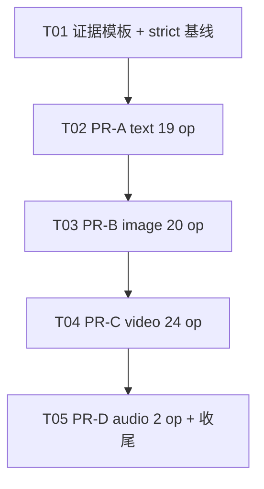

# 增量系统设计：模型证据补齐（Evidence Backfill）证据协议与分批任务分解 #530

> **2026-09-05 当前方法**：[模型合同文档优先方法修订](2026-09-05-model-contract-docs-first.md) 与 [模型 API 权威](../contracts/model-api-authority.md) 取代本文关于存在性、最小生成、边界探测、样本上限、真实执行和按执行翻转 `listed` 的可执行指令。本文保留原模型范围、历史快照与已发生执行；它们不得被当作当前输入合同。具体 EvoLink/APIMart 模型 API 文档未说明的字段、角色、数量、格式、时长和模式均为未知，不得猜测、试探或跨渠道借用。

> **文档地位**：L2 增量设计（Epic #463 / Issue #530）。**只描述相对 H2（#465 / PR #507 已合入 main）的增量**；契约 schema、listed 五元判定、dispositions 机器真源、Catalog v1.1 投影、facade fail-closed、`--strict` 红灯门禁以 H1/H2 文档为准，本文不推倒。
> **作者**：高见远（架构师） · 2026-09-05
> **工作树**：`omnimux-dsh-wt-model-evidence-backfill-530` / 分支 `agent/omnimux-model-evidence-backfill-issue-530`
> **术语**：`omnimux` 一律称**执行中枢**；禁止称「网关」。
> **当前边界**：本文件的 YAML 翻转和探测任务已由文档优先方法替代；本次只保留它们的历史范围。渠道合同、离线实现验证和历史真实执行分列，且本修订不改代码、YAML、目录状态或环境。

---

# Part A：系统设计

## 1. 历史实现方案（已替代，不可执行）

### 1.1 核心技术挑战与对策

| # | 难点 | #530 设计对策 |
|---|---|---|
| 530-C1 | **「证据够了」必须可照单执行**（US-530-2） | 沉淀**证据文件标准模板**（§3）：固定 frontmatter + 固定小节（existence / minimal / boundary / mime-size-duration / conclusion）。每个 op 一份独立文件，路径即身份：`docs/evidence/YYYY-MM-DD-model-<id>-<op>.md`。四要素缺一 → 该 op 不得 listed（机器已有 `evidence_missing_for_verified` 兜底 docUrl/verifiedAt，人审兜底四要素） |
| 530-C2 | **禁止跨模型挪用证据**（P0-2） | 一 op 一文件，文件名含 `<id>-<op>`；YAML `research.docUrl` 只能指向**本 op 自己的证据文件**。PR 审查逐键核对文件内实测 runtime ID 与 YAML 键一致；挪用 = 驳回。同族 SKU（gpt-image-2 ≠ gpt-image2-hd，seedance-2-0-fast ≠ seedance-2-0，veo-3.1 ≠ veo-3.1-fast）互不许背书 |
| 530-C3 | **Batch A 外不得共享证据** | Batch A 三键已 listed 的既有证据文件（`2026-08-14-video` / `2026-08-16-image` 等）**只允许**为其原覆盖的模型+op 继续引用；#530 新增的每一个 listed 键必须引用 #530 期间产生的 dated 证据文件（或按 P0-3 复用既有证据但 notes 注明覆盖缺口并补 dated 复核行）。**禁止**把 seedance 系证据挪给 kling/veo/wan，禁止 image 证据挪给 video |
| 530-C4 | **verified/live 只能逐 op 翻转，可审计** | YAML 变更规则（§4）：每批 PR 的 diff 中，每条 `research.status: verified` / `execution.status: live` 变更必须能在同 diff 内指出对应 `docUrl` + `verifiedAt` 行；**禁止**批量脚本翻转、禁止无证据字段的裸翻转。dispositions.json 仅允许更新 `evidence` / `notes` 字段，**不新增/删除处置行、不改处置枚举值** |
| 530-C5 | **「不接」也是交付，零悬挂**（P0-6 / G3） | draft/quarantine 的书面结论路径（§4.3）：探测后证据不足 → 保持 draft，dispositions `notes` 追加「YYYY-MM-DD 探测结论 + 缺哪项要素」，证据文件的 `conclusion` 小节写「不接 + 原因」。Issue 关闭条件 = 65 个候选 op 每个终态为「listed ∨ 书面不接」，**不是**全部 listed |
| 530-C6 | **listed 扩容可预测、可回归** | 每批 PR 描述必须声明**本批预期新 listed 键清单**；`node scripts/verify-model-contracts.mjs --strict --json` 的 `listedOperations` 增量必须与声明清单一键不差。指纹抖动可预期：每批合入后 `contentFingerprint` / catalog fingerprint 变化一次且仅一次 |
| 530-C7 | **批次独立可合、独立可回滚** | PR-A→B→C→D 顺序合入、不并发开 PR；批次间零代码耦合（都是数据文件）；回滚 = revert 该批 commit（YAML + evidence + dispositions notes），投影/facade/判定码全程不动，回滚零代码风险 |

### 1.2 框架与库选型（**零新增依赖**）

| 项 | 选型 | 理由 |
|---|---|---|
| 证据载体 | Markdown 文件（仓内 `docs/evidence/`） | 沿用既有证据仓约定（L3、Immutable Evidence）；diff 友好、PR 可审 |
| YAML 编辑 | 人工逐 op 编辑四份 `specs/*-models.yaml` | 禁止批量翻转脚本；每条变更逐行可审 |
| 校验 | 既有 `scripts/verify-model-contracts.mjs --strict --json` + `pnpm --filter omnimux test` | 门禁已建，本 Issue 只消费 |
| 探测手段 | 既有 `scripts/verify-omnimux-live.mjs` / curl / `omnimux tokens exec` 注入 key | 沿用 2026-08-14 证据的探测先例；**禁止**新增 npm 依赖、禁止把 key 写入仓库 |

### 1.3 模块边界（#530 增量视图）

```text
docs/evidence/
├─ _template-model-evidence.md            [#530 新增] 证据标准模板（§3）
├─ YYYY-MM-DD-model-<id>-<op>.md          [#530 新增×N] 每 op 一份证据（canonical 粒度）
└─ README.md                              [#530 修改] 索引新增 #530 批次行

plugins/omnimux/src/catalog/
├─ specs/text-models.yaml                 [#530 修改·PR-A] 19 op 逐键 verified/live 或留 draft
├─ specs/image-models.yaml                [#530 修改·PR-B] 20 op
├─ specs/video-models.yaml                [#530 修改·PR-C] 24 op
├─ specs/audio-models.yaml                [#530 修改·PR-D] 2 op
└─ contract/dispositions.json             [#530 修改] 仅 evidence/notes 字段；行数恒 43

docs/contracts/model-capabilities-matrix.md  [#530 修改] 每批合入后更新覆盖注记（P1-3）

【全程不动】contract/*.js、coverage.js、project.js、list.js、media/text catalog facade、
            scripts/verify-model-contracts.mjs、execute/mapper/protocol、cordis.patch.yml、
            plugins/omnimux-workflow/**
```

---

## 2. 历史文件列表（已替代，不可执行）

### 2.1 新建

| 路径 | 说明 |
|---|---|
| `docs/evidence/_template-model-evidence.md` | 证据文件标准模板（§3 全文）；下划线前缀表明非证据本体，不进证据索引矩阵 |
| `docs/evidence/2026-09-XX-model-<id>-<op>.md` × N | 每个拟 listed op 一份；文件名日期 = 实测日期 = YAML `verifiedAt` |
| `docs/specs/2026-09-05-model-evidence-backfill-design.md` | 本文件 |

### 2.2 修改

| 路径 | 说明 | 批次 |
|---|---|---|
| `plugins/omnimux/src/catalog/specs/text-models.yaml` | 11 model / 19 op 逐键补证翻转或留 draft | PR-A |
| `plugins/omnimux/src/catalog/specs/image-models.yaml` | 10 model / 20 op | PR-B |
| `plugins/omnimux/src/catalog/specs/video-models.yaml` | 10 model / 24 op | PR-C |
| `plugins/omnimux/src/catalog/specs/audio-models.yaml` | 2 model / 2 op | PR-D |
| `plugins/omnimux/src/catalog/contract/dispositions.json` | 仅 `evidence` / `notes` 字段随各批结论更新；**43 行结构不动** | PR-A–D |
| `docs/evidence/README.md` | 索引矩阵逐批登记新证据文件 | PR-A–D |
| `docs/contracts/model-capabilities-matrix.md` | 每批合入后更新覆盖注记 + updated 日期（P1-3） | PR-A–D 合入后 |
| `docs/specs/README.md` | 本 design 索引行（架构回合落盘） | 本回合 |

### 2.3 禁止修改

| 路径 | 原因 |
|---|---|
| `plugins/omnimux/src/catalog/contract/*.js`（coverage/index/dispositions.js/admission/status/load/schema/units/legacy-operation-map） | 判定码不动；本 Issue 纯数据迭代 |
| `plugins/omnimux/src/catalog/project.js` / `list.js` / `media/catalog.js` / `text/catalog.js` | 投影与 facade 不动；listed 变化自动反映 |
| `scripts/verify-model-contracts.mjs` | CLI 形状与 strict 语义不动 |
| 厂商 protocol / execute / mapper、`host/apply.js`、`cordis.patch.yml` 内容 | 执行码不动；whisper-1 / kling-avatar 缺口不在本 Issue 修 |
| `plugins/omnimux-workflow/**` | W1–W3 |
| H1/H2 PRD/design、#530 PRD | 架构不改 PM 文档 |

---

## 3. 历史证据模板（已替代，不可执行）（Evidence Protocol）

### 3.1 命名与身份

```text
docs/evidence/YYYY-MM-DD-model-<id>-<op>.md
  YYYY-MM-DD  = 实测日期（= YAML verifiedAt，禁止后填）
  <id>        = canonical runtime ID（alias 不单独出证据，归一到 canonical）
  <op>        = operation id（chat / vision_chat / text_to_image / multi_reference /
                text_to_video / first_frame / first_last_frame / video_multi_ref /
                text_to_music / text_to_speech …）
```

| 规则 | 说明 |
|---|---|
| 一 op 一文件 | 一份证据只证明它实测的 `<id>#<op>`；文件内 runtime ID 与 YAML 键必须一致 |
| alias 不出证据 | `nanobanana-2` 的证据写在 `nano_banana_2` 文件里，注明 wire alias 归一 |
| YAML 引用 | `research.docUrl` 指向本 op 自己的文件；`verifiedAt` = 文件日期 |
| 不可变 | 证据文件合入后只读（L3 Immutable）；复测出新结论 → 新日期新文件，旧文件不改 |

### 3.2 模板全文（即 `docs/evidence/_template-model-evidence.md` 的内容规约）

```markdown
---
title: "model evidence — <id>#<op> — YYYY-MM-DD"
id: "evidence-model-<id>-<op>-YYYYMMDD"
type: "evidence"
status: "accepted"
authority: "L3"
date: "YYYY-MM-DD"
authors: ["<实测者署名>"]
subsystem: "omnimux/catalog"
tags: ["model-evidence", "backfill-530", "<domain:text|image|video|audio>"]
---

# model evidence — <id>#<op> — YYYY-MM-DD

## 0. 身份（Identity）
| 字段 | 值 |
|---|---|
| runtime ID | `<canonical id>`（wire alias：`<alias 或无>`） |
| operation | `<op>` |
| 契约位置 | `plugins/omnimux/src/catalog/specs/<domain>-models.yaml` |
| 探测环境 | OS / Node 版本 / 是否 keyless / key 注入方式（`omnimux tokens exec <id>`，**禁止出现 key 值**） |
| 实测者 / 署名 | <人或 agent 署名> |

## 1. existence（存在性探针）
- 请求：<方法 + 端点 + 模型字段值；不含 key>
- 结果：HTTP 状态 / runtime 可达性结论（200 或等价；403/404 也须如实记录并进入 conclusion）
- 日志摘录：<10 行内>

## 2. minimal（最小生成）
- 最小输入：<实际提交的 prompt/参考资产清单>
- 结果：mode 字段（live/stub）、taskId/回包摘要、产物落盘路径或字节数
- 日志摘录：<回包关键字段；禁止 key>

## 3. boundary（输入数量与角色边界）
- slot 递增实测表：| slot | role | min 实测 | max 实测（拒绝点） | 拒绝时上游行为 |
- 未实测到拒绝点的维度须显式标注「未触达上限」

## 4. mime-size-duration（格式 / 体积 / 时长）
- allowedMimes 实测或官方文档来源（注明 URL 与访问日期）
- size 上限 / duration 上限：实测值 或 `policy_conservative`（注明理由）
- limitSource：每条上限标注 kind ∈ official_docs | live_probe | policy_conservative | runtime_reconciled

## 5. conclusion（结论，二选一）
- **可上架**：四要素齐全 → 建议 YAML 翻 `research: verified`（docUrl=本文件, verifiedAt=<date>）+ `execution: live`
- **不接**：缺哪项要素 / 阻塞原因（如无 key 待复测、上游 403、seam 未闭环）→ 保持 draft，dispositions notes 同步
```

### 3.3 四要素机器/人工分工

| 要素 | 机器兜底 | 人工审查 |
|---|---|---|
| docUrl + verifiedAt 存在且 dated | `evidence_missing_for_verified`（H1 已有，strict error） | — |
| 文件路径真实存在、frontmatter id 与 YAML 键一致 | 本 Issue 暂靠 PR 审查（见 §12-A3） | 逐键核对 |
| 四要素小节齐全、结论明确 | — | PR 审查勾选清单（§6.3） |
| 无跨模型挪用 | — | 核对文件内实测 ID == YAML 键的 model 部分 |

---

## 4. 历史 YAML 变更规则（已替代，不可执行）

### 4.1 verified/live 只能逐 op 改

```yaml
# 合法变更单元（示例：PR-A 中 claude-opus-5#chat 补 dated live 记录后）
research:
  status: "verified"              # draft → verified
  docUrl: "docs/evidence/2026-09-XX-model-claude-opus-5-chat.md"   # 必须同 diff 新增该文件
  verifiedAt: "2026-09-XX"        # = 证据文件日期
execution:
  status: "live"                  # stub → live；P0-7：必须有本 Issue 内 dated 真实调用记录
```

| 规则 | 说明 |
|---|---|
| 逐 op | 一次变更只翻转一个 `model#op`；PR diff 中每条 status 变更都能在**同 diff** 内找到对应新证据文件 |
| 禁批量脚本 | 禁止 sed/脚本批量 `draft→verified`；全部人工编辑 |
| live 双重要求 | `execution.status: live` 除 docUrl 外，证据文件 §2 minimal 必须有 `mode: "live"` 回包或等价真实调用记录（P0-7） |
| 冲突上限 | 无 dated 复测证据不得放宽 `policy_conservative` 值（Grok video max1 / Seedance multi-ref 等）；放宽必须附新 dated 证据文件 |

### 4.2 dispositions.json 变更白名单

| 允许 | 禁止 |
|---|---|
| `evidence[]` 追加新证据文件路径 | 新增/删除处置行（恒 43 行） |
| `notes` 追加 dated 探测结论 | 改 `id` / `disposition` / `target` 枚举值 |
| — | 改 `batch` 字段 |

### 4.3 draft / quarantine 的书面结论路径（不接也闭环）

1. 证据文件照模板写全，§5 conclusion 选「不接」并写明缺哪项要素/阻塞原因；
2. YAML 该 op **保持** `research: draft` / `execution: stub`，不动；
3. `dispositions.json` 对应行 `notes` 追加：`YYYY-MM-DD 探测：缺 <要素>（<原因>），保持 draft`；
4. quarantine 四 ID 本 Issue **不安排探测**（PRD P0-5），其书面结论沿用 H2 处置 reason，不新增证据文件；
5. whisper-1 / kling-avatar 保持 unavailable：seam/mapper 缺口属后续 Issue，任何证据都不得翻 listed。

---

## 5. 历史探测任务分解（已替代，不可执行）

> 每批 = 一个独立 PR，独立 `pnpm --filter omnimux test` + `--strict` 绿，独立回滚。批内「不接」不阻塞合入。允许批内按厂商拆子批（规则不变）。顺序合入 A→B→C→D，**不并发开 PR**（避免 YAML/dispositions 冲突与指纹抖动）。

### 5.1 PR-A · Text（11 model / 19 op）

| runtime ID | op | 探测要点 |
|---|---|---|
| `claude-opus-5` | `chat` | research 已 verified；补 dated live 调用（/v1/messages 200 复测）即可翻 execution live |
| `claude-opus-4-6` | `chat` · `vision_chat` | 四要素全补；vision 需 image 输入边界递增实测 |
| `gpt-5.6-sol` | `chat` · `vision_chat` | 同上 |
| `gpt-5.5` | `chat` · `vision_chat` | brand-four 已有 chat 线索（可按 P0-3 复用 + 补 dated 复核行）；vision 需独立 dated 图证据 |
| `grok-4.6` | `chat` · `vision_chat` | 四要素全补 |
| `kimi-k3` | `chat` · `vision_chat` | 四要素全补 |
| `deepseek-v4-pro` | `chat` | text-only（上游拒 image_url）；不声明 vision_chat |
| `deepseek-v4-flash-vision-exp` | `chat` · `vision_chat` | chat 可补；vision_chat 无独立 dated 图证据 → 可留 draft 并写不接结论 |
| `gemini-3.7-flash` | `chat` · `vision_chat` | vision 含 video 槽；slot 上限实测前维持 policy_conservative |
| `gemini-3.1-pro-preview` | `chat` · `vision_chat` | 四要素全补 |
| `glm-5.3` | `chat` | text-only（上游仅允许 text） |

### 5.2 PR-B · Image（10 model / 20 op）

| runtime ID | op | 探测要点 |
|---|---|---|
| `gpt-image-2` | `multi_reference` | t2i 已 listed；multi-ref 数量/角色边界递增实测；**禁止**用 t2i 证据顶替 |
| `grok-imagine-image` | `multi_reference` | 同上 |
| `gpt-image2-hd` | `text_to_image` · `multi_reference` | 独立 SKU，禁止借 gpt-image-2 证据 |
| `grok-imagine-image-quality` | `text_to_image` · `multi_reference` | 独立 SKU，同上 |
| `midjourney` / `midjourney-8.1` / `midjourney-7` / `midjourney-niji-7` | `text_to_image` · `multi_reference` ×4 | 四要素全补；无官方文档源时实测递增到拒绝点，测不出则 policy_conservative + 不接 |
| `nano_banana_2` | `text_to_image` · `multi_reference` | tokens-flow 403 史：先复通 existence 再谈生成；403 未解则 existence 即不接 |
| `nano_banana_pro` | `text_to_image` · `multi_reference` | 同上 |
| `seedream-5.0-pro` | `text_to_image` · `multi_reference` | 四要素全补 |
| `seedream-4.5` | `text_to_image` · `multi_reference` | 同上 |

### 5.3 PR-C · Video（10 model / 24 op）

| runtime ID | op | 探测要点 |
|---|---|---|
| `seedance-2-0-fast` | `first_frame` · `video_multi_ref` | t2v 已 listed；首帧/多参考独立探测；multi-ref 未实测前维持 max1 保守 |
| `seedance-2-5` | `text_to_video` · `first_frame` · `video_multi_ref` | 禁止借 seedance-2-0-fast 证据 |
| `seedance-2-0` | `text_to_video` · `first_frame` | 同上 |
| `seedance2.5-stable-max-720p` | `text_to_video` · `first_frame` | 独立 SKU；duration/分辨率上限实测 |
| `kling-v3` | `text_to_video` · `first_frame` · `first_last_frame` | 四要素全补 |
| `kling-v2-6` | `text_to_video` · `first_frame` · `first_last_frame` | 同上 |
| `veo-3.1` | `text_to_video` · `video_multi_ref` | 四要素全补 |
| `veo-3.1-fast` | `text_to_video` · `video_multi_ref` | 与 veo-3.1 分开处置，独立证据 |
| `grok-imagine-video-1-5` | `text_to_video` · `first_frame` · `video_multi_ref` | 参考图 max1 保守；dated 复测后才可放宽（P1-2） |
| `wan-3.0` | `text_to_video` · `first_frame` | 四要素全补 |

**本 Issue 不安排探测（锁定）**：`kling-avatar#digital_human`（unavailable：mapper 丢 audioTrack）；`kling-o1` / `kling-o3` / `kling-v3-motion-control` / `omni_flash`（quarantine）。

### 5.4 PR-D · Audio（2 model / 2 op）

| runtime ID | op | 探测要点 |
|---|---|---|
| `suno` | `text_to_music` | existence + 最小生成 + duration 上限实测 |
| `gpt-4o-mini-tts` | `text_to_speech` | existence + 最小生成 + 输入文本长度/MIME 边界 |

**锁定**：`whisper-1#speech_to_text`（unavailable：无 speechToText live seam）。

---

## 6. 历史 CI / 测试门禁（已替代，不可执行）

### 6.1 每批 PR 的硬门禁

```sh
pnpm --filter omnimux test                                  # 单测全绿
node scripts/verify-model-contracts.mjs --strict --json     # exit 0；报告留档进 PR 描述
pnpm verify:models                                          # keyless 自跳过须在 PR 记录
```

### 6.2 listed 数量按批可预测

| 批次 | 基线 listed | 本批上限（全补证成功的理论值） | PR 描述必须声明 |
|---|---|---|---|
| PR-A | 3 | 3 + 19 = 22 | 本批预期新 listed 键清单（逐键 `model#op`） |
| PR-B | 3 + A 实际 | + ≤20 | 同上 |
| PR-C | + B 实际 | + ≤24 | 同上 |
| PR-D | + C 实际 | + ≤2 | 同上 |

- `--strict --json` 的 `listedOperations` 与上一批基线的**差集**必须等于 PR 声明清单，一键不多一键不少；
- `forbiddenListed ∩ listedOperations = ∅` 恒成立（whisper-1 / kling-avatar / kling-o1 / kling-o3 / kling-v3-motion-control / omni_flash）；
- 实际 listed 少于上限不算失败（P0-6）；多于声明清单 = 审查驳回。

### 6.3 PR 审查勾选清单（每批）

- [ ] 每条 verified/live 翻转在同 diff 有对应新证据文件，文件名 `<id>-<op>` 与 YAML 键一致
- [ ] 证据四要素小节齐全；live 翻转的 minimal 小节有真实调用记录
- [ ] 无跨模型/跨模态/同族 SKU 挪用
- [ ] dispositions.json diff 只触及 evidence/notes
- [ ] `docs/evidence/README.md` 索引已登记；matrix 注记待合入后更新
- [ ] `--strict --json` 输出摘录 + listed 差集 == 声明清单

---

## 7. 依赖与风险

| 项 | 拍板 |
|---|---|
| npm 依赖 | **零新增**（沿用 H1 引入的 `yaml@^2.9.0`；探测用既有脚本与 curl） |
| 风险等级 | **R1**（每批均 R1）；`pre-authorized: false`；禁止 Agent enqueue |
| 合入 | 每批**人工合入**（老板）；顺序 A→B→C→D；前批合入 main 后下批 rebase 再开 |
| 环境 | **不写 Prod**；合入前不物化公共 45120；key 用 `omnimux tokens exec` 注入，禁止入仓 |
| R-1 无 key 环境 | 必须 live 的维度无 key → 该 op 留 draft + notes 写「待 key 复测」，不算阻塞（PRD Q1 默认假设） |
| R-2 上游 403/拒连（nano_banana tokens-flow 史、claude chat-completions group 403） | existence 即不接 → draft + 书面结论；禁止绕过 |
| R-3 指纹抖动 | 每批合入 fingerprint 变化一次属预期；消费方回归看四列表内容而非指纹值 |
| R-4 批次间冲突 | 不并发开 PR；dispositions.json 单行 notes 追加是主要冲突点，rebase 时逐行核 |

---

# Part B：任务分解

## 8. Required Packages

```
- （零新增）不引入任何新 npm 依赖
- 探测复用：scripts/verify-omnimux-live.mjs、curl、omnimux tokens exec
```

## 9. 历史任务列表（已替代，不可执行）

### T01 — 证据协议落盘与 strict 基线锁定

| 项 | 内容 |
|---|---|
| **Priority** | P0 |
| **Dependencies** | 无（H2 @ main 为基线） |
| **Source Files** | `docs/evidence/_template-model-evidence.md`（新）· `docs/evidence/README.md`（模板说明行）· 本 design（已落盘）· `docs/specs/README.md`（已落盘） |
| **交付** | §3 模板全文落为 `_template-model-evidence.md`；在 evidence README 登记模板与命名规约；记录 strict 基线快照（schemaVersion 1.1 / contentFingerprint `d5b707939b03f837` / listedOperations 3 键 / runtimeCount 43）进 PR-A 描述基线栏 |
| **独立验证** | 模板文件存在且含 §0–§5 全部小节；`node scripts/verify-model-contracts.mjs --strict --json` exit 0 且 listedOperations 仍为 3 键（基线未动） |

### T02 — PR-A：Text 19 op 补证与上架/不接闭环

| 项 | 内容 |
|---|---|
| **Priority** | P0 |
| **Dependencies** | T01 |
| **Source Files** | `plugins/omnimux/src/catalog/specs/text-models.yaml` · `plugins/omnimux/src/catalog/contract/dispositions.json` · `docs/evidence/2026-09-XX-model-<id>-<op>.md`（每个实测 op 一份）· `docs/evidence/README.md` |
| **交付** | §5.1 的 19 op 逐键探测；listed 翻转或书面不接；dispositions notes 同步；PR 描述附 listed 声明清单 + strict 摘录 |
| **独立验证** | `pnpm --filter omnimux test` 绿；`--strict --json` exit 0 且 listed 差集 == PR 声明清单；`forbiddenListed ∩ listed = ∅` |

### T03 — PR-B：Image 20 op 补证

| 项 | 内容 |
|---|---|
| **Priority** | P0 |
| **Dependencies** | T02 合入 main 后 rebase（顺序合入约束，非代码依赖） |
| **Source Files** | `specs/image-models.yaml` · `dispositions.json` · `docs/evidence/2026-09-XX-model-*.md` · `docs/evidence/README.md` |
| **交付** | §5.2 的 20 op；multi_reference 边界递增实测；nano_banana 系先 existence；同族 SKU 证据独立 |
| **独立验证** | 同 T02 门禁；nanobanana 无双列回归测试常绿 |

### T04 — PR-C：Video 24 op 补证

| 项 | 内容 |
|---|---|
| **Priority** | P0 |
| **Dependencies** | T03 合入后 rebase |
| **Source Files** | `specs/video-models.yaml` · `dispositions.json` · `docs/evidence/2026-09-XX-model-*.md` · `docs/evidence/README.md` |
| **交付** | §5.3 的 24 op（允许拆 C1/C2 子批）；Grok video max1 / Seedance multi-ref 保守值无 dated 复测不放宽 |
| **独立验证** | 同 T02 门禁；policy_conservative 上限未被无证据放宽（diff 审查） |

### T05 — PR-D：Audio 2 op 补证 + Issue 收尾

| 项 | 内容 |
|---|---|
| **Priority** | P0 |
| **Dependencies** | T04 合入后 rebase |
| **Source Files** | `specs/audio-models.yaml` · `dispositions.json` · `docs/evidence/2026-09-XX-model-*.md` · `docs/evidence/README.md` · `docs/contracts/model-capabilities-matrix.md` |
| **交付** | §5.4 的 2 op；whisper-1 保持 unavailable；matrix 覆盖注记全量更新（updated 日期）；核对 65 候选 op「listed ∨ 书面不接」零悬挂（530-D2） |
| **独立验证** | 同 T02 门禁；逐键终态审计表（65 行）附 PR 描述 |

```text
T01 ──► T02 ──► T03 ──► T04 ──► T05
（T02–T05 为合入顺序约束；代码上仅依赖 T01 模板，批间无耦合）
```

### 任务依赖图



## 10. Shared Knowledge（工程师共享约定）

```
1. 执行中枢 = omnimux；禁止称「网关」。
2. 纯数据迭代：只动 specs/*-models.yaml 的 op 状态与证据字段、dispositions.json 的
   evidence/notes、docs/evidence/ 新增 dated 证据；判定码/执行码/投影码/workflow 零改动。
3. 证据单位 = docs/evidence/YYYY-MM-DD-model-<id>-<op>.md；一 op 一文件；
   YAML docUrl 只能指向本 op 自己的文件；verifiedAt = 文件日期。
4. 四要素缺一不得 listed：existence / minimal / boundary / mime-size-duration。
5. verified/live 只能逐 op 人工翻转；禁止批量脚本；live 必须有本 Issue 内 dated
   真实调用记录（minimal 小节 mode:"live" 或等价）。
6. Batch A 外不得共享证据：禁止 seedance 系→kling/veo/wan，禁止 image→video，
   禁止同族 SKU 互背书（gpt-image-2 ≠ gpt-image2-hd；seedance-2-0-fast ≠ seedance-2-0；
   veo-3.1 ≠ veo-3.1-fast）。
7. 锁定集合不动：whisper-1 / kling-avatar unavailable；quarantine 四 ID 不接不探测；
   nanobanana hyphen 只作 alias 不双列。
8. 不接也闭环：draft + dispositions notes 写 dated 探测结论；严禁为凑全量标 verified。
9. 冲突上限无 dated 复测不放宽（policy_conservative 维持）。
10. 每批门禁：pnpm --filter omnimux test + verify-model-contracts --strict --json 绿；
    listed 差集 == PR 声明清单；forbiddenListed ∩ listed = ∅。
11. 零新增 npm 依赖；key 用 omnimux tokens exec 注入，禁止入仓。
12. R1；批批人工合入；A→B→C→D 顺序不并发；不写 Prod；合入前不物化 45120。
```

## 11. Anything UNCLEAR / 待明确事项

| # | 项 | 假设 / 处理 |
|---|---|---|
| A1 | PRD §8 批次证据文件命名（`2026-09-XX-omnimux-<domain>-backfill.md`）与本设计 per-op 文件（`YYYY-MM-DD-model-<id>-<op>.md`）的关系 | **本设计以 per-op 文件为 canonical**（主理人指令优先，且满足 P0-2 逐键核对）；若 PM 仍要批次聚合文件，可作指向 per-op 文件的索引页，不改变 YAML docUrl 指向。**建议 PRD 下一修订版对齐命名** |
| A2 | 探测是否需要 live key、无 key 环境 | 沿用 PRD Q1 默认：keyless 可做 existence/文档核查；必须 live 的维度无 key → draft + 「待 key 复测」 |
| A3 | 证据文件路径存在性、frontmatter id 与 YAML 键一致性的**机器**校验 | 本 Issue 靠 PR 人工审查；若后续要机器化，属 coverage 校验扩展的新 Issue（本 Issue 禁改 contract/*.js） |
| A4 | 批内子批拆分粒度（如 PR-C1/C2） | 由工程按实际探测量决定；规则不变（顺序、独立绿、声明清单） |
| A5 | claude-opus-5#chat 的 live 复测 | chat-completions group 403 史：若复测仍 403，execution 保持 stub + notes，research verified 不受影响 |
| A6 | midjourney 系四 SKU 无官方文档源 | PRD Q4 默认：实测递增到拒绝点；测不出 → policy_conservative + 不接 |
| A7 | 证据文件 frontmatter `status: "accepted"` | 沿用既有证据仓惯例（证据即事实记录，无 proposed 态）；如 docs 治理规范另有要求以 L1 治理文档为准 |
| A8 | 本 design status | proposed；随 PRD 评审一并转 accepted 后工程动工（530-D1） |

---

**文档结束（高见远 · 架构师 · 2026-09-05 · #530 增量 · status: proposed）**
