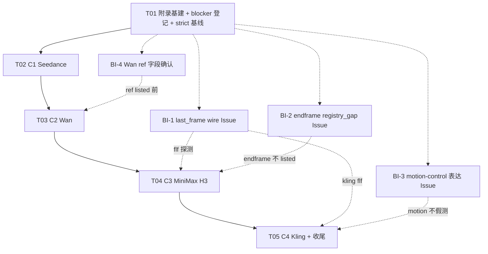

# 增量设计附录：#530 视频 C1–C4 证据补齐与上架

> **2026-09-05 当前方法**：[模型合同文档优先方法修订](2026-09-05-model-contract-docs-first.md) 与 [模型 API 权威](../contracts/model-api-authority.md) 取代本文关于存在性、最小生成、边界探测、样本上限、真实执行和按执行翻转 `listed` 的可执行指令。本文保留原模型范围、历史快照与已发生执行；它们不得被当作当前输入合同。具体 EvoLink/APIMart 模型 API 文档未说明的字段、角色、数量、格式、时长和模式均为未知，不得猜测、试探或跨渠道借用。

> **文档地位**：L2 增量设计 **附录**（Epic #463 / Issue #530 · 视频增量）。相对 `2026-09-05-model-evidence-backfill-prd.md` / `...-design.md` 的 **PR-C 视频批局部修订与细化**；不推倒 H1/H2 五元判定与 schema。
> **作者**：高见远（架构师） · 2026-09-05
> **输入**：许清楚 #530 视频增量范围结论（产品已锁定 C1–C4）
> **术语**：`omnimux` = **执行中枢**；禁止称「网关」。
> **当前范围**：C1–C4 和 YAML/dispositions 变更是历史计划，不能执行。视频模式及输入限制以渠道官方 API 文档为准；离线验证与历史真实执行另行记录，本修订不改目录状态。

---

## 0. 对 PRD / design 的局部修订声明（必读）

本附录下列 C1–C4 行保留原模型范围和架构背景，但其中探测、样本、限额、执行状态与上架指令均已替代。渠道文档未说明的模式或字段为未知，不得用这些行补齐。

| # | 原约束（PRD/design） | 本附录修订 | 生效范围 |
|---|---|---|---|
| R-A | dispositions **43 行恒定**；「不新增/删除处置行」 | **允许**为 C1–C4 **新 runtime ID** 追加 dispositions 行与 YAML `models[]` 行；alias/既有行仍禁止无故删除。行数从 43 **单调增至** `43 + Δ_new_runtime`（Δ 以实际合入的新 ID 为准）。配套单测/coverage 中写死 `43` 的断言须随批改为「≥ 基线且与 dispositions 同步」 | C1–C4 全批 |
| R-B | `kling-avatar` **unavailable**、执行不闭环、本 Issue 不探测 | **#538 后** `audioTrack` 透传 + `videoDigitalHuman` profile 已 live → 处置为 **draft-probeable**；允许 C4 探测；**无 dated 证据仍不得 listed** | C4 |
| R-C | `kling-o3` / `kling-v3-motion-control` **quarantine 且本 Issue 不安排探测** | 改为：**可探测**，但**默认保持 quarantine**（探测成功也**不自动 listed**）；仅当产品二次放行 + dated 证据齐全时才允许 disposition 降级为 draft/canonical 并逐 op 上架。默认路径 = 探测记录 + notes，**listed 增量变量默认不含二者** | C4 |
| R-D | PR-C 视频 24 op / 10 model 固定清单 | 视频主路径改为本附录 **C1–C4 锁定 ID 集合**；原清单中的 veo / grok / `seedance2.5-stable-max-720p` 等 **不在本附录交付面**（可另开批或保持 draft） | 本附录 |
| R-E | #530「判定码/执行码零改动」 | **数据面**仍优先零改；但若执行层**无法表达**某 wire（见 §5），必须在探测前开 **执行层前置 Issue**，**禁止假测**。前置 Issue **不是**本附录合入内容，但是 C 批 blocker | 执行缺口 |
| R-F | bare / 粗粒度 ID 策略未写 H3 | **`minimax-h3`（无后缀）只作「不接」结论**，禁止 generation listed；合法 wire 仅 `minimax-h3-t2v` / `flf` / `fl2va` / `endframe` 四个 | C3 |
| R-G | `end_frame` 语义 | 若 17-op `operation-registry` **无**独立 end-frame 语义，**禁止**把 endframe 污染映射为 `first_frame`；保持 **draft + registry_gap**，**另开 Issue** 扩 registry/profile 后再证 | C3 |

> **原则金句（视频附录）**：**listed 的唯一瓶颈仍是证据**；**新 runtime 可以进表，但进 listed 必须过探针**；**执行层表达不了的 op，先开 Issue，不许用 stub 回包装 listed**。

---

## 1. 产品锁定范围（C1–C4）

### 1.1 ID 全集与处置初态

| 批 | runtime ID | 仓内现状（2026-09-05 strict） | 目标处置初态 | 备注 |
|---|---|---|---|---|
| **C1** | `seedance-2-0` | YAML 有 · disposition canonical · ops draft | 保持 canonical；逐 op 补证 | 禁借 fast 证据 |
| **C1** | `seedance-2-0-fast` | YAML 有 · **t2v 已 listed** · ff/multi draft | canonical；补 `first_frame` / `video_multi_ref` | t2v 不重复 listed |
| **C1** | `seedance-2-0-mini` | **无 YAML / 无 disposition** | **新增** draft→canonical（existence 后） | 官方 updates 在列 |
| **C1** | `seedance-2-5` | YAML 有 · canonical · draft | 逐 op 补证 | 禁借 2-0-fast |
| **C2** | `wan-3.0` | YAML 有 · canonical · draft | 逐 op 补证 | t2v + first_frame |
| **C2** | `wan-3.0-prime` | **无** | **新增** draft | wire 名以 live pricing/docs 钉死 |
| **C2** | `wan-3.0-ref` | **无** | **新增** draft | 参考路径；op 候选 `video_multi_ref` |
| **C2** | `wan-3.0-prime-ref` | **无** | **新增** draft | prime+ref 组合 SKU |
| **C3** | `minimax-h3-t2v` | **无** | **新增** draft | 官方 docs 独立 model 页 |
| **C3** | `minimax-h3-flf` | **无** | **新增** draft | first/last-frame style I2V |
| **C3** | `minimax-h3-fl2va` | **无** | **新增** draft | FL2VA-oriented path |
| **C3** | `minimax-h3-endframe` | **无** | **新增** draft + **registry_gap 风险** | 不得映射 dirty first_frame |
| **C3** | `minimax-h3`（bare） | **无** | **不接**（disposition notes 或 draft 且禁止 listed） | **禁止 generation listed** |
| **C4** | `kling-v2-6` | YAML 有 · canonical · draft | 逐 op 补证 | t2v / ff / flf |
| **C4** | `kling-v3` | YAML 有 · canonical · draft | 逐 op 补证 | 同上 |
| **C4** | `kling-avatar` | YAML 有 · **draft-probeable**（#538） | draft；探测后可 digital_human listed | 走 `videoDigitalHuman` |
| **C4** | `kling-o3` | YAML 有 · **quarantine** | **默 quarantine**；可探测不自动 listed | 二次放行另议 |
| **C4** | `kling-v3-motion-control` | YAML 有 · **quarantine** | **默 quarantine**；可探测不自动 listed | 执行表达见 §5 |

**本附录明确不交付（保持原状）**：`veo-3.1` / `veo-3.1-fast` / `grok-imagine-video-1-5` / `seedance2.5-stable-max-720p` / `kling-o1` / `omni_flash`（后两者继续 quarantine 且**默认不探测**，除非产品另令）。

### 1.2 候选 operation 映射（契约层）

> 下表为 **契约候选**；最终 listed 键 = 探测成功集合变量 `S_listed`，**禁止**在 PR 描述里写成「必然 +N」。

| ID | 候选 op | profileId | seam | slots 要点 | limitSource 初值 |
|---|---|---|---|---|---|
| `seedance-2-0` | `text_to_video` · `first_frame` | `videoGenerate` | `videoGenerate` | prompt；start_frame role=`first_frame` | official_docs / policy_conservative |
| `seedance-2-0-fast` | `first_frame` · `video_multi_ref`（t2v 已 listed） | 同上 | 同上 | multi-ref **max1 保守**至 dated 放宽 | policy_conservative |
| `seedance-2-0-mini` | `text_to_video` · `first_frame`（若上游支持） | 同上 | 同上 | 成本向；duration/分辨率取更严 | policy_conservative |
| `seedance-2-5` | `text_to_video` · `first_frame` · `video_multi_ref` | 同上 | 同上 | 禁 first_last_frame（家族铁律） | official_docs + conservative multi |
| `wan-3.0` | `text_to_video` · `first_frame` | 同上 | 同上 | sound 可选 | official_docs |
| `wan-3.0-prime` | `text_to_video` · `first_frame`? | 同上 | 同上 | **existence 先钉 wire** | policy_conservative |
| `wan-3.0-ref` | `video_multi_ref`（± t2v） | 同上 | 同上 | reference_images；max 保守 | policy_conservative |
| `wan-3.0-prime-ref` | `video_multi_ref`（± t2v） | 同上 | 同上 | 同上 | policy_conservative |
| `minimax-h3-t2v` | `text_to_video` | 同上 | 同上 | **model 字段=完整 wire id** | official_docs |
| `minimax-h3-flf` | `first_last_frame` | 同上 | 同上 | first+last；**依赖 last_frame wire** | official_docs |
| `minimax-h3-fl2va` | `first_frame` 或专用（见 §5） | 同上 | 同上 | 图生视频路径；以官方页为准 | official_docs |
| `minimax-h3-endframe` | **不进 registry 既有 op 脏映射** | — | — | **draft + registry_gap**；另开 Issue | — |
| `minimax-h3` bare | — | — | — | **不接**；notes 写明 | — |
| `kling-v2-6` / `kling-v3` | `text_to_video` · `first_frame` · `first_last_frame` | `videoGenerate` | `videoGenerate` | last_frame slot；**依赖执行层 last_frame** | official_docs |
| `kling-avatar` | `digital_human` | **`videoDigitalHuman`** | `videoGenerate` | avatar_image + audio_track；**禁**借粗 videoGenerate listed | official_docs |
| `kling-o3` | 契约已有 t2v/flf 占位 | none（quarantine） | — | 默 quarantine | policy_conservative |
| `kling-v3-motion-control` | 占位 ops 不足表达运镜 | none / 待 profile | — | **执行前置 Issue**；默 quarantine | policy_conservative |

### 1.3 legacy / registry 别名（只读映射，不新增机器真源）

| 上游/历史别名 | MCC op | 说明 |
|---|---|---|
| `t2v` | `text_to_video` | 已有 |
| `i2v` | `first_frame` | 已有；**不得**用于 endframe |
| `flf` | `first_last_frame` | 已有；H3-flf / Kling flf 共用语义 |
| `avatar` | `digital_human` | 已有 |
| `endframe` / `end_frame` | **无** | **registry_gap** → 另开 Issue，禁止塞进 `first_frame` |
| `fl2va` | 待官方语义钉死 → 暂候选 `first_frame` 或新 op | 若仅「图生」可暂 `first_frame`；若含音频/多模态超出现有 slots → registry_gap |
| `motion` / `motion_control` | **无** | motion-control 专用输入未建模 |

当前 `operation-registry.json` **17 op**（含 video：`text_to_video` · `first_frame` · `first_last_frame` · `video_multi_ref` · `digital_human` · `video_edit`）。**本附录默认不扩 registry**；缺口走 draft+Issue。

---

## 2. 每个 ID 的 contract / disposition 变更路径

### 2.1 变更类型图例

| 代号 | 含义 |
|---|---|
| **Y-mod** | 修改已有 `video-models.yaml` 行（op 状态 / inputs / research·execution） |
| **Y-new** | 新增 YAML `models[]` 行 |
| **D-mod** | 修改 dispositions 行（evidence / notes；必要时 disposition 枚举仅按产品放行） |
| **D-new** | **新增** dispositions 行（修订 R-A） |
| **E-new** | 新增 `docs/evidence/YYYY-MM-DD-model-<id>-<op>.md` |
| **X-block** | 执行层前置 Issue（探测前必须存在，即使仅文档 Issue） |
| **R-gap** | registry 语义缺口，保持 draft，另开 Issue |

### 2.2 逐 ID 路径表

| ID | YAML | Disposition | 证据 | profile / seam | 前置 |
|---|---|---|---|---|---|
| `seedance-2-0` | Y-mod：ops 补 research/execution | D-mod notes/evidence | E-new × 成功 op | videoGenerate | — |
| `seedance-2-0-fast` | Y-mod：仅未 listed ops | D-mod | E-new × ff / multi | videoGenerate | multi max1 不放宽无证 |
| `seedance-2-0-mini` | **Y-new** | **D-new** draft/canonical | E-new | videoGenerate | existence 钉 ID |
| `seedance-2-5` | Y-mod | D-mod | E-new | videoGenerate | — |
| `wan-3.0` | Y-mod | D-mod | E-new | videoGenerate | — |
| `wan-3.0-prime` | **Y-new** | **D-new** | E-new | videoGenerate | existence；wire 名确认 |
| `wan-3.0-ref` | **Y-new** | **D-new** | E-new | videoGenerate | ref 字段是否=reference_images |
| `wan-3.0-prime-ref` | **Y-new** | **D-new** | E-new | videoGenerate | 同上 |
| `minimax-h3-t2v` | **Y-new** | **D-new** | E-new | videoGenerate | model 字段完整 id |
| `minimax-h3-flf` | **Y-new** | **D-new** | E-new | videoGenerate | **X-block: last_frame wire** |
| `minimax-h3-fl2va` | **Y-new** | **D-new** | E-new | videoGenerate | 语义确认；可能 X-block |
| `minimax-h3-endframe` | **Y-new**（draft only） | **D-new** draft + notes registry_gap | 可选 existence-only E | **不挂 live listed** | **R-gap + Issue** |
| `minimax-h3` bare | 不建 generation 契约行 **或** 仅 disposition | **D-new** 不接 / 或 notes | 书面不接 | — | 禁止 listed |
| `kling-v2-6` | Y-mod | D-mod | E-new | videoGenerate | **X-block: last_frame**（flf op） |
| `kling-v3` | Y-mod | D-mod | E-new | videoGenerate | 同上 |
| `kling-avatar` | Y-mod：research/execution 翻转条件 | D-mod（draft→可 canonical） | E-new digital_human | **videoDigitalHuman** / videoGenerate | #538 已满足；测音频 |
| `kling-o3` | Y-mod 仅 notes 级 / 保持 execution none | D-mod notes；**disposition 保持 quarantine** | 可选探测 E（不驱动 listed） | none | 默不 listed |
| `kling-v3-motion-control` | 占位保持 | quarantine + notes | 可选探测 E | 待 profile | **X-block motion 表达** |

### 2.3 dispositions 行数演进（变量）

```text
N0 = 43                                          # 本附录起点（strict 基线）
N1 = N0 + |{seedance-2-0-mini}|                  # C1 新 runtime
N2 = N1 + |{wan-3.0-prime, wan-3.0-ref, wan-3.0-prime-ref}| # C2（existence 成功才入表；失败则不 D-new）
N3 = N2 + |{minimax-h3-t2v, flf, fl2va, endframe}| [+ optional bare 不接行]
N4 = N3                                          # C4 无新 ID（均已在表）
```

- **入表 ≠ listed**：D-new/Y-new 只解决 coverage；listed 仍五元 + 证据。
- bare `minimax-h3`：若 runtime 宇宙将来出现该 id，必须有 disposition「不接」以免 coverage_missing；**不得**因此获得 listed op。
- 单测：`dispositions.test.js` / `coverage.test.js` 中 `assert.equal(..., 43)` 改为与 `dispositions.json.length` 同源或「基线快照常量」按批更新——**属 C1 基建任务允许的测试修订**，仍禁止改判定语义。

---

## 3. 历史 C1–C4 任务与 listed 计划（已替代，不可执行）

### 3.1 任务列表（硬上限 5 · 按批分组）

> 符合架构任务分解硬限：≤5 任务；每任务 ≥3 相关文件；T01 基础设施；批间尽量只顺序依赖 T01/前批合入。

#### T01 — 视频附录基建 + 执行层缺口登记 + strict 基线

| 项 | 内容 |
|---|---|
| **Priority** | P0 |
| **Dependencies** | 无（main / #530 工作树） |
| **Source Files** | 本文件 · `docs/specs/README.md`（索引） · `docs/evidence/_template-model-evidence.md`（复用，不改语义） · （可选）`docs/evidence/README.md` 登记 C1–C4 索引区 · **执行层前置 Issue 正文**（GitHub，非必落仓） |
| **交付** | ① 冻结 strict 快照：listed=3 键、runtimeCount=43、fingerprint 记录进 PR 描述；② 登记 §5 blocker 清单（BI-1…BI-n）为 Issue 链接；③ 明确 R-A…R-G 修订对工程生效；④ 探针素材目录约定（§4.3） |
| **独立验证** | `--strict --json` exit 0 且 listed 仍 3；本文落盘；blocker Issue 已开或明确「C1 仅 t2v/ff 可先探、flf 延后」 |

#### T02 — C1 Seedance（`2-0` / `2-0-fast` / `2-0-mini` / `2-5`）

| 项 | 内容 |
|---|---|
| **Priority** | P0 |
| **Dependencies** | T01 |
| **Source Files** | `plugins/omnimux/src/catalog/specs/video-models.yaml` · `plugins/omnimux/src/catalog/contract/dispositions.json` · `docs/evidence/YYYY-MM-DD-model-seedance-*-*.md` · `docs/evidence/README.md` · （若改行数断言）`dispositions.test.js` / `coverage.test.js` |
| **交付** | mini 入表（Y-new+D-new）；四 ID 逐 op 探测；成功键 listed；失败书面不接；multi-ref 无证不放宽 max1；**Seedance 禁 first_last_frame** 回归保持 |
| **回滚边界** | revert C1 commit(s) → YAML/disp/evidence 回退；listed 回到批前；不影响 text/image |
| **listed 增量** | `Δ_C1 ⊆ S_C1_success`（变量，见 §3.3） |

#### T03 — C2 Wan（`wan-3.0` / `wan-3.0-prime` / `wan-3.0-ref` / `wan-3.0-prime-ref`）

| 项 | 内容 |
|---|---|
| **Priority** | P0 |
| **Dependencies** | T02 合入 main 后 rebase |
| **Source Files** | `video-models.yaml` · `dispositions.json` · `docs/evidence/YYYY-MM-DD-model-wan-*.md` · `docs/evidence/README.md` · 测试断言行数 |
| **交付** | `wan-3.0` 补证；`wan-3.0-prime`/`wan-3.0-ref`/`wan-3.0-prime-ref` existence→入表→op 探测；ref 类确认 mapper `reference_images` 可表达，否则 **X-block 后不 listed** |
| **回滚边界** | revert C2 only；C1 listed 保留 |
| **listed 增量** | `Δ_C2 ⊆ S_C2_success` |

#### T04 — C3 MiniMax H3（四 wire + bare 不接）

| 项 | 内容 |
|---|---|
| **Priority** | P0 |
| **Dependencies** | T03 合入后 rebase；**BI-1（last_frame）对 flf 为硬依赖**；endframe 不依赖 BI-1（直接 R-gap） |
| **Source Files** | `video-models.yaml` · `dispositions.json` · `operation-registry.json`（**默认不改**；若另 Issue 合入后可引用） · evidence · README |
| **交付** | 四 wire Y-new+D-new；t2v 可探测；flf 仅在 last_frame 可表达后探测；fl2va 按语义；endframe **draft+registry_gap+Issue**；bare **不接**书面结论；**禁止** bare 与 endframe 脏 listed |
| **回滚边界** | revert C3；C1/C2 保留 |
| **listed 增量** | `Δ_C3 ⊆ S_C3_success`（**默认期望含 t2v，可能含 flf/fl2va；默认不含 endframe/bare**） |

#### T05 — C4 Kling（`v2-6` / `v3` / `avatar` / `o3` / `v3-motion-control`）

| 项 | 内容 |
|---|---|
| **Priority** | P0 |
| **Dependencies** | T04 合入后 rebase；flf 依赖 BI-1；motion 依赖 BI-motion；avatar 无新执行 blocker（#538 已修） |
| **Source Files** | `video-models.yaml` · `dispositions.json` · evidence · README · `docs/contracts/model-capabilities-matrix.md`（覆盖注记） |
| **交付** | v2-6/v3 逐 op；avatar digital_human 独立证据；o3/motion **探测可选、默认 quarantine、不进声明 listed 清单**；矩阵注记更新；附录范围「listed ∨ 书面不接」闭环 |
| **回滚边界** | revert C4；C1–C3 保留 |
| **listed 增量** | `Δ_C4 ⊆ S_C4_success \ {kling-o3#*, kling-v3-motion-control#*}`（默认） |

### 3.2 依赖图



### 3.3 预期 listed 增量（**变量，非预设常数**）

定义探测成功键集合：

```text
S_batch = { "<id>#<op>" | 四要素齐全 ∧ research=verified ∧ execution=live
            ∧ profile 相容 ∧ gate ∧ 非 forbiddenListed ∧ 非默认 quarantine 锁 }
Δ_batch = S_batch \ listed_before_batch
```

| 批 | `listed_before` | 声明方式 | 理论上界（仅作容量，**不是承诺**） |
|---|---|---|---|
| C1 | 3 + 既有非视频批 | PR 描述贴 `Δ_C1 = S_C1` 实表 | seedance 系未 listed op 全成功时的上界 |
| C2 | 3 + ΣΔ 前批 | 同上 | wan 四 ID 候选 op 全成功上界 |
| C3 | … | 同上；**显式排除** bare 与 endframe | H3 t2v/flf/fl2va 上界 |
| C4 | … | 同上；**显式排除** o3/motion 除非产品二次放行 | v2-6/v3/avatar 上界 |

**验收**：`--strict --json` 的 `listedOperations` 与批前差集 **==** PR 声明的 `Δ_*`；多出 = 驳回；少于上界 = 合法（不接/失败）。

### 3.4 回滚边界（统一规则）

| 规则 | 说明 |
|---|---|
| 批 = 回滚单位 | 一 Git revert 还原该批 YAML + dispositions + evidence + 测试行数常量 |
| 禁止跨批 revert 依赖 | C2 不依赖 C1 代码，仅依赖合入顺序；回滚 C2 不毁 C1 listed |
| 判定/投影码 | 默认不动；若某批为通过行数断言改了 test 期望值，revert 一并回退 |
| 执行层 Issue | **独立生命周期**；视频数据批 revert **不**自动关执行 Issue |

---

## 4. 历史探针请求矩阵（已替代，不可执行）

### 4.1 通用协议（继承 design §3）

- 证据路径：`docs/evidence/YYYY-MM-DD-model-<id>-<op>.md`（模板 `_template-model-evidence.md`）
- 四要素：existence / minimal / boundary / mime-size-duration
- key：仅 `omnimux tokens exec`（§6）；日志禁止 key
- 一 op 一文件；同族 SKU 禁互背书（`seedance-2-0-fast` ≠ `seedance-2-0` ≠ `mini` ≠ `2-5`）

### 4.2 最小请求矩阵（按 op）

| op | 最小请求（逻辑字段） | 成功判据 | 边界递增 |
|---|---|---|---|
| `text_to_video` | `{ model, prompt, duration: min, aspect_ratio?, resolution?: low }` | HTTP 接受 + task 终态成功或等价 live 回包；`mode`≠stub 冒充 | duration 档位；非法 ratio；空 prompt |
| `first_frame` | prompt + **一张** first_frame 图 → mapper 期望 `image` | live 产物 | MIME 切换；缺图拒绝；+第二张是否误进 ref |
| `first_last_frame` | prompt + first + **last** | **仅当** mapper 能表达 last；否则 **停测记 X-block** | 缺 last；两图对调 |
| `video_multi_ref` | prompt + 1× reference | `reference_images:[{url}]`；无 `image` 并存 | 2..n 直到拒绝；记录 max |
| `digital_human` | avatar 图 + **audioTrack**；model=`kling-avatar` | audioTrack 透传；live | 无音频拒绝；非法 MIME；时长上限 |
| H3 wire ids | **model=完整 id**（如 `minimax-h3-t2v`）+ 该 wire 文档最小体 | 与上面对应 op 相同 | bare `minimax-h3` 应失败或 不作为 generation 成功 |
| motion-control | **禁止**在 BI-3 关闭前构造「成功」证据 | — | — |
| endframe | existence 可选；**禁止**用 first_frame 体假测成功 | 保持 draft | — |

### 4.3 测试素材要求

| 类别 | 要求 | 用途 |
|---|---|---|
| **文本** | 短 prompt（≤50 字）中英各 1；空串 / 超长 1 | t2v / 全 op |
| **静帧图** | PNG / JPEG / WebP 各 ≥1；边长建议 512–1280；体积 < 契约 maxSizeMb | first_frame / multi_ref / avatar 脸图 |
| **首尾帧对** | 同分辨率 PNG 对 ×2（场景连续）；故意不一致对 ×1 | flf |
| **多参考** | 3–8 张主体/风格图（WebP/JPEG 混） | video_multi_ref / wan-3.0-ref |
| **Avatar 音频** | MP3 / WAV / M4A；3–10s 人声；另备 >60s 与坏 MIME | digital_human |
| **时长/大小/数量** | duration 最小档优先（成本）；图接近 maxSizeMb 的 1 张；ref 数量爬升脚本记录 | boundary / mime-size-duration |
| **存放** | 本地未跟踪目录或 `docs/evidence/fixtures/video-530/`（**无版权风险的自备/生成图**；禁止提交密钥与用户隐私） | 可复现 |

### 4.4 成本与超时（与 §6 衔接）

| 项 | 默认 |
|---|---|
| duration | 各模型 **最小档**（如 4s/5s） |
| resolution | 最低可用（720P 优先） |
| 并发 | **串行** per model，避免配额打爆 |
| 任务超时 | submit 30s；poll 单任务 **≤ 6 min**；批总墙钟按 ID 预算 |
| 取消/清理 | 超时后停止 poll；记录 taskId；本地临时文件删；**不**保证上游 cancel API 必有 |
| 失败重试 | existence 网络错误 ≤2；业务 4xx **不重试**当成功 |

---

## 5. 现有 video executor 表达力审计（假测禁令）

### 5.1 现状摘要（主仓只读结论）

| 能力 | 现状 | 代码锚点 |
|---|---|---|
| t2v | ✅ `prompt` + duration/aspect/resolution | `mapOmnimuxInput('video')` |
| first_frame | ✅ `role===first_frame` → `input.image` | 同上 |
| multi_ref | ✅ 非 first_frame 图 → `reference_images[{url}]` | 同上 |
| last_frame / flf | ❌ **无** `last_frame` → 独立 wire 字段；last 图若当「other image」会进 `reference_images` 或被 first 抢占，**语义错误** | `vendors/omnimux.js` |
| digital_human audio | ✅ 仅 `DIGITAL_HUMAN_MODEL_IDS=['kling-avatar']` 透传 `audioTrack` | #538 |
| end_frame only | ❌ registry 无 op；mapper 无 end 字段 | registry 17 op |
| motion-control | ❌ 无轨迹/驱动视频 slots；无专用 profile | YAML 占位用 flf **名不副实** |
| H3 四 wire | ⚠️ 作为 **独立 model id** 走同一 `videoGenerate` 可提交；**op 语义**仍受上表限制 | 官方 updates / llms.txt |
| Wan ref | ⚠️ 若上游就是 `reference_images`，现 mapper 可能够；若为独立字段 → 缺口 | 待 BI-4 |

### 5.2 执行层前置 Issue 清单（探测前）

| ID | 标题意向 | 阻塞对象 | 不做的后果 |
|---|---|---|---|
| **BI-1** | video mapper 表达 `last_frame`（flf） | `minimax-h3-flf` · `kling-v*#first_last_frame` | 假 ref 或丢尾帧 → **禁止测 flf 当成功** |
| **BI-2** | registry + 契约 `end_frame`（或官方等价 op） | `minimax-h3-endframe` listed | 污染 first_frame → **驳回** |
| **BI-3** | motion-control 输入模型 + profile/seam | `kling-v3-motion-control` 真探针 | 用 t2v/flf 冒充 → **禁止** |
| **BI-4** | Wan prime/ref 请求体字段与 mapper 对齐 | `wan-3.0-ref` / `wan-3.0-prime-ref` listed | 字段静默丢弃 → 假绿 |
| **BI-5** |（可选）fl2va 若超越 first_frame 语义 | `minimax-h3-fl2va` | 错 op 上架 |

**规则**：对应 BI **未关闭**（或未提供经 QA 认可的临时探针通道）时，该 op **只能** existence 级记录或书面不接，**不得** `execution: live` / listed。

### 5.3 H3 四 wire 与「能否表达」对照

| Wire | 执行层能否诚实探测 | 结论 |
|---|---|---|
| `minimax-h3-t2v` | ✅ t2v 路径 | 可进 C3 主探测 |
| `minimax-h3-flf` | ❌ 缺 last_frame 前 | **等 BI-1** |
| `minimax-h3-fl2va` | ❓ 若=单图 I2V 则 ✅ first_frame；否则 BI-5 | 先读官方页再定 |
| `minimax-h3-endframe` | ❌ registry_gap | draft + BI-2；**不 listed** |
| bare `minimax-h3` | 不作为 generation 成功态 | **不接** |

### 5.4 Wan ref / Kling motion·avatar

| 项 | 结论 |
|---|---|
| Wan ref | 假设验证前：用 multi_ref 探针；若 400/未知字段 → 升 BI-4，YAML 留 draft |
| Kling avatar | ✅ #538 后可探测；profile 必须 `videoDigitalHuman`；listed 不得靠粗 `videoGenerate` |
| Kling motion | ❌ 现 YAML 用 first_last_frame 占位 **不能**代表运镜；默认 quarantine + BI-3 |
| Kling o3 | 可 existence/t2v 探测，**默认 quarantine 不 listed** |

---

## 6. 历史安全探测规程（已替代，不可执行）

| 项 | 要求 |
|---|---|
| Token | **`omnimux tokens exec`**（token 档位/账号策略以运维既有 **45** 规程为准；本附录不写 key 值、不落盘 secret） |
| 禁止 | key 入仓、入 evidence、入 CI 日志、入 PR 正文、入 briefing |
| 环境 | 开发机 / 隔离 worktree；**不写 Prod**；不合入前不物化公共 45120 |
| 最小成本 | 最小 duration、最低 resolution、每 op 成功一次即停、边界用「拒绝点」而非多次成功出片 |
| 超时 | §4.4；超时 = 该次失败，可「待复测」不接 |
| 取消/清理 | 本地 tmp 删除；记录 taskId 于 evidence；不在共享目录留产物 |
| 并发 | 默认串行；禁止无节流刷量 |
| 审计 | evidence §0 写「key 注入方式=tokens exec」，**不写 token 名以外的秘密** |

---

## 7. 历史文件列表与实现顺序（已替代，不可执行）

### 7.1 本附录相关文件

| 路径 | 动作 | 批次 |
|---|---|---|
| `docs/specs/2026-09-05-model-evidence-backfill-video-design-addendum.md` | **新建（本文件）** | T01 |
| `docs/specs/README.md` | 索引 +1 | T01 |
| `docs/evidence/_template-model-evidence.md` | 复用 | 全批 |
| `docs/evidence/YYYY-MM-DD-model-<id>-<op>.md` | 新建 ×N | C1–C4 |
| `docs/evidence/README.md` | 登记 | C1–C4 |
| `plugins/omnimux/src/catalog/specs/video-models.yaml` | 改/增 | C1–C4 |
| `plugins/omnimux/src/catalog/contract/dispositions.json` | 改/增行 | C1–C4 |
| `plugins/omnimux/src/catalog/contract/dispositions.test.js` 等 | 行数断言对齐 | C1 起 |
| `plugins/omnimux/src/catalog/contract/operation-registry.json` | **默认不动**；BI-2 另 PR | 另 Issue |
| `plugins/omnimux/src/media/vendors/omnimux.js` | **默认不动**；BI-1/3/4 另 PR | 另 Issue |
| `docs/contracts/model-capabilities-matrix.md` | 覆盖注记 | T05 |
| `plugins/omnimux/src/catalog/contract/adapter-profiles.json` | 默认不动（avatar 已有 videoDigitalHuman） | — |

### 7.2 实现顺序（工程）

```text
1) T01 文档与 blocker Issue
2) （并行可做）BI-1 / BI-2 / BI-3 / BI-4 执行 PR —— 不阻塞 C1 的 t2v/first_frame
3) T02 C1 探测与数据 PR → 人工合入
4) T03 C2 …
5) T04 C3 …（flf 等 BI-1）
6) T05 C4 …（motion 等 BI-3；avatar 可先）
```

---

## 8. 历史 CI 与证据模板（已替代，不可执行）

### 8.1 每批必跑

```sh
pnpm --filter omnimux test
node scripts/verify-model-contracts.mjs --strict --json
pnpm verify:models   # keyless skip 须记录
```

### 8.2 批门禁清单

- [ ] `Δ_listed ==` PR 声明成功键集合
- [ ] `forbiddenListed ∩ listed = ∅`（quarantine 默锁：o3 / motion / o1 / omni_flash；**avatar 不在 forbidden 后可 listed 但必须 digital_human 证据**）
- [ ] bare `minimax-h3` 无 generation listed 键
- [ ] endframe 无 first_frame 脏 listed
- [ ] 每条 verified/live 有 per-op evidence 文件
- [ ] dispositions 行数与 D-new 一致；无幽灵 id
- [ ] Seedance 家族仍无 `first_last_frame`
- [ ] 无 key 泄漏（diff 扫描）

### 8.3 证据模板

**复用** `docs/evidence/_template-model-evidence.md` 与 design §3；视频批 tags 固定含 `video` 与 `backfill-530-c1|c2|c3|c4`。

---

## 9. Shared Knowledge（工程师）

```
1. 本附录修订了「43 行恒定」与部分 unavailable/quarantine 探测禁令；以本文件 R-A…R-G 为准。
2. 顺序只许 C1→C2→C3→C4；测不过不 listed；一 op 一 evidence。
3. listed 增量是探测成功键集合变量，不是事先写死的 +N。
4. 执行表达不了 → 前置 Issue → 禁止假测。
5. H3：只认四 wire；bare 不接；endframe 不污染 first_frame。
6. avatar：videoDigitalHuman + audioTrack；#538 后可探测。
7. o3 / motion-control：默 quarantine，可探测不自动 listed。
8. key：omnimux tokens exec only；最小成本参数；超时清理。
9. R1 人工合入；不写 Prod；不改判定语义；registry/mapper 变更走独立 Issue/PR。
10. 新 runtime 可 Y-new/D-new；入表 ≠ 上架。
```

---

## 10. Anything UNCLEAR（≤3）

| # | 项 | 默认假设（无回复则执行） |
|---|---|---|
| U1 | `wan-3.0-prime` / `wan-3.0-ref` / `wan-3.0-prime-ref` 的 **官方精确 model 字符串**是否含前缀/后缀变体 | existence 以 live pricing + docs 钉死；钉不死则 **不 D-new**，书面不接，不阻塞 C2 的 `wan-3.0` |
| U2 | `minimax-h3-fl2va` 官方请求体是否 = 单首帧 I2V | 先读 model 页；若仅单图 → op=`first_frame`；若含音频或多帧超 slots → draft + BI-5，不 listed |
| U3 | quarantine 的 o3/motion 是否要在本 Issue 内做 existence 探测 | **默认做轻量 existence**（低成本）并写 notes；**不做**完整出片；**不 listed**；产品要完整测须书面二次放行 |

> 不超过 3 条；其余争议（veo/grok 是否回流 PR-C）**移出本附录**。

---

## 11. 给主理人的交付摘要

| 项 | 内容 |
|---|---|
| 文档 | `docs/specs/2026-09-05-model-evidence-backfill-video-design-addendum.md` |
| 修订 | 43 行可增；avatar 可探测；o3/motion 默 quarantine 可探；H3 bare 不接；endframe registry_gap |
| 任务 | T01 基建 → T02 C1 → T03 C2 → T04 C3 → T05 C4 |
| Blockers | BI-1 last_frame · BI-2 endframe registry · BI-3 motion · BI-4 Wan ref 字段（· BI-5 fl2va 可选） |
| listed | 全程变量 `S_success`；禁止预设定数 |

---

**文档结束（高见远 · 架构师 · 2026-09-05 · #530 视频 C1–C4 附录 · status: accepted）**
