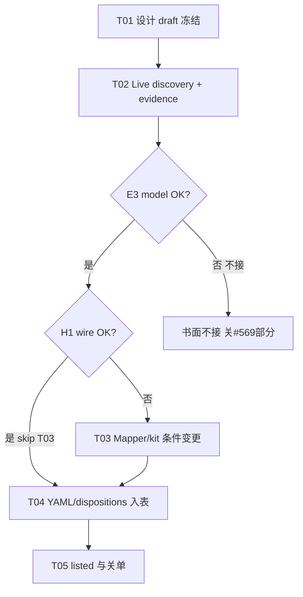

# 增量设计：#569 Wan 3.0 reference 系列 wire 与 mapper/探针路径

> **文档地位**：L2 增量设计（Issue **#569** · 关闭 #530 视频附录 **BI-4** 的前置）。只设计、不实现、不做 live API、不 push/PR/物化。
> **作者**：高见远（架构师） · 2026-09-05
> **status = `draft`**：**客户 submit 参考图字段 shape 尚未被官方精确文档或 dated probe 钉死**；禁止伪 `accepted`。升格条件见 §12。
> **术语**：`omnimux` = **执行中枢**；禁止称「网关」。上游 HTTP 云端仍称 OmniMux API / 上游。
> **原则**：**不得凭 ID 猜请求体**；**一 op 一 evidence**；**成功才 verified/live/listed**；**无 wire 证据不得 listed**；**禁止第二 HTTP client**。

---

## 0. 为何是 draft（升格门槛）

| 条件 | 本文件落盘时 | 升格 `accepted` 所需 |
|---|---|---|
| 四 runtime ID 字符串 | 产品/架构附录已锁；官方 model 页 Identity 一致 | 保持 |
| 参考图客户字段名/shape | **冲突未解**（见 §3） | dated existence/minimal：**至少 1 次** live multi-ref 成功，或官方/OpenAPI 与 hub 一致的精确字段表 |
| `images` vs `reference_images` | mdx 写 `image`/`images`；hub #429 禁 `images`、用 `reference_images`；OpenAPI `VideoRequest` **无** `reference_images` | live 分类结果写入 evidence；若需改 mapper，另 PR 合入后本设计再 accepted |
| 1/2/n · MIME · duration · sound | 仅 `wan-3.0` YAML 保守值 + 模板页「bounded」 | boundary/mime-size-duration 探针或官方精确表 |
| listed | 无 | 每成功 op 独立 evidence + YAML/disp 翻转（属 #530 C2，非本设计伪承诺） |

**本设计可执行范围（draft 也必须钉死）**：探针顺序、POST 预算、错误分类、mapper 深模块接口、文件/任务/回滚、#569 关闭条件与 C2 unlock。

---

## 1. 取证纪要（真源分级 · 访问日期 2026-09-05）

### 1.1 真源优先级（本 Issue）

```text
L0  hub 代码（mapper / route / execute）+ 上游 live HTTP 行为
L1  OmniMux 官方 OpenAPI / 非模板化 API 合同（若与 live 冲突以 live 为准并记 gap）
L2  OmniMux 官方 model 页 Identity（model 字符串）+ updates/llms 索引
L3  产品/架构附录（C2 ID 与 op 候选）
L4  第三方猜测 / 阿里云万相原生 SDK 字段名  → 禁止当 wire 真源
```

### 1.2 已读材料与结论强度

| 来源 | 路径 / 定位 | 结论 | 强度 |
|---|---|---|---|
| Issue #569 | `feat(omnimux): 钉死 Wan 3.0 ref 系列 wire 与参考图映射`；Parent #463；Blocks #530 | 验收：官方或 dated probe 钉 wire；contract+mapper+tests；无法确认 → draft/不接，不 listed | 产品令 |
| 产品附录 C2 | `docs/specs/2026-09-05-model-evidence-backfill-video-prd-addendum.md` | ID：`wan-3.0` / `wan-3.0-prime` / `wan-3.0-ref` / `wan-3.0-prime-ref`；禁短名；ref 候选 `video_multi_ref`（± t2v） | 高（产品锁） |
| 架构附录 BI-4 | `...video-design-addendum.md` §5 | Wan ref listed 前必须确认字段与 mapper；字段丢弃 → 假绿 | 高 |
| 官方 model 页 ×4 | 本地 `OmniMux-docs/en/api-reference/video-series/models/wan-3.0{,-prime,-ref,-prime-ref}.mdx`（与线上 docs 同源树） | Identity **精确** model 字符串；端点 `POST/GET /v1/video/generations`；Body **模板**：`prompt` conditional t2v；`seconds`/`duration`；`size`/`resolution`；**`image`/`images`**「Image-to-video references」；示例 **仅** `{"model","prompt"}`（含 *-ref 页） | ID=高；body multi-ref=**低**（四页+seedance/H3 同模板） |
| OpenAPI | `OmniMux-docs/openapi/relay.json` → `VideoRequest` | 属性：`model,prompt,image,duration,width,height,fps,seed,n,response_format,user,metadata`；**无** `reference_images` / `images` / `aspect_ratio` / `sound` | 中（偏旧/不全；与 hub 实测字段集不一致风险） |
| PLUGIN 摘录 | `research/omnimux/PLUGIN.md` | 提交体以 `dto/video.go` `VideoRequest`；列 `model/prompt/image/duration/.../metadata`；**未**列 `reference_images` | 中偏旧 |
| hub mapper | `plugins/omnimux/src/media/vendors/omnimux.js` `mapOmnimuxInput('video')` | `first_frame`→`image`；其它 image refs→`reference_images:[{url}]`；**互斥**；禁 `images`/`references`/`metadata`（#429 DisallowUnknownFields）；digital_human 才透传 `audioTrack` | **L0 客户端出站合同** |
| route wire | `plugins/omnimux/src/media/route.js` `toMediaWireModelId` | 仅 grok 别名重写；**Wan 完整 id 透传** | 高 |
| execute | `plugins/omnimux/src/media/execute.js` | `mapOmnimuxInput(..., { model: route.modelId, ...})`；runtime `modelId` 另有 kit 层 id；**单** openai-media client | 高 |
| 仓内 YAML | `video-models.yaml` 仅 `wan-3.0` | ops=`text_to_video`+`first_frame`；duration 5/10/15；res 720P/1080P；sound supported；**无** multi_ref 行；prime/ref **无行** | 高 |
| dispositions | 仅 `wan-3.0` canonical draft | prime/ref **无 D 行** | 高 |
| dated video evidence | `docs/evidence/` | **无** `wan-*` 视频 evidence | 高（缺口） |
| updates / llms | `11-updates-en.md` / `13-docs-llms.txt.md` | 本 worktree 摘录 **未**列出 Wan 四 SKU 专页索引（H3/Seedance 有）；**不能**用 updates 证明 ref body | 中（索引不全） |
| 第三方 | 任意非 OmniMux 文档 | **禁止**当 #569 wire 真源 | 禁 |

### 1.3 关键冲突（必须 live 仲裁）

| 主张 A | 主张 B | 设计立场 |
|---|---|---|
| 官方 mdx：`image` / **`images`** 作 I2V references | hub #429：**禁止** `images`；多参考用 **`reference_images:[{url}]`** | **探针候选序**以 hub 已知合法字段为先（避免 DisallowUnknown 自杀）；`images` 仅作对照探针且默认 **不**合入生产 mapper |
| OpenAPI 无 `reference_images` | hub 单测与 #429 注释认定上游接受 `reference_images` | OpenAPI **过时可能**；以 live 为准；成功后应推动 docs/OpenAPI 对齐（非本 PR 必做） |
| *-ref 页 curl 示例无图 | 产品名「Reference」+ 候选 `video_multi_ref` | 示例只能证明 **t2v 形态被文档写出**；**不能**证明 multi-ref 字段；也不能证明 ref SKU **必须**带图 |

---

## 2. 四个 runtime ID：existence 与 operation 分级

### 2.1 ID 锁定（禁止短名 wire）

| runtime ID | 规则 |
|---|---|
| `wan-3.0` | **POST body.model 必须完整 `wan-3.0`**；人读 alias 可保留在 catalog 解析，不得写入 wire |
| `wan-3.0-prime` | **POST body.model 必须完整 `wan-3.0-prime`** |
| `wan-3.0-ref` | **POST body.model 必须完整 `wan-3.0-ref`** |
| `wan-3.0-prime-ref` | **POST body.model 必须完整 `wan-3.0-prime-ref`** |

**短名零残留铁律**：任何**省略 `3.0` 的短名**均禁止出现在 wire、evidence、YAML id、mapper、测试字面量与本 Issue 文档中。只写完整 runtime ID；**不要**枚举历史短名。

### 2.2 Existence 分级

| 级 | 含义 | 本设计初态（2026-09-05） | 升到下一级的证据 |
|---|---|---|---|
| **E0** | 产品意图 / 附录锁定 | 四 ID 均 E0+ | — |
| **E1** | 官方目录页 Identity 出现精确字符串 | 四 ID 均 **E1**（OmniMux-docs mdx） | — |
| **E2** | live pricing / `omnimux models` 宇宙命中 | 任务描述称 runtime 已出现；**本设计会话未复跑 CLI** → 记 **E2-claimed** | 脱敏 `omnimux models`/`pricing` 摘录进 evidence §1 |
| **E3** | live POST 接受该 `model`（非 unknown model） | **未做** | existence POST 或 catalog 权威回包 |
| **E4** | 该 model 最小成功出片（task completed + url，`mode:live`） | **未做** | minimal evidence |

**规则**：E3 失败（明确 model unavailable）→ 该 ID **不 D-new / 书面不接**；**不阻塞**其它 ID。E2-claimed 不得单独驱动 listed。

### 2.3 Operation 候选分级

| ID | Op 候选 | 分级 | 依据 | 默认探测策略 |
|---|---|---|---|---|
| `wan-3.0` | `text_to_video` | **P-primary** | YAML 已有；mdx t2v 示例 | existence→minimal t2v |
| `wan-3.0` | `first_frame` | **P-primary** | YAML 已有；mapper `image` | 1 图 first_frame |
| `wan-3.0` | `video_multi_ref` | **P-optional** | YAML **未**声明 | 仅当产品要扩展时；**非 #569 主路径** |
| `wan-3.0-prime` | `text_to_video` | **P-primary** | mdx 示例 t2v；附录 ± first_frame | 先 t2v existence/minimal |
| `wan-3.0-prime` | `first_frame` | **P-secondary** | 附录 `first_frame?` | t2v 成功后再 1 图 |
| `wan-3.0-ref` | `video_multi_ref` | **P-primary（#569 核心）** | 产品/架构附录 | **必须** wire 字段钉死后 minimal |
| `wan-3.0-ref` | `text_to_video` | **P-secondary** | mdx「Required for t2v」+ 无图示例 | 低成本 1 次：无图 t2v 是否 E3/E4 |
| `wan-3.0-ref` | `first_frame` | **P-exploratory** | 未知是否与 multi-ref 同 SKU | 仅 wire 清晰后；禁与 multi 证据互背书 |
| `wan-3.0-prime-ref` | 同 `wan-3.0-ref` | 同左 | 独立 SKU，**禁止**共用 evidence | 独立 POST 与文件 |

**ref 是否「只 multi-ref」？**
**未钉死。** 文档允许解读为「同一 model 可 t2v（无图）也可 I2V/ref（有图）」。产品候选写 `video_multi_ref（± t2v）`。工程默认：

1. **主承诺面** = multi-ref（#569）。
2. **t2v on ref** = 可选二级：1 次无图 POST；成功可另开 op evidence；失败写 notes「ref SKU 不接纯 t2v」——**不**因此否定 multi-ref。
3. **禁止**假设「无图示例 ⇒ 无 multi-ref 能力」或「名字带 ref ⇒ 拒绝 t2v」。

---

## 3. 客户 submit body：字段证据强度

### 3.1 公共信封（强度：高）

| 字段 | Shape | 证据 | 透传 |
|---|---|---|---|
| `model` | string = 完整 runtime ID | mdx Identity；route 透传 | **必须完整透传**；禁止 mapper 截断 |
| `prompt` | string | mdx；hub | t2v 必填；multi-ref 默认仍带短 prompt |
| 端点 | `POST https://api.omnimux.ai/v1/video/generations` | mdx / PLUGIN / hub baseUrl | 唯一视频提交面 |
| poll | `GET .../v1/video/generations/{task_id}` | 同上 | 现 execute/poll |

### 3.2 媒体与控制字段（强度：中～低）

| 字段 | Shape（候选） | 官方 | hub 现状 | 强度 | #569 动作 |
|---|---|---|---|---|---|
| `duration` | number 秒 | mdx `seconds`/`duration` | mapper 透传 `duration` | 中高 | 探针用 **最小档**（YAML 5 或 live 更小） |
| `resolution` | string | mdx `size`/`resolution` | → `resolution` | 中 | 优先 `720P`/`720p`（大小写 live 记） |
| `aspect_ratio` | string | mdx **未**写；OpenAPI 无 | → `aspect_ratio` | 中（hub 已用） | 可选；未知字段 400 则去掉重试（计入预算） |
| `image` | string URL/base64 | mdx；OpenAPI | first_frame / bare image | 高（首帧） | first_frame 路径 |
| **`reference_images`** | **`[{ url: string }]`** | mdx **未**写；OpenAPI **无** | multi-ref **唯一**出站 | **中（仅 hub #429）** | **主探针字段** |
| **`images`** | string[] ? | mdx 模板 | **#429 禁止** | 文档低 / 实现冲突 | 对照探针 only；**默认不进生产 mapper** |
| `images` 与 `image` 并存 | — | 未说明 | hub 互斥 image vs reference_images | — | 禁止生产路径并存 |
| `sound` | boolean? | `wan-3.0` YAML `parameters.sound` | **mapper 未透传** | 低 | 边界阶段可选；未知字段则记 gap，不阻塞 multi-ref listed |
| `metadata` | object | OpenAPI/PLUGIN 有 | video **禁止**（#432） | hub 高 | **禁止**探针携带 |
| `audioTrack` / `references` / 顶层 `images` | — | — | video 禁止（非 digital_human） | hub 高 | **禁止** |

### 3.3 多参考字段：假设树（只许一条成为真源）

```text
H1（优先验证）：multi-ref = reference_images: [{url}, ...]
    + 无 image 字段
    + model=wan-3.0-ref|wan-3.0-prime-ref
    → 与 current mapper 一致

H2：multi-ref = 重复使用单数字段 image（仅 1 图）
    → 只能表达 max1；n>1 无解 → 契约 max1 或执行缺口

H3：multi-ref = images: [url, ...]（mdx 字面）
    → 与 #429 DisallowUnknown 冲突风险极高
    → 若 live 证明上游要 images 而拒 reference_images：
         升级 BI-4b（上游合同 vs hub 结构体），禁止静默改回 images 污染全视频面

H4：字段名其它（referenceImages / refs / ...）
    → 仅当 H1–H3 全失败且错误信息明示时探索；每候选 ≤1 POST
```

**证据强度结论（落盘时）**：
- **model id 完整透传**：**高**（实现已具备；docs 要求 Must be 完整 id）。
- **reference_images shape**：**中（代码约定）/ 低（官方文档）** → **不足以上 listed**。
- **images shape**：**低**（模板复制）且与 hub 冲突 → **不得**作为实现默认。

---

## 4. 边界维度：official vs 必须 probe

| 维度 | Official（可引用） | 必须 probe | 写入契约时 limitSource |
|---|---|---|---|
| 参考图数量 1 | mdx 未给 max | **是**（minimal） | live_probe 成功 → 可 verified；max 未触达拒绝点则 **policy_conservative** |
| 参考图数量 2..n | 无 | **是**（boundary 爬升） | 拒绝点写入 max；未触达则 conservative max1 或不放宽 |
| first_frame 与 ref 混用 | 无 | 可选 1 次负例 | 期望：hub 优先 image、丢 ref——契约勿同时要求两 slot |
| MIME png/jpeg/webp | `wan-3.0` YAML official_docs 指向 wan.aliyun（**非 OmniMux 字段合同**） | ref SKU **至少 1 MIME 成功**；其它 MIME 可抽样 | 无 OmniMux 专表前 = policy_conservative 继承 base |
| maxSizeMb | YAML 20 conservative | 近上限 1 张可选 | policy_conservative until live |
| duration | YAML 5/10/15 for `wan-3.0`；mdx「bounded」 | 最小档成功即可；非法 duration 1 次 | official_docs（base）/ live_probe |
| resolution | 720P/1080P YAML | 最低档 | 同上 |
| aspect_ratio | YAML 多档 | 可选 | |
| sound / 音频 | YAML sound on `wan-3.0`；**无** ref 页音轨字段 | sound 透传缺口单独记；**非** multi-ref listed 硬依赖 | |
| 纯 t2v on ref | mdx 示例 | 1 POST | 成功/失败均 notes |

---

## 5. Current mapper 是否足够

### 5.1 结论（设计裁决）

| 问题 | 裁决 |
|---|---|
| 对 #569 **探针**是否够用？ | **是（H1 路径）**：`mapOmnimuxInput('video')` 已能产出 `reference_images:[{url}]`，且不发禁字段。 |
| 对 #569 **listed** 是否够用？ | **尚不足声明够用**：缺 live 证明 H1；若真源为 H3/H4 则 **不够**。 |
| 是否按 model hardcode？ | **禁止**。保持 **role/slot → 字段** 深模块；Wan 不进 `if (model === 'wan-3.0-ref')`。 |
| sound | 现 **未**映射；listed multi-ref **不**依赖 sound 修复；若产品要 sound 控开关 → 独立小 PR，仍避免 per-model 分支（用 parameters schema / profile）。 |
| 第二 HTTP client | **禁止**。 |

### 5.2 深模块接口（不按 model hardcode）

保持/强化单一映射函数语义（逻辑合同，非本任务改码）：

```text
mapOmnimuxInput(capability='video', request):
  输入：prompt, duration?, aspectRatio?, resolution?,
        references[]: { role, type, pathOrUrl }, image?, model?, audioTrack?
  规则：
    1) 收集 type=image 且 pathOrUrl 非空的 refs
    2) 若存在 role=first_frame → 输出 image=该 url；忽略其它图（或未来显式策略）
    3) 否则若存在其它 image refs → 输出 reference_images=[{url}]（保序）
    4) 否则若 request.image → image
    5) 永不输出：images, references, metadata（video）
    6) audioTrack 仅 digital_human allowlist
    7) model 不参与字段选择（仅 digital_human 例外读取 allowlist）
```

**若 live 证明需要 model-specific 字段**：
新增 **`VideoInputProfile`**（或扩展 adapter-profiles）— `id → field mapping strategy` 数据驱动，而不是在 `mapOmnimuxInput` 堆 `wan-*` 分支。策略枚举示例：`first_frame_as_image` | `refs_as_reference_images` | `refs_as_images_array`（后两者互斥且 `images_array` 需上游+全回归证明）。
**#569 默认不引入** profile 表，除非 H1 失败且 H3 被证明为唯一真源。

### 5.3 精确触点文件 / 函数 / 测试（实现期，非本设计执行）

| 路径 | 符号 | #569 角色 |
|---|---|---|
| `plugins/omnimux/src/media/vendors/omnimux.js` | `mapOmnimuxInput` | 主映射；H1 够用则 **零改** |
| `plugins/omnimux/src/media/route.js` | `toMediaWireModelId` / `resolveMediaRoute` | 确认 Wan id 透传；**禁止**把 ref 归一成 `wan-3.0` |
| `plugins/omnimux/src/media/execute.js` | `executeOmnimuxMedia` | 组装 request；仍单 runtime |
| `plugins/omnimux/src/media/protocols/openai-media.js` | `createOpenAiMediaRuntime` | kit parameterSchema 目前只声明 prompt/duration/image——**可能不阻挡**额外字段，但若 kit 剥字段须在探针中验证出站 JSON |
| `plugins/omnimux/src/media/video.test.js` | `#429` / multi-ref / first_frame 组 | H1 回归；若改策略补用例 |
| `plugins/omnimux/src/media/route.test.js` | wire id | 增：`wan-3.0-ref` / `wan-3.0-prime-ref` / `wan-3.0-prime` 透传断言 |
| `plugins/omnimux/src/catalog/specs/video-models.yaml` | models[] | C2：Y-new ref/prime；**仅** wire+证据后 op 翻转 |
| `plugins/omnimux/src/catalog/contract/dispositions.json` | D-new | existence E3+ 后 |
| `plugins/omnimux/src/catalog/contract/operation-registry.json` | `video_multi_ref` 已存在 | **默认不改** |
| `docs/evidence/YYYY-MM-DD-model-wan-*.md` | per-op | 真源落点 |

### 5.4 kit 出站风险（探针必查）

`openai-media.js` 内 model `parameterSchema` 仅列 `prompt|duration|image`。若 runtime-kit **strip unknown keys**，则 `reference_images` 可能在客户端被静默丢弃 → **假绿/假失败**。

**探针强制**：在 submit 路径记录 **实际 JSON body**（脱敏）含是否出现 `reference_images`；若被剥 → **执行层 blocker（BI-4-kit）**，先修 kit/adapter schema 或 normalize，**禁止** listed。

---

## 6. 低成本探针协议（live discovery）

> 本设计 **不执行** live；下列为工程师/录入 Agent 的可执行规程。Key：仅 `omnimux tokens exec`；禁止 key 入盘/日志/PR。

### 6.1 阶段与停规则

```text
Phase A  Existence（目录或 POST）
Phase B  Wire discrimination（字段假设 H1→H2→H3…）
Phase C  Minimal success（首个 live 成片）
Phase D  Boundary n / 负例
Phase E  MIME · size · duration 抽样（仅预算剩余且无 OK-live 停规则冲突时）
Phase F  结论：钉死 wire ∨ 书面不接 ∨ 升级 BI-4b
```

**全局停规则**：

1. **首个 OK-live 即停**：任一 (model, op) 一旦 E4 / OK-live，**立即停止**该 op 及该 model 上一切后续成功路径刷量；**不再**为「再确认」重复同 body 出片。D/E 仅在 OK-live **之前**且预算未耗尽时允许；OK-live 之后 **禁止** D/E 再花 POST。
2. Boundary 用 **拒绝点**，不追求多次成功。
3. 业务 4xx（明确 invalid / unknown field / unknown model）**不重试当成功**；网络 5xx/超时 ≤2 次。
4. 任一 Phase B 候选因 **F-unknown** 失败 → 记类，换下一 H*；**不要**在同一 body 叠加多套字段。
5. `images` 候选失败且报 unknown → **立即放弃 H3 生产化**。
6. 配额 402 → 全批暂停，不写 live 成功。
7. **C-channel / A-auth 失败**（见 §6.2）**不**消耗字段假设进度、**不**据此否定 wire、**不**推进 H* 序号。

### 6.2 错误分类字典

| 类 | 典型信号（示意） | 解释 | 下一动作 |
|---|---|---|---|
| **A-auth** | HTTP **401** / **403**；unauthorized；forbidden；token invalid | 鉴权/权限，**非** model/字段结论 | 修 token/权限后 **同 body 重试**；**不**记 F-unknown/M-unknown；**不**否定 wire；**不**消耗 H* 假设 |
| **C-channel** | no provider；`get_channel_failed`；channel unavailable；provider not configured；路由无上游通道 | 执行通道/供应商配置，**非** wire shape | 修 channel/provider 后同假设重试；**不得**消耗字段假设；**不得**据此否定 wire 或书面不接 |
| **M-unknown** | model not found / unknown model / 404 模型（**排除** auth/channel） | ID 不在上游宇宙 | 该 ID 不接；不 D-new |
| **F-unknown** | unknown field / DisallowUnknownFields / json: unknown（**排除** auth/channel） | 字段名非法 | 换 H*；禁把 F-unknown 当 input invalid 放过 |
| **I-invalid** | invalid image / bad url / mime / empty prompt | 输入内容问题 | 修夹具后同 H* 重试 1 次 |
| **I-limit** | too many images / max reference | 边界触达 | 记录 max=n-1 |
| **Q-quota** | 402 insufficient_quota | 额度 | 停批 |
| **R-rate** | 429 | 限流 | 退避后同请求 1 次 |
| **S-server** | 5xx | 上游 | ≤2 后待复测 |
| **K-strip** | 出站无 reference_images 但本地 mapper 有 | kit 剥离 | BI-4-kit；停 listed |
| **OK-accept** | 200 + task_id | 接受 | poll 至 completed/failed |
| **OK-live** | completed + media url；hub `mode:live` | 最小成功 | 写 evidence；**立即停**该 op 成功路径（§6.1 规则 1） |

**分类硬约束**：

- **A-auth / C-channel 与 F-unknown / M-unknown 必须分开记账**；禁止把 401/403/no provider/`get_channel_failed` 误标为字段或 model 不存在。
- Channel/auth 失败 **不计** Phase B 假设消耗，**不得**写入「wire 不成立」结论。

### 6.3 POST 预算（硬上限 · QA 收紧）

| 阶段 / 桶 | 硬上限 | 说明 |
|---|---|---|
| A Existence | 0–1 / model | 优先 0：用 models/pricing；若无则 1× 最小 t2v body |
| **B Wire** | **≤ 3** / model | H1 必做；失败才 H2、H3 各 ≤1；H4 仅当前 3 次内置换，不得超 B 顶 |
| **C Minimal** | **≤ 2** / model | 含 1 次 poll 超时后的唯一重试；**首个 OK-live 即停** |
| **D Boundary** | **≤ 3** / model | n 爬升至拒绝或用尽 3 次；**仅 OK-live 之前** |
| E mime/dur | 从该 model 剩余预算划拨 | **不得**突破单 model 顶；OK-live 后禁止 |
| **单 ref model 合计** | **≤ 10** | 每个 `wan-3.0-ref` / `wan-3.0-prime-ref` 硬顶 10 POST |
| **两 ref model** | **≤ 20** | 两 ref 合计硬顶 |
| **base + prime 对照** | **≤ 8** | `wan-3.0` + `wan-3.0-prime` 对照合计 ≤8（非猜字段优先权） |
| **#569 会话硬顶** | **≤ 28** | 全会话 POST 总和（两 ref + 对照 + 其它）≤28；超出 → 停并书面待复测 |

**首个 OK-live 即停（成功路径）**：C 阶段一旦 OK-live，**禁止**继续 D/E 或重复成功出片；未完成的边界/MIME 记「待复测 / policy_conservative」，**不**为补边界突破预算。

### 6.4 推荐请求矩阵（逻辑 body）

#### A/B/C — `wan-3.0-ref`（`wan-3.0-prime-ref` 逐字替换 model）

| # | Phase | Body（逻辑） | 期望 |
|---|---|---|---|
| R0 | A | `{ model, prompt, duration:min }` 无图 | E3 或 M-unknown |
| R1 | B-H1 | `{ model, prompt, duration:min, reference_images:[{url: PNG}] }` | OK-accept / F-unknown / I-* |
| R2 | B-H2 | 仅当 R1 F-unknown：`{ model, prompt, image: url }` | 单图是否可当 ref |
| R3 | B-H3 | 仅当 R1+R2 失败：`{ model, prompt, images:[url] }` | 对照；**生产默认不采纳** |
| R4 | C | 复制 **第一个 OK-accept 的字段方案**；poll 至 OK-live | E4 |
| R5+ | D | 同方案 n=2.. 至 I-limit | max |
| Rt | 可选 | 无图 t2v（若 R0 未做 E4） | t2v 二级结论 |

#### 对照 — `wan-3.0` / `wan-3.0-prime`

| # | Body | 目的 |
|---|---|---|
| W1 | t2v 最小 | base/prime E3/E4；对照 unknown model 分类 |
| W2 | first_frame → `image` | 与 ref 字段方案对照（同 upstream 是否区分 SKU） |

### 6.5 夹具

| 资产 | 要求 |
|---|---|
| 图 | 自备 PNG/JPEG/WebP；512–1280；无隐私版权；URL 需上游可拉（公网或官方要求的可访问 URL） |
| 数量 | multi 预留 5 张不同主体图 |
| prompt | ≤50 字中性描述 |
| 存放 | 未跟踪 fixtures；不提交密钥 |

### 6.6 Evidence 落盘

- 模板：`docs/evidence/_template-model-evidence.md`
- 命名：`docs/evidence/YYYY-MM-DD-model-<id>-<op>.md`
- 一 op 一文件；`wan-3.0-ref#video_multi_ref` 与 `wan-3.0-prime-ref#video_multi_ref` **分文件**
- §0 写 tokens exec；§1–4 四要素；§2 必须附 **脱敏出站 body 字段集**（证明未 K-strip）
- tags: `video`, `backfill-530-c2`, `issue-569`

---

## 7. 测试矩阵（实现 / 合入门禁）

### 7.1 单测（无 key）

| 用例 | 断言 |
|---|---|
| multi-ref 映射 | 2× role=reference → `reference_images` 长度 2；无 `image`/`images`/`metadata` |
| first_frame 优先 | 有 first_frame 时仅 `image` |
| Wan wire 透传 | `toMediaWireModelId('wan-3.0-ref')==='wan-3.0-ref'`（prime / prime-ref / 3.0 同理） |
| 禁短名回归 | 文档/代码/测试：**任何省略 `3.0` 的短名均禁止**；wire 仅完整 runtime ID |
| digital_human 回归 | audioTrack 行为不回归（#538） |
| #429 回归 | 全绿现有 video.test.js |

### 7.2 契约 / strict

| 门禁 | 条件 |
|---|---|
| `pnpm --filter omnimux test` | 绿 |
| `node scripts/verify-model-contracts.mjs --strict --json` | 绿；**无**无证据 listed |
| 新 D-new/Y-new | 仅 E3+；listed 仅 E4+ 四要素 |
| fingerprint / listed 差集 | == PR 声明成功键 |

### 7.3 Live（有 key，#530 C2）

| 项 | 要求 |
|---|---|
| mode | 必须 `live`，禁止 stub 冒充 |
| 每成功 op | 独立 evidence |
| ref listed | **H1 或经批准的替代 wire** 已写入本设计升格修订 + evidence |

---

## 8. 任务列表与依赖（≤5）

### T01 — 设计真源 + 探针计划冻结（本 PR 文档）

| 项 | 内容 |
|---|---|
| Priority | P0 |
| Dependencies | 无 |
| Files | 本文件 · `docs/specs/README.md` ·（可选）evidence README 索引区占位 |
| 交付 | draft 设计；冲突表；POST 预算；关闭条件 |
| 验证 | `pnpm doc:lint` · `pnpm doc:index` · `git diff --check` |

### T02 — Live discovery 执行（evidence only）

| 项 | 内容 |
|---|---|
| Priority | P0 |
| Dependencies | T01；tokens |
| Files | `docs/evidence/YYYY-MM-DD-model-wan-3.0-ref-*.md` · `...prime-ref...` · 可选 `wan-3.0`/`prime` 对照 · `docs/evidence/README.md` |
| 交付 | Phase A–F 结果；钉死 H* 或书面不接；**不**改 listed |
| **硬预算** | 每 ref model **≤10**；两 ref **≤20**；base+prime 对照 **≤8**；会话 **≤28**；B≤3 / C≤2 / D≤3；**首个 OK-live 即停**；A-auth/C-channel 不耗 H* |
| 验证 | evidence 四要素或明确不接；无 key 泄漏；短名零残留 |

### T03 — Mapper / kit 对齐（仅当 T02 证明 H1 不足或 K-strip）

| 项 | 内容 |
|---|---|
| Priority | P0（条件） |
| Dependencies | T02 |
| Files | `vendors/omnimux.js` 和/或 `openai-media.js` / kit 声明 · `video.test.js` · `route.test.js` |
| 交付 | 深模块策略；**无** per-model hardcode；#429 不破 |
| 验证 | omnimux test 全绿；对照 live 复测 1 次 minimal |
| 跳过 | T02 证明 H1+无 strip → **整任务 skip** |

### T04 — Catalog 数据面（C2 入表，仍可 draft op）

| 项 | 内容 |
|---|---|
| Priority | P0 |
| Dependencies | T02 E3+（失败则不接行或 notes） |
| Files | `video-models.yaml` · `dispositions.json` · 行数相关 test |
| 交付 | Y-new/D-new prime/ref；ops 初态 draft 或仅成功 op verified；**无证据不 listed** |
| 验证 | `--strict` 绿 |

### T05 — listed 翻转 + #569 关闭包装（属 #530 C2 合入单元）

| 项 | 内容 |
|---|---|
| Priority | P0 |
| Dependencies | T02 E4+；T03 若需要已合入 |
| Files | YAML research/execution · evidence 链 · 矩阵注记可选 |
| 交付 | `Δ_listed ⊆ S_success`；Issue #569 关闭陈述；BI-4 关闭或降级 |
| 验证 | strict + 差集；R1 人工合入；不写 Prod |

### 8.1 依赖图



### 8.2 回滚边界

| 单位 | 回滚内容 | 不影响 |
|---|---|---|
| T01 文档 | revert docs only | 代码 |
| T02 evidence | 删/改 evidence 文件 | 不自动改 YAML |
| T03 mapper | revert media 文件；#429 测试保底 | catalog listed |
| T04 catalog | revert YAML/disp | 其它厂商 C1/C3 |
| T05 listed | 单键回退 research/execution | 其它 op |
| 执行层 BI-4b | 独立生命周期 | 数据批 revert 不关云端 Issue |

---

## 9. 文件清单（本设计视野）

| 路径 | 动作 | 任务 |
|---|---|---|
| `docs/specs/2026-09-05-wan-3-ref-wire-design.md` | **新建** | T01 |
| `docs/specs/README.md` | 索引 +1 draft | T01 |
| `docs/evidence/_template-model-evidence.md` | 复用 | T02 |
| `docs/evidence/YYYY-MM-DD-model-wan-*.md` | 新建 | T02/T05 |
| `docs/evidence/README.md` | 登记 | T02 |
| `plugins/omnimux/src/media/vendors/omnimux.js` | 条件改 | T03 |
| `plugins/omnimux/src/media/protocols/openai-media.js` | 条件改 | T03 |
| `plugins/omnimux/src/media/route.js` | 通常不改；补测 | T03 |
| `plugins/omnimux/src/media/video.test.js` / `route.test.js` | 补测 | T03 |
| `plugins/omnimux/src/catalog/specs/video-models.yaml` | Y-new/Y-mod | T04/T05 |
| `plugins/omnimux/src/catalog/contract/dispositions.json` | D-new/D-mod | T04/T05 |
| `operation-registry.json` | 默认不动 | — |
| 第二 HTTP client / 垂直插件 | **禁止** | — |

---

## 10. 安全规范

| 项 | 要求 |
|---|---|
| Key | `omnimux tokens exec` only；档位遵循运维 45 规程 |
| 禁止 | key 入 evidence、CI、briefing、截图 EXIF、PR |
| 成本 | 最小 duration；最低 resolution；成功即停；串行 |
| 超时 | submit 30s；poll ≤6min/任务；超时=失败可待复测 |
| 清理 | 本地 tmp 删；记录 taskId；不保证上游 cancel |
| 环境 | 隔离 worktree；**不写 Prod**；合入前不物化 45120 |
| 合规夹具 | 无用户隐私、无未授权版权图 |

---

## 11. Shared Knowledge（工程师）

```
1. #569 status 以 wire 证据为闸；本设计保持 draft 直至 H* 钉死或书面不接（QA pass 不升 accepted）。
2. POST model 必须完整：wan-3.0 | wan-3.0-prime | wan-3.0-ref | wan-3.0-prime-ref。
3. 任何省略 3.0 的短名均禁止（文档/代码/测试/evidence 零残留；不要枚举历史短名）。
4. 主探针字段 H1=reference_images:[{url}]；禁止默认改回 images。
5. image 与 reference_images 互斥；video 禁 metadata/images/references。
6. 不按 wan model id hardcode mapper；缺口用 profile/数据驱动。
7. kit 可能 strip 未声明字段 → 出站 body 必须核对。
8. 一 op 一 evidence；两 ref SKU 禁互背书；prime-ref 默认独立 minimal，无同 shape 豁免。
9. listed 只来自 E4+四要素；入表≠上架。
10. POST 硬顶：每 ref model ≤10；两 ref ≤20；base+prime 对照 ≤8；会话 ≤28；B≤3、C≤2、D≤3；首个 OK-live 即停。
11. A-auth（401/403）与 C-channel（no provider / get_channel_failed）不得记为 F-unknown/M-unknown；不耗字段假设、不否定 wire。
12. R1 人工合入；不写 Prod；无第二 client。
```

---

## 12. #569 关闭条件 与 #530 C2 unlock

### 12.1 #569 可关闭（满足其一组）

**关闭-成功（wire 钉死）**：

1. 至少一份 dated evidence：`wan-3.0-ref#video_multi_ref`（或经产品书面改认的 op）含 existence + minimal OK-live；
2. 出站 body 字段集写明（H1 或批准替代）；
3. 若曾 K-strip/H3 冲突，T03 已合入且复测 1 次成功；
4. contract（YAML slot）与 mapper 测试与 evidence **一致**；
5. `wan-3.0-prime-ref`：**必须**独立 dated minimal evidence（与 ref **分文件**）。**无**「同 shape 产品豁免」；禁止因另一 SKU 成功而跳过本 SKU minimal；未取得独立 OK-live 则该 SKU **不得 listed**（可关 #569 的 ref 部分成功，prime-ref 记待复测/不接，互不背书）。

**关闭-不接（同样合法）**：

1. E3 M-unknown 或 B 阶段全部 H* F-unknown/不可用（**A-auth / C-channel 不构成不接依据**）；
2. dispositions/notes 或 evidence conclusion=不接；
3. **零** listed 键被翻转；
4. BI-4 标记 closed-as-wont / blocked-upstream。

### 12.2 #569 **不得**关闭

- 仅有官方模板 mdx、无 live/精确 OpenAPI；
- 仅 ID 出现在 models 列表；
- stub mode 成功；
- 跨 SKU 挪用 evidence。

### 12.3 #530 C2 unlock（相对视频附录 T03）

| Unlock 项 | 依赖 #569 |
|---|---|
| `wan-3.0` t2v/ff listed | **不**阻塞于 ref wire；可并行补证 |
| `wan-3.0-prime` 入表/listed | E3/E4；不依赖 ref 字段 |
| `wan-3.0-ref` / `wan-3.0-prime-ref` **listed** | **硬依赖** #569 关闭-成功 |
| C2 整批合入声明含 ref listed | 同上 |
| C2 合入仅 base+prime | 可在 #569 关闭-不接 后进行；PR 显式排除 ref listed |

**金句**：**没有 wire 证据不得 listed**；C2 unlock listed(ref) ⇒ #569 成功关闭。

---

## 13. Anything UNCLEAR / Blocking questions（≤3）

| # | 问题 | 默认（无主理人回复则执行） |
|---|---|---|
| **Q1** | 上游 multi-ref 真源是 `reference_images` 还是 mdx `images`？ | 严格按 §6 H1→H2→H3；H1 成功即钉；H3 成功但 H1 失败 → **停 listed**，开 BI-4b，不自动改生产 mapper |
| **Q2** | `wan-3.0-ref` 无图 t2v 是否必须 listed？ | **否**；1 次探测写 notes；主路径 multi-ref |
| **Q3** | `wan-3.0-prime-ref` 是否允许「同 wire 形状」豁免独立 minimal？ | **否；无豁免**。必须独立 minimal；配额不足 →「待复测」且 **该 SKU 不 listed**，不阻塞 base C2；主理人亦不得用豁免把未探测 SKU 标 listed |

---

## 14. 给主理人的交付摘要

| 项 | 内容 |
|---|---|
| 状态 | **`draft`**（QA 内容 PASS 亦不升 `accepted`；非伪 accepted） |
| 关键结论 | 四 ID 官方页 Identity 已齐；**参考图 body 未钉**（mdx `images` vs hub `reference_images` vs OpenAPI 缺失） |
| current mapper | **探针可用（H1）**；**listed 证据不足**；禁 per-model hardcode |
| 仍需 live probe | 见 §6；硬顶：每 ref ≤10、两 ref ≤20、对照 ≤8、会话 ≤28；首个 OK-live 即停 |
| 错误分类 | A-auth / C-channel 与 F-unknown / M-unknown 分离；channel 失败不否定 wire |
| prime-ref | **无**同 shape 豁免；独立 minimal；否则该 SKU 不 listed |
| 短名 | 任何省略 3.0 的短名均禁止；文档不枚举历史短名 |
| 文件 | 本设计 + README 索引 |
| 门禁 | doc:lint / doc:index / diff --check；实现期 test+strict |
| 关单 | §12；无 wire 证据不 listed；C2 ref listed 硬依赖 #569 成功 |

---

**文档结束（高见远 · 架构师 · 2026-09-05 · #569 Wan 3.0 ref wire · status: draft）**
