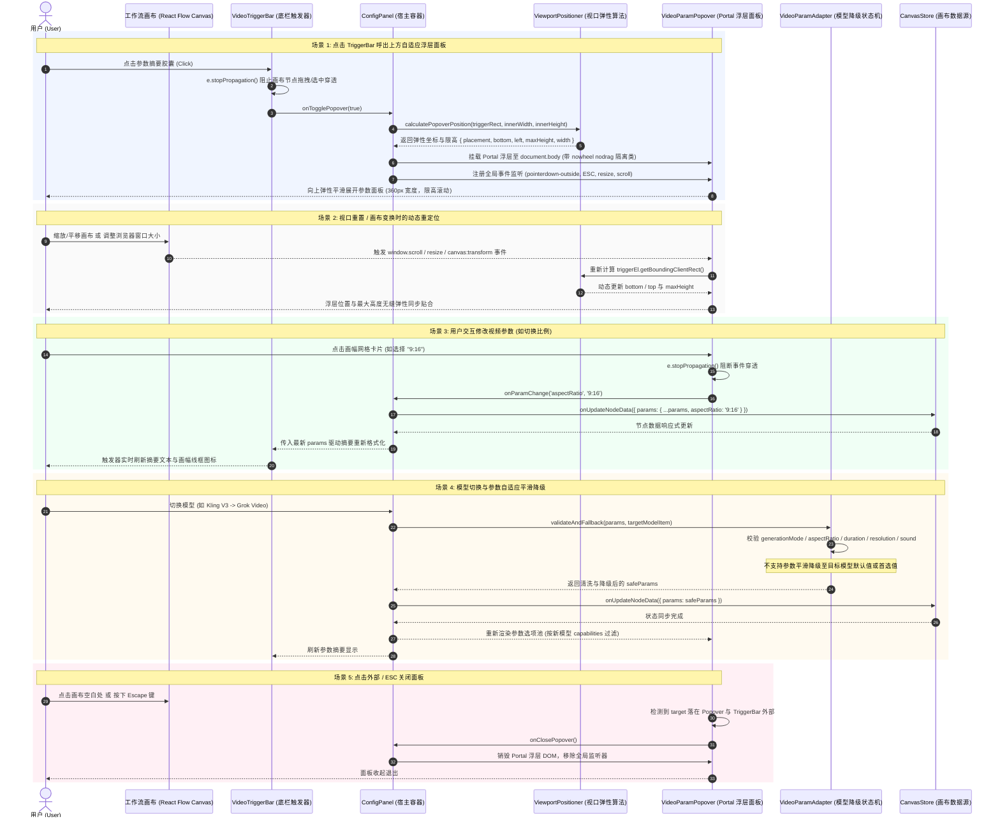
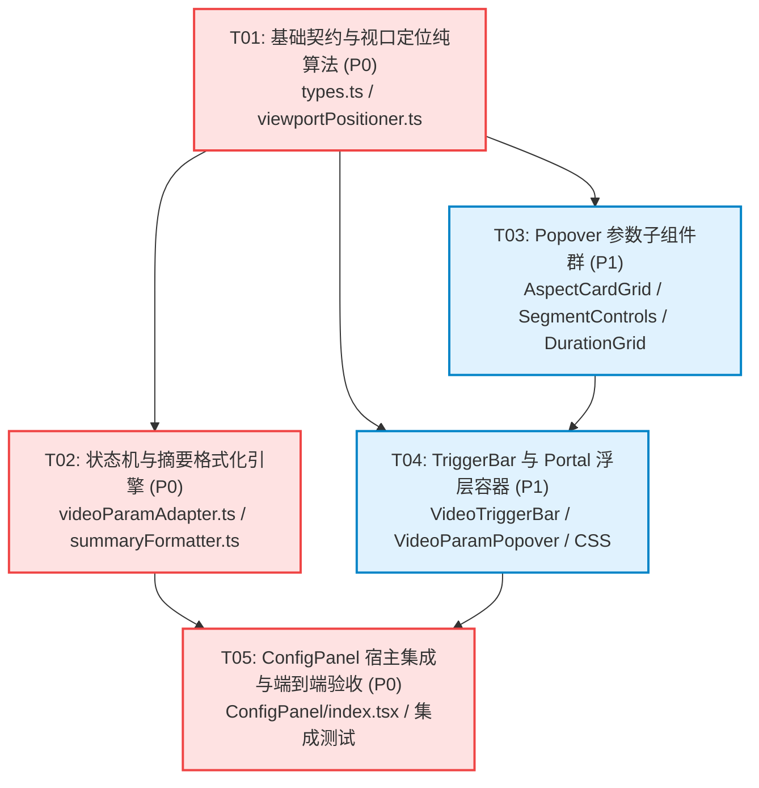

# 系统设计与任务分解规格书：视频生成节点参数配置重构（TriggerBar + 上方自适应 Popover）

## 架构师寄语
本技术规格书针对 OmniMux 工作流画布（`plugins/omnimux-workflow`）中**视频生成节点（MaterialNode）参数配置交互重构**进行全方位架构设计、核心算法推导与工程任务分解。
重构目标是将原平铺拥挤的下拉框组合收拢为**“摘要 TriggerBar 胶囊 + 上方自适应弹性 Popover 浮层”**，实现高度紧凑的节点外观与高承载力、直观可视化的参数配置体验。

---

# Part A: 系统设计 (System Design)

## 1. 技术方案与实现途径 (Implementation Approach)

### 1.1 核心技术挑战与痛点剖析
1. **画布嵌套与坐标映射冲突 (React Flow Transform Context)**：
   - 工作流画布具备多级平移（Pan）与缩放（Zoom，如 0.2x ~ 2.0x）。若将 Popover 作为子节点挂在 Flow DOM 树内，其 `scale`、`transform` 矩阵将导致弹窗模糊失真、尺寸畸变及边界裁剪（`overflow: hidden`）。
   - **技术选型**：采用 **React Portal 机制**脱离画布容器，直接挂载至 `document.body`，基于 `getBoundingClientRect()` 计算屏幕绝对物理坐标（Viewport CSS Pixels），彻底摆脱画布 Transform 影响。
2. **无限画布边界与视口碰撞自适应 (Viewport Collision & Elastic Max-Height)**：
   - 节点在画布中可被自由拖拽至视口顶部边缘。若固定向上弹出 480px，弹窗将被视口顶部截断；
   - **核心算法**：设计**双向弹性空间计算器（ViewportPositioner）**。优先向上贴合弹出，根据视口顶部剩余空间动态收缩高度（`maxHeight` 介于 200px ~ 480px 之间弹性伸缩），内部启动 `overflow-y: auto`；若顶部空间严重不足（< 200px）且下方空间更充裕时，自动翻转（Flip）至下方贴合。
3. **事件穿透与画布劫持拦截 (Event Isolation)**：
   - 浮层内部的滚轮滚动易意外触发画布的全局滚轮缩放；点击/拖拽参数滑块易被 React Flow 捕获导致节点移动或画布平移。
   - **隔离方案**：浮层容器强制标注 `nowheel nodrag` 类名，并在浮层根节点注入 `onWheel={(e) => e.stopPropagation()}` 与 `onPointerDown={(e) => e.stopPropagation()}`，彻底阻断画布事件穿透。
4. **模型能力差异与参数状态平滑降级 (Heterogeneous Model Capability & Fallback)**：
   - 各视频模型差异巨大（如 Kling V3 独占首尾帧与音效，Seedance 独占 4s/6s/8s 时长与 720P，Grok Video 无清晰度选项等）。
   - **架构方案**：抽象独立的纯函数适配器 `VideoParamAdapter`，解耦 UI 渲染与数据清洗，模型切换时毫秒级完成参数合法性校验、降级回退与数据归一化。
5. **DSH 原生设计系统 100% 遵从（Design System Compliance）**：
   - 严格杜绝硬编码 Hex 色值、杜绝原生 `<select>`、杜绝 Emoji/文字充当图标，100% 消费 `--wb-*` / `--dsw-*` Token，SVG 矢量精准线框呈现画幅比例，提供 60fps 的毛玻璃暗黑质感。

---

## 2. 系统文件清单 (File List)

所有文件均位于 `plugins/omnimux-workflow` 模块内，物理划分清晰、高内聚低耦合：

```text
plugins/omnimux-workflow/
├── src/
│   ├── canvas/
│   │   ├── editor/
│   │   │   └── components/
│   │   │       └── MaterialNode/
│   │   │           └── ConfigPanel/
│   │   │               ├── index.tsx                                          # [修改] 宿主底栏集成 TriggerBar 与 Popover 状态调度
│   │   │               └── videoParams/                                       # [新建] 视频参数重构专属模块目录
│   │   │                   ├── types.ts                                       # [新建] 视频参数、几何规格与状态机契约类型
│   │   │                   ├── viewportPositioner.ts                          # [新建] 视口弹性定位、边界碰撞与限高数学算法
│   │   │                   ├── viewportPositioner.test.mjs                    # [新建] 视口自适应定位算法纯单测
│   │   │                   ├── aspectRatioGeometry.ts                         # [新建] 各比例精确矢量线框 SVG 几何坐标映射
│   │   │                   ├── videoParamAdapter.ts                           # [新建] 模型能力解析、参数合法性与平滑降级状态机
│   │   │                   ├── videoParamAdapter.test.mjs                     # [新建] 状态机模型切换降级测试套件
│   │   │                   ├── summaryFormatter.ts                            # [新建] TriggerBar 紧凑胶囊摘要生成与格式化纯函数
│   │   │                   ├── summaryFormatter.test.mjs                      # [新建] 摘要格式化单测
│   │   │                   ├── VideoTriggerBar.tsx                            # [新建] 单行紧凑参数摘要触发器组件
│   │   │                   ├── VideoParamPopover.tsx                          # [新建] Portal 自适应参数浮层面板主外壳
│   │   │                   ├── AspectCardGrid.tsx                             # [新建] 4列画幅网格卡片（带几何 SVG 线框）
│   │   │                   ├── SegmentControls.tsx                            # [新建] 生成方式分段、清晰度分段、有声音效分段
│   │   │                   ├── DurationGrid.tsx                               # [新建] 高密度多列时长数字胶囊网格
│   │   │                   └── videoParamsIntegration.test.mjs                # [新建] ConfigPanel 与视频参数完整集成单测
│   │   └── theme/
│   │       └── components.css                                                 # [修改] 追加 wf-video-param-* 命名空间样式与动画
```

---

## 3. 数据结构与接口契约 (Data Structures and Interfaces)

### 3.1 类与契约模型（Mermaid classDiagram）

```mermaid
classDiagram
    direction TB

    class MaterialNodeData {
        +string label
        +MaterialType materialType
        +NodeKind nodeKind
        +MaterialStatus status
        +MaterialTool selectedTool
        +string prompt
        +VideoNodeParams params
        +NodeFailStrategy failStrategy
    }

    class VideoNodeParams {
        +string model
        +GenerationMode generationMode
        +string aspectRatio
        +string resolution
        +number duration
        +boolean sound
    }

    class CapabilityModelItem {
        +string id
        +string label
        +string badge
        +string subtitle
        +string family
        +InputCapability inputCapability
        +ModelParameterSchema parameters
    }

    class InputCapability {
        +string[] modalities
        +ReferenceImagesCap referenceImages
        +ReferenceAudiosCap referenceAudios
    }

    class ReferenceImagesCap {
        +number min
        +number max
        +string[] allowedMimeTypes
        +string[] supportedRoles
    }

    class ModelParameterSchema {
        +AspectRatioSchema aspectRatio
        +DurationSchema duration
        +ResolutionSchema resolution
        +SoundSchema sound
    }

    class ViewportPositioner {
        +GAP number
        +VIEWPORT_PADDING number
        +PANEL_WIDTH number
        +PANEL_DEFAULT_MAX_HEIGHT number
        +PANEL_MIN_HEIGHT number
        +calculatePopoverPosition(triggerRect: DOMRect, viewportWidth: number, viewportHeight: number) PopoverPosition
    }

    class PopoverPosition {
        +Placement placement
        +number top
        +number bottom
        +number left
        +number maxHeight
        +number width
    }

    class VideoParamAdapter {
        +isGenerationModeSupported(modelItem: CapabilityModelItem, mode: GenerationMode) boolean
        +resolveSupportedGenerationModes(modelItem: CapabilityModelItem) GenerationModeOption[]
        +validateAndFallback(params: VideoNodeParams, newModelItem: CapabilityModelItem) VideoNodeParams
        +resolveEffectiveParams(params: VideoNodeParams, schema: ModelParameterSchema) EffectiveVideoParams
    }

    class SummaryFormatter {
        +formatSummary(params: EffectiveVideoParams) VideoSummaryResult
    }

    class VideoSummaryResult {
        +string textSummary
        +SummaryItem[] items
    }

    class SummaryItem {
        +string key
        +string label
        +string iconKind
    }

    class ConfigPanel {
        -isExpanded boolean
        -isPopoverOpen boolean
        +handleModelChange(newModelId: string) void
        +handleParamUpdate(key: string, value: unknown) void
    }

    class VideoTriggerBar {
        +EffectiveVideoParams params
        +boolean isOpen
        +boolean disabled
        +onToggle() void
    }

    class VideoParamPopover {
        +PopoverPosition position
        +EffectiveVideoParams params
        +ModelParameterSchema schema
        +CapabilityModelItem currentModel
        +onParamChange(key: string, value: unknown) void
        +onClose() void
    }

    class GenerationModeSegment {
        +GenerationMode value
        +GenerationModeOption[] options
        +onChange(mode: GenerationMode) void
    }

    class AspectCardGrid {
        +string value
        +AspectRatioOption[] options
        +onChange(ratio: string) void
    }

    class ResolutionSegment {
        +string value
        +ResolutionOption[] options
        +onChange(res: string) void
    }

    class DurationGrid {
        +number value
        +DurationOption[] options
        +onChange(dur: number) void
    }

    class SoundSwitchSegment {
        +boolean value
        +boolean visible
        +onChange(sound: boolean) void
    }

    MaterialNodeData *-- VideoNodeParams : 持有
    CapabilityModelItem *-- InputCapability : 声明
    CapabilityModelItem *-- ModelParameterSchema : 包含
    InputCapability *-- ReferenceImagesCap : 约束

    ConfigPanel ..> VideoParamAdapter : 依赖校验与降级
    ConfigPanel *-- VideoTriggerBar : 渲染底栏
    ConfigPanel *-- VideoParamPopover : Portal 呼出
    VideoTriggerBar ..> SummaryFormatter : 渲染格式化摘要
    VideoParamPopover ..> ViewportPositioner : 空间弹性计算

    VideoParamPopover *-- GenerationModeSegment : 模块1
    VideoParamPopover *-- AspectCardGrid : 模块2
    VideoParamPopover *-- ResolutionSegment : 模块3
    VideoParamPopover *-- DurationGrid : 模块4
    VideoParamPopover *-- SoundSwitchSegment : 模块5
```



### 3.2 关键 TypeScript 接口契约定义 (`types.ts`)

```typescript
export type GenerationMode = 'reference' | 'first_last_frame';

export interface VideoNodeParams {
  model?: string;
  generationMode?: GenerationMode;
  aspectRatio?: string;
  resolution?: string;
  duration?: number;
  sound?: boolean;
  [key: string]: unknown;
}

export interface EffectiveVideoParams {
  model: string;
  generationMode: GenerationMode;
  aspectRatio: string;
  resolution?: string;
  duration: number;
  sound: boolean;
  hasSoundSupport: boolean;
}

export type PopoverPlacement = 'top' | 'bottom';

export interface PopoverPosition {
  placement: PopoverPlacement;
  top?: number;
  bottom?: number;
  left: number;
  maxHeight: number;
  width: number;
}

export interface AspectRatioGeometry {
  ratio: string;
  label: string;
  rectWidth: number;
  rectHeight: number;
  isDashed?: boolean;
}

export interface VideoTriggerBarProps {
  params: EffectiveVideoParams;
  isOpen: boolean;
  disabled?: boolean;
  onToggle: () => void;
}

export interface VideoParamPopoverProps {
  triggerRef: React.RefObject<HTMLElement>;
  params: EffectiveVideoParams;
  schema: import('../../../../../shared/api').ModelParameterSchema;
  modelItem?: import('../../../../../shared/api').CapabilityModelItem;
  isOpen: boolean;
  onClose: () => void;
  onParamChange: <K extends keyof VideoNodeParams>(key: K, value: VideoNodeParams[K]) => void;
}
```

---

## 4. 程序调用与交互时序 (Program Call Flow)

### 4.1 核心调用时序（Mermaid sequenceDiagram）



---

## 5. 核心算法设计与数学推导 (Core Algorithms)

### 5.1 视口自适应与空间弹性算法 (`viewportPositioner.ts`)

#### 5.1.1 算法常数与约束
- `PANEL_WIDTH = 360` (像素固定宽度)
- `PANEL_DEFAULT_MAX_HEIGHT = 480` (标准展开最大高度)
- `PANEL_MIN_HEIGHT = 200` (保证面板基础可用性的绝对最小限高)
- `GAP = 8` (TriggerBar 与 Popover 之间的间隙)
- `VIEWPORT_PADDING = 12` (距离屏幕视口四周边缘的安全留白)

#### 5.1.2 纵向空间计算与翻转决策
设定当前 TriggerBar 的视口坐标由 `triggerRect = triggerEl.getBoundingClientRect()` 测得：
$$\text{spaceAbove} = \text{triggerRect.top} - \text{VIEWPORT\_PADDING} - \text{GAP}$$
$$\text{spaceBelow} = \text{viewportHeight} - \text{triggerRect.bottom} - \text{VIEWPORT\_PADDING} - \text{GAP}$$

决策判定树：
1. **默认向上弹出（Top Priority）**：
   当 $\text{spaceAbove} \ge \text{PANEL\_MIN\_HEIGHT}$ 或 $\text{spaceAbove} \ge \text{spaceBelow}$ 时：
   - 放置方向：$\text{placement} = \text{'top'}$
   - 弹性最大高度：
     $$\text{maxHeight} = \min(\text{PANEL\_DEFAULT\_MAX\_HEIGHT}, \max(\text{PANEL\_MIN\_HEIGHT}, \text{spaceAbove}))$$
   - 锚点坐标：
     固定使用 CSS `bottom` 定位，将面板底部粘合于 Trigger 顶部上方 $\text{GAP}$ 处：
     $$\text{bottom} = \text{viewportHeight} - \text{triggerRect.top} + \text{GAP}$$
     *（利用 `bottom` 定位优势：无论内容高度是多少、是否滚动，面板底部永久对齐 TriggerBar，不会随高度收缩产生脱节悬空）*
2. **向下翻转兜底（Bottom Fallback）**：
   当 $\text{spaceAbove} < \text{PANEL\_MIN\_HEIGHT}$ 且 $\text{spaceBelow} > \text{spaceAbove}$ 时：
   - 放置方向：$\text{placement} = \text{'bottom'}$
   - 弹性最大高度：
     $$\text{maxHeight} = \min(\text{PANEL\_DEFAULT\_MAX\_HEIGHT}, \max(\text{PANEL\_MIN\_HEIGHT}, \text{spaceBelow}))$$
   - 锚点坐标：
     $$\text{top} = \text{triggerRect.bottom} + \text{GAP}$$

#### 5.1.3 横向对齐与视口边缘碰撞约束
- 理想对齐：面板左侧与 TriggerBar 左侧对齐：$\text{left} = \text{triggerRect.left}$
- 右边缘溢出检测：
  $$\text{if } (\text{left} + \text{PANEL\_WIDTH} > \text{viewportWidth} - \text{VIEWPORT\_PADDING}) \implies \text{left} = \text{viewportWidth} - \text{VIEWPORT\_PADDING} - \text{PANEL\_WIDTH}$$
- 左边缘溢出检测：
  $$\text{if } (\text{left} < \text{VIEWPORT\_PADDING}) \implies \text{left} = \text{VIEWPORT\_PADDING}$$

#### 5.1.4 视口与画布实时重绘监听
在 Popover 挂载生命周期内，注册以下协同监听器：
1. `window.addEventListener('resize', updatePosition, { passive: true })`
2. `window.addEventListener('scroll', updatePosition, { capture: true, passive: true })`
3. 针对 React Flow 画布变换：通过全局自定义事件 `window.addEventListener('omnimux:canvas-viewport-change', updatePosition)` 或在节点 `useEffect` 中监听 `x, y, zoom`，驱动 `updatePosition`。

---

### 5.2 精确几何线框 SVG 映射规范 (`aspectRatioGeometry.ts`)

为杜绝任何 Emoji/字符图形，在 $24 \times 24$ 的统一视口（ViewBox: `0 0 24 24`）内，精准计算各比例的几何线框：

| 比例 | 宽 (W) | 高 (H) | 起始 X | 起始 Y | 圆角 (rx) | 描边特征 |
|---|---|---|---|---|---|---|
| `16:9` | 22px | 12.4px | 1.0px | 5.8px | 2px | 实线 `1.5px` |
| `9:16` | 12.4px | 22px | 5.8px | 1.0px | 2px | 实线 `1.5px` |
| `1:1` | 18px | 18px | 3.0px | 3.0px | 2px | 实线 `1.5px` |
| `4:3` | 20px | 15px | 2.0px | 4.5px | 2px | 实线 `1.5px` |
| `3:4` | 15px | 20px | 4.5px | 2.0px | 2px | 实线 `1.5px` |
| `21:9` | 22px | 9.4px | 1.0px | 7.3px | 2px | 实线 `1.5px` |
| `auto` | 18px | 18px | 3.0px | 3.0px | 2px | 虚线 `stroke-dasharray="2 2"` |

---

### 5.3 模型自适应降级矩阵 (`videoParamAdapter.ts`)

当用户切换模型 $M_{\text{old}} \to M_{\text{new}}$ 时，执行如下流水线校验：

```typescript
export function validateAndFallback(
  params: VideoNodeParams,
  newModelItem: CapabilityModelItem,
): VideoNodeParams {
  const schema = newModelItem.parameters || {};
  const caps = newModelItem.inputCapability?.referenceImages;
  const next: VideoNodeParams = { ...params, model: newModelItem.id };

  // 1. 生成方式 (generationMode) 校验
  const supportedRoles = caps?.supportedRoles || ['reference'];
  const canFirstLast = supportedRoles.includes('first_frame') && supportedRoles.includes('last_frame');
  if (params.generationMode === 'first_last_frame' && !canFirstLast) {
    next.generationMode = 'reference';
  } else if (!params.generationMode) {
    next.generationMode = 'reference';
  }

  // 2. 画幅比例 (aspectRatio) 校验
  const validRatios = schema.aspectRatio?.options?.map(o => o.value) || ['16:9'];
  if (!params.aspectRatio || !validRatios.includes(params.aspectRatio)) {
    next.aspectRatio = schema.aspectRatio?.defaultValue || validRatios[0] || '16:9';
  }

  // 3. 时长 (duration) 校验
  const validDurations = schema.duration?.options?.map(o => o.value) || [5];
  if (typeof params.duration !== 'number' || !validDurations.includes(params.duration)) {
    next.duration = schema.duration?.defaultValue || validDurations[0] || 5;
  }

  // 4. 清晰度 (resolution) 校验
  const validRes = schema.resolution?.options?.map(o => o.value) || [];
  if (validRes.length > 0) {
    if (!params.resolution || !validRes.includes(params.resolution)) {
      next.resolution = schema.resolution?.defaultValue || validRes[0];
    }
  } else {
    delete next.resolution; // 该模型不支持分辨率选择
  }

  // 5. 音效 (sound) 校验
  const soundSupported = Boolean(schema.sound?.supported);
  if (!soundSupported) {
    delete next.sound;
  } else if (typeof next.sound !== 'boolean') {
    next.sound = Boolean(schema.sound?.defaultValue);
  }

  return next;
}
```

---

## 6. CSS 样式与设计规范映射 (CSS Token Mapping)

所有样式遵循 `design.md`，使用 `wf-video-param-*` 类名前缀，挂载于 `plugins/omnimux-workflow/src/canvas/theme/components.css`：

```css
/* ==========================================================================
   Video Parameter Configuration (TriggerBar + Viewport-Adaptive Popover)
   ========================================================================== */

/* 1. 紧凑单行 TriggerBar 胶囊 */
.wf-video-trigger-bar {
  display: inline-flex;
  align-items: center;
  gap: 5px;
  height: 24px;
  padding: 0 8px;
  background: var(--wb-surface-raised, rgba(255, 255, 255, 0.04));
  border: 1px solid var(--wb-border, rgba(255, 255, 255, 0.08));
  border-radius: 9999px;
  font-size: 11px;
  color: var(--wb-text-secondary, rgba(255, 255, 255, 0.72));
  cursor: pointer;
  user-select: none;
  transition: all 150ms cubic-bezier(0.4, 0, 0.2, 1);
  white-space: nowrap;
  flex-shrink: 0;
}

.wf-video-trigger-bar:hover {
  background: var(--wb-surface-overlay, rgba(255, 255, 255, 0.08));
  border-color: var(--dsw-alias-border-hover, rgba(255, 255, 255, 0.2));
  color: var(--wb-text-primary, #ffffff);
}

.wf-video-trigger-bar--open {
  background: var(--wb-surface-overlay, rgba(255, 255, 255, 0.1));
  border-color: var(--wb-accent, #3b82f6);
  color: var(--wb-text-primary, #ffffff);
  box-shadow: 0 0 0 1px var(--wb-accent, #3b82f6);
}

.wf-video-trigger-bar__dot {
  color: var(--wb-text-muted, rgba(255, 255, 255, 0.35));
  font-weight: 600;
  font-size: 10px;
  margin: 0 1px;
}

.wf-video-trigger-bar__icon-badge {
  display: inline-flex;
  align-items: center;
  justify-content: center;
  opacity: 0.85;
}

/* 2. 上方自适应 Popover 外壳容器 */
.wf-video-param-popover {
  position: fixed;
  width: 360px;
  min-height: 200px;
  background: var(--wb-surface-overlay, #1c1c1f);
  backdrop-filter: blur(20px);
  -webkit-backdrop-filter: blur(20px);
  border: 1px solid var(--wb-border, rgba(255, 255, 255, 0.12));
  border-radius: 12px;
  box-shadow: 0 16px 36px -4px rgba(0, 0, 0, 0.45), 0 6px 16px -2px rgba(0, 0, 0, 0.25);
  z-index: 10000;
  display: flex;
  flex-direction: column;
  overflow: hidden;
  animation: wf-popover-in 180ms cubic-bezier(0.16, 1, 0.3, 1);
}

@keyframes wf-popover-in {
  from {
    opacity: 0;
    transform: translateY(4px) scale(0.98);
  }
  to {
    opacity: 1;
    transform: translateY(0) scale(1);
  }
}

/* 内部纵向平滑滚动区域 */
.wf-video-param-popover__scrollable {
  padding: 14px;
  overflow-y: auto;
  display: flex;
  flex-direction: column;
  gap: 16px;
}

.wf-video-param-popover__scrollable::-webkit-scrollbar {
  width: 5px;
}
.wf-video-param-popover__scrollable::-webkit-scrollbar-thumb {
  background: var(--wb-border, rgba(255, 255, 255, 0.15));
  border-radius: 9999px;
}

/* 分区标题 */
.wf-video-param-section__title {
  font-size: 11px;
  font-weight: 500;
  color: var(--wb-text-muted, rgba(255, 255, 255, 0.45));
  margin-bottom: 8px;
  text-transform: uppercase;
  letter-spacing: 0.5px;
}

/* 3. 比例 4 列卡片网格 */
.wf-video-param-ratio-grid {
  display: grid;
  grid-template-columns: repeat(4, 1fr);
  gap: 6px;
}

.wf-video-param-ratio-card {
  display: flex;
  flex-direction: column;
  align-items: center;
  justify-content: center;
  padding: 8px 4px 6px;
  border-radius: 8px;
  border: 1px solid var(--wb-border-subtle, rgba(255, 255, 255, 0.06));
  background: var(--wb-surface-raised, rgba(255, 255, 255, 0.03));
  cursor: pointer;
  transition: all 120ms ease;
  color: var(--wb-text-secondary, rgba(255, 255, 255, 0.65));
}

.wf-video-param-ratio-card:hover {
  background: var(--wb-surface-overlay, rgba(255, 255, 255, 0.07));
  border-color: var(--dsw-alias-border-hover, rgba(255, 255, 255, 0.2));
  color: var(--wb-text-primary, #ffffff);
}

.wf-video-param-ratio-card--active {
  background: var(--wb-surface-overlay, rgba(255, 255, 255, 0.1));
  border-color: var(--wb-accent, #3b82f6);
  color: var(--wb-text-primary, #ffffff);
  box-shadow: 0 0 0 1px var(--wb-accent, #3b82f6);
}

.wf-video-param-ratio-card__svg {
  width: 24px;
  height: 24px;
  margin-bottom: 4px;
  stroke: currentColor;
  fill: none;
}

.wf-video-param-ratio-card__label {
  font-size: 11px;
  font-weight: 500;
}

/* 4. 分段控制器 (生成方式、清晰度、声音) */
.wf-video-param-segment {
  display: flex;
  background: var(--wb-surface-raised, rgba(255, 255, 255, 0.04));
  border: 1px solid var(--wb-border-subtle, rgba(255, 255, 255, 0.08));
  border-radius: 8px;
  padding: 2px;
  gap: 2px;
}

.wf-video-param-segment__btn {
  flex: 1;
  display: flex;
  align-items: center;
  justify-content: center;
  gap: 5px;
  height: 28px;
  border-radius: 6px;
  border: none;
  background: transparent;
  font-size: 12px;
  color: var(--wb-text-secondary, rgba(255, 255, 255, 0.65));
  cursor: pointer;
  transition: all 120ms ease;
}

.wf-video-param-segment__btn:hover {
  color: var(--wb-text-primary, #ffffff);
}

.wf-video-param-segment__btn--active {
  background: var(--wb-surface-overlay, rgba(255, 255, 255, 0.15));
  color: var(--wb-text-primary, #ffffff);
  font-weight: 500;
  box-shadow: 0 1px 3px rgba(0, 0, 0, 0.2);
}

/* 5. 时长高密度数字网格 */
.wf-video-param-duration-grid {
  display: grid;
  grid-template-columns: repeat(4, 1fr);
  gap: 6px;
}

.wf-video-param-duration-pill {
  height: 28px;
  display: flex;
  align-items: center;
  justify-content: center;
  background: var(--wb-surface-raised, rgba(255, 255, 255, 0.04));
  border: 1px solid var(--wb-border-subtle, rgba(255, 255, 255, 0.08));
  border-radius: 6px;
  font-size: 11px;
  color: var(--wb-text-secondary, rgba(255, 255, 255, 0.65));
  cursor: pointer;
  transition: all 120ms ease;
}

.wf-video-param-duration-pill:hover {
  background: var(--wb-surface-overlay, rgba(255, 255, 255, 0.08));
  color: var(--wb-text-primary, #ffffff);
}

.wf-video-param-duration-pill--active {
  background: var(--wb-surface-overlay, rgba(255, 255, 255, 0.15));
  border-color: var(--wb-accent, #3b82f6);
  color: var(--wb-text-primary, #ffffff);
  font-weight: 600;
  box-shadow: 0 0 0 1px var(--wb-accent, #3b82f6);
}
```

---

## 7. 暂不确定事项与假设 (Anything UNCLEAR)

1. **画布视口缩放等级极小（< 0.3x）时的对齐表现**：
   - *假设*：TriggerBar 物理尺寸在极小缩放时也会等比缩小，但由于使用 Portal 并基于 `getBoundingClientRect()` 计算物理像素，Popover 将始终保持清晰的 360px 物理宽度展开，视觉操作可读性不受画布缩放影响。
2. **多节点并发打开 Popover 的互斥策略**：
   - *决策*：全局同一时刻仅允许展开一个参数 Popover。点击任何节点外部、按 ESC 或展开另一个节点的 Popover 时，自动收起当前开启的 Popover。

---

# Part B: 任务分解 (Task Decomposition)

## 8. 所需第三方依赖包 (Required Packages)

本方案全部基于现有工作流基础设施、原生 DOM API 与已安装库实现，**零新增 npm 依赖**：
- `react@^18.2.0`: UI 框架（核心 Portal 与 hooks）
- `react-dom@^18.2.0`: `createPortal` 挂载
- `lucide-react@^0.x`: 矢量 SVG 图标（`Clock`, `Volume2`, `VolumeX`, `Layers`, `Film`, `Check`）

---

## 9. 任务拆分列表 (Task List)

> **⚠️ 任务拆分硬性守则**：严格限制在 **5 个任务以内（≤ 5）**，每个任务包含至少 3 个相关文件，T01 为基础设施与纯算法层，按依赖顺序线性推进。

| 任务 ID | 任务名称 | 优先级 | 包含文件列表 (≥3 文件) | 前置依赖 | 详细工作内容与交付要求 |
|---|---|---|---|---|---|
| **T01** | **视频参数基础契约与视口自适应定位算法** | P0 | 1. `.../videoParams/types.ts`<br>2. `.../videoParams/viewportPositioner.ts`<br>3. `.../videoParams/viewportPositioner.test.mjs`<br>4. `.../videoParams/aspectRatioGeometry.ts` | 无 | ① 定义全套 TypeScript 接口与类型；<br>② 编写视口弹性限高（200~480px）、上下翻转判定与左右防溢出算法；<br>③ 编写 100% 覆盖的视口定位单元测试（边界碰撞、贴边溢出、翻转）；<br>④ 建立画幅几何 SVG 比例参数表。 |
| **T02** | **参数状态机与胶囊摘要格式化引擎** | P0 | 1. `.../videoParams/videoParamAdapter.ts`<br>2. `.../videoParams/summaryFormatter.ts`<br>3. `.../videoParams/videoParamAdapter.test.mjs`<br>4. `.../videoParams/summaryFormatter.test.mjs` | T01 | ① 实现模型能力解析与平滑降级状态机（校验 mode、ratio、duration、res、sound）；<br>② 实现 TriggerBar 单行摘要拼装纯函数（支持 SVG 图标占位、超长防御）；<br>③ 编写模型切换回退与摘要生成单测，覆盖全量视频模型。 |
| **T03** | **Popover 内部参数选择组件群** | P1 | 1. `.../videoParams/AspectCardGrid.tsx`<br>2. `.../videoParams/SegmentControls.tsx`<br>3. `.../videoParams/DurationGrid.tsx`<br>4. `.../videoParams/AspectCardGrid.test.mjs` | T01 | ① 实现 4 列比例卡片网格组件，内嵌精准几何线框 SVG 与选中态；<br>② 实现生成方式、清晰度、有声视频分段按钮组；<br>③ 实现高密度多列时长数字胶囊网格；<br>④ 编写组件渲染与选项过滤单测。 |
| **T04** | **TriggerBar 触发器与 Portal 浮层外壳容器** | P1 | 1. `.../videoParams/VideoTriggerBar.tsx`<br>2. `.../videoParams/VideoParamPopover.tsx`<br>3. `.../theme/components.css`<br>4. `.../videoParams/VideoParamPopover.test.mjs` | T01, T03 | ① 实现 TriggerBar 胶囊组件，展示格式化摘要与激活态动效；<br>② 实现基于 React Portal 的 VideoParamPopover 外壳；<br>③ 注入 `nowheel nodrag` 与滚轮/点击阻断机制；<br>④ 注册 window resize、scroll 与外部点击/ESC 监听器；<br>⑤ 注入完整 CSS 样式。 |
| **T05** | **ConfigPanel 宿主集成与回归验收** | P0 | 1. `.../ConfigPanel/index.tsx`<br>2. `.../videoParams/videoParamsIntegration.test.mjs`<br>3. `.../ConfigPanel/configPanelExpand.test.mjs` | T02, T04 | ① 在 ConfigPanel 中替换原有 3 个内联 CustomSelect，装配 VideoTriggerBar 与 VideoParamPopover；<br>② 接通模型变更时的 `validateAndFallback` 联动；<br>③ 确保音频、图片、文本节点完全不受影响；<br>④ 运行完整集成与回归单测。 |

---

## 10. 架构共享共识 (Shared Knowledge)

- **事件穿透隔离铁律**：所有弹出浮层必须标注 `className="nowheel nodrag ..."`，且内部根元素必须调用 `e.stopPropagation()` 阻断 `wheel`、`pointerdown`、`mousedown`，严防误触 React Flow 画布缩放与拖拽。
- **设计规范 100% 遵从**：严禁出现任何未经 Token 映射的裸 Hex 色值（如 `#ffffff` 或 `#000000`），必须严格使用 `--wb-*` / `--dsw-alias-*` Token；禁止任何 Emoji 字符，比例必须使用精准 SVG 矢量几何图形。
- **Portal 挂载安全性**：`createPortal` 必须防御 SSR 环境，执行 `typeof document !== 'undefined' ? createPortal(...) : null`。

---

## 11. 任务依赖关系图 (Task Dependency Graph)



---

## 12. 自动化单元测试方案 (Automated Test Plan)

为确保工程师（寇豆码）与 QA（严过关）高质量落地，设计以下核心自动化测试套件：

1. **`viewportPositioner.test.mjs`（算法数学单测）**：
   - 测试标准顶部空间充足时的 `maxHeight`（应为 480px，`placement: 'top'`）；
   - 测试顶部空间受限（如距顶仅 280px）时的自适应压缩（`maxHeight` 应计算为约 260px，小于 480px）；
   - 测试顶部空间严重不足（< 200px）时的自动翻转（`placement: 'bottom'`，`maxHeight` 依据下方空间计算）；
   - 测试屏幕右侧边缘防溢出（`left + width` 自动向左收缩至视口安全边距内）。
2. **`summaryFormatter.test.mjs`（摘要纯函数单测）**：
   - 测试常规全参格式化：`全能参考 · 16:9 · 2K · 8s`；
   - 测试无清晰度模型（如 Grok Video）：`全能参考 · 16:9 · 5s`（中间无悬垂分隔符）；
   - 测试首尾帧模式：`首尾帧 · 9:16 · 1080P · 10s`。
3. **`videoParamAdapter.test.mjs`（模型切换降级单测）**：
   - 测试从 Kling V3（支持首尾帧）切换到 Grok Video（仅支持全能参考）时，`generationMode` 自动平滑降级为 `reference`；
   - 测试从支持 4K 的模型切换到仅支持 720P/1080P 的模型（如 Seedance）时，`resolution` 自动降级为默认 `720P`；
   - 测试从支持音效切换到无音效模型时，`sound` 字段安全剔除。
4. **`videoParamsIntegration.test.mjs`（集成与无回归断言）**：
   - 断言当 `materialType === 'video'` 时，正确挂载 `VideoTriggerBar`，点击展开 Popover；
   - 断言当 `materialType === 'image' | 'audio' | 'text'` 时，原有底栏逻辑 100% 保持不变，零回归。
